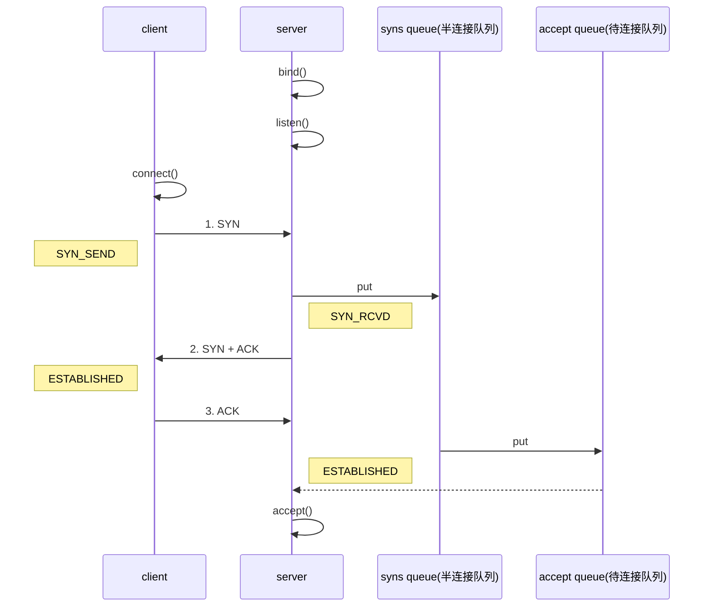

# TCP

相关连接：[TCP滑动窗口](/java/socket/3-netty-advanc?id=tcp滑动窗口)

## 三次握手
三次握手主要是，服务器缺点能收到消息，客户端确定能收到消息

1. 第一次握手，client 发送 SYN （数据包）到 server，状态修改为 SYN_SEND，server 收到，状态改变为 SYN_REVD，并将该请求放入 sync queue 队列（`服务器确定能收到客户端消息`）
2. 第二次握手，server 回复 SYN + ACK 给 client，client 收到，状态改变为 ESTABLISHED，并发送 ACK 给 server
3. 第三次握手，server 收到 ACK，状态改变为 ESTABLISHED，将该请求从 sync queue 放入 accept queue(`客户端确定能收到服务器消息`)
   - accept()：服务器建立连接资源有限，所以，要从队列中获取待连接数据,调用一次accept则队列少一个

## TCP编程常用类  

> ServerSocket 类和 Socket 类  

1. 服务器端创建一个 ServerSocket （服务器端套接字），调用 accept() 方法等待客户端来连接。

2. 客户端程序创建一个 Socket，请求与服务器建立连接。

3. 服务器接收客户端的连接请求，同时创建一个新的 Socket 与客户端建立连接，服务器继续等待新的
   请求。  
