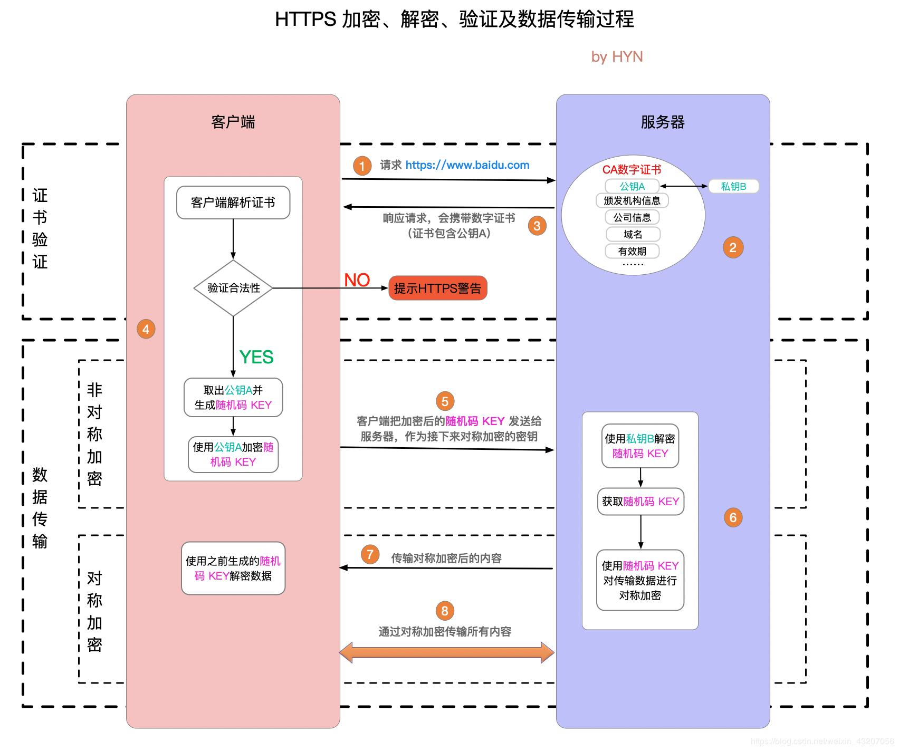

# TCP

相关连接：[TCP滑动窗口](/java/socket/3-netty-advanc?id=tcp滑动窗口)

## 三次握手
三次握手主要是，服务器缺点能收到消息，客户端确定能收到消息

1. 第一次握手，client 发送 SYN （数据包）到 server，状态修改为 SYN_SEND，server 收到，状态改变为 SYN_REVD，并将该请求放入 sync queue 队列（`服务器确定能收到客户端消息`）
2. 第二次握手，server 回复 SYN + ACK 给 client，client 收到，状态改变为 ESTABLISHED，并发送 ACK 给 server
3. 第三次握手，server 收到 ACK，状态改变为 ESTABLISHED，将该请求从 sync queue 放入 accept queue(`客户端确定能收到服务器消息`)
   - accept()：服务器建立连接资源有限，所以，要从队列中获取待连接数据,调用一次accept则队列少一个

## TCP编程常用类  

> ServerSocket 类和 Socket 类  

1. 服务器端创建一个 ServerSocket （服务器端套接字），调用 accept() 方法等待客户端来连接。

2. 客户端程序创建一个 Socket，请求与服务器建立连接。

3. 服务器接收客户端的连接请求，同时创建一个新的 Socket 与客户端建立连接，服务器继续等待新的
   请求。  

# 网络编程安全

## https安全协议

> http 和https 的区别

> 访问的基本流程

## 加密算法

> 对称加密

- 也叫单钥加密，是指加密密钥和解密密钥相同的加密方式。  

- 加密和解密都是通过一个公钥进行处理的

代表算法：AES算法、DES算法、RC4，3DES 、Triple-DES, RC2等；   

> 非对称加密  

加密使用的密钥和解密使用的密钥是不相同的，分别称为：公钥、私钥，

公钥和算法都是公开的，私钥是保密的  

非对称加密算法性能较低，但是安全性超强，由于其加密特性，非对称加密算法能加密的数据长度也是有限的。
例如：RSA、DSA、ECDSA、 DH、ECDHE  

> 散列算法  

Hash算法特别的地方在于它是一种单向（输出不依赖于输入）算法，用户可以通过hash算法对目标信息生成一段特定长度的唯一hash值，却不能通过这个hash值重新获得目标信息。
因此Hash算法常用在不可还原的密码存储、信息完整性校验等。
将任意长度的信息转换为较短的固定长度的值，通常其长度要比信息小得多，且算法不可逆。
例如：MD5、SHA-1、SHA-2、SHA-256 等  

## HTTPS加密ssl的过程

1. 服务端用非对称加密算法RSA生成公钥和私钥，把公钥放在证书里发送给客户端，私钥自己保存
2. 客户端接收到公钥后，首先向一个权威的服务器检查证书的合法性，如果证书合法，客户端产生一段随机数，这个随机数就作为通信的密钥，我们称之为对称密钥 
3. 用公钥加密这段随机数，然后发送到服务器服务器用密钥解密获取对称密钥，然后，双方就已对称密钥进行加密解密通信了  

