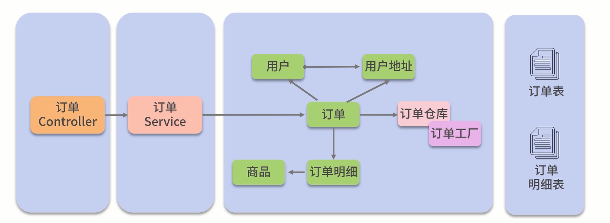
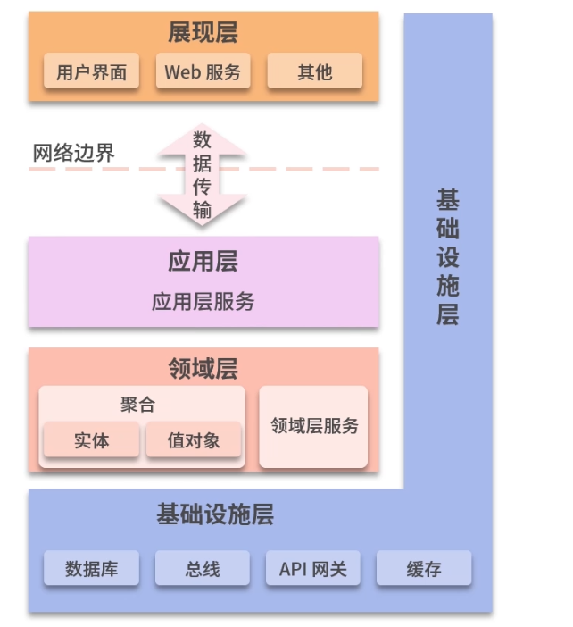

# 单一职责原则

> 判断两个需求变更是否是一起的原则?

1. AA发生变更时，BB是否也要变动代码
2. BB发生变更时，AA是否要变动代码

*如*：

用户发生变更时，vip会员是否变动

vip的业务发生变更时，用户是否要变动

所以这里：用户是一个领域， VIP会员是一个领域


# 领域模型落实数据库设计

在传统数据库设计中，我们有 1:1   1:N   N:N的数据库设计，

在领域模型中，多了一种设计关系，即继承关系，实现方式有一下三种

## 整表设计

为了避免多join操作，我更倾向这种方式

优点：简单，整个继承关系的数据全部保存在这个表里

缺点：容易造成表稀疏，如正确行为，过错类型则永远为空


## 同主键处理

1. 设计N张表，表字段公共部分一致
2. 并且主键生成规则必须一致


## 关联表处理

1. 设计一个父表，存储公共字段
2. 设计几个子表，与父表设计成外键关系

**DDD往往应用于系统增删改的业务场景中， 查询一般使用其他模式**


# 充血模型和贫血模型

如图：service只做一件事，就是会员打折，但是具体是金卡打折，还是银卡打折，则交给领域模型去做


## 充血模型架构




## 贫血模型架构


## 取舍

将需要封装的业务逻辑放到领域对象中,按照充血模型去设计

除此之外的其他业务逻辑放到Service中，按照贫血模型去设计

如订单逻辑：

订单是一定有订单明细的，订单明细如果缺了订单，则没有了意义，所以，我们将订单明细设计到订单的充血模型中


# 仓库

通常就会实现一个仓库(Repository)去完成对数据库的访问

# 工厂

订单仓库将任务交给订单工厂，订单工厂分别调用订单DAO、订单明细DAO和用户DAO去进行查询

订单工厂将订单明细对象与用户对象，分别set到订单对象的“订单明细”与“用户”属性中

订单工厂将装配好的订单对象返回给订单仓库

# 子域划分

## Domain Storytelling方式划分

[Release v1.4.0 · WPS/domain-story-modeler (github.com)](https://github.com/WPS/domain-story-modeler/releases/tag/v1.4.0)

# 限界上下文

将整个系统划分成许多相对独立的*业务场景*

比如: 购物机，对于用户来说，是买东西的，对于运营人员来说，是收钱的

## 为什么需要

1. 同一个事物不同场景有不同的模型
2. 限界上下文是分工的单位


在一个一个的业务场景中进行领域分析与建模

这样的业务场景称之为“问题子域”,简称“子域”


电商网站的“问题域”——人们如何进行在线购物，购物的流程是怎样的

电商网站——用户选购、下单、支付、物流等多个子域


一个复杂系统的领域驱动设计,是以子域为中心进行领域建模绘制出一张一张的领域模型设计
称之为“限界上下文”(Context Bounds，CB)


称之为“限界上下文”(Context Bounds，CB)


单一职责原则：每个限界上下文中实现的都是软件变化同一个原因的业务

## 子域划分与限界上下文


如下单这个操作，需要查询用户的相关信息，此时不是直接去查询用户表，而是去调用用户域的接口，获取用户信息

此时用户下单就是主题域

用户注册就是支撑域


对业务理解比较粗略时,从主要流程开始领域建模


## 上下文映射


# 怎样提供微服务接口

当多个团队都在向你提出API接口时,你怎么提供接口

对这些接口进行规划，通过复用用尽可能少的接口满足他们的需求


当调用方需要接口变更时怎么办

变更现有接口应当尽可能向前兼容，即接口的名称与参数都不变，只在内部增加新的功能


# DDD架构




## 传统四层架构


--- 接口层 ：负责外部通信
--- 应用服务层：面向问题空间， 事务控制，事件分发

--- 领域层：核心层，领域中的实体，资源库，

--- 基础设施层： 通用工具，数据库访问等

> 缺陷

1. 领域层对基础设施层仍然有感知，领域模型和技术实现耦合

## 六边行层

领域模型变成核心层，周围使用适配器模式进行包围


```
- adapter:适配器层
	-remote：远程调用的实现
	-repository 资源库的实现，接口在领域层
	-rest

- application 应用层，面向问题空间， 事务控制，事件分发

- domain 领域层
	-entity
	-remote : 远程调用的接口
	-repository: 资源库的接口

- inface 基础设施层

```

上面的结构，领域模型非常的独立，不受其他干扰

# 实体与值对象

## 实体

1. 主要由标识定义的对象被称作ENTITY

2. 在各个领域传输中状态是可变的

## 值对象

1. 用于描述领域的某个方面而本身没有概念标识的对象称为值对象
2. 值对象是不可变的，所以没有set方法，如果我们想调整它的属性，那么就要创建新的方法

## 区别

> **可变性是实体的特点**（有id）
>
> 不变性是值对象的本质

如：行政区域是不变的等

在线订餐系统中，菜单既可以设计成实体，也可以设计成值对象

# 领域对象的构造

## 领域对象由谁构造

1. 一个聚合内部的领域对象，一般是由聚合根构造的
2. 聚合根本身的构造一般在领域服务或者应用服务里进行

# 资源库（Repository）

资源库的实现，其实就是对存储层的技术实现

# 聚合

聚合就是一组相关对象的集合，我们把它作为数据修改的单元。每个聚合都有一个根和一个边界。聚合根是聚合所包含的一个特定实体。对聚合而言，外部对象只可以引用根，而边界内部的对象之间则可以互相引用。

## 聚合

订单与订单明细是一个整体

创建订单是，在订单对象填入或更新订单明细

保存订单时，直接保存订单对象（将订单对象作为一个整体），而不需要关注保存订单表还是订单明细表


聚合体现的是整体和部分的关系（如：订单和用户不能设计成聚合关系，因为订单和用户不是整体和聚合的关系）

当整体不存在时，则不能设计成聚合

## 聚合根

一旦将对象设计成聚合，那么外部访问只能通过聚合根访问

“聚合根”――**外部访问的唯一入口**


在一个系统中,增删改的业务可以采用领域驱动的设计

但在非增删改的分析汇总场景中,直接SQL查询

## 聚合的原则

1. 聚合内的实体适用事务一致性

2. 聚合之间适用最终一致性
3. 不脱离聚合根修改聚合内部对象

# 领域服务与应用服务

## 应用服务

*应用层*:负责接收外围的的用户（web应用，小程序等）请求，协调调用领悟模型，其不参与任何逻辑

> 相关职责

1. 事务控制
2. 身份认证和访问权限
3. 定时任务调度
4. 事件订阅与发布