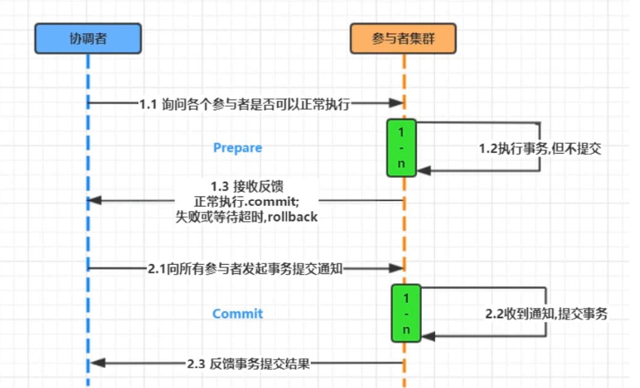
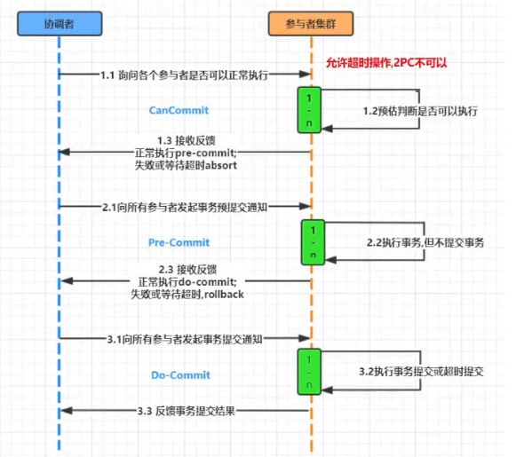

# CAP理论

​	在分布式系统领域有个著名的CAP定理

1. C-数据一致性；
2. A-服务可用性；
   1. 系统中非故障节点收到的每个请求都必须有响应.在可用系统中，如果我们的客户端向服务器发送请求，并且服务器未崩溃，则服务器必须最终响应客户端，不允许服务器忽略客户的请求
3. P-服务对网络分区故障的容错性
   1. 单台服务器，或多台服务器出问题（主要是网络问题）后，正常服务的服务器依然能正常提供服务
      1. 也就是说，如果服务器网络出现问题，允许服务器之间 数据的不同步
   2. 这三个特性在任何分布式系统中不能同时满足，最多同时满足两个

*CAP理论也就是说在分布式存储系统中，最多只能实现以上两点。而由于当前网络延迟故障会导致丢包等问题，所以我们分区容错性是必须实现的。也就是NoSqL数据库P肯定要有，我们只能在一致性和可用性中进行选择，没有Nosql数据库能同时保证三点。（==>AP 或者 CP）*

>  `CP(consistency + partition tolerance):`

关注一致性和分区容忍性。它关注的是系统里大多数人的一致性协议。这样的系统只需要保证大多数结点数据一致，而少数的结点会在没有同步到最新版本的数据时变成不可用的状态。这样能够提供一部分的可用性。

# 两阶段提交协议（2PC）

两阶段提交协议，简称2PC(2 Prepare Commit)，是比较常用的解决分布式事务问题的方式，要么所有参与进程都提交事务，要么都取消事务，即实现ACID中的原子性(A)的常用手段。

1. 准备阶段：协调者询问是否可以执行
2. 提交阶段：协调者发起提交事务通知

# 3PC

*三阶段提交升级点：*

1. 三阶段提交协议引入了超时机制。
2. 在第一阶段和第二阶段中，引入了一个准备阶段。保证了在最后提交阶段之前各参与节点的状态是一致的。

