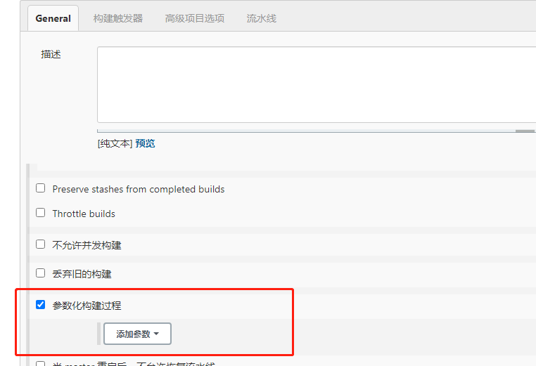
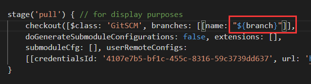
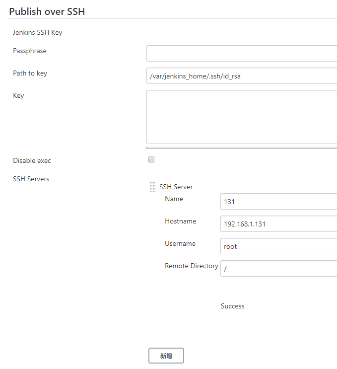
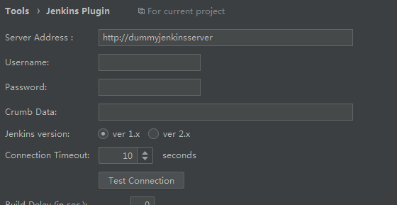

# 安装

## docker方式安装

```shell
[root@localhost ~]# docker pull jenkins/jenkins
[root@localhost home]# chmod 777 /home/jenkins_node

## 创建并启动容器
[root@localhost ~]# docker run -d -p 8080:8080 -p 10241:50000 -v /home/jenkins_node:/var/jenkins_home -v /etc/localtime:/etc/localtime --name jenkins jenkins/jenkins
33672d81b57f697caa35b7f3e3620fa9196280a24443b1558fe3c8ffaf51728d

```

- 说明

```shell
-d 后台运行镜像

-p 8080:8080 将镜像的8080端口映射到服务器的10240端口。

p 10241:50000 将镜像的50000端口映射到服务器的10241端口

-v /home/jenkins_node:/var/jenkins_home /home/jenkins_home目录为容器jenkins工作目录，我们将硬盘上的一个目录挂载到这个位置，方便后续更新镜像后继续使用原来的工作目录。这里我们设置的就是上面我们创建的 /home/jenkins_node目录

-v /etc/localtime:/etc/localtime让容器使用和服务器同样的时间设置。

--name jenkins 给容器起一个别名
```

- 查看容器日志获取初始化密码

```shell
[root@localhost home]# docker logs jenkins

```


```shell
Please use the following password to proceed to installation:

7de7268eb5d34f78ba2f1810b1f161d1

```

- 配置证书

```shell
wget https://cdn.jsdelivr.net/gh/lework/jenkins-update-center/rootCA/update-center.crt -O update-center-rootCAs/update-center.crt
```

```shell
[root@localhost jenkins_node]# chmod 777  update-center-rootCAs
```

- 修改插件配置文件（启动后，生成配置文件，修改此文件，重启jenkins）

```shell
[root@localhost jenkins_node]# vim hudson.model.UpdateCenter.xml 
```

```xml
<?xml version='1.1' encoding='UTF-8'?>
<sites>
  <site>
    <id>default</id>
    <url>https://cdn.jsdelivr.net/gh/lework/jenkins-update-center/updates/huawei/update-center.json</url>
  </site>
</sites>

```

## RPM方式

- 前往华为云下载rpm包
- 安装

```shell
[root@localhost opt]# rpm -ivh jenkins-2.277.2-1.1.noarch.rpm
```

- 如果发现java环境问题，可以前往/etc/init.d/jenkins配置java环境
- 启动

```shell
systemctl start jenkins
```

- 查看初始化密码

```shell
[root@localhost log]# cat /var/lib/jenkins/secrets/initialAdminPassword
```

- 默认工作目录：JENKINS_HOME="/var/lib/jenkins"

- 如果插件响应时间过长，则可以更换源

```shell
 vi /var/lib/jenkins/hudson.model.UpdateCenter.xml

 将 https://updates.jenkins.io/update-center.json" 修改为 "http://mirror.xmission.com/jenkins/updates/update-center.json"
```


# 插件配置

访问：http://192.168.1.134:8080/

由于jenkins 插件安装蛮，所以跳过插件安装直接点击 

- 选择插件安装
- 选择 无 -> 安装
- 初始化管理账号 ： admin/123456
- 进入jenkins主界面

## 修改国内插件下载地址

- 进入/home/jenkins_node/updates文件替换default.json的源地址

```shell
sed -i 's/http:\/\/updates.jenkins-ci.org\/download/https:\/\/mirrors.tuna.tsinghua.edu.cn\/jenkins/g' default.json && sed -i 's/http:\/\/www.google.com/https:\/\/www.baidu.com/g' default.json
```

- jenkins -> Manage Jenkins -> Manage Plugins -> advanced
- 修改Update Site

```html
https://mirrors.tuna.tsinghua.edu.cn/jenkins/updates/update-center.json
```

- 点击submit
- http://192.168.1.134:8080/restart 重启jenkins

## 安装汉化插件

- jenkins -> Manage Jenkins -> Manage Plugins -> advanced
- 搜索Chinese
- 安装Localization: Chinese (Simplified)插件
- 选择下载后重启（这个插件需要重启）

## 用户添加

- manage jenkins->manage users
- 添加用户

## 用户权限插件

- 前往manage jenkins->manage Plugins

- 搜索Role

- Role-based Authorization Strategy

- 选择直接安装

- 进入：jenkins -> Manage Jenkins -> 全局安全配置

- 授权策略：Role-Based Strategy ->  保存

- 进入角色管理：jenkins -> Manage Jenkins ->  Manage and Assign Roles

- Item roles： 项目角色，

  - -Pattern：添加角色后能访问的项目通配符
  - 如：dev.*  匹配 dev_01等任务

- Node roles： 节点角色，应用jenkins主从

  - Role to add：添加角色

  

# 凭证管理

管理docker私有仓库，git密码，需要密文保护的数据库密码

- 安装 Credentials Binding 插件
- 进入Manage credentials, 添加凭证

# 从git上拉取代码

- 安装git插件
- docker安装git

```shell
[root@localhost ~]# yum install git -y
```

- jenkins配置密码，在任务配置里选择git，填入git仓库地址，选择对应密码
- 在构建日志的控制台输出中可以看到对应的构建日志

```shell
Building in workspace /var/jenkins_home/workspace/dev_01
The recommended git tool is: NONE
using credential edeabfcb-f7c2-486c-8ba7-e722516e6a0b
Cloning the remote Git repository
Cloning repository https://gitee.com/lonelyxiao/learning.git
 > git init /var/jenkins_home/workspace/dev_01 # timeout=10
Fetching upstream changes from https://gitee.com/lonelyxiao/learning.git
 > git --version # timeout=10
 > git --version # 'git version 2.11.0'
using GIT_ASKPASS to set credentials gitee
```


# Maven配置

- maven配置步骤：
  - 配置环境变量（java/maven）
  - 配置jdk地址以及maven地址

## 配置地址

- 进入：jenkins -> Manage Jenkins -> 全局工具配置
  - 新增JDK
  - 去掉自动安装
  - 别名：jdk1.8
  - JAVA_HOME:/usr/lib/jvm/java-1.8.0-openjdk
  - 新增maven

## 配置环境变量

- 添加全局变量：（这些键值对每个节点上的每个应用都有效.它们可以在Jenkins配置(如$key或者${key})中使用, 并且在每个构建启动时被加入到环境变量中.）
  - 进入：jenkins -> Manage Jenkins -> 系统配置
  - 全局属性
  - JAVE_HOME: /usr/lib/jvm/java-1.8.0-openjdk
  - M2_HOME:/home/maven
  - PATH+EXTRA:$M2_HOME/bin
- git代码拉取后，进行构建
- 点击构建，执行shell脚本
- 输入脚本测试环境是否正常

```shell
#!/bin/bash
echo "mvn clean package"
mvn clean package
```

# 建立maven风格项目

- 安装[Maven Integration](https://plugins.jenkins.io/maven-plugin)插件
- 新建任务，多了一个构建maven项目的选项
- 与自由风格不同的是，他的构建是基于pom构建

# 建立流水线类型项目

- 安装[Pipeline](https://plugins.jenkins.io/workflow-aggregator)插件
- 创建一个PipeLine任务
- pipeLine语法

## 声明式

```shell
pipeline {
	//环境
    agent any
	//阶段
    stages {
        stage('Hello') {
            steps {
                echo 'Hello World'
            }
        }
    }
}
```

一个stages里可以有多个stage

一个stage相当于一个步骤

如:拉取代码一个步骤，编译一个步骤

steps：步骤，可以编写shell脚本

- 点击流水线语法可以自动生成对应的代码
  - 拉取代码：选择checkout
  - 编译maven：选择shell script， 填入对应的打包命令
- 将生成的语法填入对应的steps中

## sh脚本语句

 每个sh相当于一个sh脚本，所以他们的作用域都是隔离的

```shell
## 直接使用这个
sh 'mvn clean package -Dmaven.test.skip=true '
```

```shell
sh '''
	脚本语句
'''
```


## 将pipeline语法写入项目文件中

- 语法配置在任务中不好管理，所以可以选择将部署代码写在项目中
- 在项目根目录新建Jenkinsfile文件
- 任务配置->流水线->scm->git->脚本路径:Jenkinsfile 

## 动态参数控制

- 在一些脚本中，有些参数需要动态的控制，如版本号等



- 在项目中传入对应的参数



# 构建触发器

- 访问触发地址，能够触发jenkins重新构建项目

- 触发远程构建
  - 输入token，当get `JENKINS_URL`/job/dev_pipe_pipeline/build?token=`TOKEN_NAME`时，会触发

# 参数化构建

# 邮件服务

- 安装[Email Extension Template](https://plugins.jenkins.io/emailext-template)插件
- 系统管理->系统配置->Extended E-mail Notification
- Content Token Reference可以查看具体html中的邮件模板参数
- 在pipleline脚本中添加post
- 在流水线->generator 生成post模板

```shell
post {
  unstable {
    // One or more steps need to be included within each condition's block.
  }
}
```

# 代码审查

# 远程SSH

- 安装[Publish Over SSH](https://plugins.jenkins.io/publish-over-ssh)插件
- 系统管理->系统配置->Publish over SSH
  - 在jenkins所在的服务器上生成公钥

```shell
jenkins@effa534ebc42:/$ ssh-keygen
jenkins@effa534ebc42:/$ cd /var/jenkins_home/.ssh/
jenkins@effa534ebc42:~/.ssh$ ls
id_rsa	id_rsa.pub
##将公钥拷贝到131服务器
jenkins@effa534ebc42:~/.ssh$ ssh-copy-id root@192.168.1.131
```

- 在目标服务器上看到对应的公钥文件

```shell
cd ~/.ssh/
[root@localhost .ssh]# ls
authorized_keys
```

- 在jenkins上配置ssh
  - jenkins -> 系统配置 -> publish over ssh
  - path to key (私钥路径): /var/jenkins_home/.ssh/id_rsa



- 插件按照后需要重启
- 流水线选择sshpublisher,生成pipeline模板， 在execCommand里面写入代码
- pipeline模板，注意定义的参数在代码中要“” (双引号)

```shell
node {
    def branch = '*/master'
    def command = 'echo "aaa" > aaa.txt'
    stage('pull code') { // for display purposes
        checkout([$class: 'GitSCM', branches: [[name: "${branch}"]], doGenerateSubmoduleConfigurations: false, extensions: [], submoduleCfg: [], userRemoteConfigs: [[credentialsId: 'edeabfcb-f7c2-486c-8ba7-e722516e6a0b', url: 'https://gitee.com/lonelyxiao/learning.git']]])
    }
    stage('Build') {
        sh 'mvn clean package -Dmaven.test.skip=true '
    }
    stage('publish code') {
        sshPublisher(publishers: [sshPublisherDesc(configName: '131', transfers: [sshTransfer(cleanRemote: false, excludes: '', execCommand: "${command}", execTimeout: 120000, flatten: false, makeEmptyDirs: false, noDefaultExcludes: false, patternSeparator: '[, ]+', remoteDirectory: '', remoteDirectorySDF: false, removePrefix: '', sourceFiles: '')], usePromotionTimestamp: false, useWorkspaceInPromotion: false, verbose: false)])
    }
}
```

# 远程文件

- removePrefix: 上传的远程文件夹
- removePrefix：上传后删除的文件
- sourceFiles：本地文件
- 将target下所有输送目标服务器

```
def remote_directory = '/home/jar'
def source_files = 'esearch/es-jd/target/**'
```

```shell
  sshPublisher(publishers: [sshPublisherDesc(configName: '131', transfers: [sshTransfer(cleanRemote: false, excludes: '', execCommand: "", execTimeout: 120000, flatten: false, makeEmptyDirs: false, noDefaultExcludes: false, patternSeparator: '[, ]+', remoteDirectory: '', remoteDirectorySDF: false, removePrefix: '', sourceFiles: '')], usePromotionTimestamp: false, useWorkspaceInPromotion: false, verbose: false)])
```

- removePrefix:如果不指定路径，则目标路径会全路径

```shell
sshPublisher(publishers: [sshPublisherDesc(configName: '131', transfers: [sshTransfer(cleanRemote: false, excludes: '', execCommand: 'nohup java -jar es-jd-1.0-SNAPSHOT.jar >> catalina.out 2>&1 &', execTimeout: 120000, flatten: false, makeEmptyDirs: false, noDefaultExcludes: false, patternSeparator: '[, ]+', remoteDirectory: '/home/jar/', remoteDirectorySDF: false, removePrefix: 'esearch/es-jd/target', sourceFiles: 'esearch/es-jd/target/es-jd-1.0-SNAPSHOT.jar')], usePromotionTimestamp: false, useWorkspaceInPromotion: false, verbose: false)])
```

# 构建nodejs

```shell
stage('Build') {
      nodejs("nodejs"){
		sh '''
			cd dym-sales-web-saas
			pwd
			node -v && npm -v
			npm config set registry http://registry.npm.taobao.org/
			npm config get registry
			npm i
			npm run build
		'''
        }
    }
```

# 集成idea

- 安装 Jenkins Control Plugin插件
- 配置相关信息



password:在用户列表 --> 设置 --->  API Token中获取

