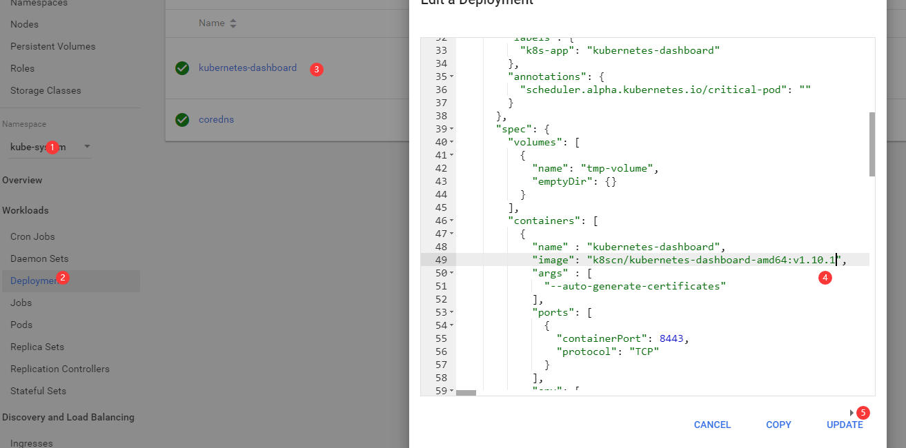

# 基础部分

## k8s功能

- 自动装箱
- 自动修复
- 水平拓展
- 负载均衡，服务发现
- 滚动更新
  - 加应用的时候，检测没有问题才进行服务

## k8s 的组件

- master（主控节点）
  - apiserver：对外统一入口，并负责接收、校验并响应所有的rest请求，结果状态被持久存储于etcd中
  - scheduler：节点调度，选择可用的节点，进行应用部署
  - controller manager：处理集群常规后台任务，一个资源对应一个controller，
  - etcd：保存了整个集群的状态
- node（工作节点）
  - kubelet：管理node节点的容器状态（生命周期）
  - kube-proxy：提供网络代理，提供负载均衡功能


## 核心概念

- Prod
  - 最小部署单元
  - 一组容器的集合
  - 他们共享网络
  - 生命周期是短暂的
- contoller
- service
  - 定义一组prod的访问规则

# 部署

## supervisorctl 安装

- 安装前先要安装epel

```shell
[root@localhost ~]# yum install epel-release
```

```shell
## 安装supervisor
[root@k8sm ~]# yum install supervisor -y
[root@k8sm ~]# systemctl start supervisord
[root@k8sm ~]# systemctl enable supervisord
```

- 配置启动文件,如下配置java启动程序ini

```shell
[root@localhost ~]# vim /etc/supervisord.d/sales-test.ini                              
```

```shell
[program:sales-test]
directory = /home/sales-server/test ; 程序的启动目录
command = java -Xms2048m -Xmx2048m -XX:+PrintGC -XX:+PrintGCTimeStamps -XX:+UseG1GC -jar dym-sales-webapp.jar ; 启动命令，可以看出与手动在命令行启动的命令是一样的
autostart = true     ; 在 supervisord 启动的时候也自动启动
startsecs = 30        ; 启动 30 秒后没有异常退出，就当作已经正常启动了
autorestart = true   ; 程序异常退出后自动重启
startretries = 3     ; 启动失败自动重试次数，默认是 3
user = root          ; 用哪个用户启动
redirect_stderr = true  ; 把 stderr 重定向到 stdout，默认 false
stdout_logfile_maxbytes = 20MB  ; stdout 日志文件大小，默认 50MB
stdout_logfile_backups = 20     ; stdout 日志文件备份数
; stdout 日志文件，需要注意当指定目录不存在时无法正常启动，所以需要手动创建目录（supervisord 会自动创建日志文件）
stdout_logfile = /data/log/sale-test/springboot-sales-test.log ;应用日志目录  
```


## kubeadmin方式

- 准备三台服务器， master， node1, node2

- 系统初始化操作（除特点说明，其他都要在三台服务器执行）

```shell
	## 三台服务器关闭防火墙
[root@localhost ~]# systemctl stop firewalld
[root@localhost ~]# systemctl disable firewalld.service 
## 关闭selinux
sed -i 's/enforcing/disabled/' /etc/selinux/config
## 判断是否关闭
[root@k8sm ~]# getenforce
Disabled


## 关闭 swap
sed -ri 's/.*swap.*/#&/' /etc/fstab  
## 设置规划主机名
[root@localhost ~]# hostnamectl set-hostname k8smaster
# 查看
[root@localhost ~]# hostname
k8smaster
# 在master节点上添加host（需要与修改的hostname一致）
cat >> /etc/hosts <<EOF 
192.168.1.140 k8smaster
192.168.1.141 k8snode1
192.168.1.142 k8snode2
EOF
## 对网络进行设置
##将桥接的IPV4流量传递到iptables的链
cat >> /etc/sysctl.d/k8s.conf <<EOF
net.bridge.bridge-nf-call-ip6tables = 1
net.bridge.bridge-nf-call-iptables = 1
EOF
# 生效
[root@localhost ~]# sysctl --system

##时间同步
[root@localhost ~]# yum install ntpdate -y
[root@localhost ~]# ntpdate ntp1.aliyun.com
```

- 安装docker
  - 安装yum install -y docker-ce-18.06.3.ce-3.el7版本
- 设置k8s的阿里源

```shell
cat <<EOF > /etc/yum.repos.d/kubernetes.repo
[kubernetes]
name=Kubernetes
baseurl=http://mirrors.aliyun.com/kubernetes/yum/repos/kubernetes-el7-x86_64
enabled=1
gpgcheck=0
repo_gpgcheck=0
gpgkey=http://mirrors.aliyun.com/kubernetes/yum/java/yum-key.gpg
       http://mirrors.aliyun.com/kubernetes/yum/java/rpm-package-key.gpg
EOF
```

- 安装k8s

```shell
# 搜索各个版本的k8s
[root@k8snode2 ~]# yum search kubelet --showduplicates | sort -r
[root@k8snode2 ~]# yum install -y kubelet-1.18.0 kubeadm-1.18.0 kubect1-1.18.0
#开机启动
[root@k8smaster ~]# systemctl enable kubelet
```

- 部署k8s master(在master节点上执行)（192.168.1.140执行）
  - 当前节点ip
  - 使用阿里云镜像（从阿里云拉取很多组件镜像）
  - 指定版本
  - 连接访问的ip（不冲突就行）

```shell
kubeadm init \
--apiserver-advertise-address=192.168.1.140 \
--image-repository registry.aliyuncs.com/google_containers \
--kubernetes-version v1.18.0 \
--service-cidr=10.96.0.0/12 \
--pod-network-cidr=10.244.0.0/16
```

出现类似警告

detected "cgroupfs" as the Docker cgroup driver

需要修改docker

```shell
vim /etc/docker/daemon.json
##追加内容
{
 "exec-opts":["native.cgroupdriver=systemd"]
}
##生效
systemctl restart docker
systemctl status docker
```

可以在master节点上查看images

```shell
[root@k8smaster ~]# docker images
```

在master部署k8s成功后，我们看到如下图


- 使用kubectl工具
  - 执行途中的mkdir命令

```shell
mkdir -p $HOME/.kube
sudo cp -i /etc/kubernetes/admin.conf $HOME/.kube/config
sudo chown $(id -u):$(id -g) $HOME/.kube/config
```

```shell
##查看节点
[root@k8smaster ~]# kubectl get nodes
NAME        STATUS     ROLES    AGE     VERSION
k8smaster   NotReady   master   6m46s   v1.18.0
```

- 将node加入k8smaster中
  - 在另外两个node执行图中命令

```shell
kubeadm join 192.168.1.140:6443 --token e21hc2.oeigv6v2appxkh6c \
    --discovery-token-ca-cert-hash sha256:e46f08a3df79c9548ba8d1a75b2bb10ec3e6b7a40af361ccd9c878342919c994
```

```shell
##此时查看node加入了
[root@k8smaster ~]# kubectl get nodes
NAME        STATUS     ROLES    AGE     VERSION
k8smaster   NotReady   master   9m27s   v1.18.0
k8snode1    NotReady   <none>   45s     v1.18.0
k8snode2    NotReady   <none>   37s     v1.18.0

```

默认token有效期为24小时，当过期之后，该token就不可用了。这时就需要重新创建token，操作如下:

```shell
kubeadm token create --print-join-command
```

- 部署CNI网络插件(master节点)

```shell
[root@k8smaster ~]# kubectl apply -f https://raw.githubusercontent.com/coreos/flannel/master/Documentation/kube-flannel.yml
## 查看pods有没有运行
[root@k8smaster ~]# kubectl get pods -n kube-system
##如果查看到有那个pods运行异常，可以下载镜像
 docker pull quay.io/coreos/flannel:v0.12.0-amd64
 ##之后重写加载插件
 kubectl apply -f https://raw.githubusercontent.com/coreos/flannel/master/Documentation/kube-flannel.yml
```

- 重写查看节点，正常

```shell'
[root@k8smaster ~]# kubectl get nodes
NAME        STATUS   ROLES    AGE   VERSION
k8smaster   Ready    master   11h   v1.18.0
k8snode1    Ready    <none>   11h   v1.18.0
k8snode2    Ready    <none>   11h   v1.18.0

```

- 测试k8s集群

在k8szhogn 创建一个pod，验证是否正常运行

```shell
## 拉取nginx镜像
[root@k8smaster ~]# kubectl create deployment nginx --image=nginx
deployment.apps/nginx created
##等到nginx运行之后，对外暴露端口
[root@k8smaster ~]# kubectl get pod
NAME                    READY   STATUS    RESTARTS   AGE
nginx-f89759699-nrg87   1/1     Running   0          77s
##
[root@k8smaster ~]# kubectl expose deployment nginx --port=80 --type=NodePort
service/nginx exposed
```

```shell
##查看nginx对外端口 31303
[root@k8smaster ~]#  kubectl get pod,svc
NAME                        READY   STATUS    RESTARTS   AGE
pod/nginx-f89759699-nrg87   1/1     Running   0          4m7s

NAME                 TYPE        CLUSTER-IP      EXTERNAL-IP   PORT(S)        AGE
service/kubernetes   ClusterIP   10.96.0.1       <none>        443/TCP        13h
service/nginx        NodePort    10.110.148.58   <none>        80:31303/TCP   76s
```

访问：http://192.168.1.140:31303/

## 二进制搭建集群

### 准备三台服务器

1. 如上准备环境（初始化系统）

- docker配置文件需要配置：

  bip与宿主机一致

```json
{
 "exec-opts": ["native.cgroupdriver=systemd"],
 "bip": "172.17.44.1/24",
 "registry-mirrors": ["https://ou219a7c.mirror.aliyuncs.com"]
}

```


1. 安装下epel源

```shell
yum install epel-release
## 编辑repo，将注释的base放出来，metalink注释
[root@k8sn1 opt]# vim /etc/yum.repos.d/epel.repo
```

3. DNS初始化

   1. 安装bind9软件

   ```shell
   # 在master上安装
   [root@k8sm ~]# yum install bind -y
   # 查看版本
   [root@k8sm ~]# rpm -qa bind
   bind-9.11.4-26.P2.el7_9.2.x86_64
   ```

   2. 编辑配置文件

   ```shell
   [root@k8sm ~]# vim /etc/named.conf
   ## 更改监听地址为本机地址
   listen-on port 53 { 192.168.1.143; };
   ## 更改哪些客户端能查询这个DNS解析（任何都可以）
   allow-query     { any; };
   ## 新增上级DNS, 意思就是这个DNS没有查询到，到上级查询
   forwarders      { 202.96.128.86; };
   ##DNS采用递归的算法
    recursion yes;
   ```

   3. 检查配置，没有报错就是正常

   ```shell
   [root@k8sm ~]# named-checkconf
   ```

   4. 配置域

   ```shell
   [root@k8sm ~]# vim /etc/named.rfc1912.zones
   ## 添加域（允许本机update）
   zone "host.com" IN {
           type master;
           file "host.com.zone";
           allow-update { 192.168.1.143; };
   };
   
   # 创建区域文件
   [root@k8sm ~]# vim /var/named/host.com.zone
   
   $ORIGIN host.com.
   $TTL 86400
   @ IN SOA dns.host.com. dnsadmin.host.cncom (
   20201206901;Serial（修改需要修改这个，否则不同步，一般以时间+次数）
   3H;Refresh
   15M;Retry
   1W;Expire
   1D;Minimum
   )
    IN NS dns.host.com.
   dns IN A 192.168.1.143
   m IN A 192.168.1.143
   n1 IN A 192.168.1.144
   n2 IN A 192.168.1.145
   
   ## 检查配置文件
   [root@k8sm ~]# named-checkzone "host.com" /var/named/host.com.zone 
   zone host.com/IN: loaded serial 20201206
   OK
   
   ```

   5. 启动并检查

   ```shell
   [root@k8sm ~]# systemctl start named
   [root@k8sm ~]# netstat -npl | grep 53
   
   ## 安装DNS检测工具
   yum install bind-utils
   ## 检测dns
   ## A 记录  主机域  自建的dns
   [root@k8sm ~]# dig -t A n1.host.com @192.168.1.143 +short
   
   ```

   6. 使用dns

   ```shell
   [root@k8sm ~]# vim /etc/sysconfig/network-scripts/ifcfg-ens33
   DNS1=192.168.1.143
   #重启
   [root@k8sm ~]# systemctl restart network
   ## 查看
   [root@k8sm ~]# cat /etc/resolv.conf 
   # Generated by NetworkManager
   nameserver 192.168.1.143
   [root@k8sm ~]# ping m.host.com
   ```

   7. 其他两个都修改新的DNS

### 准备签发证书环境

1. master上

2. 安装CFSSL

```shell
[root@k8sm ~]# wget https://pkg.cfssl.org/R1.2/cfssl_linux-amd64 -O /usr/bin/cfssl
[root@k8sm bin]# wget https://pkg.cfssl.org/R1.2/cfssljson_linux-amd64 -O /usr/bin/cfssl-json
[root@k8sm bin]# wget https://pkg.cfssl.org/R1.2/cfssl-certinfo_linux-amd64 -O /usr/bin/cfssl-certinfo
```

```shell
[root@k8sm bin]# ll /usr/bin/cfssl*
-rw-r--r-- 1 root root 10376657 Mar 29  2016 /usr/bin/cfssl
-rw-r--r-- 1 root root  6595195 Mar 29  2016 /usr/bin/cfssl-certinfo
-rw-r--r-- 1 root root  2277873 Mar 29  2016 /usr/bin/cfssl-json
```

```shell
# 授予可执行权限
[root@k8sm bin]# chmod +x /usr/bin/cfssl*
# 检查
[root@k8sm bin]# which cfssl
/usr/bin/cfssl
[root@k8sm bin]# which cfssl-json 
/usr/bin/cfssl-json
[root@k8sm bin]# which cfssl-certinfo 
/usr/bin/cfssl-certinfo

```

### 签发CA证书

1. 开始签发证书

```shell
[root@k8sm opt]# mkdir certs
```

2. 创建ca请求文件
   1. CN: 浏览器使用该字段验证网站是否合法，一般是域名
   2. key: 加密算法和长度
   3. O:组织
   4. OU： 单位
   5. expiry: 过期时间

```shell
cat > ca-csr.json <<EOF
{
  "CN": "host.com",
  "hosts": [],
  "key": {
    "algo": "rsa",
    "size": 2048
  },
  "names": [
    {
      "C": "CN",
      "L": "BeiJing",
      "ST": "BeiJing",
      "O": "system:m",
      "OU": "System"
    }
  ],
  "ca":{
  	"expiry": "175200h"
  }
}
EOF
```

3. 签发证书

```shell
[root@k8sm certs]# cfssl gencert -initca ca-csr.json | cfssl-json -bare ca
2020/12/06 08:03:57 [INFO] generating a new CA key and certificate from CSR
2020/12/06 08:03:57 [INFO] generate received request
2020/12/06 08:03:57 [INFO] received CSR
2020/12/06 08:03:57 [INFO] generating key: rsa-2048
2020/12/06 08:03:57 [INFO] encoded CSR
2020/12/06 08:03:57 [INFO] signed certificate with serial number 463094640636714033430782087311472842531612561820
```

```shell
##  ca.pem 根证书
## ca-key.pem 根证书的私钥
[root@k8sm certs]# ll
total 16
-rw-r--r-- 1 root root 1005 Dec  6 08:03 ca.csr
-rw-r--r-- 1 root root  262 Dec  6 07:59 ca-csr.json
-rw------- 1 root root 1675 Dec  6 08:03 ca-key.pem
-rw-r--r-- 1 root root 1367 Dec  6 08:03 ca.pem
```

### 部署etcd集群

etcd是分布式键值存储系统，k8s使用他存储，所以首先搭建etcd数据库，使用3台集群，则可以容忍1台故障

1. 签发证书
   1. 建立生成证书的配置文件
   2. ca-config.json：可以定义多个 profiles，分别指定不同的参数；后续在签名证书时使用某个profile；
      signing：表示该证书可用于签名其它证书；生成的 ca.pem 证书中 CA=TRUE；
      server auth：表示client可以用该 CA 对server提供的证书进行验证；
      client auth：表示server可以用该CA对client提供的证书进行验证；
      profiles 中的 **peer**是后面cfssl gencert 命令值profiles 指定的值，要相互对应。

```shell
cat >/opt/certs/ca-config.json <<EOF
{
    "signing": {
        "default": {
            "expiry": "175200h"
        },
        "profiles": {
            "server": {
                "expiry": "175200h",
                "usages": [
                    "signing",
                    "key encipherment",
                    "server auth"
                ]
            },
            "client": {
                "expiry": "175200h",
                "usages": [
                    "signing",
                    "key encipherment",
                    "client auth"
                ]
            },
            "peer": {
                "expiry": "175200h",
                "usages": [
                    "signing",
                    "key encipherment",
                    "server auth",
                    "client auth"
                ]
            }
        }
    }
} 
EOF
```

2. 创建etcd的证书的请求文件
   1. host表示将来需要部署etcd的服务器ip
   2. 如果服务器变了，则需要重新签发证书

```shell
cat >/opt/certs/etcd-peer-csr.json <<EOF
{
    "CN": "k8s-etcd",
    "hosts": [
        "192.168.1.143",
        "192.168.1.144",
        "192.168.1.145"
    ],
    "key": {
        "algo": "rsa",
        "size": 2048
    },
    "names": [
        {
            "C": "CN",
            "ST": "beijing",
            "L": "beijing",
            "O": "laoxiao",
            "OU": "ops"
        }
    ]
}
EOF
```

3. 生成证书

```shell
## 先生成证书看一下
[root@k8sm certs]# cfssl gencert -ca=ca.pem -ca-key=ca-key.pem -config=ca-config.json -profile=peer etcd-peer-csr.json
## 通过管道符进行生成
[root@k8sm certs]# cfssl gencert -ca=ca.pem -ca-key=ca-key.pem -config=ca-config.json -profile=peer etcd-peer-csr.json | cfssl-json -bare etcd-peer

[root@k8sm certs]# ll
total 36
-rw-r--r-- 1 root root  837 Dec  9 10:22 ca-config.json
-rw-r--r-- 1 root root 1005 Dec  6 08:03 ca.csr
-rw-r--r-- 1 root root  262 Dec  6 07:59 ca-csr.json
-rw------- 1 root root 1675 Dec  6 08:03 ca-key.pem
-rw-r--r-- 1 root root 1367 Dec  6 08:03 ca.pem
-rw-r--r-- 1 root root 1062 Dec  9 10:29 etcd-peer.csr
-rw-r--r-- 1 root root  359 Dec  9 10:23 etcd-peer-csr.json
-rw------- 1 root root 1679 Dec  9 10:29 etcd-peer-key.pem
-rw-r--r-- 1 root root 1436 Dec  9 10:29 etcd-peer.pem

```

4. 创建一个没有家目录不需要登录的etcd用户

```shell
[root@k8sm certs]# useradd -s /sbin/nologin -M etcd
## 查看下etcd用户的信息
[root@k8sm certs]# id etcd
uid=1000(etcd) gid=1000(etcd) groups=1000(etcd)

```

5. 下载etcd的软件

https://repo.huaweicloud.com/etcd/v3.1.20/

```shell
[root@k8sm src]# wget https://repo.huaweicloud.com/etcd/v3.1.20/etcd-v3.1.20-linux-amd64.tar.gz

## 解压
[root@k8sm src]# tar xvf etcd-v3.1.20-linux-amd64.tar.gz -C /opt/
## 做一个软连接
[root@k8sm opt]# ln -s /opt/etcd-v3.1.20-linux-amd64 /opt/etcd

[root@k8sm opt]# cd etcd
[root@k8sm etcd]# ll
total 30108
drwxr-xr-x 11 478493 89939     4096 Oct 10  2018 Documentation
-rwxr-xr-x  1 478493 89939 16406432 Oct 10  2018 etcd
-rwxr-xr-x  1 478493 89939 14327712 Oct 10  2018 etcdctl
-rw-r--r--  1 478493 89939    32632 Oct 10  2018 README-etcdctl.md
-rw-r--r--  1 478493 89939     5878 Oct 10  2018 README.md
-rw-r--r--  1 478493 89939     7892 Oct 10  2018 READMEv2-etcdctl.md

```

6. 创建目录和迁移证书（三台服务器）

```shell
#创建etdc的目录
[root@k8sm etcd]# mkdir -p /opt/etcd/certs /data/etcd /data/logs/etcd-server
## 将三个证书拷贝到对应目录下
[root@k8sm etcd]# cp /opt/certs/ca.pem /opt/etcd/certs/
[root@k8sm etcd]# cp /opt/certs/etcd-peer-key.pem /opt/etcd/certs/
[root@k8sm etcd]# cp /opt/certs/etcd-peer.pem /opt/etcd/certs/
[root@k8sm etcd]# ls /opt/etcd/certs/
ca.pem  etcd-peer-key.pem  etcd-peer.pem
```

7. 创建etcd启动脚本

主要name 要每台服务器都不相同

```shell
cat >/opt/etcd/etcd-server-startup.sh <<'EOF'
#!/bin/sh
./etcd \
    --name etcd-server-143 \
    --data-dir /data/etcd/etcd-server \
    --listen-peer-urls https://192.168.1.143:2380 \
    --listen-client-urls https://192.168.1.143:2379,http://127.0.0.1:2379 \
    --quota-backend-bytes 8000000000 \
    --initial-advertise-peer-urls https://192.168.1.143:2380 \
    --advertise-client-urls https://192.168.1.143:2379,http://127.0.0.1:2379 \
    --initial-cluster  etcd-server-143=https://192.168.1.143:2380,etcd-server-144=https://192.168.1.144:2380,etcd-server-145=https://192.168.1.145:2380 \
    --ca-file ./certs/ca.pem \
    --cert-file ./certs/etcd-peer.pem \
    --key-file ./certs/etcd-peer-key.pem \
    --client-cert-auth  \
    --trusted-ca-file ./certs/ca.pem \
    --peer-ca-file ./certs/ca.pem \
    --peer-cert-file ./certs/etcd-peer.pem \
    --peer-key-file ./certs/etcd-peer-key.pem \
    --peer-client-cert-auth \
    --peer-trusted-ca-file ./certs/ca.pem \
    --log-output stdout
EOF
[root@hdss7-12 ~]# chmod +x /opt/etcd/etcd-server-startup.sh
## 更改属主
[root@k8sm certs]# chown -R etcd:etcd /opt/etcd-v3.1.20-linux-amd64/
[root@k8sm opt]# chown -R etcd:etcd /data/etcd/
[root@k8sm opt]# chown -R etcd:etcd /data/logs/etcd-server/

```

参数说明

| 参数               | 使用说明           |
| :----------------- | :----------------- |
| --name etcd0       | 本member的名字     |
| data-dir           | etcd的数据目录     |
| listen-peer-urls   | etcd的内部通信地址 |
| listen-client-urls | etcd的外部访问     |
| initial-cluster    | etcd名字+地址      |

8. 安装supervisord

因为etcd是后台启动的，如果掉了可以重启

创建etcd的启动文件

```shell
cat >/etc/supervisord.d/etcd-server.ini <<EOF
[program:etcd-server]  ; 显示的程序名,类型my.cnf,可以有多个
command=sh /opt/etcd/etcd-server-startup.sh
numprocs=1             ; 启动进程数 (def 1)
directory=/opt/etcd    ; 启动命令前切换的目录 (def no cwd)
autostart=true         ; 是否自启 (default: true)
autorestart=true       ; 是否自动重启 (default: true)
startsecs=30           ; 服务运行多久判断为成功(def. 1)
startretries=3         ; 启动重试次数 (default 3)
exitcodes=0,2          ; 退出状态码 (default 0,2)
stopsignal=QUIT        ; 退出信号 (default TERM)
stopwaitsecs=10        ; 退出延迟时间 (default 10)
user=etcd              ; 运行用户
redirect_stderr=true   ; 是否重定向错误输出到标准输出(def false)
stdout_logfile=/data/logs/etcd-server/etcd.stdout.log
stdout_logfile_maxbytes=64MB  ; 日志文件大小 (default 50MB)
stdout_logfile_backups=4      ; 日志文件滚动个数 (default 10)
stdout_capture_maxbytes=1MB   ; 设定capture管道的大小(default 0)
;子进程还有子进程,需要添加这个参数,避免产生孤儿进程
killasgroup=true
stopasgroup=true
EOF
```

启动服务并且查看

```shell
[root@k8sm ~]# supervisorctl update
etcd-server: added process group
[root@k8sm ~]# supervisorctl status
etcd-server                      STARTING
```

8. 其他节点部署，
9. 查看集群状态

```shell
[root@k8sm etcd]# ./etcdctl cluster-health
member 4b1aa1dd24c2ff5e is healthy: got healthy result from http://127.0.0.1:2379
member 8fafbca53d201e6a is healthy: got healthy result from http://127.0.0.1:2379
member ee2517de2ebc109c is healthy: got healthy result from http://127.0.0.1:2379
cluster is healthy
## 查看节点的主从状态
[root@k8sm etcd]# ./etcdctl member list
```

### 安装apiserver

1. 从这个地址下载

https://gitee.com/mirrors/Kubernetes/blob/master/CHANGELOG/CHANGELOG-1.19.md

对应版本（1.19），下载[Server binaries](https://gitee.com/mirrors/Kubernetes/blob/master/CHANGELOG/CHANGELOG-1.19.md#server-binaries)中的kubernetes-server-linux-amd64.tar.gz


ps: 找到对应的github， 在re'lease中Additional binary downloads are linked in the [CHANGELOG/CHANGELOG-1.17.md](https://github.com/kubernetes/kubernetes/blob/master/CHANGELOG/CHANGELOG-1.17.md#downloads-for-v11714).

```shell
## 解压
[root@k8sm src]# tar -zvxf kubernetes-server-linux-amd64.tar.gz -C /opt/
## 版本控制
[root@k8sm opt]# mv kubernetes kubernetes-v1.19
[root@k8sm opt]# ln -s kubernetes-v1.19 /opt/kubernetes
## 删除源码包，省的占空间
[root@k8sm kubernetes]# rm -rf kubernetes-src.tar.gz
## 进入对应的目录
[root@k8sm bin]# pwd
/opt/kubernetes/server/bin
## 这个目录下的tar tag是docker镜像，都删除，这个只有在kubadmin的方式部署时有用
[root@k8sm bin]# rm -f *.tar
[root@k8sm bin]# rm -f *_tag
```

2. 签发client证书

这个证书主要是apiserver和etcd证书通信用的,apiserver去寻找etcd证书

- 创建生成证书的签名请求（csr）

```shell
cat >/opt/certs/client-csr.json <<EOF
{
    "CN": "k8s-node",
    "hosts": [
    ],
    "key": {
        "algo": "rsa",
        "size": 2048
    },
    "names": [
        {
            "C": "CN",
            "ST": "beijing",
            "L": "beijing",
            "O": "laoxiao",
            "OU": "ops"
        }
    ]
}
EOF
```

- 签发证书

```shell
[root@k8sm certs]# cfssl gencert -ca=ca.pem -ca-key=ca-key.pem -config=ca-config.json -profile=client client-csr.json | cfssl-json -bare client

[root@k8sm certs]# ll | grep client
-rw-r--r-- 1 root root 1001 Dec 12 08:23 client.csr
-rw-r--r-- 1 root root  285 Dec 12 08:20 client-csr.json
-rw------- 1 root root 1675 Dec 12 08:23 client-key.pem
-rw-r--r-- 1 root root 1383 Dec 12 08:23 client.pem

```

3. 签发server证书

这个证书的作用是apiserver对外提供的证书

hosts：apiserver可能会在的服务器ip

```shell
cat >/opt/certs/apiserver-csr.json <<EOF
{
    "CN": "k8s-apiserver",
    "hosts": [
        "127.0.0.1",
        "192.168.0.1",
        "kubernetes.default",
        "kubernetes.default.svc",
        "kubernetes.default.svc.cluster",
        "kubernetes.default.svc.cluster.local",
        "192.168.1.143",
        "192.168.1.144",
        "192.168.1.145"
    ],
    "key": {
        "algo": "rsa",
        "size": 2048
    },
    "names": [
        {
            "C": "CN",
            "ST": "beijing",
            "L": "beijing",
            "O": "laoxiao",
            "OU": "ops"
        }
    ]
}
EOF
```

- 生成证书

```shell
[root@k8sm certs]# cfssl gencert -ca=ca.pem -ca-key=ca-key.pem -config=ca-config.json -profile=server apiserver-csr.json | cfssl-json -bare apiserver
[root@k8sm certs]# ll | grep api
-rw-r--r-- 1 root root 1249 Dec 12 08:34 apiserver.csr
-rw-r--r-- 1 root root  562 Dec 12 08:32 apiserver-csr.json
-rw------- 1 root root 1675 Dec 12 08:34 apiserver-key.pem
-rw-r--r-- 1 root root 1606 Dec 12 08:34 apiserver.pem
```

3. 部署主节点apiserver

- copy证书

```shell
## 建立证书目录
[root@k8sm bin]# pwd
/opt/kubernetes/server/bin
[root@k8sm bin]# mkdir cert
##拷贝证书
[root@k8sm bin]# cp /opt/certs/apiserver-key.pem ./cert/
[root@k8sm bin]# cp /opt/certs/apiserver.pem ./cert/
[root@k8sm bin]# cp /opt/certs/ca-key.pem ./cert/
[root@k8sm bin]# cp /opt/certs/ca.pem ./cert/
[root@k8sm bin]# cp /opt/certs/client-key.pem ./cert/
[root@k8sm bin]# cp /opt/certs/client.pem ./cert/
```

- 创建apiserver日志审计的文件

```shell
[root@k8sm bin]# mkdir conf
```

```shell
cat >/opt/kubernetes/server/bin/conf/audit.yaml <<'EOF'
apiVersion: audit.k8s.io/v1beta1 # This is required.
kind: Policy
# Don't generate audit events for all requests in RequestReceived stage.
omitStages:
  - "RequestReceived"
rules:
  # Log pod changes at RequestResponse level
  - level: RequestResponse
    resources:
    - group: ""
      # Resource "pods" doesn't match requests to any subresource of pods,
      # which is consistent with the RBAC policy.
      resources: ["pods"]
  # Log "pods/log", "pods/status" at Metadata level
  - level: Metadata
    resources:
    - group: ""
      resources: ["pods/log", "pods/status"]

  # Don't log requests to a configmap called "controller-leader"
  - level: None
    resources:
    - group: ""
      resources: ["configmaps"]
      resourceNames: ["controller-leader"]

  # Don't log watch requests by the "system:kube-proxy" on endpoints or services
  - level: None
    users: ["system:kube-proxy"]
    verbs: ["watch"]
    resources:
    - group: "" # core API group
      resources: ["endpoints", "services"]

  # Don't log authenticated requests to certain non-resource URL paths.
  - level: None
    userGroups: ["system:authenticated"]
    nonResourceURLs:
    - "/api*" # Wildcard matching.
    - "/version"

  # Log the request body of configmap changes in kube-system.
  - level: Request
    resources:
    - group: "" # core API group
      resources: ["configmaps"]
    # This rule only applies to resources in the "kube-system" namespace.
    # The empty string "" can be used to select non-namespaced resources.
    namespaces: ["kube-system"]

  # Log configmap and secret changes in all other namespaces at the Metadata level.
  - level: Metadata
    resources:
    - group: "" # core API group
      resources: ["secrets", "configmaps"]

  # Log all other resources in core and extensions at the Request level.
  - level: Request
    resources:
    - group: "" # core API group
    - group: "extensions" # Version of group should NOT be included.

  # A catch-all rule to log all other requests at the Metadata level.
  - level: Metadata
    # Long-running requests like watches that fall under this rule will not
    # generate an audit event in RequestReceived.
    omitStages:
      - "RequestReceived"
EOF
```

- 建立apiserver的启动脚本

apiserver-count:apiserver的数量=2个

authorization-mode：权限模式，基于角色的方式

注意：推荐的准入控制配置：

```wiki
version >= 1.10 ，使用–enable-admission-plugins flag (不用关心顺序)参数，这些版本中–admission-control参数被丢弃了
--enable-admission-plugins=NamespaceLifecycle,LimitRanger,ServiceAccount,DefaultStorageClass,DefaultTolerationSeconds,MutatingAdmissionWebhook,ValidatingAdmissionWebhook,ResourceQuota

version = 1.9，顺序很重要
--admission-control=NamespaceLifecycle,LimitRanger,ServiceAccount,DefaultStorageClass,DefaultTolerationSeconds,MutatingAdmissionWebhook,ValidatingAdmissionWebhook,ResourceQuota

v1.6 <= version <= v1.8
--admission-control=NamespaceLifecycle,LimitRanger,ServiceAccount,PersistentVolumeLabel,DefaultStorageC
```


```shell
cat >/opt/kubernetes/server/bin/kube-apiserver.sh <<'EOF'
#!/bin/bash
./kube-apiserver \
  --apiserver-count 2 \
  --audit-log-path /data/logs/kubernetes/kube-apiserver/audit-log \
  --audit-policy-file ./conf/audit.yaml \
  --authorization-mode RBAC \
  --client-ca-file ./cert/ca.pem \
  --requestheader-client-ca-file ./cert/ca.pem \
  --admission-control=NamespaceLifecycle,LimitRanger,ServiceAccount,DefaultStorageClass,DefaultTolerationSeconds,MutatingAdmissionWebhook,ValidatingAdmissionWebhook,ResourceQuota \
  --etcd-cafile ./cert/ca.pem \
  --etcd-certfile ./cert/client.pem \
  --etcd-keyfile ./cert/client-key.pem \
  --etcd-servers https://192.168.1.143:2379,https://192.168.1.144:2379,https://192.168.1.145:2379 \
  --service-account-key-file ./cert/ca-key.pem \
  --service-cluster-ip-range 192.168.0.0/16 \
  --service-node-port-range 3000-29999 \
  --target-ram-mb=1024 \
  --kubelet-client-certificate ./cert/client.pem \
  --kubelet-client-key ./cert/client-key.pem \
  --log-dir  /data/logs/kubernetes/kube-apiserver \
  --tls-cert-file ./cert/apiserver.pem \
  --tls-private-key-file ./cert/apiserver-key.pem \
  --v 2
EOF
```

```shell
## 给执行权限
[root@k8sm bin]# chmod +x kube-apiserver.sh
```

- 创建supervisor的文件

```shell
cat >/etc/supervisord.d/kube-apiserver.ini <<EOF
[program:kube-apiserver]      ; 显示的程序名,类似my.cnf,可以有多个
command=sh /opt/kubernetes/server/bin/kube-apiserver.sh
numprocs=1                    ; 启动进程数 (def 1)
directory=/opt/kubernetes/server/bin
autostart=true                ; 是否自启 (default: true)
autorestart=true              ; 是否自动重启 (default: true)
startsecs=30                  ; 服务运行多久判断为成功(def. 1)
startretries=3                ; 启动重试次数 (default 3)
exitcodes=0,2                 ; 退出状态码 (default 0,2)
stopsignal=QUIT               ; 退出信号 (default TERM)
stopwaitsecs=10               ; 退出延迟时间 (default 10)
user=root                     ; 运行用户
redirect_stderr=true          ; 重定向错误输出到标准输出(def false)
stdout_logfile=/data/logs/kubernetes/kube-apiserver/apiserver.stdout.log
stdout_logfile_maxbytes=64MB  ; 日志文件大小 (default 50MB)
stdout_logfile_backups=4      ; 日志文件滚动个数 (default 10)
stdout_capture_maxbytes=1MB   ; 设定capture管道的大小(default 0)
;子进程还有子进程,需要添加这个参数,避免产生孤儿进程
killasgroup=true
stopasgroup=true
EOF
```

- 启动服务

```shell
[root@k8sm bin]# mkdir -p /data/logs/kubernetes/kube-apiserver
[root@k8sm bin]# supervisorctl update
kube-apiserver: added process group
[root@k8sm bin]# supervisorctl status
```

- 如果参数有问题，可以查看帮助文档

```shell
[root@k8sn1 bin]# ./kube-apiserver --help
```

4. 部署另外一个节点


### 为apiserver自签证书

- 采用可信用ip列表

server-csr.json 这个文件是master使用的

```shell
[root@k8sm ssl]# pwd
/home/ssl
[root@k8sm ssl]# cat server-csr.json 
```

这些地址就是可信用的ip列表

```shell
[root@k8sm ssl]# cat  server-csr.json 
{
    "CN": "kubernetes",
    "hosts": [
      "10.0.0.1",
  "127.0.0.1",
  "kubernetes",
  "kubernetes.default",
  "kubernetes.default.svc",
  "kubernetes.default.svc.cluster",
  "kubernetes.default.svc.cluster.local",
      "192.168.1.143",
      "192.168.1.144",
      "192.168.1.145"
    ],
    "key": {
        "algo": "rsa",
        "size": 2048
    },

```

执行命令生成server相关证书(ps:上面已经生成了)

```shell
cfssl gencert -ca=ca.pem -ca-key=ca-key.pem -config=ca-config.json -profile=kubernetes server-csr.json | cfssljson -bare server
```

ps:如果报错发现日志，可以查看系统日志

```shell
cat /var/log/messages|grep kube-apiserver|grep -i error
```

### 部署controller-manager服务

**在apiserver上**

apiserve、controller-manager、kube-scheduler三个服务在同一个服务器，用http://127.0.0.1通信，所以不需要签发证书

- 创建controller-manager启动脚本

```shell
cat >/opt/kubernetes/server/bin/kube-controller-manager.sh <<'EOF'
#!/bin/sh
./kube-controller-manager \
  --cluster-cidr 172.7.0.0/16 \
  --leader-elect true \
  --log-dir /data/logs/kubernetes/kube-controller-manager \
  --master http://127.0.0.1:8080 \
  --service-account-private-key-file ./cert/ca-key.pem \
  --service-cluster-ip-range 192.168.0.0/16 \
  --root-ca-file ./cert/ca.pem \
  --v 2 
EOF
```

```shell
# 授权
chmod +x /opt/kubernetes/server/bin/kube-controller-manager.sh
```

supervisor配置

```shell
cat >/etc/supervisord.d/kube-conntroller-manager.ini <<EOF
[program:kube-controller-manager] ; 显示的程序名
command=sh /opt/kubernetes/server/bin/kube-controller-manager.sh
numprocs=1                    ; 启动进程数 (def 1)
directory=/opt/kubernetes/server/bin
autostart=true                ; 是否自启 (default: true)
autorestart=true              ; 是否自动重启 (default: true)
startsecs=30                  ; 服务运行多久判断为成功(def. 1)
startretries=3                ; 启动重试次数 (default 3)
exitcodes=0,2                 ; 退出状态码 (default 0,2)
stopsignal=QUIT               ; 退出信号 (default TERM)
stopwaitsecs=10               ; 退出延迟时间 (default 10)
user=root                     ; 运行用户
redirect_stderr=true          ; 重定向错误输出到标准输出(def false)
stdout_logfile=/data/logs/kubernetes/kube-controller-manager/controller.stdout.log
stdout_logfile_maxbytes=64MB  ; 日志文件大小 (default 50MB)
stdout_logfile_backups=4      ; 日志文件滚动个数 (default 10)
stdout_capture_maxbytes=1MB   ; 设定capture管道的大小(default 0)
;子进程还有子进程,需要添加这个参数,避免产生孤儿进程
killasgroup=true
stopasgroup=true
EOF
```

```shell]
mkdir -p /data/logs/kubernetes/kube-controller-manager
supervisorctl update
supervisorctl status
```

### 部署kube-scheduler服务

- 启动脚本

```shell
cat >/opt/kubernetes/server/bin/kube-scheduler.sh <<'EOF'
#!/bin/sh
./kube-scheduler \
  --leader-elect  \
  --log-dir /data/logs/kubernetes/kube-scheduler \
  --master http://127.0.0.1:8080 \
  --v 2
EOF
```

```shell
# 授权
chmod +x  /opt/kubernetes/server/bin/kube-scheduler.sh
```

```shell
cat >/etc/supervisord.d/kube-scheduler.ini <<EOF
[program:kube-scheduler]
command=sh /opt/kubernetes/server/bin/kube-scheduler.sh
numprocs=1                    ; 启动进程数 (def 1)
directory=/opt/kubernetes/server/bin
autostart=true                ; 是否自启 (default: true)
autorestart=true              ; 是否自动重启 (default: true)
startsecs=30                  ; 服务运行多久判断为成功(def. 1)
startretries=3                ; 启动重试次数 (default 3)
exitcodes=0,2                 ; 退出状态码 (default 0,2)
stopsignal=QUIT               ; 退出信号 (default TERM)
stopwaitsecs=10               ; 退出延迟时间 (default 10)
user=root                     ; 运行用户
redirect_stderr=true          ; 重定向错误输出到标准输出(def false)
stdout_logfile=/data/logs/kubernetes/kube-scheduler/scheduler.stdout.log
stdout_logfile_maxbytes=64MB  ; 日志文件大小 (default 50MB)
stdout_logfile_backups=4      ; 日志文件滚动个数 (default 10)
stdout_capture_maxbytes=1MB   ; 设定capture管道的大小(default 0)
;子进程还有子进程,需要添加这个参数,避免产生孤儿进程
killasgroup=true
stopasgroup=true
EOF
```

```shell
mkdir -p /data/logs/kubernetes/kube-scheduler
supervisorctl update
supervisorctl status
```
- 检查集群健康状态

```shell
## 部署软连接
[root@k8sm bin]# ln -s /opt/kubernetes/server/bin/kubectl /usr/bin/kubectl
## 获取集群健康状态
[root@k8sm bin]# kubectl get cs
NAME                 STATUS    MESSAGE              ERROR
controller-manager   Healthy   ok                   
scheduler            Healthy   ok                   
etcd-2               Healthy   {"health": "true"}   
etcd-0               Healthy   {"health": "true"}   
etcd-1               Healthy   {"health": "true"}
```

### 部署kubelet服务

kubelet需要部署对外的服务，所以它需要签发一套server的证书

- 创建生成证书的文件

```shell
cat >/opt/certs/kubelet-csr.json <<EOF
{
    "CN": "k8s-kubelet",
    "hosts": [
    "127.0.0.1",
    "192.168.1.10",
    "192.168.1.143",
    "192.168.1.144",
    "192.168.1.145"
    ],
    "key": {
        "algo": "rsa",
        "size": 2048
    },
    "names": [
        {
            "C": "CN",
            "ST": "beijing",
            "L": "beijing",
            "O": "laoxiao",
            "OU": "ops"
        }
    ]
}
EOF
```

- 生成证书

```shell
[root@k8sm certs]# cfssl gencert -ca=ca.pem -ca-key=ca-key.pem -config=ca-config.json -profile=server kubelet-csr.json |cfssl-json -bare kubelet

[root@k8sm certs]# ll | grep kube
-rw-r--r-- 1 root root 1082 Dec 12 23:34 kubelet.csr
-rw-r--r-- 1 root root  387 Dec 12 23:33 kubelet-csr.json
-rw------- 1 root root 1679 Dec 12 23:34 kubelet-key.pem
-rw-r--r-- 1 root root 1444 Dec 12 23:34 kubelet.pem
```

- 分发证书到node节点

```shell
[root@k8sm certs]# cd /opt/kubernetes/server/bin/cert/
[root@k8sm cert]# cp /opt/certs/kubelet*.pem .
[root@k8sm cert]# ll | grep kubelet
-rw------- 1 root root 1679 Dec 12 23:45 kubelet-key.pem
-rw-r--r-- 1 root root 1444 Dec 12 23:45 kubelet.pem
```

- 创建kubelet配置

创建kubelet的配置文件需要走四步

每次更换证书都要重新认证 因为config里面配置的就是我们的ca信息

1. set-cluster(创建集群参数)

设置根证书, 6443位apiserver提供的对外的端口

```shell
kubectl config set-cluster myk8s \
    --certificate-authority=/opt/kubernetes/server/bin/cert/ca.pem \
    --embed-certs=true \
    --server=https://192.168.1.143:6443 \
    --kubeconfig=kubelet.kubeconfig
```

2. set-credentials(设置客户端认证参数)

此时 apiserver是服务端，我们需要用客户端的证书和它通信

```shell
## 在conf下执行
kubectl config set-credentials k8s-node \
    --client-certificate=/opt/kubernetes/server/bin/cert/client.pem \
    --client-key=/opt/kubernetes/server/bin/cert/client-key.pem \
    --embed-certs=true \
    --kubeconfig=kubelet.kubeconfig
```

3. set-context

创建context，关联集群myk8s和用户k8s-node

```shell
kubectl config set-context myk8s-context \
    --cluster=myk8s \
    --user=k8s-node \
    --kubeconfig=kubelet.kubeconfig
```

4. 切换上下文

使用生成的配置文件向apiserver注册,注册信息会写入etcd,所以只需要注册一次即可

```shell
[root@k8sm conf]# kubectl config use-context myk8s-context --kubeconfig=kubelet.kubeconfig
Switched to context "myk8s-context".
```

可以看出来,配置文件kubelet.kubeconfig里面包含了集群名字,用户名字,集群认证的公钥,用户的公私钥等

6. 给k8s-node用户授予具有集群运算的权限

7. 创建k8s-node.yaml文件

创建k8s-node用户，创建一个ClusterRoleBinding资源

此资源中定义了一个`user`叫`k8s-node`

给`k8s-node`用户绑定了角色`ClusterRole`,角色名为`system:node`

使这个用户具有成为集群运算节点角色的权限

```shell
cat >/opt/kubernetes/server/bin/conf/k8s-node.yaml <<EOF
apiVersion: rbac.authorization.k8s.io/v1
kind: ClusterRoleBinding
metadata:
  name: k8s-node
roleRef:
  apiGroup: rbac.authorization.k8s.io
  kind: ClusterRole
  name: system:node
subjects:
- apiGroup: rbac.authorization.k8s.io
  kind: User
  name: k8s-node
EOF
```

8. 应用资源配置

```shell
# 创建资源配置
[root@k8sm conf]# kubectl create -f /opt/kubernetes/server/bin/conf/k8s-node.yaml
clusterrolebinding "k8s-node" created
##查看集群角色和角色属性
[root@k8sm conf]# kubectl get clusterrolebinding k8s-node
NAME       AGE
k8s-node   23s

[root@k8sm conf]# kubectl get clusterrolebinding k8s-node -o yaml
apiVersion: rbac.authorization.k8s.io/v1
kind: ClusterRoleBinding
metadata:
  creationTimestamp: 2020-12-13T10:35:04Z
  name: k8s-node
  resourceVersion: "8671"
  selfLink: /apis/rbac.authorization.k8s.io/v1/clusterrolebindings/k8s-node
  uid: dc9f3d28-3d2e-11eb-84f6-000c295a01ee
roleRef:
  apiGroup: rbac.authorization.k8s.io
  kind: ClusterRole
  name: system:node
subjects:
- apiGroup: rbac.authorization.k8s.io
  kind: User
  name: k8s-node
```

9. 部署其他节点的kubelet

创建了第一个节点后，其他节点的创建只需拷贝kubelet的证书和`kubelet.kubeconfig`文件

```shell
## 拷贝证书
[root@k8sm conf]# scp /opt/certs/kubelet*.pem root@192.168.1.144:/opt/kubernetes/server/bin/cert/

[root@k8sm conf]# scp /opt/kubernetes/server/bin/conf/kubelet.kubeconfig root@192.168.1.144:/opt/kubernetes/server/bin/conf/
```

10. 创建kubelet启动脚本（kubelet节点执行）

hostname-override:不同的节点需要配置不同的域名

anonymous-auth：不允许匿名登录，必须经过apiserver才能登录

cgroup-driver systemd: 对应了docker的/etc/docker/daemon.json文件中配置的 "exec-opts": ["native.cgroupdriver=systemd"]

fail-swap-on="false"：当运算节点swap分区没有关闭，仍然能正常启动

--pod-infra-container-image pause:latest \  ： kubelet一个初始的镜像，默认去国外拉取，这里我们配置去阿里云拉取

```shell
cat >/opt/kubernetes/server/bin/kubelet.sh <<'EOF'
#!/bin/sh
./kubelet \
  --hostname-override m.host.com \
  --anonymous-auth=false \
  --cgroup-driver systemd \
  --cluster-dns 192.168.0.2 \
  --cluster-domain cluster.local \
  --runtime-cgroups=/systemd/system.slice \
  --kubelet-cgroups=/systemd/system.slice \
  --fail-swap-on="false" \
  --client-ca-file ./cert/ca.pem \
  --tls-cert-file ./cert/kubelet.pem \
  --tls-private-key-file ./cert/kubelet-key.pem \
  --image-gc-high-threshold 20 \
  --image-gc-low-threshold 10 \
  --kubeconfig ./conf/kubelet.kubeconfig \
  --pod-infra-container-image=registry.aliyuncs.com/archon/pause-amd64:3.0
  --log-dir /data/logs/kubernetes/kube-kubelet \
  --root-dir /data/kubelet
EOF
```

```shell
## 
[root@k8sm bin]# chmod +x /opt/kubernetes/server/bin/kubelet.sh

[root@k8sm bin]# mkdir -p /data/logs/kubernetes/kube-kubelet
[root@k8sm bin]# mkdir -p /data/kubelet
```

11. 创建启动文件

```shell
cat >/etc/supervisord.d/kube-kubelet.ini  <<EOF
[program:kube-kubelet]
command=sh /opt/kubernetes/server/bin/kubelet.sh
numprocs=1                    ; 启动进程数 (def 1)
directory=/opt/kubernetes/server/bin    
autostart=true                ; 是否自启 (default: true)
autorestart=true              ; 是否自动重启 (default: true)
startsecs=30                  ; 服务运行多久判断为成功(def. 1)
startretries=3                ; 启动重试次数 (default 3)
exitcodes=0,2                 ; 退出状态码 (default 0,2)
stopsignal=QUIT               ; 退出信号 (default TERM)
stopwaitsecs=10               ; 退出延迟时间 (default 10)
user=root                     ; 运行用户
redirect_stderr=true          ; 重定向错误输出到标准输出(def false)
stdout_logfile=/data/logs/kubernetes/kube-kubelet/kubelet.stdout.log
stdout_logfile_maxbytes=64MB  ; 日志文件大小 (default 50MB)
stdout_logfile_backups=4      ; 日志文件滚动个数 (default 10)
stdout_capture_maxbytes=1MB   ; 设定capture管道的大小(default 0)
;子进程还有子进程,需要添加这个参数,避免产生孤儿进程
killasgroup=true
stopasgroup=true
EOF
```

```shell
[root@k8sm bin]# supervisorctl update
[root@k8sm bin]# supervisorctl status
[root@k8sm bin]# kubectl get nodes
NAME          STATUS    ROLES     AGE       VERSION
m.host.com    Ready     <none>    5m        v1.9.0
n1.host.com   Ready     <none>    53s       v1.9.0
```

12. 给节点打上标签

这里只是方便识别而已

```shell
[root@k8sm bin]# kubectl label node m.host.com node-role.kubernetes.io/master=
[root@k8sm bin]# kubectl label node n1.host.com node-role.kubernetes.io/node=
[root@k8sm bin]# kubectl get nodes
NAME          STATUS    ROLES     AGE       VERSION
m.host.com    Ready     master    12m       v1.9.0
n1.host.com   Ready     node      8m        v1.9.0
```


### 部署kube-proxy

1. 签发证书

- 创建签发证书的json配置文件
- 注意他的client不能和之前的client一样，因为CN变了
- CN的名字就是后面的system:角色名，如果与角色名不一致，则需要clusterrolebinding操作

如这里一样


```shell
cat >/opt/certs/kube-proxy-csr.json <<EOF
{
    "CN": "system:kube-proxy",
    "key": {
        "algo": "rsa",
        "size": 2048
    },
    "names": [
        {
            "C": "CN",
            "ST": "beijing",
            "L": "beijing",
            "O": "laoxiao",
            "OU": "ops"
        }
    ]
}
EOF
```

```shell
[root@k8sm certs]# cfssl gencert -ca=ca.pem -ca-key=ca-key.pem -config=ca-config.json -profile=client kube-proxy-csr.json | cfssl-json -bare kube-proxy-client
```

```shell
[root@k8sm certs]# ll | grep kube-proxy-c
-rw-r--r-- 1 root root 1013 Dec 13 10:07 kube-proxy-client.csr
-rw------- 1 root root 1679 Dec 13 10:07 kube-proxy-client-key.pem
-rw-r--r-- 1 root root 1395 Dec 13 10:07 kube-proxy-client.pem
-rw-r--r-- 1 root root  272 Dec 13 10:05 kube-proxy-csr.json
```

2. 分发证书(到proxy节点)

```shell
[root@k8sm cert]# cp /opt/certs/kube-proxy-c*.pem .
[root@k8sm cert]# ll | grep kube-proxy-c
-rw------- 1 root root 1679 Dec 13 10:33 kube-proxy-client-key.pem
-rw-r--r-- 1 root root 1395 Dec 13 10:33 kube-proxy-client.pem

```

3. 创建kube-proxy配置

四个步骤

-  set-cluster

```shell
[root@k8sm cert]# cd /opt/kubernetes/server/bin/conf/
kubectl config set-cluster myk8s \
    --certificate-authority=/opt/kubernetes/server/bin/cert/ca.pem \
    --embed-certs=true \
    --server=https://192.168.1.143:6443 \
    --kubeconfig=kube-proxy.kubeconfig
```

- set-credentials

```shell
kubectl config set-credentials kube-proxy \
    --client-certificate=/opt/kubernetes/server/bin/cert/kube-proxy-client.pem \
    --client-key=/opt/kubernetes/server/bin/cert/kube-proxy-client-key.pem \
    --embed-certs=true \
    --kubeconfig=kube-proxy.kubeconfig
```

- set-context

```shell
kubectl config set-context myk8s-context \
    --cluster=myk8s \
    --user=kube-proxy \
    --kubeconfig=kube-proxy.kubeconfig
```

- use-context

```shell
kubectl config use-context myk8s-context --kubeconfig=kube-proxy.kubeconfig
```

4. 拷贝其他节点

```shell
[root@k8sm conf]# scp kube-proxy.kubeconfig root@192.168.1.144:/opt/kubernetes/server/bin/conf/
```

5. 加载ipvs模块

- 查看发现没有

```shell
[root@k8sm conf]# lsmod | grep ip_vs
[root@k8sm conf]# 
```


- 启动内核中的ipvs模块（每个节点执行）

```shell
# 创建开机ipvs脚本
cat >./ipvs.sh <<'EOF'
#!/bin/bash
ipvs_mods_dir="/usr/lib/modules/$(uname -r)/kernel/net/netfilter/ipvs"
for i in $(ls $ipvs_mods_dir|grep -o "^[^.]*")
do
  /sbin/modinfo -F filename $i &>/dev/null
  if [ $? -eq 0 ];then
    /sbin/modprobe $i
  fi
done
EOF
```

```shell
[root@k8sm ~]# chmod +x ipvs.sh
##执行并检查
[root@k8sm ~]# ./ipvs.sh 
[root@k8sm ~]# lsmod | grep ip_vs
ip_vs_wrr              12697  0 
ip_vs_wlc              12519  0 

```

- 创建kube-proxy启动脚本(各个节点)

cluster-cidr：需要与docker的bind ip的网段相同

ipvs-scheduler：ipvs算法

proxy-mode：网络方式

ps:比1.9版本多了ipvs-min-sync-period、ipvs-sync-period 、feature-gates配置

```shell
cat >/opt/kubernetes/server/bin/kube-proxy.sh <<'EOF'
#!/bin/sh
./kube-proxy \
  --hostname-override m.host.com \
  --cluster-cidr 172.7.0.0/16 \
  --feature-gates=SupportIPVSProxyMode=true \
  --proxy-mode=ipvs \
  --ipvs-min-sync-period=5s \
  --ipvs-sync-period=5s \
  --ipvs-scheduler=nq \
  --kubeconfig ./conf/kube-proxy.kubeconfig

EOF
```

```shell
[root@k8sm bin]# chmod +x kube-proxy.sh
```

- 创建supervisor文件

```shell
cat >/etc/supervisord.d/kube-proxy.ini <<'EOF'
[program:kube-proxy]
command=sh /opt/kubernetes/server/bin/kube-proxy.sh
numprocs=1                    ; 启动进程数 (def 1)
directory=/opt/kubernetes/server/bin
autostart=true                ; 是否自启 (default: true)
autorestart=true              ; 是否自动重启 (default: true)
startsecs=30                  ; 服务运行多久判断为成功(def. 1)
startretries=3                ; 启动重试次数 (default 3)
exitcodes=0,2                 ; 退出状态码 (default 0,2)
stopsignal=QUIT               ; 退出信号 (default TERM)
stopwaitsecs=10               ; 退出延迟时间 (default 10)
user=root                     ; 运行用户
redirect_stderr=true          ; 重定向错误输出到标准输出(def false)
stdout_logfile=/data/logs/kubernetes/kube-proxy/proxy.stdout.log
stdout_logfile_maxbytes=64MB  ; 日志文件大小 (default 50MB)
stdout_logfile_backups=4      ; 日志文件滚动个数 (default 10)
stdout_capture_maxbytes=1MB   ; 设定capture管道的大小(default 0)
;子进程还有子进程,需要添加这个参数,避免产生孤儿进程
killasgroup=true
stopasgroup=true
EOF
```

```shell
[root@k8sn1 bin]# mkdir -p /data/logs/kubernetes/kube-proxy/
[root@k8sm bin]# supervisorctl update
```

6. 验证

```shell
[root@k8sm bin]# kubectl get svc
NAME         TYPE        CLUSTER-IP    EXTERNAL-IP   PORT(S)   AGE
kubernetes   ClusterIP   192.168.0.1   <none>        443/TCP   1d

[root@k8sm ~]# ipvsadm -Ln
IP Virtual Server version 1.2.1 (size=4096)
Prot LocalAddress:Port Scheduler Flags
  -> RemoteAddress:Port           Forward Weight ActiveConn InActConn
TCP  192.168.0.1:443 nq persistent 10800
  -> 192.168.1.143:6443           Masq    1      0          0         
  -> 192.168.1.144:6443           Masq    1      0          0 
```

### 验证集群

1. 在任意一个节点创建资源配置清单

```shell
cat >/root/nginx-ds.yaml <<'EOF'
apiVersion: extensions/v1beta1
kind: DaemonSet
metadata:
  name: nginx-ds
spec:
  template:
    metadata:
      labels:
        app: nginx-ds
    spec:
      containers:
      - name: my-nginx
        image: nginx
        ports:
        - containerPort: 80
EOF
```

2. 验证

一下三个正常，才算节点正常

```shell
[root@k8sm bin]# kubectl create -f /root/nginx-ds.yaml


[root@k8sm bin]# kubectl get pods
NAME             READY     STATUS    RESTARTS   AGE
nginx-ds-ffw98   1/1       Running   0          38s
nginx-ds-fswr9   1/1       Running   0          38s

[root@k8sm ~]# kubectl get pods -o wide
NAME             READY     STATUS    RESTARTS   AGE       IP            NODE
nginx-ds-9dr2q   1/1       Running   5          22h       172.17.43.2   m.host.com
nginx-ds-mn42h   1/1       Running   3          22h       172.7.44.2    n1.host.com

[root@k8sm ~]# kubectl get cs
NAME                 STATUS    MESSAGE              ERROR
controller-manager   Healthy   ok                   
scheduler            Healthy   ok                   
etcd-2               Healthy   {"health": "true"}   
etcd-0               Healthy   {"health": "true"}   
etcd-1               Healthy   {"health": "true"}

```

# 关于cfssl

cfssl :证书签发的主要工具

cfssl-json:将cfssl生成的证书( json格式)变为文件承载式证书

cfssl-certinfo:验证证书的信息

验证证书

```shell
[root@k8sm certs]# cfssl-certinfo -cert apiserver.pem 
```

issuer：证书签发方

# kubectl

## k8s资源管理方法

- 陈述式
  - 命令行cli进行管理

- 声明式
  - 统一资源配置清单（manifest）进行管理
- gui式
  - 依赖图形化操作界面

### 陈述式

#### pod资源

- 查询kube的**名称空间**

```shell
[root@k8sm ~]# kubectl get namespace
NAME          STATUS    AGE
default       Active    3d
kube-public   Active    3d
kube-system   Active    3d

## 或者使用简称
[root@k8sm ~]# kubectl get ns
NAME          STATUS    AGE
default       Active    3d
kube-public   Active    3d
kube-system   Active    3d
```

- 查询default名称空间的所有资源
  - 查询default可以省略，直接

```shell
[root@k8sm ~]# kubectl get all -n default
NAME          DESIRED   CURRENT   READY     UP-TO-DATE   AVAILABLE   NODE SELECTOR   AGE
ds/nginx-ds   2         2         2         2            2           <none>          1d
ds/nginx-ds   2         2         2         2            2           <none>          1d

NAME                READY     STATUS    RESTARTS   AGE
po/nginx-ds-9dr2q   1/1       Running   8          1d
po/nginx-ds-mn42h   1/1       Running   4          1d

NAME             TYPE        CLUSTER-IP    EXTERNAL-IP   PORT(S)   AGE
svc/kubernetes   ClusterIP   192.168.0.1   <none>        443/TCP   3d
## 或者
[root@k8sm ~]# kubectl get all
```

- 创建/删除名称空间

```shell
[root@k8sm ~]# kubectl create ns app
namespace "app" created
[root@k8sm ~]# kubectl delete ns app
namespace "app" deleted
```

- 在某个空间创建一个pod控制器
  - 在kube-public声明创建一个pod控制器nginx-dp，控制器类型：deployment
  - 使用的镜像是阿里云上的nginx

```shell

[root@k8sm ~]# kubectl create deployment nginx-dp --image=nginx -n kube-public
deployment "nginx-dp" created
[root@k8sm ~]# kubectl get deploy -n kube-public
NAME       DESIRED   CURRENT   UP-TO-DATE   AVAILABLE   AGE
nginx-dp   1         1         1            1           30s
[root@k8sm ~]# kubectl get pods -n kube-public
NAME                       READY     STATUS    RESTARTS   AGE
nginx-dp-d496c4776-khc76   1/1       Running   0          54s
```

- 用扩展的方式显示资源

```shell
[root@k8sm ~]# kubectl get pods -n kube-public -o wide
NAME                       READY     STATUS    RESTARTS   AGE       IP           NODE
nginx-dp-d496c4776-khc76   1/1       Running   0          11m       172.7.44.3   n1.host.com

```

- 获取pod的详细描述
  - StrategyType：发布的策略：默认滚动发布

```shell
[root@k8sm ~]# kubectl describe deployment nginx-dp -n kube-public
```

- 进入pod资源
  - 同时也可以用docker进入

```shell
[root@k8sm ~]# kubectl get pods -n kube-public
NAME                       READY     STATUS    RESTARTS   AGE
nginx-dp-d496c4776-khc76   1/1       Running   0          55m
[root@k8sm ~]# kubectl exec -it nginx-dp-d496c4776-khc76 /bin/bash -n kube-public
root@nginx-dp-d496c4776-khc76:/# 
```

- 删除pod资源
  - 其实就是重启pod资源
- 删除deploy
  - 就是删除控制器

```shell
[root@k8sm ~]# kubectl get pods -n kube-public
NAME                       READY     STATUS    RESTARTS   AGE
nginx-dp-d496c4776-khc76   1/1       Running   1          1d
[root@k8sm ~]# kubectl delete deploy nginx-dp -n kube-public
deployment "nginx-dp" deleted
[root@k8sm ~]# kubectl get pods -n kube-public
No resources found.

```

#### service资源

当我们删除pod资源后，之前的43资源漂移到了44上，他们明明是一个资源，但是ip却变了，这时候，需要一个service统一对外服务

```shell
## 创建一个对外的service
[root@k8sm ~]# kubectl expose deployment nginx-dp --port=80 -n kube-public
##发现一个对外的service
[root@k8sm ~]# kubectl get all -n kube-public
NAME           TYPE        CLUSTER-IP        EXTERNAL-IP   PORT(S)   AGE
svc/nginx-dp   ClusterIP   192.168.246.140   <none>        80/TCP    25s
```

此时，无论deployment里面怎么变，serviceip都不会变

```shell
##能够访问对应的地址
[root@k8sn1 bin]# curl 192.168.246.140
```

将资源扩容两份

```shell
[root@k8sm ~]# kubectl scale deployment nginx-dp --replicas=2 -n kube-public

##发现serviceip没有变
[root@k8sm ~]# ipvsadm -Ln
IP Virtual Server version 1.2.1 (size=4096)
Prot LocalAddress:Port Scheduler Flags
  -> RemoteAddress:Port           Forward Weight ActiveConn InActConn
TCP  192.168.0.1:443 nq persistent 10800
  -> 192.168.1.143:6443           Masq    1      0          0         
  -> 192.168.1.144:6443           Masq    1      0          0         
TCP  192.168.246.140:80 nq
  -> 172.7.43.3:80                Masq    1      0          0         
  -> 172.7.44.2:80                Masq    1      0          0
```

- 查看service资源

```shell
[root@k8sm ~]# kubectl describe svc nginx-dp -n kube-public
```

### 声明式

通过修改资源配置清单来对pods和service进行操作

- 资源

查看某个pod的资源

```shell
[root@k8sm ~]# kubectl get pods nginx-dp-d496c4776-rdgkc -o yaml -n kube-public
```

主要有以下几个段

```shell
apiVersion: v1
kind: Pod
metadata:
spec:
```

如果不知道这几个段是什么意思，可以explain查看

```shell
[root@k8sm ~]# kubectl explain pods.kind
```

- 创建资源配置清单

targetPort：容器中的端口

port:

```shell
cat > nginx-ds-svc.yaml << 'EOF'
apiVersion: v1
kind: Service
metadata:
  labels:
    app: nginx-ds
  name: nginx-ds
  namespace: default
spec:
  ports:
  - port: 80
    protocol: TCP
    targetPort: 80
  selector:
    app: nginx-ds
  type: ClusterIP
EOF
```

创建一个service

```shell
[root@k8sm ~]# kubectl create -f nginx-ds-svc.yaml 
service "nginx-ds" created
## service已创建
[root@k8sm ~]# kubectl get svc
NAME         TYPE        CLUSTER-IP        EXTERNAL-IP   PORT(S)   AGE
kubernetes   ClusterIP   192.168.0.1       <none>        443/TCP   5d
nginx-ds     ClusterIP   192.168.180.239   <none>        80/TCP    29s
```

再查看service配置清单

```shell
[root@k8sm ~]# kubectl get svc nginx-ds -o yaml
```

- 离线修改资源（建议）

```shell
[root@k8sm ~]# kubectl apply -f nginx-ds-svc.yaml
```

- 在线修改

使用vi的方式进行修改，修改后保存退出生效

但会导致线下的资源配置清单与线上不一致，不建议操作

```shell
[root@k8sm ~]# kubectl edit svc nginx-ds
```

# Flannel

## 安装

CNI能够解决pod资源跨宿主机进行通信的问题

常见CNI网络插件

- Flannel
- Calico
- Canal
- Contiv
- OpenContrail
- NSX-T
- Kube-router

flannel下载地址https://github.com/coreos/flannel/releases

- 下载安装

```shell
[root@k8sm src]# wget https://github.com/coreos/flannel/releases/download/v0.12.0/flannel-v0.12.0-linux-amd64.tar.gz
[root@k8sm src]# mkdir -p /opt/flannel-v0.12.0
[root@k8sm src]# tar -xvf flannel-v0.12.0-linux-amd64.tar.gz -C /opt/flannel-v0.12.0/
[root@k8sm opt]# ln -s /opt/flannel-v0.12.0 /opt/flannel
```

```shell
[root@k8sm ~]# cd /opt/flannel
[root@k8sm flannel]# ll
total 34480
-rwxr-xr-x 1 etcd etcd 35253112 Mar 12  2020 flanneld
-rwxr-xr-x 1 etcd etcd     2139 May 28  2019 mk-docker-opts.sh
-rw-r--r-- 1 etcd etcd     4300 May 28  2019 README.md

```

- 获取client证书

因为flannel会去操作etcd，所以它需要client证书，连接etcd

```shell
[root@k8sm cert]# cp /opt/certs/client*.pem .
[root@k8sm cert]# cp /opt/certs/ca.pem .
[root@k8sm cert]# ll
total 12
-rw-r--r-- 1 root root 1367 Dec 18 11:18 ca.pem
-rw------- 1 root root 1675 Dec 18 11:17 client-key.pem
-rw-r--r-- 1 root root 1383 Dec 18 11:17 client.pem
```

- 建立配置文件

这个里面定义了子网信息

FLANNEL_SUBNET：本机的网络

```shell
cat >/opt/flannel/subnet.env <<EOF
FLANNEL_NETWORK=172.7.0.0/16
FLANNEL_SUBNET=172.7.43.1/24
FLANNEL_MTU=1500
FLANNEL_IPMASQ=false
EOF
```

- 创建启动文件
  - public-ip:本机地址
  - iface：网卡，需要自己查询本机网卡

```shell
cat >/opt/flannel/flanneld.sh <<'EOF'
#!/bin/sh
./flanneld \
  --public-ip=192.168.1.143 \
  --etcd-endpoints=https://192.168.1.143:2379,https://192.168.1.144:2379,https://192.168.1.145:2379 \
  --etcd-keyfile=./cert/client-key.pem \
  --etcd-certfile=./cert/client.pem \
  --etcd-cafile=./cert/ca.pem \
  --iface=ens33 \
  --subnet-file=./subnet.env \
  --healthz-port=2401
EOF
```

- 在etcd中写入网络信息

```shell
[root@k8sm flannel]# /opt/etcd/etcdctl set /coreos.com/network/config '{"Network": "172.7.0.0/16", "Backend": {"Type": "host-gw"}}'
{"Network": "172.7.0.0/16", "Backend": {"Type": "host-gw"}}

## 查看
[root@k8sm flannel]# /opt/etcd/etcdctl get /coreos.com/network/config
{"Network": "172.7.0.0/16", "Backend": {"Type": "host-gw"}}
```


- 配置启动

```shell
cat >/etc/supervisord.d/flannel.ini <<EOF
[program:flanneld]
command=sh /opt/flannel/flanneld.sh
numprocs=1
directory=/opt/flannel
autostart=true
autorestart=true
startsecs=30
startretries=3
exitcodes=0,2
stopsignal=QUIT
stopwaitsecs=10
user=root
redirect_stderr=true
stdout_logfile=/data/logs/flanneld/flanneld.stdout.log
stdout_logfile_maxbytes=64MB
stdout_logfile_backups=4
stdout_capture_maxbytes=1MB
;子进程还有子进程,需要添加这个参数,避免产生孤儿进程
killasgroup=true
stopasgroup=true
EOF
```

```shell
[root@k8sm flannel]# mkdir -p /data/logs/flanneld
```


- 在其他pods服务器安装
- 验证
  - 在44上验证43的pod

```shell
[root@k8sn1 flannel]# ping 172.7.43.2
```

## 原理

- 查看路由（host-gw模式）
  - 可以看到，在143上，想访问44，则需要经过144这个网关
  - 所以，他的寻址是: 143 ->144 -> 44
  - 相当于在每一个宿主机上加了一个静态路由
  - gateway模型的要求是宿主机在二层网络下

```shell
[root@k8sm ~]# route -n
Kernel IP routing table
Destination     Gateway         Genmask         Flags Metric Ref    Use Iface
0.0.0.0         192.168.1.1     0.0.0.0         UG    100    0        0 ens33
172.7.43.0      0.0.0.0         255.255.255.0   U     0      0        0 docker0
172.7.44.0      192.168.1.144   255.255.255.0   UG    0      0        0 ens33
172.18.0.0      0.0.0.0         255.255.0.0     U     0      0        0 br-9ca4f43e3aff
192.168.1.0     0.0.0.0         255.255.255.0   U     100    0        0 ens33
```

## 优化网络

让pods之间的请求不通过宿主机

查看iptables的路由规则

```shell
[root@k8sm ~]# iptables-save | grep -i postrouting
:POSTROUTING ACCEPT [9:532]
:KUBE-POSTROUTING - [0:0]
-A POSTROUTING -m comment --comment "kubernetes postrouting rules" -j KUBE-POSTROUTING
-A POSTROUTING -s 172.7.43.0/24 ! -o docker0 -j MASQUERADE
-A POSTROUTING -s 172.18.0.0/16 ! -o br-9ca4f43e3aff -j MASQUERADE
-A POSTROUTING -s 172.18.0.8/32 -d 172.18.0.8/32 -p tcp -m tcp --dport 10514 -j MASQUERADE
-A KUBE-POSTROUTING -m comment --comment "kubernetes service traffic requiring SNAT" -m mark --mark 0x4000/0x4000 -j MASQUERADE

```

我们需要优化

**-A POSTROUTING -s 172.7.43.0/24 ! -o docker0 -j MASQUERADE**

规则

- 先删除这个要优化的**SNAT**规则

```shell
[root@k8sm ~]# iptables -t nat -D POSTROUTING -s 172.7.43.0/24 ! -o docker0 -j MASQUERADE
```

- 再插入一条新的规则
  - 192.168.1.143主机上的，来源是172.7.43.0/24段的docker的ip，目标ip不是172.7.0.0/16段，网络发包不从docker0桥设备出站的，才进行SNAT转换
  - 意思就是，143上的pod，找其他宿主机的同网段的pod，不进行SNAT转换

```shell
[root@k8sm ~]# iptables -t nat -I POSTROUTING -s 172.7.43.0/24 ! -d 172.7.0.0/16 ! -o docker0 -j MASQUERADE

```

- 保存规则

```shell
[root@k8sm ~]# iptables-save > /etc/sysconfig/iptables
```

- 验证
  - 在44上的宿主机上查看pod日志
  - 43上请求44
  - 44 的请求来源 172.7.43.3

```shell
[root@k8sn1 ~]# kubectl logs -f nginx-ds-mn42h
172.7.43.3 - - [20/Dec/2020:12:06:06 +0000] "GET / HTTP/1.1" 200 612 "-" "curl/7.64.0" "-"

```

# 服务发现

- 服务发现指服务之间互相定位的过程
- k8s 里的服务发现：DNS

## 安装CorderDNS

### 容器的方式部署

- 下载

```shell
[root@k8sm ~]# docker pull coredns/coredns:1.6.5
```

### 创建资源清单

- 在一个pod节点操作
- 创建资源清单目录

```shell
[root@k8sm ~]# mkdir -p /data/k8s-yaml/coredns/
[root@k8sm ~]# cd /data/k8s-yaml/coredns/
```


- 创建rbac清单

```shell
cat >/data/k8s-yaml/coredns/rbac.yaml <<EOF
apiVersion: v1
kind: ServiceAccount
metadata:
  name: coredns
  namespace: kube-system
  labels:
      kubernetes.io/cluster-service: "true"
      addonmanager.kubernetes.io/mode: Reconcile
---
apiVersion: rbac.authorization.k8s.io/v1
kind: ClusterRole
metadata:
  labels:
    kubernetes.io/bootstrapping: rbac-defaults
    addonmanager.kubernetes.io/mode: Reconcile
  name: system:coredns
rules:
- apiGroups:
  - ""
  resources:
  - endpoints
  - services
  - pods
  - namespaces
  verbs:
  - list
  - watch
---
apiVersion: rbac.authorization.k8s.io/v1
kind: ClusterRoleBinding
metadata:
  annotations:
    rbac.authorization.kubernetes.io/autoupdate: "true"
  labels:
    kubernetes.io/bootstrapping: rbac-defaults
    addonmanager.kubernetes.io/mode: EnsureExists
  name: system:coredns
roleRef:
  apiGroup: rbac.authorization.k8s.io
  kind: ClusterRole
  name: system:coredns
subjects:
- kind: ServiceAccount
  name: coredns
  namespace: kube-system
EOF
```

- configmap

```shell
cat >/data/k8s-yaml/coredns/cm.yaml <<EOF
apiVersion: v1
kind: ConfigMap
metadata:
  name: coredns
  namespace: kube-system
data:
  Corefile: |
    .:53 {
        errors
        log
        health
        ready
        kubernetes cluster.local 192.168.0.0/16  #service资源cluster地址
        forward . 192.168.1.143   #上级DNS地址
        cache 30
        loop
        reload
        loadbalance
       }
EOF
```

- depolyment

image:镜像

```shell
cat >/data/k8s-yaml/coredns/dp.yaml <<EOF
apiVersion: apps/v1
kind: Deployment
metadata:
  name: coredns
  namespace: kube-system
  labels:
    k8s-app: coredns
    kubernetes.io/name: "CoreDNS"
spec:
  replicas: 1
  selector:
    matchLabels:
      k8s-app: coredns
  template:
    metadata:
      labels:
        k8s-app: coredns
    spec:
      priorityClassName: system-cluster-critical
      serviceAccountName: coredns
      containers:
      - name: coredns
        image: coredns/coredns:1.6.1
        args:
        - -conf
        - /etc/coredns/Corefile
        volumeMounts:
        - name: config-volume
          mountPath: /etc/coredns
        ports:
        - containerPort: 53
          name: dns
          protocol: UDP
        - containerPort: 53
          name: dns-tcp
          protocol: TCP
        - containerPort: 9153
          name: metrics
          protocol: TCP
        livenessProbe:
          httpGet:
            path: /health
            port: 8080
            scheme: HTTP
          initialDelaySeconds: 60
          timeoutSeconds: 5
          successThreshold: 1
          failureThreshold: 5
      dnsPolicy: Default
      volumes:
        - name: config-volume
          configMap:
            name: coredns
            items:
            - key: Corefile
              path: Corefile
EOF
```

- service

```shell
cat >/data/k8s-yaml/coredns/svc.yaml <<EOF
apiVersion: v1
kind: Service
metadata:
  name: coredns
  namespace: kube-system
  labels:
    k8s-app: coredns
    kubernetes.io/cluster-service: "true"
    kubernetes.io/name: "CoreDNS"
spec:
  selector:
    k8s-app: coredns
  clusterIP: 192.168.0.2
  ports:
  - name: dns
    port: 53
    protocol: UDP
  - name: dns-tcp
    port: 53
  - name: metrics
    port: 9153
    protocol: TCP
EOF
```

### 应用资源

```shell
[root@k8sm coredns]# kubectl apply -f /data/k8s-yaml/coredns/rbac.yaml 
serviceaccount "coredns" created
clusterrole "system:coredns" created
clusterrolebinding "system:coredns" created
```

```shell
[root@k8sm coredns]# kubectl apply -f /data/k8s-yaml/coredns/cm.yaml 
configmap "coredns" created
[root@k8sm coredns]# kubectl apply -f /data/k8s-yaml/coredns/dp.yaml 
deployment "coredns" created
[root@k8sm coredns]# kubectl apply -f /data/k8s-yaml/coredns/svc.yaml 
service "coredns" created
```

### 检查

```shell
[root@k8sm coredns]# kubectl get all -n kube-system
NAME             DESIRED   CURRENT   UP-TO-DATE   AVAILABLE   AGE
deploy/coredns   1         1         1            0           53s

NAME                   DESIRED   CURRENT   READY     AGE
rs/coredns-8cdf955f8   1         1         0         53s

NAME             DESIRED   CURRENT   UP-TO-DATE   AVAILABLE   AGE
deploy/coredns   1         1         1            0           53s

NAME                   DESIRED   CURRENT   READY     AGE
rs/coredns-8cdf955f8   1         1         0         53s

NAME                         READY     STATUS             RESTARTS   AGE
po/coredns-8cdf955f8-zqjdc   0/1       Running   0          53s

NAME          TYPE        CLUSTER-IP    EXTERNAL-IP   PORT(S)                  AGE
svc/coredns   ClusterIP   192.168.0.2   <none>        53/UDP,53/TCP,9153/TCP   48s

```

- 由于我们在**cluster-dns 192.168.0.2**中已经声明了clus的dns为192.168.0.2，所以我们可以dig一下
- coredns已经能解析外网域名了,因为coredns的配置中,写了他的上级DNS为`192.168.1.143`,如果它自己解析不出来域名,会通过递归查询一级级查找

```shell
[root@k8sn1 coredns]# dig -t A www.baidu.com @192.168.0.2 +short
www.a.shifen.com.
14.215.177.38
14.215.177.39

[root@k8sn1 coredns]# dig -t A m.host.com @192.168.0.2 +short
192.168.1.143

```

- 现在，我们通过service的名字，访问service

```shell
[root@k8sn1 coredns]# kubectl get svc -n kube-public
NAME       TYPE        CLUSTER-IP        EXTERNAL-IP   PORT(S)   AGE
nginx-dp   ClusterIP   192.168.246.140   <none>        80/TCP    6d
# svc名字.命名空间.svc.cluster.local.
[root@k8sn1 coredns]# dig -t A nginx-dp.kube-public.svc.cluster.local. @192.168.0.2 +short
192.168.246.140

```

- 进入一个集群里面，通过service访问,可以访问

```shell
root@nginx-ds-mn42h:/# curl nginx-dp.kube-public
## 也可以这么访问
root@nginx-ds-mn42h:/# curl nginx-dp.kube-public.svc.cluster.local

## 因为他配置了短域名
root@nginx-ds-9dr2q:/# cat /etc/resolv.conf 
nameserver 192.168.0.2
search default.svc.cluster.local svc.cluster.local cluster.local
options ndots:5

```


### 排错

如果看到ImagePullBackOff这种错误，

- 先查看当前deployment为什么会创建失败

```shell
kubectl describe pod coredns-8cdf955f8-ns9tk -n kube-system
```

- 然后重新修改资源文件应用

```shell
kubectl apply -f dp.yaml 
```

# 服务暴露

DNS实现只能让service集群内部访问，想要外部访问是不行的

如果想要外部访问有两种方式：

- 使用NodePort型的Service

  - 注意:无法使用kube-proxy的ipvs模型，只能使用iptables模型
- 使用Ingress资源
  - 注意: Ingress只能调度并暴露7层应用，特指http和https协议

## Ingress 介绍

- k8s api的标准资源类型之一
- 其实是一组基于域名和url，把用户请求转发给service
- 其实它就是简化版的nginx+go的一段脚本

## 部署traefik

- ingress控制器

## 准备资源配置清单

- 创建目录

```shell
[root@k8sm ~]# mkdir -p /data/k8s-yaml/traefik
```

- rbac

  - kind: ClusterRole， 声明了一个集群角色

  - name: traefik-ingress-controller， 集群名字

  - rules:定义一组规则

    ```shell
     resources:
          - services
          - endpoints
          - secrets
        verbs:
          - get
          - list
          - watch
    ```

  - 在resources里配置的资源下，有get,list watch这些权限
  
  - kind: ClusterRoleBinding， 将定义的资源与角色绑定起来
  
  - subjects:绑定了哪个用户

```shell
cat >/data/k8s-yaml/traefik/rbac.yaml <<EOF
apiVersion: v1
kind: ServiceAccount
metadata:
  name: traefik-ingress-controller
  namespace: kube-system
---
apiVersion: rbac.authorization.k8s.io/v1beta1
kind: ClusterRole
metadata:
  name: traefik-ingress-controller
rules:
  - apiGroups:
      - ""
    resources:
      - services
      - endpoints
      - secrets
    verbs:
      - get
      - list
      - watch
  - apiGroups:
      - extensions
    resources:
      - ingresses
    verbs:
      - get
      - list
      - watch
---
kind: ClusterRoleBinding
apiVersion: rbac.authorization.k8s.io/v1beta1
metadata:
  name: traefik-ingress-controller
roleRef:
  apiGroup: rbac.authorization.k8s.io
  kind: ClusterRole
  name: traefik-ingress-controller
subjects:
- kind: ServiceAccount
  name: traefik-ingress-controller
  namespace: kube-system
EOF
```

- deployment
  - 注意这里将容器中的80端口映射给了宿主机的81端口
  - 所有的http请求都从81进，然后用ingress规则进行转发到特定的service
  - serviceAccountName：rbac中创建的账户名称

```shell
cat >/data/k8s-yaml/traefik/ds.yaml <<EOF
apiVersion: extensions/v1beta1
kind: DaemonSet
metadata:
  name: traefik-ingress
  namespace: kube-system
  labels:
    k8s-app: traefik-ingress
spec:
  template:
    metadata:
      labels:
        k8s-app: traefik-ingress
        name: traefik-ingress
    spec:
      serviceAccountName: traefik-ingress-controller
      terminationGracePeriodSeconds: 60
      containers:
      - image: traefik:v1.7.2-alpine
        name: traefik-ingress
        ports:
        - name: controller
          containerPort: 80
          hostPort: 81
        - name: admin-web
          containerPort: 8080
        securityContext:
          capabilities:
            drop:
            - ALL
            add:
            - NET_BIND_SERVICE
        args:
        - --api
        - --kubernetes
        - --logLevel=INFO
        - --insecureskipverify=true
        - --kubernetes.endpoint=https://192.168.1.143:6443
        - --accesslog
        - --accesslog.filepath=/var/log/traefik_access.log
        - --traefiklog
        - --traefiklog.filepath=/var/log/traefik.log
        - --metrics.prometheus
EOF
```

- service

```shell
cat >/data/k8s-yaml/traefik/svc.yaml <<EOF
kind: Service
apiVersion: v1
metadata:
  name: traefik-ingress-service
  namespace: kube-system
spec:
  selector:
    k8s-app: traefik-ingress
  ports:
    - protocol: TCP
      port: 80
      name: controller
    - protocol: TCP
      port: 8080
      name: admin-web
EOF
```

- ingress 清单
  - 当我们的域名是traefik.host.com时，这个地址去找traefik-ingress-service的service的8080端口
  - 后续如果新增了service，只需要新生成一个ingress清单即可

```shell
cat >/data/k8s-yaml/traefik/ingress.yaml <<EOF
apiVersion: extensions/v1beta1
kind: Ingress
metadata:
  name: traefik-web-ui
  namespace: kube-system
  annotations:
    kubernetes.io/ingress.class: traefik
spec:
  rules:
  - host: traefik.host.com
    http:
      paths:
      - path: /
        backend:
          serviceName: traefik-ingress-service
          servicePort: 8080
EOF
```

- 创建

```shell
[root@k8sm ~]# kubectl apply -f /data/k8s-yaml/traefik/rbac.yaml 
[root@k8sm ~]# kubectl apply -f /data/k8s-yaml/traefik/ds.yaml 
[root@k8sm ~]# kubectl apply -f /data/k8s-yaml/traefik/svc.yaml
[root@k8sm ~]# kubectl apply -f /data/k8s-yaml/traefik/ingress.yaml
```

- 检测

```shell
[root@k8sm ~]# kubectl get pods -n kube-system
NAME                       READY     STATUS    RESTARTS   AGE
coredns-84888599c8-fkr9n   1/1       Running   2          2d
traefik-ingress-8lkcb      1/1       Running   0          1m
traefik-ingress-wmntp      1/1       Running   0          58s
```

- 配置dns解析

- 访问

  http://traefik.host.com:81/dashboard/

# 仪表盘（dashboard）

- 建立目录

```shell
[root@k8sm ~]# mkdir -p /data/k8s-yaml/dashboard
```


## 配置资源配置清单

- rbac

```shell
cat >/data/k8s-yaml/dashboard/rbac.yaml <<EOF
apiVersion: v1
kind: ServiceAccount
metadata:
  labels:
    k8s-app: kubernetes-dashboard
    addonmanager.kubernetes.io/mode: Reconcile
  name: kubernetes-dashboard-admin
  namespace: kube-system
---
apiVersion: rbac.authorization.k8s.io/v1
kind: ClusterRoleBinding
metadata:
  name: kubernetes-dashboard-admin
  namespace: kube-system
  labels:
    k8s-app: kubernetes-dashboard
    addonmanager.kubernetes.io/mode: Reconcile
roleRef:
  apiGroup: rbac.authorization.k8s.io
  kind: ClusterRole
  ## 使用集群自带的权限
  ## 可以kubectl get clusterrole cluster-admin -o yaml命令查看这个角色的权限
  ## 他拥有所有资源所有权限
  name: cluster-admin
subjects:
- kind: ServiceAccount
  name: kubernetes-dashboard-admin
  namespace: kube-system
EOF
```

- deployment
  - resources：对容器启动资源限制
  - requests：容器跑起来必须满足这个资源
  - limits: 最大限制的资源，如果超过则杀掉进程
  - volumeMounts：容器挂载数据卷
  - livenessProbe：探针，判断容器是否running状态

```shell
cat >/data/k8s-yaml/dashboard/dp.yaml <<EOF
apiVersion: apps/v1
kind: Deployment
metadata:
  name: kubernetes-dashboard
  namespace: kube-system
  labels:
    k8s-app: kubernetes-dashboard
    kubernetes.io/cluster-service: "true"
    addonmanager.kubernetes.io/mode: Reconcile
spec:
  selector:
    matchLabels:
      k8s-app: kubernetes-dashboard
  template:
    metadata:
      labels:
        k8s-app: kubernetes-dashboard
      annotations:
        scheduler.alpha.kubernetes.io/critical-pod: ''
    spec:
      priorityClassName: system-cluster-critical
      containers:
      - name: kubernetes-dashboard
        image: k8scn/kubernetes-dashboard-amd64:v1.8.3
        resources:
          limits:
            cpu: 100m
            memory: 300Mi
          requests:
            cpu: 50m
            memory: 100Mi
        ports:
        - containerPort: 8443
          protocol: TCP
        env:
          - name: ACCEPT_LANGUAGE
            value: english
        args:
          # PLATFORM-SPECIFIC ARGS HERE
          - --auto-generate-certificates
        volumeMounts:
        - name: tmp-volume
          mountPath: /tmp
        livenessProbe:
          httpGet:
            scheme: HTTPS
            path: /
            port: 8443
          initialDelaySeconds: 30
          timeoutSeconds: 30
      volumes:
      - name: tmp-volume
        emptyDir: {}
      ## 默认登录的用户
      serviceAccountName: kubernetes-dashboard-admin
      tolerations:
      - key: "CriticalAddonsOnly"
        operator: "Exists"
EOF
```

- service

```shell
cat >/data/k8s-yaml/dashboard/svc.yaml <<EOF
apiVersion: v1
kind: Service
metadata:
  name: kubernetes-dashboard
  namespace: kube-system
  labels:
    k8s-app: kubernetes-dashboard
    kubernetes.io/cluster-service: "true"
    addonmanager.kubernetes.io/mode: Reconcile
spec:
  selector:
    k8s-app: kubernetes-dashboard
  ports:
  - port: 443
    targetPort: 8443
EOF
```

- ingress
  - 对外访问用 dashboard.host.com域名访问
  - 连接service端口为443

```shell
cat >/data/k8s-yaml/dashboard/ingress.yaml <<EOF
apiVersion: extensions/v1beta1
kind: Ingress
metadata:
  name: kubernetes-dashboard
  namespace: kube-system
  annotations:
    kubernetes.io/ingress.class: traefik
spec:
  rules:
  - host: dashboard.host.com
    http:
      paths:
      - backend:
          serviceName: kubernetes-dashboard
          servicePort: 443
EOF
```

- 应用资源文件

```shell
[root@k8sm ~]# kubectl apply -f /data/k8s-yaml/dashboard/rbac.yaml 
[root@k8sm ~]# kubectl apply -f /data/k8s-yaml/dashboard/dp.yaml
[root@k8sm ~]# kubectl apply -f /data/k8s-yaml/dashboard/svc.yaml
[root@k8sm ~]# kubectl apply -f /data/k8s-yaml/dashboard/ingress.yaml
```

- 解析DNS

- 访问

http://dashboard.host.com:81/#!/login

## K8S的RBAC

- k8s有两种账户
  - 用户账户：useraccount
    - kubeconfig就是用户账户的配置文件
  - 服务账户：
    - deployment的    **"serviceAccount": "traefik-ingress-controller"**就是服务账户
    - traefik是通过pod的形式交付k8s的，所以要创建服务账户
- 我们无法给账户直接授权，只能通过角色
- 角色两种
  - Role
    - 只对指定的名称空间有效
  - ClusterRole
    - 对整个集群有效

## 仪表盘鉴权

- dashbord升级到1.10.1后，需要强制登录，而不能skip
- 但是token登录，需要https模式

### 升级dashbord

如图，直接到dashbord里修改镜像，

siriuszg/kubernetes-dashboard-amd64:v1.10.1

然后update



### openssl签发证书

- 创建私钥

```shell
[root@k8sm certs]# (umask 077; openssl genrsa -out dashboard.host.com.key 2048)
Generating RSA private key, 2048 bit long modulus
........+++
.............................+++
e is 65537 (0x10001)

## 检查，多出了私钥
[root@k8sm certs]# ll dashboard.*
-rw------- 1 root root 1675 Dec 31 10:54 dashboard.host.com.key
```

- 创建签发证书的请求文件
  - -key dashboard.host.com.key:私钥
  - -out dashboard.host.com.csr：证书签发的请求文件
  - -subj "/CN=dashboard.host.com/C=CN/L=Beijing/O=laoxiao/OU=ops"：主题，c'n

```shell
[root@k8sm certs]# openssl req -new -key dashboard.host.com.key -out dashboard.host.com.csr -subj "/CN=dashboard.host.com/C=CN/ST=Bj/L=Beijing/O=laoxiao/OU=ops"
[root@k8sm certs]# ll dashboard.host.com.*
-rw-r--r-- 1 root root 1005 Dec 31 11:01 dashboard.host.com.csr
-rw------- 1 root root 1675 Dec 31 10:54 dashboard.host.com.key
```

- 签发证书
  - -in : 证书请求文件
  - -CA： 根证书
  - -CAcreateserial：自动创建序列号，可有可无
  -  -out ：输出的证书文件，也可以输出pem文件
  - -days：有效时间

```shell
[root@k8sm certs]# openssl x509 -req -in dashboard.host.com.csr -CA ca.pem -CAkey ca-key.pem -CAcreateserial -out dashboard.host.com.crt -days 3650
Signature ok
subject=/CN=dashboard.host.com/C=CN/ST=Bj/L=Beijing/O=laoxiao/OU=ops
Getting CA Private Key

[root@k8sm certs]# ll dashboard.host.com.*
-rw-r--r-- 1 root root 1204 Dec 31 11:05 dashboard.host.com.crt
-rw-r--r-- 1 root root 1005 Dec 31 11:01 dashboard.host.com.csr
-rw------- 1 root root 1675 Dec 31 10:54 dashboard.host.com.key

```

- 查看证书

```shell
[root@k8sm certs]# cfssl-certinfo -cert dashboard.host.com.crt
```

### 配置nginx

- 在nginx目录下，拷贝私钥和证书过来,配置好

```shell
[root@k8sn2 certs]# pwd
/etc/nginx/certs
[root@k8sn2 certs]# ll
total 8
-rw-r--r-- 1 root root 1204 Dec 31 11:12 dashboard.host.com.crt
-rw------- 1 root root 1675 Dec 31 11:12 dashboard.host.com.key
```

```shell
server {
    listen       80;
    server_name  dashboard.host.com;

    rewrite ^(.*)$ https://${server_name}$1 permanent;
}
server {
    listen       443 ssl;
    server_name  dashboard.host.com;

    ssl_certificate     "certs/dashboard.host.com.crt";
    ssl_certificate_key "certs/dashboard.host.com.key";
    ssl_session_cache shared:SSL:1m;
    ssl_session_timeout  10m;
    ssl_ciphers HIGH:!aNULL:!MD5;
    ssl_prefer_server_ciphers on;

    location / {
        proxy_pass http://192.168.1.143:81;
        proxy_set_header Host       $http_host;
        proxy_set_header x-forwarded-for $proxy_add_x_forwarded_for;
    }
}
```

- 访问地址https://dashboard.host.com/

- 获取token登录
  - kubernetes-dashboard-admin-token就是service account
  - 我们在上面配置的它的角色就是cluster-admin
  - cluster-admin绑定权限是集群管理员（内部已绑定）
  - 所以他有管理员权限

```shell
[root@k8sm certs]# kubectl get secret -n kube-system
NAME                                     TYPE                                  DATA      AGE
coredns-token-frqh4                      kubernetes.io/service-account-token   3         9d
default-token-tdlx9                      kubernetes.io/service-account-token   3         18d
kubernetes-dashboard-admin-token-rcqsl   kubernetes.io/service-account-token   3         4d
kubernetes-dashboard-key-holder          Opaque                                2         4d
traefik-ingress-controller-token-cmxwt   kubernetes.io/service-account-token   3         7d
## 获取token
[root@k8sm certs]# kubectl describe secret kubernetes-dashboard-admin-token-rcqsl -n kube-system
```

### 新建一个用户

- 从官方拉一个最小权限rbac的配置下来，改一改0.0

https://gitee.com/mirrors/Kubernetes/blob/master/cluster/addons/dashboard/dashboard.yaml

```shell
## 定义了一个service，名字是kubernetes-dashboard-minimal
apiVersion: v1
kind: ServiceAccount
metadata:
  labels:
    k8s-app: kubernetes-dashboard
    addonmanager.kubernetes.io/mode: Reconcile
  name: kubernetes-dashboard-minimal
  namespace: kube-system
  
---

kind: Role
apiVersion: rbac.authorization.k8s.io/v1
metadata:
  labels:
    k8s-app: kubernetes-dashboard
    addonmanager.kubernetes.io/mode: Reconcile
  name: kubernetes-dashboard-minimal
  namespace: kube-system
rules:
  - apiGroups: [""]
    resources: ["secrets"]
    resourceNames: ["kubernetes-dashboard-key-holder", "kubernetes-dashboard-certs", "kubernetes-dashboard-csrf"]
    verbs: ["get", "update", "delete"]
  - apiGroups: [""]
    resources: ["configmaps"]
    resourceNames: ["kubernetes-dashboard-settings"]
    verbs: ["get", "update"]
  - apiGroups: [""]
    resources: ["services"]
    resourceNames: ["heapster", "dashboard-metrics-scraper"]
    verbs: ["proxy"]
  - apiGroups: [""]
    resources: ["services/proxy"]
    resourceNames: ["heapster", "http:heapster:", "https:heapster:", "dashboard-metrics-scraper", "http:dashboard-metrics-scraper"]
    verbs: ["get"]
    
---

apiVersion: rbac.authorization.k8s.io/v1
kind: RoleBinding
metadata:
  labels:
    k8s-app: kubernetes-dashboard
    addonmanager.kubernetes.io/mode: Reconcile
  name: kubernetes-dashboard-minimal
  namespace: kube-system
roleRef:
  apiGroup: rbac.authorization.k8s.io
  kind: Role
  name: kubernetes-dashboard-minimal
subjects:
  - kind: ServiceAccount
    name: kubernetes-dashboard
    namespace: kube-system
```

- 将service的serviceAccountName的名字换成kubernetes-dashboard-minimal（默认的服务账号）
- 登录的时候，如果用最高权限，则权限最高，如果用kubernetes-dashboard-minimal则权限最小

# 平滑升级

- 查看pod组件，那个服务器使用的最少，则从哪个服务器开始
- 删除节点

```shell
kubectl delete node n1.host.com
```

