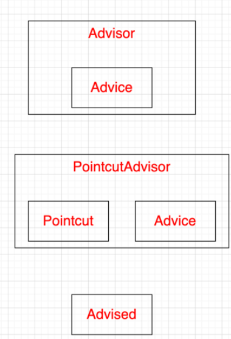
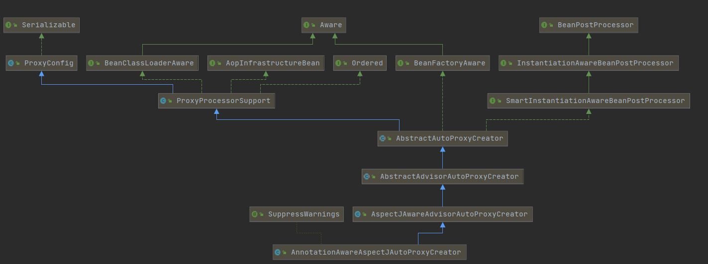
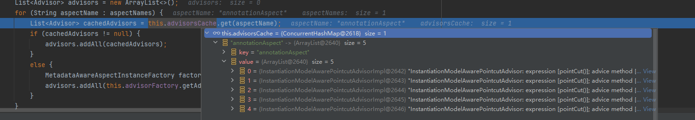

#

# aop原理

# 几个名词

Advice: org.aopalliance.aop.Advice
“通知”，表示 Aspect 在特定的 Join point 采取的操作。包括 “around”, “before” and “after 等

Pointcut: org.springframework.aop.Pointcut

“切点”，它是用来匹配连接点 Join point 的，可以说"Pointcut"表示的是"Join point"的集合。

Advisor: org.springframework.aop.Advisor

“通知者”，它持有 Advice，是 Spring AOP 的一个基础接口。

Advised: org.springframework.aop.framework.Advised
AOP 代理工厂配置类接口。提供了操作和管理 Advice 和 Advisor 的能力。



# 代理对象的创建

1. @EnableAspectJAutoProxy注解利用ImportBeanDefinitionRegistrar，进行注册，注册了AnnotationAwareAspectJAutoProxyCreator，他实际是一个后置处理器BeanPostProcessor
   1. 我们知道BeanPostProcessor后置处理器，会在bean 实例化，和初始化前后，调用对应的after和before方法



2. 在bean refresh阶段，前往org.springframework.beans.factory.support.AbstractAutowireCapableBeanFactory#doCreateBean方法

看到如下代码，此时instanceWrapper是创建好的，还没有被代理的对象实例

```java
try {
    populateBean(beanName, mbd, instanceWrapper);
    exposedObject = initializeBean(beanName, exposedObject, mbd);
}
```

3. 进入initializeBean方法，进行实例对象的初始化过程,调用<b id="blue">invokeInitMethods</b>初始完后，调用<b id="blue">applyBeanPostProcessorsAfterInitialization</b>方法，进行后置处理器的after方法调用，对于AOP的相关后置处理器，则是AbstractAutoProxyCreator#postProcessAfterInitialization
   1. postProcessAfterInitialization中可以看到，原生对象先从二级缓存中删除，才会进入代理对象创建过程

```java
try {
    invokeInitMethods(beanName, wrappedBean, mbd);
}
catch (Throwable ex) {
    throw new BeanCreationException(
          (mbd != null ? mbd.getResourceDescription() : null),
          beanName, "Invocation of init method failed", ex);
}
if (mbd == null || !mbd.isSynthetic()) {
    wrappedBean = applyBeanPostProcessorsAfterInitialization(wrappedBean, beanName);
}
```

```java
//后置处理器的实现AbstractAutoProxyCreator
public Object postProcessAfterInitialization(@Nullable Object bean, String beanName) {
    if (bean != null) {
       Object cacheKey = getCacheKey(bean.getClass(), beanName);
       if (this.earlyProxyReferences.remove(cacheKey) != bean) {
          return wrapIfNecessary(bean, beanName, cacheKey);
       }
    }
    return bean;
}
```

4. 通过wrapIfNecessary方法，可以看到getAdvicesAndAdvisorsForBean方法，这个方法就是生成代理对象的advisors，从getAdvicesAndAdvisorsForBean进入，最终可以看到如图的代码
   1. 代码从缓存中获取到对应的拦截器advice列表



```java
protected List<Advisor> findEligibleAdvisors(Class<?> beanClass, String beanName) {
    //获取容器中所有的advisor
    List<Advisor> candidateAdvisors = findCandidateAdvisors();
    //对advisor进行筛选，符号当前bean的留下来
    List<Advisor> eligibleAdvisors = findAdvisorsThatCanApply(candidateAdvisors, beanClass, beanName);
    extendAdvisors(eligibleAdvisors);
    if (!eligibleAdvisors.isEmpty()) {
       eligibleAdvisors = sortAdvisors(eligibleAdvisors);
    }
    return eligibleAdvisors;
}
```

5. 回到在<b id="blue">wrapIfNecessary</b>中，如果获取到了advisor,则开始AbstractAutoProxyCreator#createProxy创建代理对象，并且返回代理Bean
   1. 通过工厂方式创建代理类：**Spring 默认是jdk代理的，如果是直接使用类而不是接口，则是cglib**，当强制使用cglib时：需要配置`spring.aop.proxy-target-class=true`或`@EnableAspectJAutoProxy(proxyTargetClass = true`)


# 代理类执行过程

容器中保存了组件的代理对象（cglib增强后的对象），这个对象里面保存了详细信息（比如增强器，目标对象，xxx）；
1. 进入到org.springframework.aop.framework.JdkDynamicAopProxy#invoke方法(JDK代理对象的执行方法)

```java
//获取该代理类的所有拦截器链的所有信息（创建bean的时候的后置处理器保存的）
List<Object> chain = this.advised.getInterceptorsAndDynamicInterceptionAdvice(method, targetClass);
else {
    MethodInvocation invocation =
        new ReflectiveMethodInvocation(proxy, target, method, args, targetClass, chain);
    // Proceed to the joinpoint through the interceptor chain.
    retVal = invocation.proceed();
}
```

> 如何获取拦截器链:org.springframework.aop.framework.AdvisedSupport#getInterceptorsAndDynamicInterceptionAdvice


* 如何获取拦截器链
     * 1）.List<Object> interceptorList保存所有拦截器 5
          * 一个默认的ExposeInvocationInterceptor 和 4个增强器；
     * 2）.遍历所有的增强器，将其转为Interceptor；
          *registry.getInterceptors(advisor);
     * 3）.将增强器转为List<MethodInterceptor>；
          * 如果是MethodInterceptor，直接加入到集合中
          * 如果不是，使用AdvisorAdapter将增强器转为MethodInterceptor；
          * 转换完成返回MethodInterceptor数组；
* 3）.如果没有拦截器链，直接执行目标方法;
     * 拦截器链（每一个通知方法又被包装为方法拦截器，利用MethodInterceptor机制）
 * 4）.如果有拦截器链，把需要执行的目标对象，目标方法，
      * 拦截器链等信息传入创建一个 CglibMethodInvocation 对象，
      * 并调用 Object retVal =  mi.proceed();

* 5）.拦截器链的触发过程（CglibMethodInvocation.proceed()方法过程 ）
     * 1).如果没有拦截器执行执行目标方法，或者拦截器的索引和拦截器数组-1大小一样（指定到了最后一个拦截器）执行目标方法；
          *2).链式获取每一个拦截器，拦截器执行invoke方法，每一个拦截器等待下一个拦截器执行完成返回以后再来执行；
          *拦截器链的机制，保证通知方法与目标方法的执行顺序；
          拦截器链时拍好续的，递归调用invoke方法，最后一个调用invoke，执行方法前的拦截器链，执行后返回，执行方法执行后的拦截器链，如果没抛出异常，返回后执行returning拦截器链


## 效果：
1. 正常执行：前置通知-》目标方法-》后置通知-》返回通知
2. 出现异常：前置通知-》目标方法-》后置通知-》异常通知

