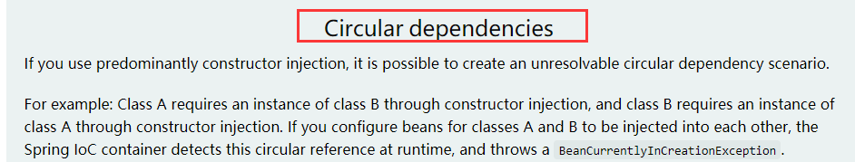

#

# Spring 的生命周期

## Refresh过程
org.springframework.context.support.AbstractApplicationContext#refresh

```java
public void refresh() throws BeansException, IllegalStateException {
    synchronized (this.startupShutdownMonitor) {
        //刷新前的预处理;
        prepareRefresh();
        //创建beanfactory
        ConfigurableListableBeanFactory beanFactory = obtainFreshBeanFactory();
        //对beanfactory进行初步的初始化操作
        //加入一些bean依赖，和内建的非bean的依赖
        //比如context的类加载器，BeanPostProcessor和XXXAware自动装配等
        prepareBeanFactory(beanFactory);

        try {
            // 这一步是空实现，留给子类扩展。
            // 一般 Web 环境的 ApplicationContext 都要利用它注册新的 Scope，完善 Web 下的 BeanFactory
            postProcessBeanFactory(beanFactory);
            //执行BeanFactoryPostProcessor（BeanFactory后置处理器）的方法；
            //主要作用是让你能接触到bean definitions
            invokeBeanFactoryPostProcessors(beanFactory);
            //注册BeanPostProcessor（Bean的后置处理器），在创建bean的前后等执行
            registerBeanPostProcessors(beanFactory);
            //初始化MessageSource组件（做国际化功能；消息绑定，消息解析）；
            initMessageSource();
            //初始化事件派发器
            initApplicationEventMulticaster();
            //子类重写这个方法，在容器刷新的时候可以自定义逻辑；如创建Tomcat，Jetty等WEB服务器
            onRefresh();
            //注册应用的监听器。就是注册实现了ApplicationListener接口的监听器bean，
            //这些监听器是注册到ApplicationEventMulticaster中的
            registerListeners();

            ////初始化所有剩下的非懒加载的单例bean
            finishBeanFactoryInitialization(beanFactory);
            //完成context的刷新。主要是调用LifecycleProcessor的onRefresh()方法，
            //并且发布事件（ContextRefreshedEvent）
            finishRefresh();
        }
```

> 流程详细描述


1. `上下文启动准备`

AbstractApplicationContext#prepareRefresh  刷新前的预处理;

```java
//记录启动时间，状态标识
this.startupDate = System.currentTimeMillis();
this.closed.set(false);
this.active.set(true);
//拓展属性，默认是没有，可以由子类拓展一些属性，如：web的一些属性
initPropertySources();
```

2. `Beanfactory创建阶段`

*AbstractApplicationContext#obtainFreshBeanFactory*：

- 调用<b id="gray">AbstractRefreshableApplicationContext#refreshBeanFactory</b>（**xml的模式解析在这里**）

```java
protected final void refreshBeanFactory() throws BeansException {
    //如果有Beanfactory,则进行销毁
   if (hasBeanFactory()) {
      destroyBeans();
      closeBeanFactory();
   }
   try {
      //创建beanfactory
      DefaultListableBeanFactory beanFactory = createBeanFactory();
      beanFactory.setSerializationId(getId());
      //是否允许beandefinition重复定义和是否允许循环依赖的属性设置
      customizeBeanFactory(beanFactory);
      //从xml中加载beandefinition的信息
      loadBeanDefinitions(beanFactory);
      synchronized (this.beanFactoryMonitor) {
         this.beanFactory = beanFactory;
      }
   }
}
```

3. `准备阶段`

<b id="blue">AbstractApplicationContext#prepareBeanFactory</b>

- 添加aware（通过addBeanPostProcessor）
- 忽略aware的注入

```java
//添加aware
beanFactory.addBeanPostProcessor(new ApplicationContextAwareProcessor(this));
```

- 依赖注入BeanFactory等

4. `后置处理阶段`

*AbstractApplicationContext#postProcessBeanFactory*:

- 依赖子类来实现他的拓展
- 子类可以通过这个方式来添加aware接口如：GenericWebApplicationContext#postProcessBeanFactory方法

*AbstractApplicationContext#invokeBeanFactoryPostProcessors*:

- 这一步会调用 beanFactory 后置处理器（beanFactory 后置处理器，充当 beanFactory 的扩展点，`可以用来补充或修改 BeanDefinition`）(spring的注解模式基于此)

- 执行BeanDefinitionRegistryPostProcessor#postProcessBeanDefinitionRegistry
- 然后再执行BeanFactoryPostProcessor#postProcessBeanFactory
- 常见的 BeanFactory 后置处理器有:
  - <b id="gray">ConfigurationClassPostProcessor </b>： 解析 @Configuration、@Bean、@Import、@PropertySource 等（**注解模式的解析在这里**）
  - <b id="gray">PropertySourcesPlaceHolderConfigurer </b>：替换 BeanDefinition 中的 ${ }
  - <b id="gray">MapperScannerConfigurer </b>: 补充 Mapper 接口对应的 BeanDefinition

5. `注册BeanPostProcessor`

*AbstractApplicationContext#registerBeanPostProcessors*：

- 这一步是继续从 beanFactory 中找出 bean 后处理器，添加至 BeanPostProcessor集合中
- Bean后置处理器，充当 bean 的扩展点，可以工作在 bean 的实例化、依赖注入、初始化阶段，常见的有：
  - <b id="gray">AutowiredAnnotationBeanPostProcessor </b>：解析 @Autowired，@Value 注解
  - <b id="gray">CommonAnnotationBeanPostProcessor </b>：解析 @Resource，@PostConstruct，@PreDestroy
  - <b id="gray">AnnotationAwareAspectJAutoProxyCreator </b>：为符合切点的目标 bean 自动创建代理

- 由源码可以看出，如果BeanPostProcessor标注了PriorityOrdered，那么他会提前依赖查找，但是这个初始化可能bean准备不是那么的充分

```java
if (beanFactory.isTypeMatch(ppName, PriorityOrdered.class)) {
   BeanPostProcessor pp = beanFactory.getBean(ppName, BeanPostProcessor.class);
   priorityOrderedPostProcessors.add(pp);
   if (pp instanceof MergedBeanDefinitionPostProcessor) {
      internalPostProcessors.add(pp);
   }
}
```

6. `初始化MessageSource`

*AbstractApplicationContext#initMessageSource*

- 内建Bean(国际化文案)

```java
//判断MessageSource是否已构建好，springboot中，会在外部创建这个bean
if (beanFactory.containsLocalBean(MESSAGE_SOURCE_BEAN_NAME)) {
   this.messageSource = beanFactory.getBean(MESSAGE_SOURCE_BEAN_NAME, MessageSource.class);
   }
}
```

7. `Spring 广播事件初始化`

*AbstractApplicationContext#initApplicationEventMulticaster*

- 内建bean
- 最终变为一个单例的bean

8. `上下文刷新阶段`

*AbstractApplicationContext#onRefresh*：

- 这一步是空实现，留给子类扩展
- SpringBoot 中的子类在这里准备了 WebServer，即内嵌 web 容器

9. `事件监听器注册`

*AbstractApplicationContext#registerListeners*

- 事件监听器顾名思义，用来接收事件广播器发布的事件，有如下来源
- 事先编程添加的来自容器中的 bean
- 来自于 @EventListener 的解析

10. `初始化完成阶段`

- AbstractApplicationContext#finishBeanFactoryInitialization
- 当ConversionService存在时，关联ConversionService
- 这一步会将 BeanFactory 的成员补充完毕，并初始化所有非延迟单例 bean
- 添加StringValueResolver
  - 处理一系列字符串的逻辑比如：占位符解释、SpEL计算等等
- 初始化单例Beans（ 对象的创建都分三个阶段，每一阶段都有不同的 bean 后处理器参与进来，扩展功能）

11. `应用上下文关闭阶段`

- AbstractApplicationContext#close 
- 状态表示关闭:active(fales), closed(true)
- 发布Spring应用上下文关闭时间
- 注销Shutdown Hook（优雅关闭线程能够触发close事件）

## 注解的方式加载Bean过程

通过refresh->PostProcessorRegistrationDelegate#invokeBeanFactoryPostProcessors->PostProcessorRegistrationDelegate#invokeBeanDefinitionRegistryPostProcessors
->ConfigurationClassPostProcessor#postProcessBeanDefinitionRegistry
->ConfigurationClassPostProcessor#processConfigBeanDefinitions
最终可以看到，解析 componentScan 的组件
```java
ConfigurationClassParser parser = new ConfigurationClassParser(
				this.metadataReaderFactory, this.problemReporter, this.environment,
				this.resourceLoader, this.componentScanBeanNameGenerator, registry);

Set<BeanDefinitionHolder> candidates = new LinkedHashSet<>(configCandidates);
Set<ConfigurationClass> alreadyParsed = new HashSet<>(configCandidates.size());
do {
   parser.parse(candidates);

```
进入到org.springframework.context.annotation.ConfigurationClassParser#doProcessConfigurationClass
在这个方法中，将bean的定义解析成BeanDefinition
```java
//将component的注解扫描的bean定义扫描出来
Set<BeanDefinitionHolder> scannedBeanDefinitions =
						this.componentScanParser.parse(componentScan, sourceClass.getMetadata().getClassName());

// Process any @Import annotations
processImports(configClass, sourceClass, getImports(sourceClass), filter, true);

```

## Bean实例化流程

入口方法：org.springframework.context.support.AbstractApplicationContext#finishBeanFactoryInitialization

1. 在finishBeanFactoryInitialization方法中，调用beanFactory.preInstantiateSingletons();创建方法

```java
protected void finishBeanFactoryInitialization(ConfigurableListableBeanFactory beanFactory) {
	//实例化所有立即加载的单例bean
   beanFactory.preInstantiateSingletons();
}
```

2. 调用org.springframework.beans.factory.support.DefaultListableBeanFactory#preInstantiateSingletons方法

   1. 遍历获取容器中所有的Bean，依次创建对象getBean(beanName);
2. 在所有bean实例化后，遍历所有beanName：触发所有SmartInitializingSingleton实例化后后置处理器方法afterSingletonsInstantiated();

```java
public void preInstantiateSingletons() throws BeansException {
   //所有bean的名称
   List<String> beanNames = new ArrayList<>(this.beanDefinitionNames);
   // 触发所有非延迟加载单例bean的初始化，主要步骤为getBean
   for (String beanName : beanNames) {
       //合并父BeanDefinition对象
      RootBeanDefinition bd = getMergedLocalBeanDefinition(beanName);
      if (!bd.isAbstract() && bd.isSingleton() && !bd.isLazyInit()) {
         if (isFactoryBean(beanName)) {
            ...
         }
         else {
             //实例化当前bean
            getBean(beanName);
         }
      }
   }
}
```

3. getBean->doGetBean()->getSingleton()->

   1. 从getBean进来，调用org.springframework.beans.factory.support.AbstractBeanFactory#doGetBean

   <b id="blue">doGetBean</b>主要做的事情：

   1. 尝试从缓存中获取bean
   2. 循环依赖判断
   3. 递归去父容器获取bean实例
   4. 从当前容器获取beandefinition实例

```java
protected <T> T doGetBean(final String name, @Nullable final Class<T> requiredType,
      @Nullable final Object[] args, boolean typeCheckOnly) throws BeansException {
	//解析beanName如果以&开头去掉&开头，如果是别名获取到真正的名字
    //因为factorybean是已&开头获取
   final String beanName = transformedBeanName(name);
   Object bean;

   // 单纯理解尝试从缓存中获取bean
   // Spring创建bean的原则是不等bean创建完成就会将创建bean的ObjectFactory提早曝光
   //如果存在循环依赖, 那么缓存中存在, 存在的对象是2种情况: 1)未属性注入的普通bean 2)经过AOP的代理对象
   Object sharedInstance = getSingleton(beanName);
   if (sharedInstance != null && args == null) {
      // 如果beanName的实例存在于缓存中,且Bean还在创建中，则说明是循环引用
      //如果是普通bean，直接返回，如果是FactoryBean，则返回它的getObject
      bean = getObjectForBeanInstance(sharedInstance, name, beanName, null);
   }

   else {
      //检查父工厂中是否存在该对象
      BeanFactory parentBeanFactory = getParentBeanFactory();
      if (parentBeanFactory != null && !containsBeanDefinition(beanName)) {
        
      }

      try {
          //合并父子bean属性
         final RootBeanDefinition mbd = getMergedLocalBeanDefinition(beanName);
         // 创建单例bean
         if (mbd.isSingleton()) {
             //调用多态方法
            sharedInstance = getSingleton(beanName, () -> {
               try {
                  return createBean(beanName, mbd, args);
               }
            });
            bean = getObjectForBeanInstance(sharedInstance, name, beanName, mbd);
         }
      }
   }
   return (T) bean;
}
```

多态方法<b id="blue">getSingleton</b>

```java
public Object getSingleton(String beanName, ObjectFactory<?> singletonFactory) {
   synchronized (this.singletonObjects) {
       //
      Object singletonObject = this.singletonObjects.get(beanName);
      if (singletonObject == null) {
          //验证完要真正开始创建对象，先标识该bean正在被创建，因为spingbean创建过程复杂，步骤很多，需要标识
         beforeSingletonCreation(beanName);
         boolean newSingleton = false;
         boolean recordSuppressedExceptions = (this.suppressedExceptions == null);
         if (recordSuppressedExceptions) {
            this.suppressedExceptions = new LinkedHashSet<>();
         }
         try {
             //调用外部传入的创建bean的方法
            singletonObject = singletonFactory.getObject();
            newSingleton = true;
         }
      }
      return singletonObject;
   }
}
```

4. 调用org.springframework.beans.factory.support.AbstractAutowireCapableBeanFactory#createBean方法

```java
protected Object createBean(String beanName, RootBeanDefinition mbd, @Nullable Object[] args)
      throws BeanCreationException {
   try {
       //真正干活的bean（真正的创建）
      Object beanInstance = doCreateBean(beanName, mbdToUse, args);
      if (logger.isTraceEnabled()) {
         logger.trace("Finished creating instance of bean '" + beanName + "'");
      }
      return beanInstance;
   }
}
```

org.springframework.beans.factory.support.AbstractAutowireCapableBeanFactory#doCreateBean

```java
protected Object doCreateBean(final String beanName, final RootBeanDefinition mbd, final @Nullable Object[] args)
      throws BeanCreationException {

   // bean的一个包装类
   BeanWrapper instanceWrapper = null;
   if (mbd.isSingleton()) {
      instanceWrapper = this.factoryBeanInstanceCache.remove(beanName);
   }
   if (instanceWrapper == null) {
       //创建Bean实例,仅仅调用构造方法,但是尚未设置属性
      instanceWrapper = createBeanInstance(beanName, mbd, args);
   }
   final Object bean = instanceWrapper.getWrappedInstance();
   Class<?> beanType = instanceWrapper.getWrappedClass();
   if (beanType != NullBean.class) {
      mbd.resolvedTargetType = beanType;
   }
   // Initialize the bean instance.
   Object exposedObject = bean;
   try {
       //bean属性填充
      populateBean(beanName, mbd, instanceWrapper);
       //调用初始化方法，应用BeanPostProcessor后置处理器
      exposedObject = initializeBean(beanName, exposedObject, mbd);
   }
   return exposedObject;
}
```

## Bean属性填充
org.springframework.beans.factory.support.AbstractAutowireCapableBeanFactory#populateBean

```java
//pvs 是一个 MutablePropertyValues 实例，里面实现了PropertyValues接口，
//提供属性的读写操作实现，同时可以通过调用构造函数实现深拷贝
PropertyValues pvs = (mbd.hasPropertyValues() ? mbd.getPropertyValues() : null);

int resolvedAutowireMode = mbd.getResolvedAutowireMode();
//判断bean的依赖注入方式：即是否标注有 @Autowired 注解或 autowire=“byType/byName” 的标签
if (resolvedAutowireMode == AUTOWIRE_BY_NAME || resolvedAutowireMode == AUTOWIRE_BY_TYPE) {
   //深拷贝当前已有的配置
   MutablePropertyValues newPvs = new MutablePropertyValues(pvs);
   // Add property values based on autowire by name if applicable.
   if (resolvedAutowireMode == AUTOWIRE_BY_NAME) {
      autowireByName(beanName, mbd, bw, newPvs);
   }
   // Add property values based on autowire by type if applicable.
   if (resolvedAutowireMode == AUTOWIRE_BY_TYPE) {
      autowireByType(beanName, mbd, bw, newPvs);
   }
   pvs = newPvs;
}

for (BeanPostProcessor bp : getBeanPostProcessors()) {
   if (bp instanceof InstantiationAwareBeanPostProcessor) {
      InstantiationAwareBeanPostProcessor ibp = (InstantiationAwareBeanPostProcessor) bp;
      //调用
      //org.springframework.beans.factory.annotation.AutowiredAnnotationBeanPostProcessor#postProcessProperties
      //对@Autowire进行赋值
      PropertyValues pvsToUse = ibp.postProcessProperties(pvs, bw.getWrappedInstance(), beanName);
```

> postProcessProperties
拓展属性修改的后置处理器方法


## 循环依赖问题
官网说明：https://docs.spring.io/spring-framework/docs/current/reference/html/core.html#beans-dependency-resolution



在org.springframework.beans.factory.support.DefaultSingletonBeanRegistry中，有三个map，分别是三个`存放Bean`的缓存

```java
//一级缓存:存放的是已经初始化好了的Bean
private final Map<String, Object> singletonObjects = new ConcurrentHashMap<>(256);

//三级缓存:存放的是一个函数，里面
private final Map<String, ObjectFactory<?>> singletonFactories = new HashMap<>(16);

//二级缓存: 存放的是实例化了，但是未初始化的Bean
private final Map<String, Object> earlySingletonObjects = new HashMap<>(16);
```

三级缓存的value 是一个ObjectFactory， 从缓存中取出（getSingleton）时，会调用ObjectFactory.getObject方法，得到对象，这种设计的作用，是为了有AOP的情况下，可以返回代理对象

> 实现过程：

A对象依赖B对象， B对象依赖A对象

1. A对象实例化后立马将自己包装成ObjectFactory，放入三级缓存中（`提前暴露自己`）,`在属性设置的时候`发现需要B， 然后去实例化B

2.  B实例化后，同样将自己放入三级缓存中，`在属性设置的时候`发现需要A，于是B先查一级缓存，没有，再查二级缓存，还是没有，再查三级缓存，找到了A的包装ObjectFactory，调用AObjectFactory的方法获取A放到二级缓存里面，并删除三级缓存里面的A
3. B顺利初始化完毕，将自己放到一级缓存里面（此时B里面的A依然是创建中状态,然后回来接着创建A，此时B已经创建结束，直接从一级缓存里面拿到B，然后完成创建，并将A自己放到一级缓存里面。

> 源码解析

1. 从org.springframework.beans.factory.support.DefaultSingletonBeanRegistry#getSingleton入手

```java
if (mbd.isSingleton()) {
   sharedInstance = getSingleton(beanName, () -> {
      try {
         return createBean(beanName, mbd, args);
      }
   });
}
```

2. 进入org.springframework.beans.factory.support.AbstractAutowireCapableBeanFactory#createBean方法，实例化bean
   1. 从三级缓存调用，调用getObject方法获取bean，实际调用的AbstractAutowireCapableBeanFactory#getEarlyBeanReference方法


```java
protected Object doCreateBean(final String beanName, final RootBeanDefinition mbd, final @Nullable Object[] args)
      throws BeanCreationException {
   BeanWrapper instanceWrapper = null;
   if (instanceWrapper == null) {
       //创建Bean实例，仅仅调用构造方法,但是尚未设置属性
      instanceWrapper = createBeanInstance(beanName, mbd, args);
   }

   if (earlySingletonExposure) {
       //往三级缓存放入一个方法，方法里面可以获取已经实例化的bean
      addSingletonFactory(beanName, () -> getEarlyBeanReference(beanName, mbd, bean));
   }

   // Initialize the bean instance.
   Object exposedObject = bean;
   try {
       //属性设置
      populateBean(beanName, mbd, instanceWrapper);
      exposedObject = initializeBean(beanName, exposedObject, mbd);
   }
}
```

3. 在org.springframework.beans.factory.support.DefaultSingletonBeanRegistry#getSingleton中我们发现它会从三级缓存中取出*缓存的函数*调用，
   1. 其实就是调用getEarlyBeanReference方法
   2. 这个方法调用*SmartInstantiationAwareBeanPostProcessor*可以做一些拓展（**二级缓存的作用**）
   3. 只有存在循环依赖时，才会调用getEarlyBeanReference方法

```java
protected Object getEarlyBeanReference(String beanName, RootBeanDefinition mbd, Object bean) {
   Object exposedObject = bean;
   if (!mbd.isSynthetic() && hasInstantiationAwareBeanPostProcessors()) {
      for (BeanPostProcessor bp : getBeanPostProcessors()) {
         if (bp instanceof SmartInstantiationAwareBeanPostProcessor) {
            SmartInstantiationAwareBeanPostProcessor ibp = (SmartInstantiationAwareBeanPostProcessor) bp;
            exposedObject = ibp.getEarlyBeanReference(exposedObject, beanName);
         }
      }
   }
   return exposedObject;
}
```

4. 最终在org.springframework.beans.factory.support.DefaultSingletonBeanRegistry#getSingleton方法中，调用org.springframework.beans.factory.support.DefaultSingletonBeanRegistry#addSingleton方法，将bean放入一级缓存中

## 初始化和销毁

在注入bean的时候，执行初始化方法，在销毁容器时，执行bean的销毁方法

如果是多实例的，只会执行初始化方法

> 第一种方式

```java
public class TestInit {
    public void init(){
        System.out.println("test init");
    }

    public void destroy(){
        System.out.println("test destroy");
    }
}
```

```java
@Bean(initMethod = "init", destroyMethod = "destroy")
public TestInit testInit(){
    return new TestInit();
}
```

> 第二种方式

实现InitializingBean，DisposableBean接口，实现对应方法，将类注入ioc容器中

```java
@Component
public class Cat implements InitializingBean,DisposableBean {
    //容器销毁时执行方法
    public void destroy() throws Exception {
        System.out.println("Cat.....destroy");
    }
    //加载完属性执行方法，也就是初始化
    public void afterPropertiesSet() throws Exception {
        System.out.println("Cat ... init ...");
    }
}
```

> 第三种方式 JSR250

利用jsr250注解

```java
@Component
public class TestJsr250 {
    //bean初始化完成，并且赋值完成调用
    @PostConstruct
    public void init(){
        System.out.println("TestJsr250 ... init");
    }
    //容器销毁bean时调用
    @PreDestroy
    public void destroy(){
        System.out.println("TestJsr250 ... destroy");
    }
}
```


## 后置处理器
### BeanPostProcessor
bean后置处理器，bean创建对象初始化前后进行拦截工作的
初始化前后调用(后置处理器)


所有bean在调用初始化方法前后时都会调用下面的方法

这个在底层大量运用，如

bean赋值，注入其他组件，@Autowired，生命周期注解功能，@Async,xxx BeanPostProcessor;

```java
/**
 * 所有bean初始化前后调用
 * Created by Administrator on 2019/6/29.
 */
@Component
public class TestBeanPropersecor implements BeanPostProcessor {
    /**
     * bean调用初始化方法之前调用
     * @param o bean对象
     * @param s bean id名
     * @return
     * @throws BeansException
     */
    public Object postProcessBeforeInitialization(Object o, String s) throws BeansException {
        System.out.println("BeforeInitialization.. "+o.getClass() + " bean name："+s);
        //返回bean对象，这里可以根据一些操作，返回处理后的bean
        return o;
    }

    public Object postProcessAfterInitialization(Object o, String s) throws BeansException {
        System.out.println("AfterInitialization.. "+o.getClass() + " bean name："+s);
        return o;
    }
}
```

### BeanFactoryPostProcessor：beanFactory的后置处理器；
    * 在BeanFactory标准初始化之后调用，来定制和修改BeanFactory的内容；
    * 所有的bean定义已经保存加载到beanFactory，但是bean的实例还未创建

```java
@Component //要想生效，则加入ioc容器中
public class MyBeanFactoryProcessor implements BeanFactoryPostProcessor {
    public void postProcessBeanFactory(ConfigurableListableBeanFactory beanFactory) throws BeansException {
        //获取所有的bean信息
        String[] beanDefinitionNames = beanFactory.getBeanDefinitionNames();
        System.out.println("MyBeanFactoryProcessor ....");
        for(String beanDefinitionName : beanDefinitionNames){
            System.out.println("MyBeanFactoryProcessor:"+beanDefinitionName);
        }
    }
}
```

```java
@ComponentScan("com.xiao.Ext")
@Configuration
public class ExtConfig {
    @Bean(initMethod = "init", destroyMethod = "destroy")
    public TestInit testInit(){
        return new TestInit();
    }
}
```


> 原理

进入refresh() 方法，可以看到invokeBeanFactoryPostProcessors(beanFactory);方法，这个方法会找到所有BeanFactoryPostProcessor并执行,在invokeBeanFactoryPostProcessors方法中，执行invokeBeanFactoryPostProcessors方法

```java
class PostProcessorRegistrationDelegate {
   public static void invokeBeanFactoryPostProcessors(
   invokeBeanFactoryPostProcessors(nonOrderedPostProcessors, beanFactory);
```

```java
private static void invokeBeanFactoryPostProcessors(
      Collection<? extends BeanFactoryPostProcessor> postProcessors, ConfigurableListableBeanFactory beanFactory) {
    //获取BeanFactoryPostProcessor的名
    String[] postProcessorNames =
				beanFactory.getBeanNamesForType(BeanFactoryPostProcessor.class, true, false);
    //获取所有未排序的BeanFactoryPostProcessor（源码上面还有其他排序的等，这里不贴出了）
    List<BeanFactoryPostProcessor> nonOrderedPostProcessors = new ArrayList<BeanFactoryPostProcessor>();
		for (String postProcessorName : nonOrderedPostProcessorNames) {
			nonOrderedPostProcessors.add(beanFactory.getBean(postProcessorName, BeanFactoryPostProcessor.class));
		}
   for (BeanFactoryPostProcessor postProcessor : postProcessors) {
      postProcessor.postProcessBeanFactory(beanFactory);
   }
}
```


# 环境切换

建立一个config，用@profile标注个个环境产生的bean（如果不标示，则标示默认产生）

```java
@Configuration
public class TestProfile {

    @Profile(value = "test")
    @Bean("testTestBean")
    public TestBean testBeanTest(){
        return new TestBean();
    }

    @Profile(value = "prod")
    @Bean("prodTestBean")
    public TestBean testBeanPro(){
        return new TestBean();
    }

    @Profile(value = "dev")
    @Bean("devTestBean")
    public TestBean testBeanDev(){
        return new TestBean();
    }
}
```

1、使用命令行动态参数: 在虚拟机参数位置加载 -Dspring.profiles.active=test

2、代码的方式切换产生对应的bean 

```java
@Test
public void testBeanConfig2(){
    AnnotationConfigApplicationContext applicationContext = new AnnotationConfigApplicationContext();
    //设置激活的环境
    applicationContext.getEnvironment().setActiveProfiles("prod");
    //配置主配置类
    applicationContext.register(TestProfile.class);
    //启动刷新容器
    applicationContext.refresh();

    String[] beanNamesForType = applicationContext.getBeanNamesForType(TestBean.class);
    for(String beanName : beanNamesForType){
        System.out.println(beanName);
    }
    applicationContext.close();
}
```
# 懒加载Bean

第一次获取bean的时候加载bean的对象，默认时初始化的时候就把bean对象创建好了
该注解值时候`单例模式`

```java
@Bean
@Lazy
public TestBean testBean(){
    System.out.println("创建对象bean、、、、");
    TestBean testBean = new TestBean();
    testBean.setUsername("lisi");
    return testBean;
}
```


# Bean 排序

Ordered

 