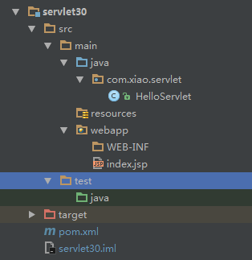
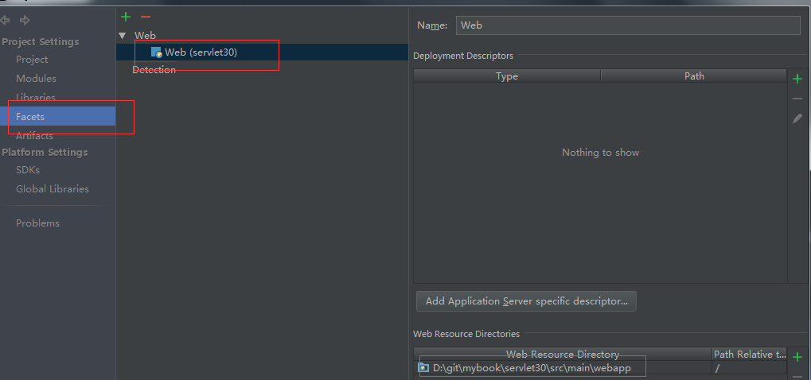
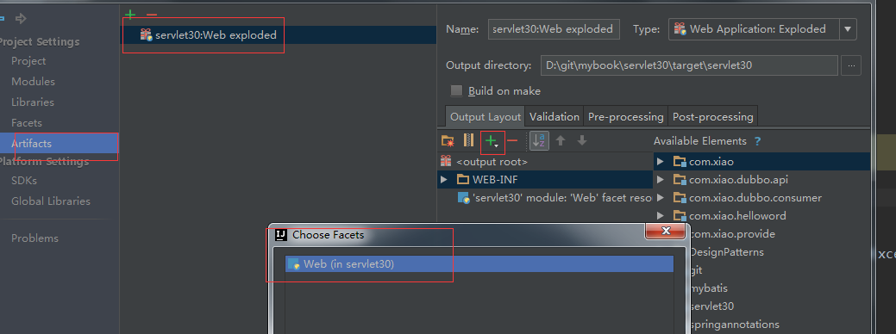
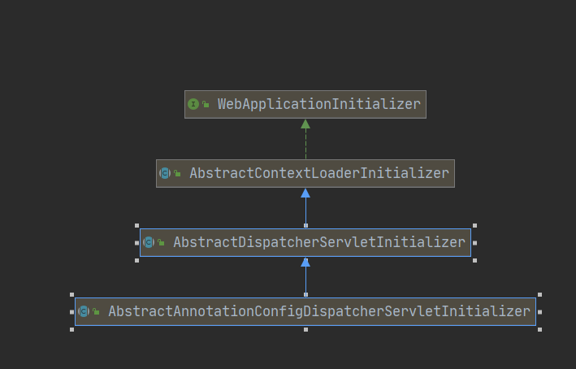

#

# Get和Post方法的区别

1. post请求包含更多的请求头
2. post在真正接收数据之前会先将请求头发送给服务器进行确认，然后才真正发送数据

```tex
post请求的过程：
（1）浏览器请求tcp连接（第一次握手）
（2）服务器答应进行tcp连接（第二次握手）
（3）浏览器确认，并发送post请求头（第三次握手，这个报文比较小，所以http会在此时进行第一次数据发送）
（4）服务器返回100 Continue响应
（5）浏览器发送数据
（6）服务器返回200 OK响应
get请求的过程：
（1）浏览器请求tcp连接（第一次握手）
（2）服务器答应进行tcp连接（第二次握手）
（3）浏览器确认，并发送get请求头和数据（第三次握手，这个报文比较小，所以http会在此时进行第一次数据发送）
（4）服务器返回200 OK响应
也就是说，目测get的总耗是post的2/3左右，这个口说无凭，网上已经有网友进行过测试。
```

3. get会将数据缓存起来，而post不会
   1. GET可被浏览器缓存（如静态资源），通过 `Cache-Control` 控制缓存策略
   2. POST默认不缓存，但可通过手动设置头信息实现（较少使用）


# Servlet3.0

3.0可以不使用传统的web.xml，直接使用注解，就可以搭建器web项目

使用idea示例：

1. 建立web项目







1. pom文件：

```xml
<dependencies>
    <dependency>
        <groupId>javax.servlet</groupId>
        <artifactId>javax.servlet-api</artifactId>
        <version>3.0.1</version>
        <!--打包时不带入-->
        <scope>provided</scope>
    </dependency>
</dependencies>

<build>
    <plugins>
        <plugin>
            <groupId>org.apache.maven.plugins</groupId>
            <artifactId>maven-war-plugin</artifactId>
            <version>2.4</version>
            <configuration>
                <!--表示不使用web.xml-->
                <failOnMissingWebXml>false</failOnMissingWebXml>
            </configuration>
        </plugin>
    </plugins>
</build>
```

3. 新建一个servlet,使用<b id="blue">@WebServlet</b>注解

```java
@WebServlet("/hello")
public class HelloServlet extends HttpServlet {
    @Override
    protected void doGet(HttpServletRequest req, HttpServletResponse resp) throws ServletException, IOException {
        resp.getWriter().print("hello.....");
    }
}
```

直接访问servlet，就能获得对应的输出结果

## 整合SpringMvc

进入Spring mvc 官网：<https://docs.spring.io/spring/docs/current/spring-framework-reference/web.html>参考，这里我们利用servlet3.0的方式来整合spring mvc

引入jar包

```xml
<dependency>
    <groupId>org.springframework</groupId>
    <artifactId>spring-webmvc</artifactId>
    <version>4.3.11.RELEASE</version>
</dependency>
```

我们spring-web的jar包下可以看到：META-INF/services/javax.servlet.ServletContainerInitializer文件（ps:这个是文件文件里面有SpringServletContainerInitializer的全路径内容）

在web容器启动时，会扫描每个jar包下的这个文件

加载这个文件的启动类org.springframework.web.SpringServletContainerInitializer

```java
@HandlesTypes(WebApplicationInitializer.class)
public class SpringServletContainerInitializer implements ServletContainerInitializer {
    @Override
	public void onStartup(Set<Class<?>> webAppInitializerClasses, ServletContext servletContext)
			throws ServletException {
```

它会去加载所有实现了**WebApplicationInitializer**接口的组件

并且为WebApplicationInitializer组件创建对象（组件不是接口，不是抽象类）

以下是WebApplicationInitializer的实现类：

- AbstractContextLoaderInitializer：创建根容器；createRootApplicationContext()；

```java
@Override
public void onStartup(ServletContext servletContext) throws ServletException {
   registerContextLoaderListener(servletContext);
}
protected void registerContextLoaderListener(ServletContext servletContext) {
    
    //调用createRootApplicationContext方法，进而创建根容器
		WebApplicationContext rootAppContext = createRootApplicationContext();
```

- AbstractDispatcherServletInitializer：

  - 创建一个web的ioc容器；createServletApplicationContext();

  - 创建了DispatcherServlet；createDispatcherServlet()；

  - 将创建的DispatcherServlet添加到ServletContext中；getServletMappings()来自定义mapping
- AbstractAnnotationConfigDispatcherServletInitializer：注解方式配置的DispatcherServlet初始化器
  - 创建根容器：createRootApplicationContext()：getRootConfigClasses();传入一个配置类
  - 创建web的ioc容器： createServletApplicationContext();：获取配置类；getServletConfigClasses();

```java
/**
  *  通过getRootConfigClasses获取配置类
  **/
@Override
@Nullable
protected WebApplicationContext createRootApplicationContext() {
   Class<?>[] configClasses = getRootConfigClasses();
```

## 总结



以注解方式来启动SpringMVC；继承AbstractAnnotationConfigDispatcherServletInitializer；
实现抽象方法指定DispatcherServlet的配置信息；

## 代码示例

```xml
<dependencies>
    <dependency>
        <groupId>org.springframework</groupId>
        <artifactId>spring-webmvc</artifactId>
        <version>4.3.13.RELEASE</version>
    </dependency>
    <dependency>
        <groupId>javax.servlet</groupId>
        <artifactId>javax.servlet-api</artifactId>
        <version>3.0.1</version>
        <!--打包时不带入-->
        <scope>provided</scope>
    </dependency>
</dependencies>
```

配置两个配置类，相当于配置web.xml里面的：

*根容器的配置类；（Spring的配置文件）*

```java
//SpringMVC只扫描Controller；子容器
//useDefaultFilters=false 禁用默认的过滤规则；
@ComponentScan(value = "com.xiao", includeFilters = {
        @ComponentScan.Filter(type = FilterType.ANNOTATION, classes = {RestController.class, Controller.class})
},useDefaultFilters = false)
public class AppConfig {
}
```

*Web容器的配置类（SpringMVC配置文件）*

```java
//根容器只扫描service和reposity, Controller
@ComponentScan(value = "com.xiao", excludeFilters = {
        @ComponentScan.Filter(type= FilterType.ANNOTATION, classes={Controller.class, RestController.class})
})
public class RootConfig {
}
```

```java
//web容器启动的时候创建对象；调用方法来初始化容器以前前端控制器
public class MyWebAppInitializer extends AbstractAnnotationConfigDispatcherServletInitializer {

    //获取根容器的配置类；（Spring的配置文件）   父容器；
    @Override
    protected Class<?>[] getRootConfigClasses() {
        return new Class<?>[]{RootConfig.class};
    }

    //获取web容器的配置类（SpringMVC配置文件）  子容器；
    @Override
    protected Class<?>[] getServletConfigClasses() {
        return new Class<?>[]{AppConfig.class};
    }

    //获取DispatcherServlet的映射信息
    //  /：拦截所有请求（包括静态资源（xx.js,xx.png）），但是不包括*.jsp；
    //  /*：拦截所有请求；连*.jsp页面都拦截；jsp页面是tomcat的jsp引擎解析的；
    @Override
    protected String[] getServletMappings() {
        // TODO Auto-generated method stub
        return new String[]{"/"};
    }
}
```

```java
@RestController
public class HelloController {
    @Autowired
    private HelloService helloService;
    @RequestMapping("/hello")
    @ResponseBody
    public String sayHello(){
        return helloService.sayHello();
    }
}
```
