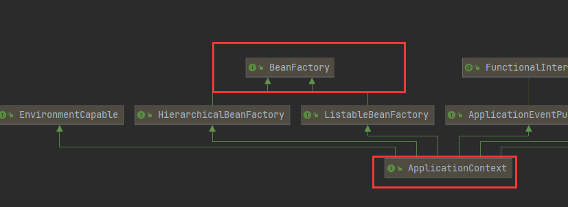

# IOC容器的职责

- 实现与应用解耦

- 依赖处理
  - 依赖查找：如通过名称去查找
  - 依赖注入

# IOC和DI的区别

- IOC是站在对象的角度，对象实例化及其管理的权利交给了（反转)给了容器
- 容器会把对象依赖的其他对象注入(送进去)，比如A对象实例化过程中因为声明了一个B类型的属性，那么就需要容器把B对象注入给A

# IOC依赖来源

- 自定义bean：我们自定义的bean
- 内建的bean
- 容器内建依赖：beanfactory
- IoC中，依赖查找和依赖注入的数据来源并不一样。因为BeanFactory、ResourceLoader、ApplicationEventPublisher、ApplicationContext这四个并不是Bean，它们只是一种特殊的依赖项，无法通过依赖查找的方式来获取，只能通过依赖注入的方式来获取。

## ApplicationContext

- applicationContext是BeanFactory子接口
- 他提供了获取上下文，监听的方法



- 查看源码可以得知，application有个getBeanFactory的方法
- 他将BeanFactory组合进来了，所以，applicationContext虽然实现了BeanFactory,但他们是两个东西，一般我们需要beanfactory时，通常用ApplicationContext.getBeanFactory()

## BeanFactory与FactoryBean

- BeanFactory是IOC最基本的**容器**，负责管理bean，它为其他具体的IOC容器提供了最基本的规范
- FactoryBean是创建bean的一种方式，帮助实现负责的初始化操作

# refresh过程

```java
public void refresh() throws BeansException, IllegalStateException {
    synchronized (this.startupShutdownMonitor) {
        //刷新前的预处理;
        prepareRefresh();
        //创建beanfactory
        ConfigurableListableBeanFactory beanFactory = obtainFreshBeanFactory();
        //对beanfactory进行初步的初始化操作
        //加入一些bean依赖，和内建的非bean的依赖
        //比如context的类加载器，BeanPostProcessor和XXXAware自动装配等
        prepareBeanFactory(beanFactory);

        try {
            //BeanFactory准备工作完成后进行的后置处理工作
            postProcessBeanFactory(beanFactory);
            //执行BeanFactoryPostProcessor的方法；
            //主要作用是让你能接触到bean definitions
            invokeBeanFactoryPostProcessors(beanFactory);
            //注册BeanPostProcessor（Bean的后置处理器），在创建bean的前后等执行
            registerBeanPostProcessors(beanFactory);
            //初始化MessageSource组件（做国际化功能；消息绑定，消息解析）；
            initMessageSource();
            //初始化事件派发器
            initApplicationEventMulticaster();
            //子类重写这个方法，在容器刷新的时候可以自定义逻辑；如创建Tomcat，Jetty等WEB服务器
            onRefresh();
            //注册应用的监听器。就是注册实现了ApplicationListener接口的监听器bean，
            //这些监听器是注册到ApplicationEventMulticaster中的
            registerListeners();

            ////初始化所有剩下的非懒加载的单例bean
            finishBeanFactoryInitialization(beanFactory);
            //完成context的刷新。主要是调用LifecycleProcessor的onRefresh()方法，
            //并且发布事件（ContextRefreshedEvent）
            finishRefresh();
        }
```

