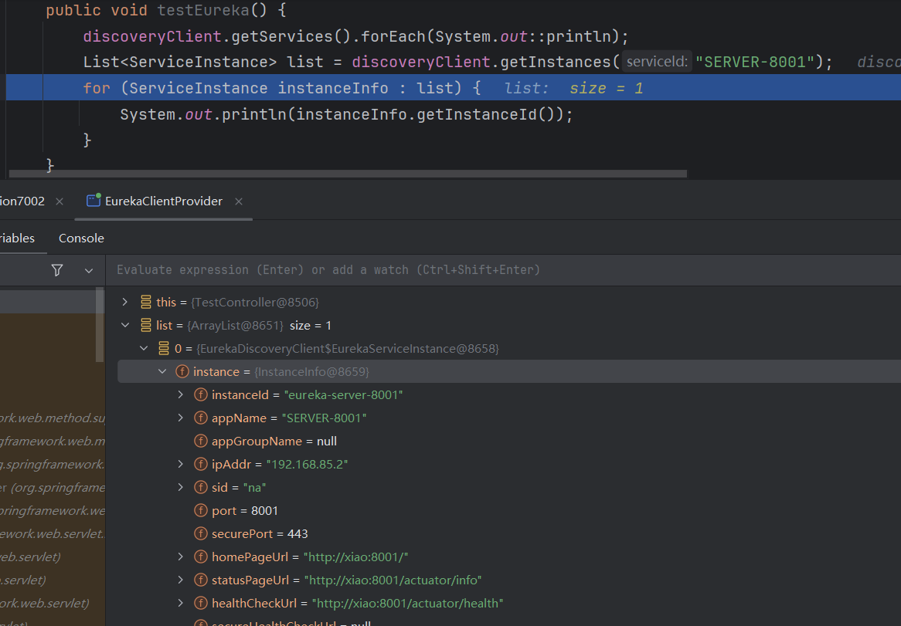
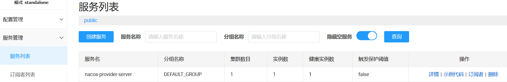
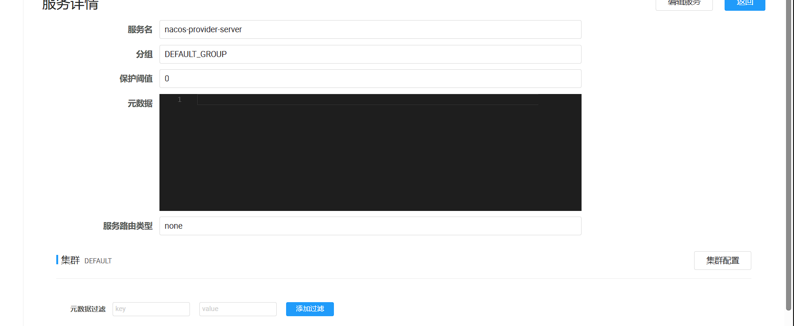
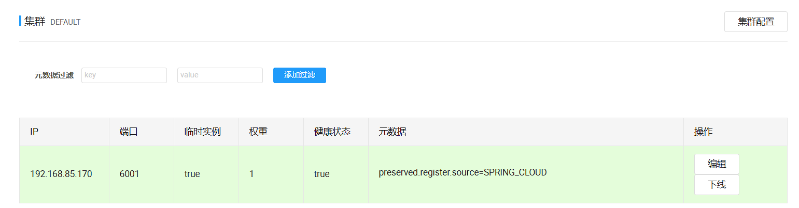

##

# 问题

1. 一个微服务的提供者的数量和分布往往是动态变化的，也是无法预先确定的
2. 服务注册中心本质上是为了解耦服务提供者和服务消费者。

# Eureka
## Eureka服务注册与发现

Spring Cloud 封装了 Netflix 公司开发的 Eureka 模块来实现服务注册和发现(请对比Zookeeper)。

Eureka 采用了 C-S 的设计架构。Eureka Server 作为服务注册功能的服务器，它是服务注册中心。

而系统中的其他微服务，使用 Eureka 的客户端连接到 Eureka Server并维持心跳连接。这样系统的维护人员就可以通过 Eureka Server 来监控系统中各个微服务是否正常运行。SpringCloud 的一些其他模块（比如Zuul）就可以通过 Eureka Server 来发现系统中的其他微服务，并执行相关的逻辑。


Eureka包含两个组件：Eureka Server和Eureka Client
Eureka Server提供服务注册服务
各个节点启动后，会在EurekaServer中进行注册，这样EurekaServer中的服务注册表中将会存储所有可用服务节点的信息，服务节点的信息可以在界面中直观的看到


EurekaClient是一个Java客户端，用于简化Eureka Server的交互，客户端同时也具备一个内置的、使用轮询(round-robin)负载算法的负载均衡器。在应用启动后，将会向Eureka Server发送心跳(默认周期为30秒)。如果Eureka Server在多个心跳周期内没有接收到某个节点的心跳，EurekaServer将会从服务注册表中把这个服务节点移除（默认90秒）

## 三大角色

<b id="blue">Eureka Server</b> 提供服务注册和发现

<b id="blue">Service Provider</b>服务提供方将自身服务注册到Eureka；并且通过心跳机制进行续约

<b id="blue">Service Consumer</b>服务消费方定期的向serve拉取服务注册列表

> EurekaClient通过poll模式获取注册数据

<b id="blue">EurekaClient心跳</b>

通过注册中心进行访问没如果server多个心跳周期没有收到某个节点(默认30S续约一次)，则server会将其从服务注册表移除（默认90秒）

## Euraka 与zookeeper的区别
zookeeper保证的是cp：在向注册中心注册时，zookeeper可以允许几分钟的注册事件，但不能接收服务down掉不可用，当master接口与其他节点失去联系时，其余节点重新选择leader，但如果选择leader时间太长，选举期间，整个zk集群是不可用的，这时就会导致注册服务瘫痪。

euraka保证的是ap：eureka各个节点平等，只要有一台在，就能保证注册服务，只不过查到的信息可能不是最新的，此外，它还有一种自我保护机制：在15分钟内，85%节点没有正常心跳，则eureka认为客户端与注册中心网络出现故障，则出现以下几点现象

1 不会从注册表移除没有心跳的过期服务

2 任然接受新的注册与查询，但不同步其他节点

3 网络稳定，再同步到其他节点

## 建立Eureka服务

### 服务端构建

新建cloud-eureka-7001服务

引入jar包

```xml
<dependencies>
    <!--eureka-server服务端 -->
    <dependency>
        <groupId>org.springframework.cloud</groupId>
        <artifactId>spring-cloud-starter-eureka-server</artifactId>
    </dependency>
</dependencies>
```

配置文件

```yml
server:
  port: 7001

eureka:
  instance:
    hostname: localhost ##eureka服务端的实例名称，后续defaultZone通过这个来关联eureka
  client:
    ##false表示不向注册中心注册自己。
    register-with-eureka: false
    ##false表示自己端就是注册中心，
    ##我的职责就是维护服务实例，并不需要去检索服务
    fetch-registry: false
    service-url:
      ##设置与Eureka Server交互的地址查询服务和注册服务都需要依赖这个地址。
      defaultZone: http://${eureka.instance.hostname}:${server.port}/eureka/
```

使用EurekaServer开启server

```java
@SpringBootApplication
// EurekaServer服务器端启动类,接受其它微服务注册进来
@EnableEurekaServer
public class Application7001 {
    public static void main(String[] args) {
        SpringApplication.run(Application7001.class,args);
    }
}
```

访问<http://localhost:7001/>


### Client注册

微服务注册进eureka服务中心

#### 基本信息注册

将cloud-provider-dept-8001注册服务中心

添加依赖

```xml
<!-- 将微服务provider注册进eureka -->
  <dependency>
      <groupId>org.springframework.cloud</groupId>
      <artifactId>spring-cloud-starter-netflix-eureka-client</artifactId>
</dependency>
<dependency>
    <groupId>org.springframework.cloud</groupId>
    <artifactId>spring-cloud-starter-config</artifactId>
</dependency>
<!--Spring boot 相关引入	-->
 <dependency>
     <groupId>org.springframework.boot</groupId>
     <artifactId>spring-boot-starter-web</artifactId>
</dependency>
<dependency>
    <groupId>org.springframework.boot</groupId>
    <artifactId>spring-boot-starter-actuator</artifactId>
</dependency>
```

添加配置信息 

```yml
eureka:
  client: ##客户端注册进eureka服务列表内
    service-url:
      defaultZone: http://localhost:7001/eureka
```

在启动类添加注解

```java
@SpringBootApplication
@MapperScan("com.xiao.mapper")
//本服务启动后会自动注册进eureka服务中
@EnableEurekaClient
public class Application {
```

测试：

先启动eureka 再启动 被注册的服务

访问：<http://localhost:7001/> 能看到注册信息

| Application | AMIs        | Availability Zones | Status                                                       |
| :---------- | :---------- | :----------------- | :----------------------------------------------------------- |
| **UNKNOWN** | **n/a** (1) | (1)                | **UP** (1) - [192.168.1.101:8001](http://192.168.1.101:8001/info) |


#### 添加服务别名（status）

添加application名称与status别名，能够再Eureka上能够具体的看到对应应用的别名

引入包

```xml
<dependency>
    <groupId>org.springframework.boot</groupId>
    <artifactId>spring-boot-starter-actuator</artifactId>
</dependency>
```

配置文件添加

```yml
spring:
  application:
    name: provider-dept ##添加Application名称，可以用与feign和rebbion访问
eureka:
  client: ##客户端注册进eureka服务列表内
    service-url:
      defaultZone: http://localhost:7001/eureka
  instance:
    instance-id: provider-dept-8001 ##每个微服务提供者这个instance-id都必须不同（Status）
    ##访问路径可以显示IP地址
    prefer-ip-address: true
```

结果：

| Application       | AMIs        | Availability Zones | Status                                                       |
| :---------------- | :---------- | :----------------- | :----------------------------------------------------------- |
| **PROVIDER-DEPT** | **n/a** (1) | (1)                | **UP** (1) - [provider-dept-8001](http://192.168.1.101:8001/info) |

## Eureka 的集群搭建

1. 修改eureka所在服务的host文件映射

127.0.0.1	eureka7001.com
127.0.0.1   eureka7002.com
127.0.0.1   eureka7003.com

2. 新建另外两个eureka server的项目 : 修改yml配置
   1. 修改hostname,可以自定义名称，用于区分Eureka的不同实例,但是hostname需要在主机的host文件中，能指向对应的地址
   2. defaultZone，需要指向其他集群的地址，用<b id="blue">,</b>隔开
   3. 集群模式下，<b id="blue">register-with-eureka</b>和<b id="blue">fetch-registry</b>都可以改成<b id="blue">true</b>


```yaml
eureka:
  instance:
    ##hostname: localhost ##eureka服务端的实例名称
     hostname: eureka7001.com ##eureka服务端的实例名称
  client:
    ##false表示不向注册中心注册自己。
    register-with-eureka: false
    ##false表示自己端就是注册中心，
    ##我的职责就是维护服务实例，并不需要去检索服务
    fetch-registry: false
    service-url:
      ##设置与Eureka Server交互的地址查询服务和注册服务都需要依赖这个地址。
      ##defaultZone: http://${eureka.instance.hostname}:${server.port}/eureka/
      defaultZone: http://eureka7002.com:7002/eureka/,http://eureka7003.com:7003/eureka/
```

3. 在Client修改注册的服务配置（将应用服务注册到eureka集群中）

```yaml
eureka:
  client: ##客户端注册进eureka服务列表内
    service-url:
      ##defaultZone: http://localhost:7001/eureka
      defaultZone: http://eureka7001.com:7001/eureka/,http://eureka7002.com:7002/eureka/,http://eureka7003.com:7003/eureka/
```

访问：<http://eureka7001.com:7001/>能看到集群信息

## 获取Eureka注册的服务

从代码上我们可以如此获取，不过一般都不会这么用，因为我们拿到注册服务后，一般还会做负载算法等操作

<b id="blue">SERVER-8001</b>：就是注册服务的application的name

```java
@Autowired
private DiscoveryClient discoveryClient;

@GetMapping("/testEureka")
public void testEureka() {
    discoveryClient.getServices().forEach(System.out::println);
    List<ServiceInstance> list = discoveryClient.getInstances("SERVER-8001");
    for (ServiceInstance instanceInfo : list) {
        System.out.println(instanceInfo.getInstanceId());
    }
}
```

如下，能看到相关的注册信息



## 失效剔除

Eureka Server会定时（默认60s）的进行检查，如果发现实例在一定时间(默认90s)内没有收到心跳，则会注销该实例

## Eureka自我保护

问题：提供者和注册中心之间的网络有点问题，不代表服务提供者不可用，不代表服务消费者无法访问服务提供者

解决方案：如果在15分钟内超过85%的客户端节点都没有正常的心跳，那么Eureka就认为客户端与注册中心出现了网络故障，Eureka Server自动进入自我保护机制。

处于自我保护时：

1. 不会剔除任何服务实例（可能是服务提供者和EurekaServer之间网络问题），保证了大多数服务依然可
   用
2. EurekaServer仍然能够接受新服务的注册和查询请求，但是不会被同步到其它节点上，保证当前节点
   依然可用，当网络稳定时，当前EurekaServer新的注册信息会被同步到其它节点中。
3. 通过eureka.server.enable-self-preservation配置可用关停自我保护，默认值是打开


# Nacos

服务注册+服务配置=eureka+config

**Nacos支持ap+cp模式，可自由切换**

## 安装

下载nacos-server-1.1.4.tar.gz，到linux解压，前往bin目录启动（单机模式）

```shell
[root@node1 nacos]# ./bin/startup.sh -m standalone
```

访问

<http://192.168.94.131:8848/nacos/index.html#/login>

nacos/nacos

## 注册

> 如何将一个服务注册进入nacos

1. 必须父模块引入alibaba cloud 相关的jar包

```xml
<dependency>
    <groupId>com.alibaba.cloud</groupId>
    <artifactId>spring-cloud-alibaba-dependencies</artifactId>
    <version>2.1.0.RELEASE</version>
    <type>pom</type>
    <scope>import</scope>
</dependency>
```

2. 引入alibaba-nacos-discovery的jar

```xml
<dependency>
    <groupId>org.springframework.boot</groupId>
    <artifactId>spring-boot-starter-web</artifactId>
</dependency>
<!-- 将微服务注册进nacos -->
<dependency>
    <groupId>com.alibaba.cloud</groupId>
    <artifactId>spring-cloud-starter-alibaba-nacos-discovery</artifactId>
</dependency>
```

3. 配置文件

```yaml
server:
  port: 8081
spring:
  application:
    name: nacos-provider-payment
  cloud:
    nacos:
      discovery:
        server-addr: 192.168.94.131:8848
```

4. 主启动类

```java
@SpringBootApplication
@EnableDiscoveryClient
public class NacosMain9001 {

    public static void main(String[] args) {
        SpringApplication.run(NacosMain9001.class, args);
    }
}
```

5. 进入nacos服务中心，能看到服务管理-服务列表下有这个服务



## 注册详情页面

1. 分组：默认分组是 DEFAULT_GROUP ，属于nacos数据模型的一个概念，主要用于配置中心，作为注册中心这里保持默认即可
2. 元数据：类似与eureka的元数据




3. 权重：权重越大，承载的流量也就越大，编辑可以修改权重值
4. 下线：当前服务对于客户端不可见



## 阈值的作用

> 配置范围

0-1之间

> 场景

如果A->B， B服务有100个服务， 如果有98个服务挂了，那么，另外两个服务就会承受大量的流量，此时，对于这两个服务，压力是十分大的

> 解决方案

当我们的 服务健康实例数/服务总数<阈值 ，则此时nacos将所有的服务（健康的+不健康的）都返回给客户端，保证这两个健康的服务流量是正常的，至少让一部分的请求能正常的进行

至于阈值大小，则由业务生产情况来定

## 数据模型

| 概念      | 描述                                              |
| --------- | ------------------------------------------------- |
| Namespace | 代表不同的环境，如开发dev、测试test、⽣产环境prod |
| Group     | 代表某项⽬                                        |
| Service   | 某个项⽬中具体xxx服务                             |
| DataId    | 某个项⽬中具体的xxx配置⽂件                       |

### cluster-name

配置<b id="gray">spring.cloud.nacos.discovery.cluster-name</b>，是 **Spring Cloud Alibaba Nacos 客户端**的一个配置属性，**它的核心作用是实现服务发现的“同集群优先调用”策略，用于服务治理**

比如如下配置

- `spring.cloud.nacos.discovery.cluster-name=beijing`
- `spring.cloud.nacos.discovery.cluster-name=shanghai`

> 服务注册：

- 当微服务实例（服务提供者）启动并向 Nacos Server 注册时，会将自己配置的 `cluster-name` 作为**元数据（metadata）** 的一部分发送给 Nacos Server。
- Nacos Server 会将这个 `cluster-name` 信息与该服务实例的其他信息（IP、端口、服务名等）一起存储

> 服务发现与负载均衡

1. 当另一个微服务（服务消费者）需要调用某个服务（如 `user-service`）时，它会向 Nacos Server 查询 `user-service` 的所有**健康实例列表**
2. Spring Cloud Alibaba 集成了 Ribbon 或 Spring Cloud LoadBalancer 进行客户端负载均衡。它们可以利用 `cluster-name` 信息实现**负载均衡策略**
   1. 负载均衡器会**优先**从同策略的实例中选择一个进行调用
   2. 如果同策略服务不可用，则向其他策略进行调用
3. **自定义路由策略：** 开发者可以基于 `cluster-name` 实现更复杂的路由逻辑。

### namespace

`spring.cloud.nacos.discovery.namespace` 是 **Spring Cloud Alibaba Nacos 客户端** 的关键配置属性，用于指定微服务实例注册和发现时所属的 **Nacos 命名空间**。这是 Nacos 实现 **多租户和环境隔离** 的核心机制。

> 核心作用

1. **环境隔离（最重要用途）**
   1. 不同环境（开发、测试、预发布、生产）使用**不同的命名空间**
2. **多租户支持**:
   1. 不同业务线、团队或租户可以使用**独立的命名空间**

> 实现效果

- 服务消费者**只能发现同一命名空间**的服务提供者

## 统一配置

Nacos可以作为配置中心，做统一配置（Config）的功能

- 引入jar包

```xml
<dependency>
    <groupId>com.alibaba.cloud</groupId>
    <artifactId>spring-cloud-starter-alibaba-nacos-config</artifactId>
</dependency>
```

- 新建两个配置文件 bootstrap.yml、application.yml

application.yml配置对应的开发环境

```yaml
spring:
  profiles:
    active: dev #开发环境
```

- bootstrap.yml配置通用配置

  - 指定远程配置的名称：spring.applicaition.name

  - 在nacos配置的文件名规则: ${spring.application.name}-${spring.profile.active}.${spring.cloud.nacos.config.file.extension}

```yaml
server:
  port: 3377

spring:
  application:
    name: nacos-config-client
  cloud:
    nacos:
      discovery:
        server-addr: 192.168.94.131:8848 #Nacos服务注册中心地址
      config:
        server-addr: 192.168.94.131:8848 #Nacos作为配置中心地址
        file-extension: yaml  #指定yaml格式的配置

# ${spring.application.name}-${spring.profile.active}.${spring.cloud.nacos.config.file.extension}
# 配置的nacos的文件名：nacos-config-client-dev.yaml
```

- 登录nacos，在配置列表新增Data Id：nacos-config-client-dev.yaml文件

```yaml
config: 
    info: 'form nacos'
```

- 建立访问类

```java
@RestController
@RefreshScope// 发送post的请求，支持动态刷新
public class ConfigController {

    @Value("${config.info}")
    private String config;

    @GetMapping("/getconfig")
    public String getConfig() {
        return config;
    }
}
```

## 分类配置

namespace+group+dataid: 锁定的是配置文件

1. 在nacos上建立命名空间 dev
2. 在配置列表新增Data Id，  文件名可以是：nacos-config-client.yaml
3. 在我们的bootstrap.yaml中配置 `spring.cloud.nacos.discovery.namespace`=dev
   1. 此时锁定的namespace
4. 在建立dataid时，指定group
   1. 如下：这个配置会读取nacos上的TEST_GROUP组的配置，命名空间也是同样配置

```yaml
cloud:
  nacos:
    discovery:
      server-addr: 192.168.94.131:8848 #Nacos服务注册中心地址
    config:
      server-addr: 192.168.94.131:8848 #Nacos作为配置中心地址
      file-extension: yaml #指定yaml格式的配置
      group:  TEST_GROUP
```

## dataId 的完整格式

完整配置如下：

${prefix}-${spring.profile.active}.${file-extension}

1. prefix 默认为  spring.application.name 的值，也可以通过配置项 spring.cloud.nacos.config.prefix来配置。
2. spring.profile.active 即为当前环境对应的 profile。 注意：当 spring.profile.active 为空时，对应的连接符 - 也将不存在，dataId 的拼 接格式变成  ${prefix}.${file-extension}

## 配置⾃动更新

通过 Spring Cloud 原⽣注解  @RefreshScope 实现配置⾃动更新

## 多个dataId的配置


## 持久化配置

为了保证数据存储的一致性，nacos采用集中式存储的方式来支持集群化部署，目前只支持mysql的存储

- 前往conf目录，寻找sql脚本,在nacos_config数据库中执行脚本

```shell
[root@node1 conf]# pwd
/home/nacos/conf
[root@node1 conf]# vim nacos-mysql.sql 
```

- 备份properties的文件

```shell
[root@node1 conf]# cp application.properties application.properties.init
```

- 配置mysql库

```mysql
###############在此处新增配置
spring.datasource.platform=mysql
# 实例的各数
db.num=1
# 如果num=2， 则配置两个实例，如：db.url.0=和db.url.1=
db.url.0=jdbc:mysql://192.168.94.134:3306/nacos_config?characterEncoding=utf8&connectTimeout=1000&socketTimeout=3000&autoReconnect=true
db.user=root
db.password=123456
```

## 集群配置

1. 因为测试是同一个服务部署多个服务，所以，先从<b id="gray">application.properties</b>更改端口（也可以向后面那样，修改脚本来）
2. 并且修改<b id="gray">nacos.inetutils.ip-address</b>配置，绑定ip（防止一个服务器多个ip）

3. 配置集群文件

```shell
[root@node1 conf]# cp cluster.conf.example cluster.conf
```

配置ip必须是前面我们绑定的

```shell
# 查看本机的ip
[root@node1 conf]# hostname -i
192.168.94.131
```

```conf
# cluster.conf文件中的配置
192.168.94.131:3333
192.168.94.131:4444
192.168.94.131:5555
```

4. 修改startup.sh启动文件,表示可以自定义启动的端口
   1. 让这个启动文件能够根据传入的参数，启动不同的端口服务

```shell
# 备份文件
[root@node1 bin]# cp startup.sh startup.sh.bak
```

- 修改前

```shell
while getopts ":m:f:s:" opt
do
    case $opt in
        m)
            MODE=$OPTARG;;
        f)
            FUNCTION_MODE=$OPTARG;;
        s)
            SERVER=$OPTARG;;
        ?)
        echo "Unknown parameter"
        exit 1;;
    esac
done
```

```shell
##表示传参数p
while getopts ":m:f:s:p:" opt
do
    case $opt in
        m)
            MODE=$OPTARG;;
        f)
            FUNCTION_MODE=$OPTARG;;
        s)
            SERVER=$OPTARG;;
        p)  
        	PORT=$OPTARG;;
        ?)
        echo "Unknown parameter"
        exit 1;;
    esac
done

```

修改前

```shell
# start
echo "$JAVA ${JAVA_OPT}" > ${BASE_DIR}/logs/start.out 2>&1 &
nohup $JAVA ${JAVA_OPT} nacos.nacos >> ${BASE_DIR}/logs/start.out 2>&1 &
echo "nacos is starting，you can check the ${BASE_DIR}/logs/start.out"
```

- 修改后
  - Dserver.port来指定启动的端口

```shell
# start
echo "$JAVA ${JAVA_OPT}" > ${BASE_DIR}/logs/start.out 2>&1 &
nohup $JAVA -Dserver.port=${PORT} ${JAVA_OPT} nacos.nacos >> ${BASE_DIR}/logs/start.out 2>&1 &
echo "nacos is starting，you can check the ${BASE_DIR}/logs/start.out"

```

- 启动脚本

```shell
[root@node1 bin]# ./startup.sh -p 3333
[root@node1 bin]# ./startup.sh -p 4444
[root@node1 bin]# ./startup.sh -p 5555
```

- 配置nginx

```conf
 upstream cluster {
          server 192.168.94.131:3333;
          server 192.168.94.131:4444;
          server 192.168.94.131:5555;
        }


        server {
            #监听的端口,这里为80
                listen       80;
                #server_name就是域名,
                server_name  localhost;

                #location域名代理地址
            # / 代表所有请求路径
                location / {
                        #root /home/nginx/html;
                        #index  index.html;
                        proxy_pass http://cluster;
                }
        }

```

 

- 访问<http://192.168.94.134/nacos/index.html