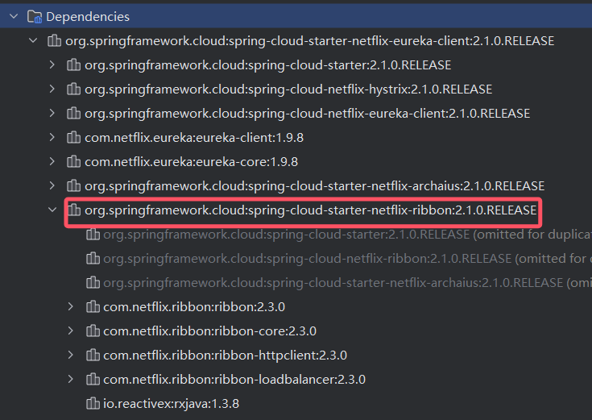
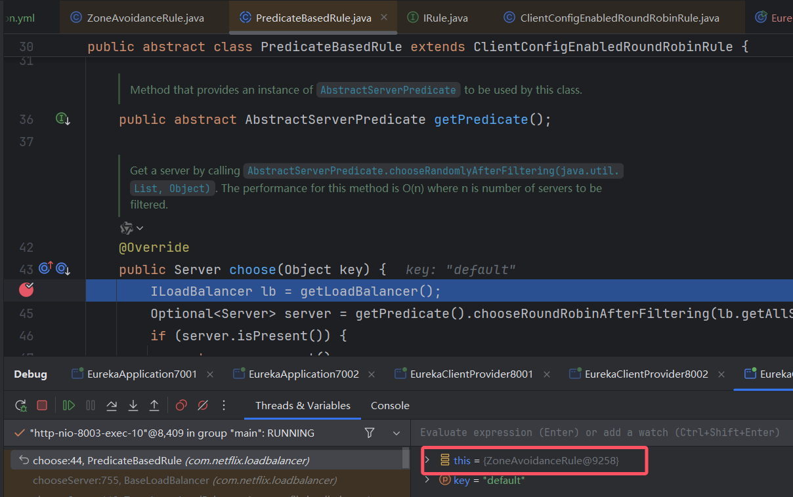
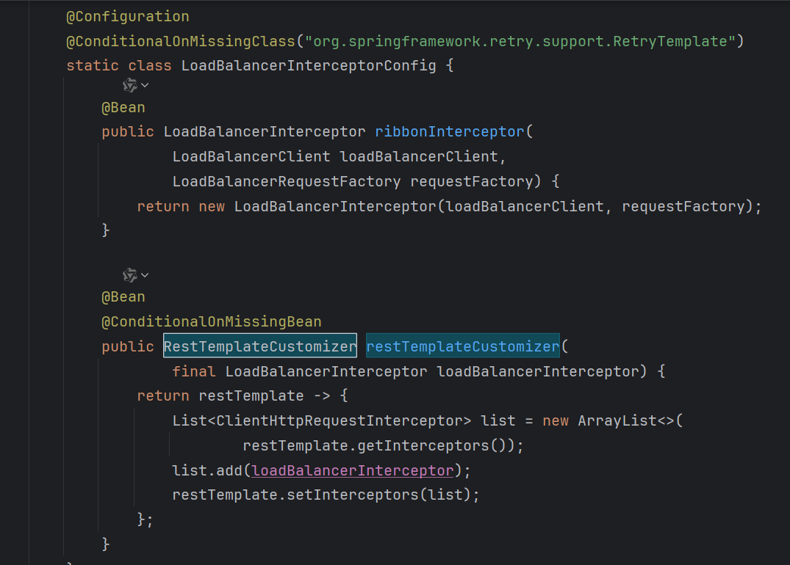

# 

# 负载均衡的分类

1. 集中式
   1. 即在服务的消费方和提供方之间使用独立的LB设施(可以是硬件，如F5, 也可以是软件，如nginx), 由该设施负责	把访问请求通过某种策略转发至服务的提供方；
2. 进程内LB
   1. 将LB逻辑集成到消费方，消费方从服务注册中心获知有哪些地址可用，然后自己再从这些地址中选择出一个合适的服务器。如：nginx、ribbon
3. 服务器端负载
   1. 如nginx: 客户端将请求发送到nginx服务器，由nginx服务器再根据算法，负载到对应的应用
4. 客户端负载
   1. 如Ribbon: 客户端从注册中心拿到对应的服务提供者的注册信息，再做出算法判断，负载到对应的服务

# Ribbon的初步使用

1. 检查项目里是否引入了<b id="gray">spring-cloud-starter-ribbon</b>包



1. 初始化RestTemplate的Bean
   1. <b id="blue">LoadBalanced</b>是关键，意味着restTemplate能够从服务中心获取到对应的服务来进行负载均衡的选择

```java
@Bean
@LoadBalanced
public RestTemplate getRestTemplate() {
    return new RestTemplate();
}
```

2. 服务调用
   1. <b id="blue">SERVER-8001</b>就是服务提供者的服务注册名（spring.application.name），通过它能从注册中心获取到对应的服务

```java
@Autowired
private RestTemplate restTemplate;

@GetMapping("/getPort")
public String getPort() {
    return restTemplate.getForObject("http://SERVER-8001/test/getPort", String.class);
}
```

3. 可以在<b id="blue">SERVER-8001</b>服务端，提供一个接口，这个接口返回当前服务的端口号，发布两个服务
   1. 访问客户端的接口，获取到的端口变化来观察轮训机制

# Ribbon负载均衡

Ribbon在工作时分成两步
第一步先选择 EurekaServer ,它优先选择在同一个区域内负载较少的server.
第二步再根据用户指定的策略，在从server取到的服务注册列表中选择一个地址。
其中Ribbon提供了多种策略：比如轮询、随机和根据响应时间加权。

## 负载均衡器有三大组件  

1. 负载规则 ，从服务器列表中决定用哪个服务器
2. ping任务 ，后台运行的任务，用来验证服务器是否可用
3. 服务器列表 ，可以是静态也可以是动态，如果是动态  


# Ribbon内置负载均衡

他们都是IRule接口的实现类

| 策略名                    | 策略描述                                                     | 实现说明                                                     |
| ------------------------- | ------------------------------------------------------------ | ------------------------------------------------------------ |
| BestAvailableRule         | 选择一个最小的并发请求的server                               | 逐个考察Server，如果Server被tripped了，则忽略，在选择其中ActiveRequestsCount最小的server |
| AvailabilityFilteringRule | 过滤掉那些因为一直连接失败的被标记为circuit tripped的后端server，并过滤掉那些高并发的的后端server（active connections 超过配置的阈值） | 使用一个AvailabilityPredicate来包含过滤server的逻辑，其实就就是检查status里记录的各个server的运行状态 |
| WeightedResponseTimeRule  | 根据相应时间分配一个weight，相应时间越长，weight越小，被选中的可能性越低。 | 一个后台线程定期的从status里面读取评价响应时间，为每个server计算一个weight。Weight的计算也比较简单responsetime 减去每个server自己平均的responsetime是server的权重。当刚开始运行，没有形成statas时，使用roubine策略选择server。 |
| RetryRule                 | 对选定的负载均衡策略机上重试机制。                           | 在一个配置时间段内当选择server不成功，则一直尝试使用subRule的方式选择一个可用的server |
| RoundRobinRule            | roundRobin方式轮询选择server                                 | 轮询index，选择index对应位置的server                         |
| RandomRule                | 随机选择一个server                                           | 在index上随机，选择index对应位置的server                     |
| ZoneAvoidanceRule         | 复合判断server所在区域的性能和server的可用性选择server       | 使用ZoneAvoidancePredicate和AvailabilityPredicate来判断是否选择某个server，前一个判断判定一个zone的运行性能是否可用，剔除不可用的zone（的所有server），AvailabilityPredicate用于过滤掉连接数过多的Server。 |

# Ribbon原理图


# Ribbon的类解析

1. 他的父接口为com.netflix.loadbalancer.IRule，通过choose方法返回对应的服务
2. 默认为ZoneAvoidanceRule，断点在choose方法中，可以看到，对应的默认算法



# 更换负载均衡

1. 如果想更换负载均衡策略，则可以将服务的全限定名配置在Client的配置文件中
   1. <b id="blue">server-8001</b>表示服务端的appname,表示指定当前服务的负载均衡策略

```yml
server-8001:
  ribbon:
    NFlOadBalancerRuleClassName: com.netflix.loadbalancer.RandomRule
```

2. 如果想全局生效，可以如此

```yml
ribbon:
    NFlOadBalancerRuleClassName: com.netflix.loadbalancer.RandomRule
```


## 自定义负载均衡

**自定义的配置类不能放在@ComponentScan所扫描的当前包下**

```java
@Configuration
public class MySelfRule {
    @Bean
    public IRule myRule(){
        //定义随机算法
        return  new RandomRule();
    }
}
```

```java
@RibbonClient(name = "cloud-zookeeper-comsumer", configuration = MySelfRule.class)
public class PaymentMain80 {
    public static void main(String[] args) {
        SpringApplication.run(PaymentMain80.class, args);
    }
}
```

## 轮询算法原理

rest接口第N次请求数%服务器总集群数量=实际调用服务器下标

每次服务重启后rest从1开始计算 


# 绑定拦截器过程

1. SpringCloud,通过SpringBoot spi的方式，注入了RibbonAutoConfiguration


2. 从<b id="blue">RibbonAutoConfiguration</b>，我们看到了LoadBalancerAutoConfiguration，通过find,我们找到，他在common中进行加载


3. LoadBalancerAutoConfiguration中，配合LoadBalanced注解，将所有的标识了LoadBalanced的RestTemplate Bean注入到容器中
   1. LoadBalanced注解是一个@Qualifier类型，[具体可以了解](/java/spring/2-ioc?id=限定注入)

```java
public class LoadBalancerAutoConfiguration {

    @LoadBalanced
    @Autowired(required = false)
    private List<RestTemplate> restTemplates = Collections.emptyList();
```

4. 从下面代码可以看出，@LoadBalanced添加了注解的RestTemplate对象会被添加⼀个拦截器 LoadBalancerInterceptor，该拦截器就是后续 拦截请求进⾏负载处理的



# 拦截器链执行过程

1. 通过断点，我们可以看到，restTemplate.getForObject调用最终会执行到拦截器方法LoadBalancerInterceptor#intercept


2. 从上面可以看到，最终的负载均衡是在这里面执行的

```java
return this.loadBalancer.execute(serviceName, requestFactory.createRequest(request, body, execution));
```

3. 并且，loadBalancer是<b id="blue">LoadBalancerClient</b>类型，他的实现类是<b id="blue">RibbonLoadBalancerClient</b>

# 负载均衡的执行

1. 探究<b id="blue">RibbonLoadBalancerClient</b>，我们发现他是在最初我们看到的<b id="blue">RibbonAutoConfiguration</b>中进行注入的

```java
@Bean
@ConditionalOnMissingBean(LoadBalancerClient.class)
public LoadBalancerClient loadBalancerClient() {
    return new RibbonLoadBalancerClient(springClientFactory());
}
```

2. 
