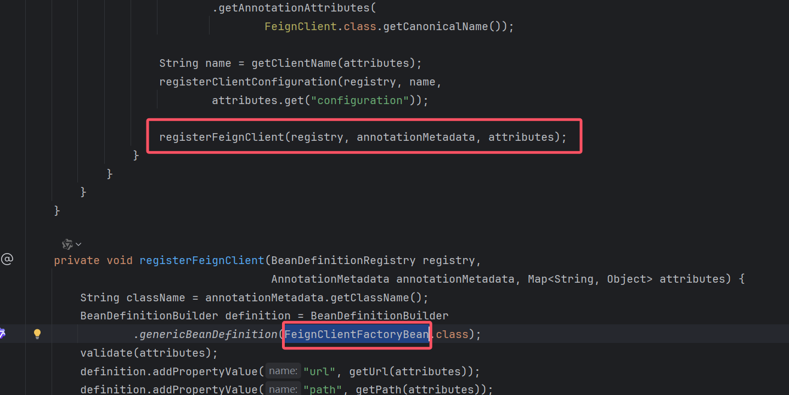
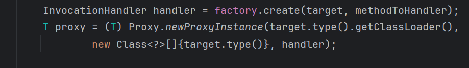

# 

# 前言

在前面负载均衡的时候， [ribbon的初步使用](/java/springcloud/2-load-balance?id=ribbon的初步使用)，我们看到了，调用远程服务可以通过<b id="gray"> restTemplate.getForObject("http://SERVER-8001/test/getPort", String.class)</b>这种，拼接的方式进行调用，这样的方式不够灵活

# Feign

Feign是Netflix开发的声明式、模板化的HTTP客户端， Feign可以帮助我们更快捷、优雅地调用HTTP API。

在Spring Cloud中，使用Feign非常简单——创建一个接口，并在接口上添加一些注解，代码就完成了（类似Dubbo那样，面相interface编程）

## 简单使用

1. 导入jar包，pom文件

```xml
<dependency>
    <groupId>org.springframework.cloud</groupId>
    <artifactId>spring-cloud-starter-feign</artifactId>
</dependency>
```

2. 因为feign现在被弃用，所以现在都是引入openfeign

```yaml
<dependency>
    <groupId>org.springframework.cloud</groupId>
    <artifactId>spring-cloud-starter-openfeign</artifactId>
</dependency>
```

3. 建立一个接口，之后，comsumer端就可以通过这个接口访问打provide端了

```java
@FeignClient(value = "PROVIDER-DEPT") //指定provide的注册服务
public interface DeptClientService {
    //方法名和value得与服务端提供的相同
    @RequestMapping(value="getUser", method = RequestMethod.GET)
    public TUser getUser();
}
```

3. 建立controller类

```java
@RestController
public class UserController {
    @Autowired //只需要引用feign的接口了
    private DeptClientService deptClientService;
    
    @GetMapping("getUser")
    public TUser getUser(){
        return deptClientService.getUser();
    }
}
```

4. 启动类需要@EnableFeignClients来开启feign

```java
@SpringBootApplication
@EnableFeignClients
@EnableEurekaClient
public class DepFeignApplication80 {
    public static void main(String[] args) {
        SpringApplication.run(DepFeignApplication80.class, args);
    }
}
```

5. 配置文件（[注册中心](/java/springcloud/1-register-Center?id=eureka)）这些可以参考负载均衡章节

## 超时配置与重试机制

如下：其中重试操作解释如下

1. 当访问到故障请求的时候，它会再尝试访问⼀次当前实例（次数 由MaxAutoRetries配置）
2. 如果不⾏，就换⼀个实例进⾏访问，如果还不⾏，再换⼀次实例访问（更换次数 由MaxAutoRetriesNextServer配置）
3. 如果依然不⾏，返回失败信息

```yaml
# 对Ribbon进行配置，如果想正对某个服务，则可以配置 服务名.ribbon.xxx
# 如果想配置全局，则直接配置 ribbon.xxx
server-8001:
  ribbon:
    #请求连接超时时间
    ConnectTimeout: 2000
    #请求处理超时时间
    ReadTimeout: 20000
    #对所有操作都进⾏重试
    OkToRetryOnAllOperations: true
    #对当前选中实例重试次数，不包括第⼀次调⽤
    MaxAutoRetries: 0
    #切换实例的重试次数
    MaxAutoRetriesNextServer: 0
    # 负载均衡规则
    NFlOadBalancerRuleClassName: com.netflix.loadbalancer.RandomRule
```

## 日志输出

Feign是http请求客户端，它在请求和接收响应的时候，可以 打印出⽐较详细的⼀些⽇志信息（响应头，状态码等等）

# OpenFeign

是Spring Cloud对Feign的扩展，支持Spring MVC注解（如`@RequestMapping`），并深度集成Spring Cloud功能（如服务发现、熔断器等）。通过动态代理生成实现类，简化了与Spring项目的整合

如果我们想看到Feign请求时的⽇志，我们可以进⾏配置，默认情况下Feign的⽇志 没有开启

1.  开启Feign⽇志功能及级别（这里配置的是日志显示的内容）
   1.  NONE：默认的，不显示任何⽇志----性能最好 
   2. BASIC：仅记录请求⽅法、URL、响应状态码以及执⾏时间----⽣产问题追踪 
   3. HEADERS：在BASIC级别的基础上，记录请求和响应的header 
   4. FULL：记录请求和响应的header、body和元数据----适⽤于开发及测试环境定位问 题

```Java
@Configuration
public class FeignConfig {

    @Bean
    public Logger.Level getLeve() {
        return Logger.Level.FULL;
    }
}
```

2.  配置log⽇志级别为debug
   1. 这里表示<b id="blue">com.xiao.client.*</b>所有的feign客户端，请求响应都会答应日志
   2. 如果想指定某个类，可以如此配置 com.xiao.config.FeignConfig：debug

```yaml
logging:
  level:
    com.xiao.client.*: debug
```


## 基本使用

> 直连的方式

1. 引入Openfeign的jar包

```xml
<dependency>
    <groupId>org.springframework.cloud</groupId>
    <artifactId>spring-cloud-starter-openfeign</artifactId>
</dependency>
```

2. 编写启动类

```java
@SpringBootApplication
@EnableFeignClients
public class OrderApplication {

    public static void main(String[] args) {
        SpringApplication.run(OrderApplication.class, args);
    }

}
```

3. 在服务端编写一个模拟的接口（获取用户的接口）

```java
@RestController
@RequestMapping("/user")
@Slf4j
public class UserController {
    @GetMapping("/get")
    public UserVO getUser(Long userId) {
        log.debug("接收到请求：{}", userId);
        return new UserVO("张三", 20);
    }
}
```

4. 编写消费端的openfeign代码

```java
@Component
@FeignClient("http://127.0.0.1:81")
@RequestMapping("/user")
public interface UserFeign {
    @GetMapping("/get")
    UserVO getUser(Long userId);
}
```

> 使用注册中心模式

1. 添加注册相关的jar包（如nacos）

```xml
<dependency>
    <groupId>com.alibaba.cloud</groupId>
    <artifactId>spring-cloud-starter-alibaba-nacos-discovery</artifactId>
</dependency>
```

2. 开启注册的注解

```java
@SpringBootApplication
@EnableFeignClients
@EnableDiscoveryClient
public class OrderApplication
```

3. 将调用的地方的name改为服务方的服务名（user-81）

```java
@Component
@FeignClient(name = "user-81")
@RequestMapping("/user")
public interface UserFeign 
```

## 超时配置

- 有些接口，可能调用会很长时间（openfeign默认超时1s）
- 修改超时的配置

```yaml
# 设置feign客户端超时时间(OpenFeign默认支持ribbon)
ribbon:
  # 指的是建立连接所用的时间,适用于网络状态正常的情况下,两端连接所用的时间
  ReadTimeout: 5000
  # 指的是建立连接后从服务器读取到可用资源所用的时间
  ConnectTimeout: 5000
```

## 日志增强

- 定义一个config

```java
@Configuration
public class LevelLog {
    @Bean
    public Logger.Level feignLoggerLevel() {
        // 请求和响应的头信息,请求和响应的正文及元数据
        return Logger.Level.FULL;
    }
}
```

- 配置文件

```yaml
logging:
  level:
    # feign日志以什么级别监控哪个接口
    com.cloud.xiao.controller.FeignController.getDiscovery: debug
```


## 常见错误

- Method Not Allowed
  - 可能是调用的type出错
  - 可能是返回值问题（如返回string， feign接口是实体对象）
  - 可能是服务方式get，消费方使用post调用

在sun.net.www.protocol.http.HttpURLConnection#getOutputStream中，如果 body有值，则自动转为post请求, 而openfeign默认将参数放入body中

所以，如果是get请求，需要带上**RequestParam**

# Feign源码跟踪

## 代理类注入过程

1. 从<b id="blue">EnableFeignClients</b>注解进入，可以看到import了一个<b id="gray">FeignClientsRegistrar</b>类
   1. FeignClientsRegistrar实现了ImportBeanDefinitionRegistrar，可以自定义注入bean

```java
@Override
public void registerBeanDefinitions(AnnotationMetadata metadata,
       BeanDefinitionRegistry registry) {
    //注入EnableFeignClients的defaultConfiguration相关默认属性
    registerDefaultConfiguration(metadata, registry);
    //扫描FeignClient注解的接口，生成代理对象
    registerFeignClients(metadata, registry);
}
```

2. 进入到<b id="blue">registerFeignClients</b>-><b id="blue">registerFeignClient</b>方法，可以看到，每个标记的FeignClient的接口，都有会有一个<b id="blue">FeignClientFactoryBean</b>来生产代理类



3. FeignClientFactoryBean是一个工厂Bean,由getObject返回一个代理对象，这个代理对象就是标识了feign的接口的代理对象

```java
@Override
public Object getObject() throws Exception {
    return getTarget();
}
```

3. 通过getTarget方法最终进入到feign.ReflectiveFeign#newInstance方法
   1. 通过下图，生成代理对象



4. 其中InvocationHandler handler = factory.create(target, methodToHandler);返回代理指向类FeignInvocationHandler

## 代理类执行过程

1. 通过feign.SynchronousMethodHandler#invoke，来执行代理类的具体请求方法

2. 请求进入到LoadBalancerFeignClient#execute，

```java
@Override
public Response execute(Request request, Request.Options options) throws IOException {
    try {
       URI asUri = URI.create(request.url());
       String clientName = asUri.getHost();
       URI uriWithoutHost = cleanUrl(request.url(), clientName);
       FeignLoadBalancer.RibbonRequest ribbonRequest = new FeignLoadBalancer.RibbonRequest(
             this.delegate, request, uriWithoutHost);

       IClientConfig requestConfig = getClientConfig(options, clientName);
       //进入到负载均衡的过程
       return lbClient(clientName).executeWithLoadBalancer(ribbonRequest,
             requestConfig).toResponse();
    }
```

3. 进入到executeWithLoadBalancer->LoadBalancerCommand#submit->LoadBalancerCommand#selectServer
4. 可以看到getServerFromLoadBalancer方法

```java
public Server getServerFromLoadBalancer(@Nullable URI original, @Nullable Object loadBalancerKey) throws ClientException {
    String host = null;
    int port = -1;
    if (original != null) {
        host = original.getHost();
    }
    if (original != null) {
        Pair<String, Integer> schemeAndPort = deriveSchemeAndPortFromPartialUri(original);        
        port = schemeAndPort.second();
    }
    ILoadBalancer lb = getLoadBalancer();
    if (host == null) {
        if (lb != null){
            //ribbon的负载均衡的选择Server
            Server svc = lb.chooseServer(loadBalancerKey);
```