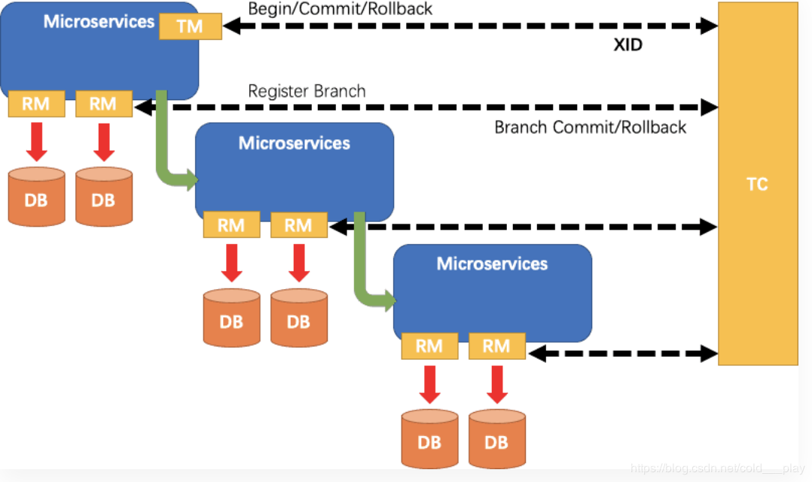
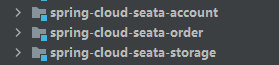

# 分布式事务


# 分布式事务

## 概念

多数据源的事务控制

> 1+3组件模型

1. 一个事务id

- Transaction ID（XID）：全局事务id

2. 三个组件

- TC - 事务协调者维护全局和分支事务的状态，驱动全局事务提交或回滚。
- TM - 事务管理器：定义全局事务的范围：开始全局事务、提交或回滚全局事务。
- RM - 资源管理器：管理分支事务处理的资源，与TC交谈以注册分支事务和报告分支事务的状态，并驱动分支事务提交或回滚。

> 处理过程

- TM向TC申请开启一个全局事务，全局事务创建成功并生成一个全局唯一的XID；
- XID在微服务调用链路的上下文中传播；
- RM(**相当于数据源**)向TC注册分支事务，将其纳入XID对应全局事务的管辖；
- TM向TC发起针对XID的全局提交或回滚决议；
- TC调度XID下管辖的全部分支事务完成提交或回滚请求；



**相当于：TM发起事务的开启或者回滚/提交，TC驱动RM对每个分支数据源进行回滚/提交**

## Server安装

1. 解压seata-server-1.0.0.tar.gz文件
2. 修改conf下的配置文件file.conf
   1. 该文件用于配置`存储方式`、`透传事务信息的NIO`等信息

> 修改配置文件

1. 修改自定义事务组名称:fsp_tx_group
   1. my_test_tx_group:我们自定义的事务组
   2. fsp_tx_group事务组名称

```shell
service {
  vgroup_mapping.my_test_tx_group = "fsp_tx_group"
  default.grouplist = "127.0.0.1:8091"
  disableGlobalTransaction = false
}
```

2. 修改事务日志存储模式为db（默认时文件存储）、

```shell
store {
  mode = "db"
  file {
    dir = "sessionStore"
  }
## 设置数据库信息
  db {
    datasource = "dbcp"
    db-type = "mysql"
    driver-class-name = "com.mysql.jdbc.Driver"
    url = "jdbc:mysql://127.0.0.1:3306/seata"
    user = "mysql"
    password = "mysql"
  }
}
```

3. 创建seata数据库的表信息

可以在源码的：[seata](https://github.com/seata/seata)/[script](https://github.com/seata/seata/tree/develop/script)/[server](https://github.com/seata/seata/tree/develop/script/server)/**db**/的目录找到对应版本的sql脚本

4. 修改**registry.conf**文件（配置的是注册机制）

```shell
registry {
    # file 、nacos 、eureka、redis、zk、consul、etcd3、sofa
    type = "nacos"

    nacos {
    serverAddr = "localhost:8848"
    namespace = ""
    cluster = "default"
}
```

## 事务使用

> 新建三个测试数据库

- seata_order：存储订单的数据库
- seata_storage:存储库存的数据库
- seata_account: 存储账户信息的数据库

> 新建三个模块，模拟操作订单，并且减库存



> 每个数据库都必须添加一个脚本

```sql
-- 此脚本必须初始化在你当前的业务数据库中，用于AT 模式XID记录。与server端无关（注：业务数据库）
-- 注意此处0.3.0+ 增加唯一索引 ux_undo_log
CREATE TABLE `undo_log` (
  `id` bigint(20) NOT NULL AUTO_INCREMENT,
  `branch_id` bigint(20) NOT NULL,
  `xid` varchar(100) NOT NULL,
  `context` varchar(128) NOT NULL,
  `rollback_info` longblob NOT NULL,
  `log_status` int(11) NOT NULL,
  `log_created` datetime NOT NULL,
  `log_modified` datetime NOT NULL,
  `ext` varchar(100) DEFAULT NULL,
  PRIMARY KEY (`id`),
  UNIQUE KEY `ux_undo_log` (`xid`,`branch_id`)
) ENGINE=InnoDB AUTO_INCREMENT=1 DEFAULT CHARSET=utf8;
```


> 以订单为例说明

1. 引入jar包，每个库都要引入seata 的jar包，和mysql相关的jar包

```xml
<dependency>
    <groupId>com.alibaba.cloud</groupId>
    <artifactId>spring-cloud-starter-alibaba-seata</artifactId>
    <exclusions>
        <exclusion>
            <groupId>io.seata</groupId>
            <artifactId>seata-all</artifactId>
        </exclusion>
    </exclusions>
</dependency>
<dependency>
    <groupId>io.seata</groupId>
    <artifactId>seata-all</artifactId>
    <version>1.0.0</version>
</dependency>
```

2. 配置文件

```yaml
spring:
  application:
    name: seata-order-service
  cloud:
    alibaba:
      seata:
        #与seata server服务器上的对应
        tx-service-group: fsp_tx_group
    nacos:
      discovery:
        server-addr: 192.168.1.131:8848
  datasource:
    driver-class-name: com.mysql.jdbc.Driver
    url: jdbc:mysql://192.168.1.134:3306/seata_order
    username: root
    password: 123456
```

3. 将seata的file.conf、registry.conf复制到classpath下

4. 在service层添加代码

```java
@GlobalTransactional
public void create(TOrder order){
    System.out.println("开始创建订单");
    orderDao.insert(order);
    System.out.println("开始减库存");
    storageService.decrease(order.getProductId(), 1);
    System.out.println("开始减金额");
    accountService.decrease(order.getUserId(), order.getMoney());
    System.out.println("开始修改订单状态");
    orderDao.updateStatus(order.getId());
}
```

访问：<http://127.0.0.1:2001/order/create?userId=1&productId=1&money=10&status=0>，发现事务能够回滚

## 原理

> 概念

- TC:全局协调管理者，可以理解为**seata服务器**，负责全局管控
- TM:谁的方法有事务注解标识，它就是事务发起方
- RM:就是上面三个订单库存账户三个库，相当于事务的参与方

> 执行过程

1. 1阶段，seata拦截业务sql
   1. 业务数据更新前，将数据保存到before image中
   2. 更新后，保存到after image中，生成行锁


2. 2阶段顺利提交，将before和after删除行锁
   1. 因为“业务SQL”在一阶段已经提交至数据库，所以Seata框架只需将一阶段保存的快照数据和行锁删掉，完成数据清理即可。

3. 2阶段回滚
   1. 回滚方式便是用“before image”还原业务数据;但在还原前要首先要校验脏写，对比“数据库当前业务数据”和“after image”,如果两份数据完全一致就说明没有脏写，可以还原业务数据，如果不一致就说明有脏写，出现脏写就需要转人工处理。


# seata

1+3组件模型

Transaction ID xid ：全局事务id

- 三组件概念
  - TC - 事务协调者维护全局和分支事务的状态，驱动全局事务提交或回滚。
  - TM - 事务管理器：定义全局事务的范围：开启全局事务、提交或回滚全局事务。
  - RM - 资源管理器：管理分支事务处理的资源，与TC交谈以注册分支事务和报告分支事务的状态，并驱动分支事务提交或回滚。

## 处理过程

- TM向TC申请开启一个全局事务，全局事务创建成功并生成一个全局唯一的XID；
- XID在微服务调用链路的上下文中传播；
- RM(**相当于数据源**)向TC注册分支事务，将其纳入XID对应全局事务的管辖；
- TM向TC发起针对XID的全局提交或回滚决议；
- TC调度XID下管辖的全部分支事务完成提交或回滚请求；


## 安装

- 修改**file.conf**文件

该文件用于配置`存储方式`、`透传事务信息的NIO`等信息

​	修改自定义事务组名称:fsp_tx_group

```conf
service {
  #transaction service group mapping
  vgroup_mapping.my_test_tx_group = "fsp_tx_group"
  #only support when registry.type=file, please don't set multiple addresses
  default.grouplist = "127.0.0.1:8091"
  #disable seata
  disableGlobalTransaction = false
}
```

修改事务日志存储模式为db

```conf
store {
  ## store mode: file、db
  mode = "db"

  ## file store property
  file {
    ## store location dir
    dir = "sessionStore"
  }

  ## database store property
  db {
    ## the implement of javax.sql.DataSource, such as DruidDataSource(druid)/BasicDataSource(dbcp) etc.
    datasource = "dbcp"
    ## mysql/oracle/h2/oceanbase etc.
    db-type = "mysql"
    driver-class-name = "com.mysql.jdbc.Driver"
    url = "jdbc:mysql://127.0.0.1:3306/seata"
    user = "mysql"
    password = "mysql"
  }
}
```

- 创建seata数据库

[seata](https://github.com/seata/seata)/[script](https://github.com/seata/seata/tree/develop/script)/[server](https://github.com/seata/seata/tree/develop/script/server)/[db](https://github.com/seata/seata/tree/develop/script/server/db)/**mysql.sql**

- 修改**registry.conf**文件

```conf
registry {
  # file 、nacos 、eureka、redis、zk、consul、etcd3、sofa
  type = "file"

  nacos {
    serverAddr = "localhost:8848"
    namespace = ""
    cluster = "default"
  }
```

## 业务数据库准备

- 新建三个数据库
  - seata_order：存储订单的数据库
  - seata_storage:存储库存的数据库
  - seata_account: 存储账户信息的数据库
- 创建表

```sql
create table t_order(
	id bigint(11) auto_increment,
	user_id bigint comment '用户id',
	product_id bigint comment '产品id',
	money int comment '金额（分）',
	status int(1) comment '0 创建中 1 完结中',
	primary key(id)
) comment '订单表';
```

```sql
create table t_storage(
	id bigint(11) auto_increment,
	product_id bigint comment '产品id',
	total int(11) comment '数量',
	reside int(11) comment '剩余库存',
	primary key(id)
) comment '库存表';	
```

```sql
create table t_account(
	id bigint(11) auto_increment,
	user_id bigint(11) comment '用户id',
	total int(11) comment '总额度',
	reside int(11) comment '剩余额度',
	primary key(id)
) comment '账户表';
```

- 在每个数据库建立日志回滚表

```sql
-- 此脚本必须初始化在你当前的业务数据库中，用于AT 模式XID记录。与server端无关（注：业务数据库）
-- 注意此处0.3.0+ 增加唯一索引 ux_undo_log
CREATE TABLE `undo_log` (
  `id` bigint(20) NOT NULL AUTO_INCREMENT,
  `branch_id` bigint(20) NOT NULL,
  `xid` varchar(100) NOT NULL,
  `context` varchar(128) NOT NULL,
  `rollback_info` longblob NOT NULL,
  `log_status` int(11) NOT NULL,
  `log_created` datetime NOT NULL,
  `log_modified` datetime NOT NULL,
  `ext` varchar(100) DEFAULT NULL,
  PRIMARY KEY (`id`),
  UNIQUE KEY `ux_undo_log` (`xid`,`branch_id`)
) ENGINE=InnoDB AUTO_INCREMENT=1 DEFAULT CHARSET=utf8;
```

## 新建三个模块

- 业务需求

下订单->减库存->扣余额->改订单状态

- 新建三个模块
  - 订单
  - 库存
  - 账户

- 以订单模块为例

pom

```xml
<dependency>
    <groupId>com.alibaba.cloud</groupId>
    <artifactId>spring-cloud-starter-alibaba-seata</artifactId>
    <exclusions>
        <exclusion>
            <groupId>io.seata</groupId>
            <artifactId>seata-all</artifactId>
        </exclusion>
    </exclusions>
</dependency>
<dependency>
    <groupId>io.seata</groupId>
    <artifactId>seata-all</artifactId>
    <version>1.0.0</version>
</dependency>
```

配置文件

```yaml
server:
  port: 2001
spring:
  application:
    name: seata-order-service
  cloud:
    alibaba:
      seata:
        #与seata server服务器上的对应
        tx-service-group: fsp_tx_group
    nacos:
      discovery:
        server-addr: 192.168.94.131:8848
  datasource:
    driver-class-name: com.mysql.jdbc.Driver
    url: jdbc:mysql://192.168.94.134:3306/seata_order
    username: root
    password: 123456

mybatis:
  # 给实体类的包目录起别名
  type-aliases-package: com.xiao.seata.Entity
  mapper-locations: classpath:mapper/*.xml
  configuration:
    map-underscore-to-camel-case: true
```

将seata的file.conf、registry.conf复制到classpath下

file.conf需要修改

```conf
service {
   #修改自定义事务组名称
  vgroup_mapping.fsp_tx_group = "default"
  default.grouplist = "192.168.94.131:8091"
  disableGlobalTransaction = false
}
```

整合数据源，使用seata的数据源配置

```java
@Configuration
public class DataSourceProxyConfig {
    @Value("${mybatis.mapper-locations}")
    private String mapperLocations;

    @Bean
    @ConfigurationProperties(prefix = "spring.datasource")
    public DataSource druidDataSource() {
        return new DruidDataSource();
    }

    @Primary
    @Bean("dataSource")
    public DataSourceProxy dataSourceProxy(DataSource druidDataSource) {
        return new DataSourceProxy(druidDataSource);
    }

    @Bean(name = "sqlSessionFactory")
    public SqlSessionFactory sqlSessionFactoryBean(DataSourceProxy dataSourceProxy) throws Exception {
        SqlSessionFactoryBean bean = new SqlSessionFactoryBean();
        bean.setDataSource(dataSourceProxy);
        ResourcePatternResolver resolver = new PathMatchingResourcePatternResolver();
        bean.setMapperLocations(resolver.getResources(mapperLocations));
        bean.setTransactionFactory(new SpringManagedTransactionFactory());
        return bean.getObject();
    }
}
```

在service层的方法加上对应的事务注解

```java
@GlobalTransactional
public void create(TOrder order){
    System.out.println("开始创建订单");
    orderDao.insert(order);
    System.out.println("开始减库存");
    storageService.decrease(order.getProductId(), 1);
    System.out.println("开始减金额");
    accountService.decrease(order.getUserId(), order.getMoney());
    System.out.println("开始修改订单状态");
    orderDao.updateStatus(order.getId());
}
```

访问：<http://127.0.0.1:2001/order/create?userId=1&productId=1&money=10&status=0>，发现事务能够回滚

## 原理

- 概念
  - TC:全局协调管理者，可以理解为seata服务器，负责全局管控
  - TM:谁的方法有事务注解标识，它就是事务发起方
  - RM:就是上面三个订单库存账户三个库，相当于事务的参与方

- 执行过程

  - 1阶段，seata拦截业务sql

  业务数据更新前，将数据保存到before image中

  更新后，保存到after image中，生成行锁

  ```
  观察业务数据表，发现执行到orderDao.insert(order);时，t_order有了一条数据，undo_log也多了一条数据，这个表存的是前后镜像数据
  ```

  

  数据放入各个业务表的undo_log中

  - 2阶段顺利提交，将before和after删除行锁
  - 2阶段回滚，那么after和业务数据库对比，一至，将前置数据逆向数据回滚

  

## seata库说明

- branch_table：当一个rm执行sql后，会往这个表插入一条分支数据
- global_table： 记录事务发起方信息，并且记录全局信息