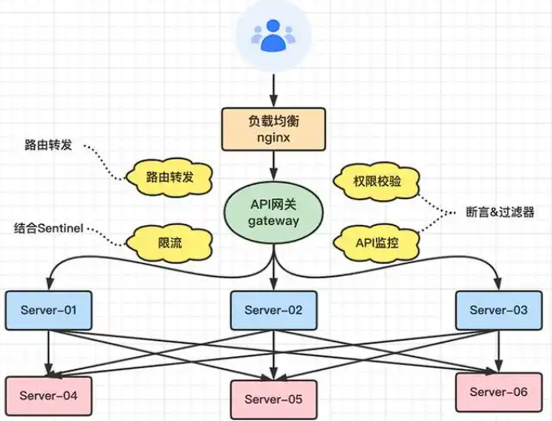
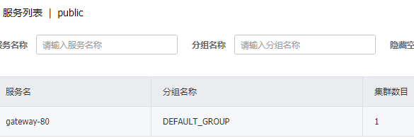

# zuul路由网关

# Gateway新一代网关

## GateWay在架构中的位置

1. 利用域名解析作为第一级负载均衡手段，负载到nginx上
2. 通过nginx负载均衡到网关上
3. 网关做：鉴权、 流量控制、熔断、路径重写、⽇志监控等操作



## 三大概念

- 路由(Route)
  - 路由为一组断言与一组过滤器的集合，他是网关的一个基本组件

- 断言(Predicate)
  - 我们匹配的条件，为true就进入相对路由（类似于 nginx中的location匹配⼀样）

- 过滤器(Filter)
  - 在pre类型的过滤器可以做参数校验，权限校验、流量监控等，
  - 在post类型可以做响应类容，响应头修改，等作用

# 网关微服务搭建

> 引入jar包

- 新建gateway模块，引入jar包（包括：starter-web、nacos-discovery），注意，如果引入zookeeper-discovery，则需要exclusion掉他项目的默认的zookeeperjar包
- 注意不要引入springboot web相关的包

```xml
<dependency>
    <groupId>org.springframework.cloud</groupId>
    <artifactId>spring-cloud-starter-gateway</artifactId>
</dependency>
<dependency>
    <groupId>com.alibaba.cloud</groupId>
    <artifactId>spring-cloud-starter-alibaba-nacos-discovery</artifactId>
</dependency>
```

> 添加配置文件

- 增加配置文件，gateway也是要注册进入注册中心的
  - id:路由的ID，没有固定规则但要求唯一，简易配合服务名
  - uri:  匹配后提供服务的路由地址
  - predicates: 断言

```yaml
server:
  port: 80

spring:
  application:
    name: gateway-80
  cloud:
    nacos:
      discovery:
        server-addr: 192.168.1.131:8848
    gateway:
      routes:
        - id: renren_fast_route
          #匹配后提供服务的路由地址
          #uri: http://localhost:8004         
          ## 对注册中心的renren-fast进行轮询请求
          uri: lb://renren-fast
          predicates:
            - Path=/api/**   
```

> 添加启动类

- 网关的启动类其实只需要enable注册中心即可

```java
@SpringBootApplication
@EnableDiscoveryClient
public class GatewayApplication {
    public static void main(String[] args) {
        SpringApplication.run(GatewayApplication.class, args);
    }
}
```

> 启动后前往nacos注册中心能看到对应的配置

- 服务名即spring-name



## 断言

>  地址断言

```yaml
routes:
    - id: renren_fast_route
      uri: lb://renren-fast
      predicates:
        - Path=/api/** 
```

## 过滤器

> 过滤器配置

在过滤器中，可以鉴权（做用户权限的判断）

```java
@Component
public class AuthorFilter implements GlobalFilter, Ordered {
    @Override
    public Mono<Void> filter(ServerWebExchange exchange, GatewayFilterChain chain) {
        //模拟获取token
        String token = exchange.getRequest()
            .getHeaders().getFirst("Authorization");
        //模拟获取用户
        String username = exchange.getRequest()
            .getQueryParams().getFirst("username");
        if(token == null) {
            //认证不通过
            exchange.getResponse()
                .setStatusCode(HttpStatus.MULTI_STATUS);
            return exchange.getResponse().setComplete();
        }
        //通过
        return chain.filter(exchange);
    }

    @Override
    public int getOrder() {
        //过滤器执行的顺序，0表示第一个执行
        return 0;
    }
}
```

## 路由

### 重写地址

RewritePath：

下面的配置：相当于当访问 http://renren-fast/api地址的时候,重定向访问第三方地址为http://renren-fast/renren-fast

```yaml
routes:
  - id: renren_fast_route
    uri: lb://renren-fast
    predicates:
      - Path=/api/**
    filters:
      - RewritePath=/api/?(?<segment>.*), /renren-fast/$\{segment}
```

## 跨域配置

```java
@Configuration
public class AppCorsConfiguration {
    @Bean
    public CorsWebFilter corsWebFilter() {
        //此处要选择reactive的，因为Gateway是响应式的
        UrlBasedCorsConfigurationSource source = new UrlBasedCorsConfigurationSource();
        CorsConfiguration corsConfiguration = new CorsConfiguration();
        corsConfiguration.addAllowedHeader("*");
        corsConfiguration.addAllowedMethod("*");
        corsConfiguration.addAllowedOrigin("*");
        corsConfiguration.setAllowCredentials(Boolean.TRUE);
        source.registerCorsConfiguration("/**", corsConfiguration);
        return new CorsWebFilter(source);
    }
}
```

- 如果发现类似的错误，测需要将服务端的跨域配置去掉，只需要在网关配置统一跨域

```
header contains multiple values 'http://localhost:8001, http://localhost:8001', but only one is allowed.
```

