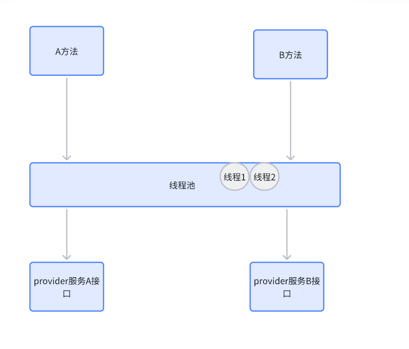

#

# 扇入扇出

如果有微服务：A->B->C

<b id="blue">扇入</b>：上游对B的调用，扇⼊⼤，说明该模块复⽤性好

<b id="blue">扇出</b>：B对下游的调用，扇出⼤，说明业务逻辑复杂

# 雪崩

如果说：C服务器响应时间过长，大量请求阻塞，⼤量线程不会释 放，会导致服务器资源耗尽，最终导致上游服务甚⾄整个系统瘫痪。

# 雪崩的解决方案

## 服务熔断

当扇出链路的某个微服务不可⽤或者响应时间太⻓时，熔断该节点微服务的调⽤，快速返回错误的响应信息。当检测到该节点微服务调⽤响应正常后，恢复调⽤链路。（重点在断，切断对下游的链路）

## 服务降级

服务降级⼀般是从整体考虑，就是当某个服务熔断之后，服务器将不再被调⽤，此 刻客户端可以⾃⼰准备⼀个本地的fallback回调，返回⼀个缺省值，这样做，虽然服务水平下降，但好⽍可⽤，⽐直接挂掉要强。

## 服务限流

有些服务式核心的功能，比如：秒杀

不能使用单纯的服务熔断手段，那么，则可以通过限流的方式，进行处理，比如限制访问的人数等。

限流措施也很多，比如：

1. 限制总并发数（⽐如数据库连接池、线程池） 
2. 限制瞬时并发数（如nginx限制瞬时并发连接数） 
3. 限制时间窗⼝内的平均速率（如Guava的RateLimiter、nginx的limit_req模块， 限制每秒的平均速率） 
4. 限制远程接⼝调⽤速率、限制MQ的消费速率等

# Hystrix

由Netflix开源的⼀个 延迟和容错库，⽤于隔离访问远程系统、服务或者第三⽅库，防⽌级联失败，从⽽ 提升系统的可⽤性与容错性。

## 熔断配置

1. 服务调用A->B,将B的接口设置延迟时间为10000s
2. 在服务A启动Hystrix（引入jar包，然后Application启动类开启注解<b id="blue">@EnableCircuitBreaker</b>）

```xml
<dependency>
    <groupId>org.springframework.cloud</groupId>
    <artifactId>spring-cloud-starter-netflix-hystrix</artifactId>
</dependency>
```

```Java
@SpringBootApplication
//本服务启动后会自动注册进eureka服务中
@EnableEurekaClient
//开启对hystrix熔断机制的支持
@EnableCircuitBreaker
public class EurekaClientConsumer
```

3. 使用<b id="blue">@HystrixCommand</b>注解，进行熔断配置
   1. 使用<b id="blue">commandProperties</b>进行熔断的细节配置
   2. 每一个配置都是一个<b id="blue">@HystrixProperty</b>
   3. 这些属性值可以通过<b id="blue">HystrixCommandProperties</b>进行查阅
   4. 比如下面的配置，就是进行超时时间的配置

```java
@HystrixCommand(commandProperties = {
        @HystrixProperty(name = "execution.isolation.thread.timeoutInMilliseconds", value = "3000")
})
@GetMapping("/getPortTimeOut")
public String getPortTimeOut() {
    return restTemplate.getForObject("http://SERVER-8001/test/getPortTimeOut", String.class);
}
```

4. 上面配置了超时配置，如果超过时间，则访问B服务失败，抛出异常


## 服务降级

1. A->B，B可能出现几种情况
   1. B的服务超时
   2. B因为一些问题，抛出了异常
2. 很多时候，我们不想B服务的异常对外，那么这个时候，我们可以进行服务降级兜底处理
3. 添加<b id="gray">fallbackMethod</b>兜底方法，当 <b id="blue">SERVER-8001</b>服务抛出异常或者超时时候，访问兜底方法

```java
@HystrixCommand(commandProperties = {
        @HystrixProperty(name = "execution.isolation.thread.timeoutInMilliseconds", value = "3000")
}, fallbackMethod = "getPortTimeOutFallback")
@GetMapping("/getPortTimeOut")
public String getPortTimeOut() {
    return restTemplate.getForObject("http://SERVER-8001/test/getPortTimeOut", String.class);
}

public String getPortTimeOutFallback() {
    return "-1";
}
```

## 舱壁模式

### 问题

如果不进⾏任何设置，所有熔断⽅法使⽤⼀个Hystrix线程池（默认10个线程），那么这样的话会导致问题，这个问题并不是扇出链路微服务不可⽤导致的，⽽是我们的线程机制导致的，如果⽅法A的请求把10个线程都⽤了，⽅法2请求处理的时候压根都没法去访问B，因为没有线程可⽤，并不是B服务不可⽤。



## 解决方案

为了避免问题服务请求过多导致正常服务⽆法访问， Hystrix 不是采⽤增加线程数，⽽是单独的为每⼀个控制⽅法创建⼀个线程池的⽅式，这种模式叫做“舱壁模式"，也是线程隔离的⼿段

<b id="blue">threadPoolKey</b>：线程池的唯一标识

<b id="blue">threadPoolProperties</b>：线程池的属性

```java
@HystrixCommand(threadPoolKey = "timeOutA", threadPoolProperties = {
        @HystrixProperty(name = "coreSize", value = "1"),
        @HystrixProperty(name = "maxQueueSize", value = "10"),
})
@GetMapping("/A")
public String A() {
    return restTemplate.getForObject("http://SERVER-8001/test/getPortTimeOut", String.class);
}

@HystrixCommand(threadPoolKey = "timeOutA", threadPoolProperties = {
        @HystrixProperty(name = "coreSize", value = "1"),
        @HystrixProperty(name = "maxQueueSize", value = "10"),
})
@GetMapping("/B")
public String B() {
    return restTemplate.getForObject("http://SERVER-8001/test/getPortTimeOut", String.class);
}
```

## 跳闸和自我修复


```java
/**
 * 8秒钟内，请求次数达到2个，并且失败率在50%以上，就跳闸
* 跳闸后活动窗⼝设置为3s
 */
 @HystrixCommand(
 commandProperties = {
     @HystrixProperty(name = 
    "metrics.rollingStats.timeInMilliseconds",value = "8000"),
     @HystrixProperty(name = 
    "circuitBreaker.requestVolumeThreshold",value = "2"),
     @HystrixProperty(name = 
    "circuitBreaker.errorThresholdPercentage",value = "50"),
     @HystrixProperty(name = 
    "circuitBreaker.sleepWindowInMilliseconds",value = "3000")
                }
    )
```

## 健康查看

基于Spring Boot的健康检查观察跳闸状态

```yaml
# springboot中暴露健康检查等断点接⼝
management:
  endpoints:
    web:
      exposure:
        include: "*"
  # 暴露健康接⼝的细节
  endpoint:
    health:
      show-details: always
```

然后再访问http://localhost:8003/actuator/health


## 通配服务降级

服务降级：（反正这个降级我找了许多资料，没搞懂，应该是服务端接收的压力达到设定的值，就不进入这个服务计算，进入预定的方法， 或者，这个服务挂了，我们取一个将就的结果，先凑合着用）

代码实现

在之前的feign的api中修改

增加一个回调函数的类，这个类注入容器中，重写consumer调用的接口（想想dubbo的本地存根）

```java
@Component
public class ClientFallbackService implements FallbackFactory<DeptClientService> {
    @Override
    public DeptClientService create(Throwable throwable) {
        return new DeptClientService() {
            @Override
            public TUser getUser() {
                TUser tUser = new TUser();
                tUser.setUsername("给你个假数据缓缓");
                return tUser;
            }
        };
    }
}
```

在接口中增加注解

```java
@FeignClient(value = "PROVIDER-DEPT", fallbackFactory = ClientFallbackService.class)
public interface DeptClientService {
    @RequestMapping(value="getUser", method = RequestMethod.GET)
    public TUser getUser();
}
```

需要将comsumer端把feign的hystrix的服务降级打开

```yaml
feign:
  hystrix:
    enabled: true
```

关闭了服务器端的服务器，模拟网络断了

访问<http://127.0.0.1/getUser>返回

```json
{"id":null,"username":"给你个假数据缓缓","datesource":null}
```

- 新版写法


### 局部服务降级

一般服务降级fallback是在客户端调用的，这些方法既可以在consumer端也可以在provide端

pom新增

```xml
<!--  hystrix -->
<dependency>
    <groupId>org.springframework.cloud</groupId>
    <artifactId>spring-cloud-starter-hystrix</artifactId>
</dependency>
```

```xml
<!--  HSR1版本 -->
<dependency>
    <groupId>org.springframework.cloud</groupId>
    <artifactId>spring-cloud-starter-netflix-hystrix</artifactId>
</dependency>
```


```java
@SpringBootApplication
@MapperScan("com.xiao.mapper")
//本服务启动后会自动注册进eureka服务中
@EnableEurekaClient
@EnableCircuitBreaker//开启熔断机制
public class Application8003 {
    public static void main(String[] args) {
        SpringApplication.run(Application8003.class, args);
    }
}
```

```java
@RestController
public class UserController {

    @Autowired
    private UserService userService;
    @GetMapping("getUser")
    //毁掉的方法
    @HystrixCommand(fallbackMethod = "getUserCallable",
            //调用超过1000ms，则进入回调方法，缺省貌似5000ms
            commandProperties = {
                    @HystrixProperty(name = "execution.isolation.thread.timeoutInMilliseconds", value = "1000")})
    public TUser getUser() throws Exception{
        Thread.sleep(2000);//模拟超时
        return userService.findUser();
    }

    public TUser getUserCallable(){
        TUser tUser = new TUser();
        tUser.setId("1");
        //取用户出现问题或者超时，
        // 从缓存取出可能错误的以前的数据，将就下
        tUser.setDatesource("我来自缓存");
        return tUser;
    }
}
```

### 全局服务降级

此处在80客户端

```java
@RestController
//标注全局的降级方法
@DefaultProperties(defaultFallback="fallbackMethod")
public class FeignController {
    @GetMapping(value = "/consumer/timeOut/{id}")
    @HystrixCommand(commandProperties = {
        @HystrixProperty(name="execution.isolation.thread.timeoutInMilliseconds", value = "1000")
    })
    public String timeOut(@PathVariable("id") Long id) throws Exception{
        return feignService.timeOut(id);
    }
	//当前类访问
    public String fallbackMethod() throws Exception{
        return "全局服务降级方法";
    }
```

### 服务熔断

为了防止雪崩，hystrix提供了基于断路器的服务熔断机制

当请求发生错误的比例超过一定比例时histrix将打开断路器进入closed状态，这个状态下我们所有针对该服务的请求（以依赖隔离的线程池为隔断单位，同一线程池中的所有hiystrix command都会被熔断）都会默认使用降级策略进行处理。结果一段时间（通常称为睡眠窗口）后，断路器将被置为半打开(half open)状态，这个状态下将对一定数量的请求进行正常处理，同时统计请求成功的数量。这个数量如果能达到指定的比例断路器将自动关闭重新进入打开open状态。这就是hystrix基于断路器的熔断器机制

**保证服务方进程不被长时间占用**


代码实现

从8002的providemaven项目复制一个项目8003

pom新增

```xml
<!--  hystrix -->
<dependency>
    <groupId>org.springframework.cloud</groupId>
    <artifactId>spring-cloud-starter-hystrix</artifactId>
</dependency>
```
```xml
<!--  HSR1版本 -->
<dependency>
    <groupId>org.springframework.cloud</groupId>
    <artifactId>spring-cloud-starter-netflix-hystrix</artifactId>
</dependency>
```


```java
@SpringBootApplication
@MapperScan("com.xiao.mapper")
//本服务启动后会自动注册进eureka服务中
@EnableEurekaClient
@EnableCircuitBreaker//开启熔断机制
public class Application8003 {
    public static void main(String[] args) {
        SpringApplication.run(Application8003.class, args);
    }
}
```

```java
/**
     * 在10秒窗口期中10次请求有6次是请求失败的,断路器将起作用(断路器起作用后，就算是正确的也会调用fallback方法，隔一会后才会正常调用)
     顺序：服务降级-》服务熔断-》服务恢复
     * @param id
     * @return
     */
@HystrixCommand(
    fallbackMethod = "paymentCircuitBreaker_fallback", commandProperties = {
        @HystrixProperty(name = "circuitBreaker.enabled", value = "true"),// 是否开启断路器
        @HystrixProperty(name = "circuitBreaker.requestVolumeThreshold", value = "10"),// 请求次数
        @HystrixProperty(name = "circuitBreaker.sleepWindowInMilliseconds", value = "10000"),// 时间窗口期/时间范文
        @HystrixProperty(name = "circuitBreaker.errorThresholdPercentage", value = "60")// 失败率达到多少后跳闸
    }
)
public String paymentCircuitBreaker(@PathVariable("id") Integer id) {
    if (id < 0) {
        throw new RuntimeException("*****id不能是负数");
    }
    String serialNumber = IdUtil.simpleUUID();
    return Thread.currentThread().getName() + "\t" + "调用成功,流水号:" + serialNumber;
}

public String paymentCircuitBreaker_fallback(@PathVariable("id") Integer id) {
    return "id 不能负数,请稍后重试,o(╥﹏╥)o id:" + id;
}
```

## 服务限流

秒杀等高并发操作，严禁一窝蜂拥挤，排队调用方法

## 服务监控

> hystrixDashboard

能够监控访问的次数与服务是否健康


# Sentinel

- 功能：流量控制、熔断降级、系统负载保护
- Hystrix的升级版


## 安装

1. 前往sentinel（https://github.com/alibaba/Sentinel）下载 sentinel-dashboard-1.7.1.jar的安装包
2. 将jar包上传linux，编写一个简单脚本

```shell
#! /bin/bash
start(){
  nohup java -jar sentinel-dashboard-1.8.1.jar  > log.file  2>&1 &
}
start;
```

3. 登录：http://192.168.1.131:8080/#/login 密码 sentinel/sentinel

## 应用注入sentinel

> 此处我们将user包注入

1. 引入客户端的jar包

```xml
<dependency>
    <groupId>com.alibaba.cloud</groupId>
    <artifactId>spring-cloud-starter-alibaba-sentinel</artifactId>
</dependency>
```

2. 配置sentinel的相关配置
   1. <b id="gray">port</b>：启动该端口http服务， sentinel会通过这个端口将配置信息发送到这个服务


```yaml
        sentinel:
          transport:
            dashboard: 192.168.1.131:8080
            #跟控制台交流的端口,随意指定一个未使用的端口即可
            port: 8719
            #客户端的ip，建议配置上
            clientIp: 192.168.1.107
```

启动后,在访问接口后，就能在界面看到对应的配置，也能看到调用的对应接口

**sentinel是懒加载的**，所以，访问的一段时间之后，才能显示出来


## 关键概念

1. 资源：
   1. 它可以是 Java 应⽤程序中的任何内容，例如，由应⽤程序提供的服务，或 由应⽤程序调⽤的其它应⽤提供的服务，甚⾄可以是⼀段代码。我们请求 的API接⼝就是资源
2. 规则
   1. 围绕资源的实时状态设定的规则，可以包括流量控制规则、熔断降级规则 以及系统保护规则。所有规则可以动态实时调整

 ## 规则模块

进入**簇点链路**菜单，查看对应的接口（只有访问过的接口才会出现在菜单里面）

> 名词解释


- 资源名：唯一名称，默认是请求路径
- 针对来源：针对某个服务名（调用方）来设置限流，其他方式调用不生效
- 阈值类型
  - QPS:每秒请求数
  - 线程数： 进入以后只执行对应线程数的请求，当线程数（处理该接口的线程）达到阈值，则进行限流

- 在配置好后，点击新增保存，配置的规则就生效了

## 失败策略配置

为了方便测试，建立两个接口


### 直接模式

将流控模式配置成 直接

> 测试QPS限制

在对应的地址处点击**流控**

我们对a接口做QPS限制为1，则快速访问A时，发现1秒只能访问1次，如果过多访问，会抛出**Blocked by Sentinel (flow limiting)**异常

### 关联模式

从资源a进入限流配置，对流控做关联调整


- a接口关联b接口，B达到阈值，则限流A（**qps的配置还是配置A这里**）

### 链路模式


## 流控效果

- 预热（Warm Up）
  - 有时，一个接口，平时没有访问，一瞬间请求爆发
  - 让通过的流量缓慢增加，在一定时间内逐渐增加到阈值上限，给冷系统一个预热的时间，避免冷系统被压垮。warm up冷启动主要用于启动需要额外开销的场景，例如建立数据库连接等。(如：我们设置qps=100,当流量猛增时，我们不让限制一瞬间是100)
  - 最终的效果是：设置QPS限制100，在指定时间内（比如10S），系统缓慢的限流，让接口最终限制100（前10S，阈值100/3，10S后阈值达到100）
- 排队等待：阈值必须是QPS,一个个匀速排队执行（对应算法：漏桶算法）
  - 排队模式下，QPS不要设置超过1000
  - 设置超时时间，如果等待时间>超时时间，则进行拒绝请求
  - 匀速排队：如果单机阈值设置为5，则表示1秒内通过5个请求，则表示200ms通过一个请求


## 降级

Sentinel 的降级 就是Hystrix 的熔断跳闸

### RT规则

RT(平均响应时间、毫秒级)

- 当1s内持续进入5个请求，对应时刻的平均响应时间(秒级）均超过阈值（count，以ms为单位)，那么在接下的时间窗口（DegradeRule中的timewindow，以s为单位)之内，对这个方法的调用都会自动地熔断(抛出 DegradeException )
- RT最大4900，超出阈值，最多4900

如：此时，对接口做出限制2000秒阻塞，限制RT=100ms, 时间窗口=5s

表示：1S时间内，平均响应时间为100ms， 表示1s之内，超过10个请求（1000/100），则在接下来的5S时间内，熔断跳闸，不能访问


### 异常比例（秒级）

QPS>=5且这个1秒访问的请求数异常比例（报错的请求）超过阈值，触发降级，时间窗口结束后，关闭熔断降级

> 异常比例（秒级）（配置值为小数）

QPS>=5且这个1秒访问的请求数异常比例（报错的请求）超过阈值，触发降级，时间窗口结束后，关闭熔断降级

> 异常数（分钟级）

当资源近 1 分钟的异常数超过阈值，触发降级，时间窗口（时间窗口配置应该>60s）结束后，关闭熔断降级

## 热点Key限流

热点key的限流往往需要配合SentinelResource注解来进行配置

参数必须是基本类型或者**String**

> SentinelResource兜底方法在同一个类

1. 定义一个热点key的方法，一个兜底方法
   1. 当热点value所配置的规则超过时，出发handler方法

```java
@SentinelResource(value = "hotKey", blockHandler = "blockHandler")
@GetMapping("/hotKey")
public String hotKey(String p1, String p2) {
    return "hotkey";
}

public String blockHandler(String p1, String p2, BlockException exception) {
    return "block error";
}
```

2. 前往界面配置规则
   1. 标识value这个规则，第0个参数，即p1qps达到1以上后，触发兜底方法


> 兜底方法不在同一个类

1. 定义一个类

```java
public class HandlerClass {
    public static String blockHandler(String p1, String p2, BlockException exception) {
        return "block error";
    }
}
```

2. 调整配置
   1. blockHandlerClass标识器配置的类

```java
@SentinelResource(value = "hotKey", blockHandlerClass = HandlerClass.class, blockHandler = "blockHandler")
@GetMapping("/hotKey")
public String hotKey(String p1, String p2) {
    return "hotkey";
}
```

> 特殊值配置

当我们设置了热点key，但是我们还想key在某个特殊值的时候能达到200的阈值，这时，我们可以配置高级选项


## 自定义兜底

### 服务方兜底

**SentinelResource**注解，不单单对热点key生效，前面的流控，降级都可以生效，只要将其value配置在对应资源名处，就不是对接口，而是对对应的配置的兜底value生效

> fallback

- fallback针对的是业务上的异常
- blockHandler针对的是sentinel的配置服务

如：此处注意，异常必须是Throwable，因为exceptionsToTrace默认是这个，如果是其他，需要额外配置

```java
@SentinelResource(value = "fallback", fallback = "handlerFallback")
@RequestMapping("/fallback")
public String fallback(String p1) {
    if(Objects.equals(p1, "1")) {
        throw new IllegalArgumentException("发生了异常");
    }
    return "fallback";
}

public String handlerFallback(String p1, Throwable e) {
    return "异常方法....";
}
```

### 客户端兜底

> 整合Openfeign

当我们的服务方网络断了或者挂了，则可以调用兜底方法进行数据的返回

1. 引入注册jar包，sentinel的jar包
2. 前往配置文件开启配置(**激活sentinel对openfeign的支持**)

```yaml
feign:
  sentinel:
    enabled: true
```

3. 更改openfeign的调用类，**注意这个mapping注解不能用**

```java
@FeignClient(name = "user-81", fallback = UserFeignImpl.class)
//@RequestMapping("/user")
public interface UserFeign {
    @GetMapping("/user/get")
    UserVO getUser(@RequestParam("userId") Long userId);
    
}
```

4. 实现兜底方法,这个兜底方法，必须是spring bean

```java
@Component
public class UserFeignImpl implements UserFeign {
    @Override
    public UserVO getUser(Long userId) {
        return new UserVO("服务器凉了，兜底的方法", 20);
    }
}
```

## 系统规则

对整个系统进行配置

## 持久化至nacos

如果不配置持久化，则每次服务重启，我们的配置都会消失

此处，我们将持久化配置到nacos中

1. 引入相关jar包

```xml
<dependency>
    <groupId>com.alibaba.csp</groupId>
    <artifactId>sentinel-datasource-nacos</artifactId>
</dependency>
```

2. 配置nacos信息

```yaml
sentinel:
  datasource:
    ds1:
      nacos:
        server-addr: 192.168.1.131:8848
        data-id: user-sentinel
        group-id: DEFAULT_GROUP
        data-type: json
        rule-type: flow
```

3. 前往nacos配置相关配置
   1. 注意data-id一定要一致


resource:资源名称;

limitApp:来源应用;

grade:阈值类型，0表示线程数，1表示QPS;

count:单机阈值;

strategy:流控模式, O表示直接，1表示关联，2表示链路;

controlBehavior:流控效果，0表示快速失败，1表示Warm Up，2表示排队等待;

clusterMode:是否集群。

- 配置代码

```json
[
    {
        "resource": "/user/a",
        "limitApp": "default",
        "grade": 1,
        "count": 5,
        "strategy": 0,
        "controlBehavior": 0,
        "clusterMode": false
    }
]
```

4. 启动服务后，刷新接口，能够在sentinel看到配置好的配置


