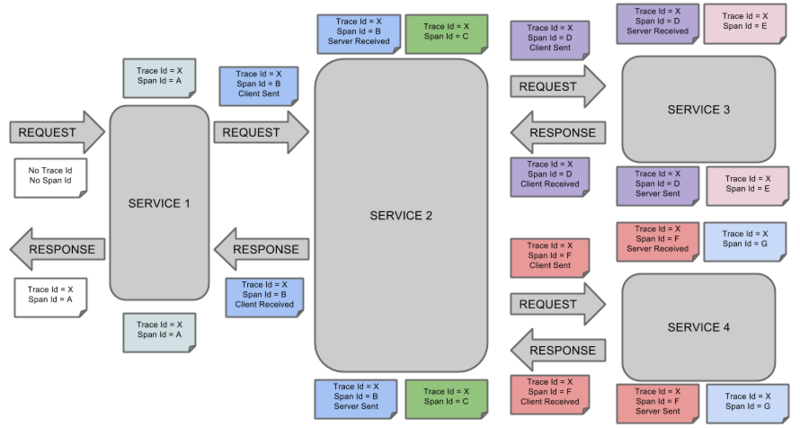
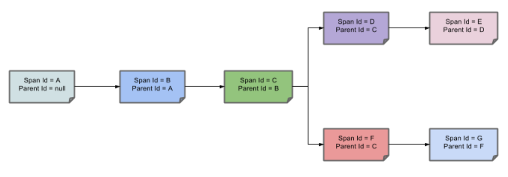
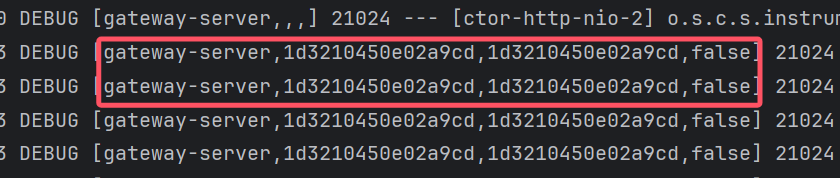
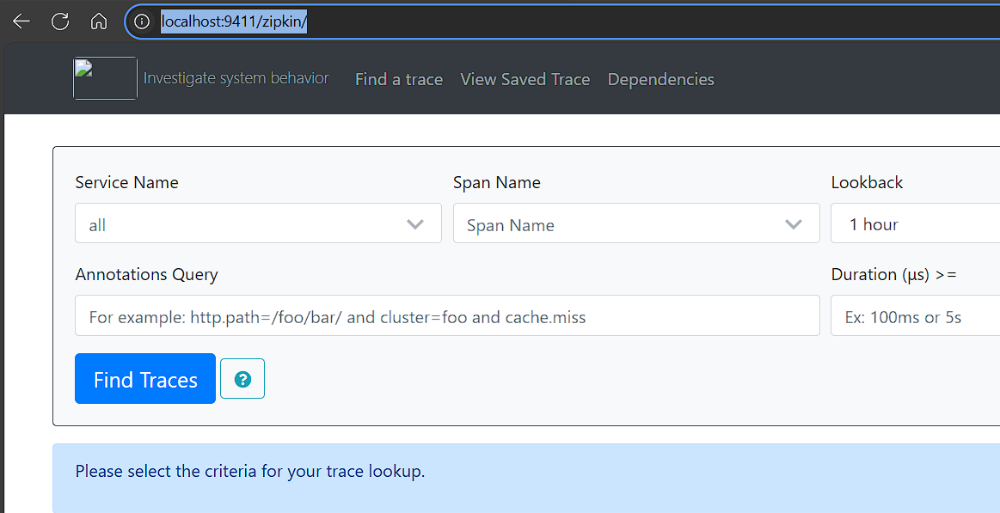
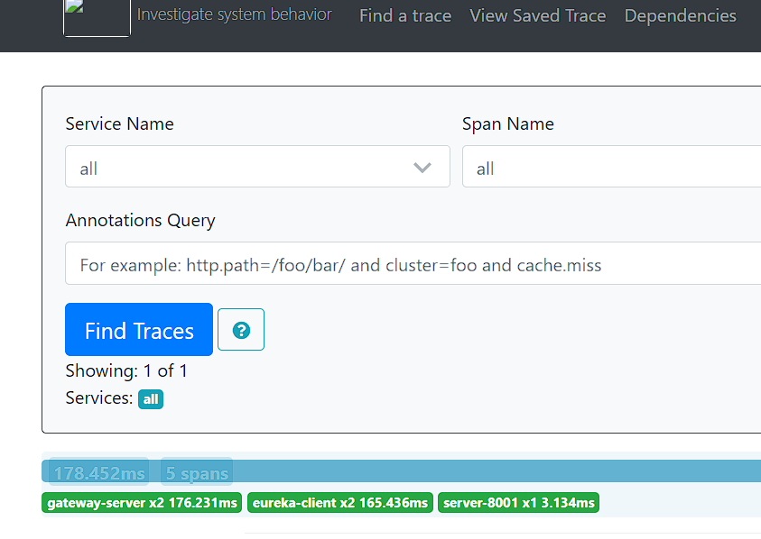
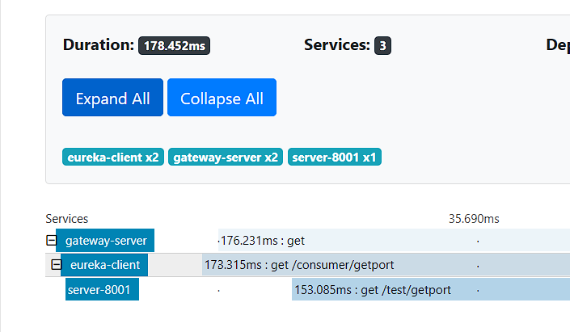
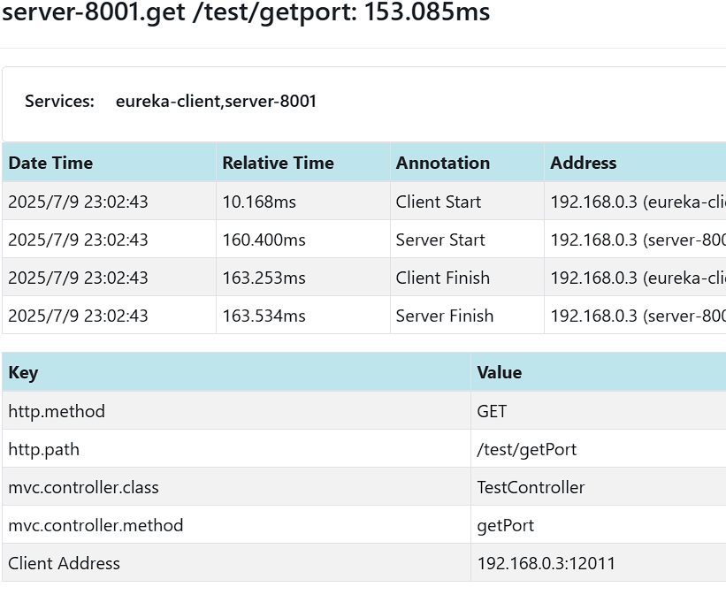

#

# 问题

分布式的服务众多

在微服务架构下，⼀次请求少则经过三四次服务调⽤完成，多则跨越几十个甚⾄是上百个服务节点。那么问题接踵⽽来：

1. 如何动态展示服务的调⽤链路？（⽐如A服务调⽤了哪些其他的服务） 
2. 如何分析服务调⽤链路中的瓶颈节点并对其进⾏调优？(⽐如A—>B—>C，C 服务处理时间特别⻓)
3. 如何快速进⾏服务链路的故障发现？

这就是分布式链路追踪技术存在的⽬的和意义

# 常见分布式链路追踪⽅案

1. **Spring Cloud Sleuth + Twitter Zipkin**
2. Apache Skywalking

# 分布式链路的几个概念



如图所示，我们可以看到几个名词：<b id="gray">trace id</b> <b id="gray">spanceid</b>

span：调用链路的来源，标识一次请求

trace:span的集合，一整条调用的链路存在的唯一标识



一条链路通过trace id 为唯一标识，span标识为单服务发起的请求信息， 各个span通过parent id关联起来


# Sleuth 

1. 在每个需要引入全链路追踪的服务，添加pom

```xml
<dependency>
    <groupId>org.springframework.cloud</groupId>
    <artifactId>spring-cloud-starter-sleuth</artifactId>
</dependency>
```

2. 在配置文件中配置好显示的日志配置

```yaml
#分布式链路追踪
logging:
  level:
    org.springframework.web.servlet.DispatcherServlet: debug
    org.springframework.cloud.sleuth: debug
```

3. 访问请求，能够在日志中看到如下的日志信息



# Zipkin

从上图中可以看到，Sleuth的链路日志是在每个服务显示的，且显示的很不明显，所以需要将日志信息聚合上传到Zipkin的服务端，然后聚合的查阅日志以及调用的链路信息

Zipkin 包括<b id="gray">Zipkin Server</b>和<b id="gray">Zipkin Client</b>两部分，<b id="gray">Zipkin Server</b>是⼀个单独的服 务

## Zipkin Server

1. 新建一个项目，引入Server必备的一些jar包

```xml
<dependency>
    <groupId>org.springframework.boot</groupId>
    <artifactId>spring-boot-starter-web</artifactId>
</dependency>

<dependency>
    <groupId>io.zipkin.java</groupId>
    <artifactId>zipkin-server</artifactId>
    <version>2.12.3</version>
    <exclusions>
        <!--排除掉log4j2的传递依赖，避免和springboot依赖的⽇志组件冲突-->
        <exclusion>
            <groupId>org.springframework.boot</groupId>
            <artifactId>spring-boot-starter-log4j2</artifactId>
    </exclusion>
</exclusions>
</dependency>
<!--zipkin-server ui界⾯依赖坐标-->
<dependency>
    <groupId>io.zipkin.java</groupId>
    <artifactId>zipkin-autoconfigure-ui</artifactId>
    <version>2.12.3</version>
</dependency>
```

2. 建立配置文件，引入配置

```yaml
server:
  port: 9411
  management:
    metrics:
      web:
        server:
          auto-time-requests: false # 关闭⾃动检测请求
```

3. 建立启动类

```java
@SpringBootApplication
@EnableZipkinServer  // 开启Zipkin Server功能
public class ZipkinServerApplication {
    public static void main(String[] args) {
        SpringApplication.run(ZipkinServerApplication.class,args);
    }
}
```

4. 访问地址[Zipkin - Index](http://localhost:9411/zipkin/)，进入到zipkin的访问页面



## Zipkin Client

1. 在要上传日志的服务模块，引入jar包

```xml
<dependency>
    <groupId>org.springframework.cloud</groupId>
    <artifactId>spring-cloud-starter-zipkin</artifactId>
</dependency>
```

2. 在每个服务，添加要上传的server配置地址

```yaml
spring:
  application:
    name: gateway-server
  zipkin:
    base-url: http://127.0.0.1:9411
    type: web
```

3. 触发日志后，可以访问地址，查看到对应的日志请求链路数据



4. 点进去某个请求，可以看到每个服务请求时间



