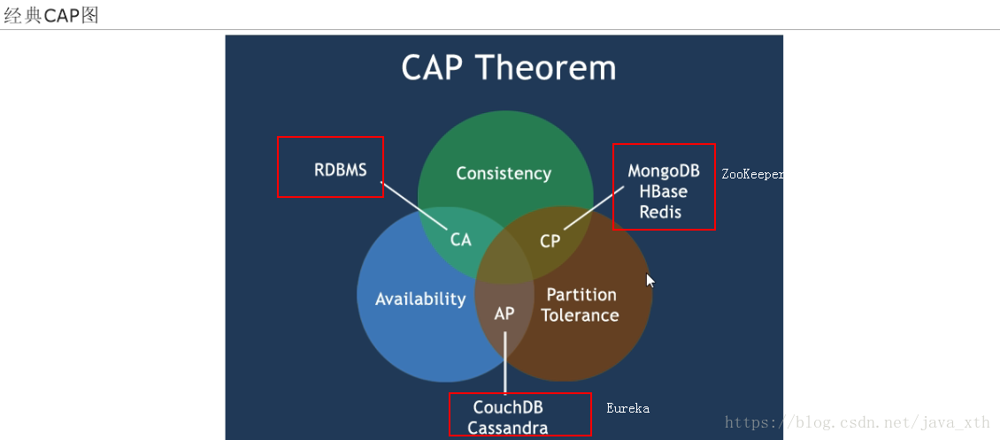
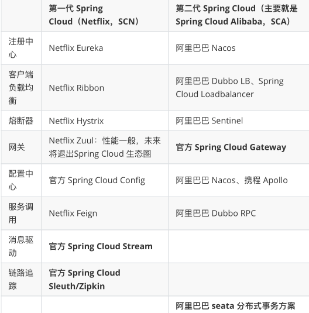

# 

# 什么是微服务

将单一的应用程序化成小的服务模块，每个服务模块都是独立的进程

将业务区分，分为一个个服务模块，每一个小服务可以拥有自己的数据库，它强调的时个体

# 微服务架构

个个微服务直接相互调用，形成一个架构，它强调的时整体

# Dubble与cloud的区别

dubble是基于rpc远程调用，cloud时基于restful的

# 微服务的优缺点

## 优点

- 服务足够小

- 代码易于理解

- 开发效率高，一个服务只做一个事

- 有利于解耦

- 微服务能用不同语言开发 

- 微服务可以有自己的数据库，也可以由统一的数据库

## 缺点
- 增加了运维成本
- 使整体的服务变复杂

# 一些概念

服务注册：服务提供者将（服务器IP，访问协议，端口等）注册/登记到注册中心

服务发现：服务消费者从注册中心近实时的获取到注册的服务列表，根据一定的策略选择一个服务访问

负载均衡：

熔断：即断路保护；如果下游服务因为压力过大，响应变慢或者失败，上游服务为了保护系统的可用性，暂时的切断对下游服务的调用

链路追踪：对一次调用的请求链路（多个服务），进行日志记录（如：通过traceid贯穿整个链路，spanceId记录某个服务的日志id），性能健康

- spanId : 同一个线程中唯一, 从0始，按照调用链路从0递增
- traceId : 在一个 链路 中 traceId 唯一

API网关：

# SpringCloud是什么

SpringCloud=分布式微服务架构下的一站式解决方案，是各个微服务架构落地技术的<b id="red">集合体</b>，俗称微服务全家桶

利用SpringBoot的开发便利性简化了微服务架构的开发（自动装配）

我们需要注意，SpringCloud其实是一套规范，是一套用于构建微服务架构的规范，而不是一个可以拿来即用的框架（所谓规范就是应该有哪些功能组件，然后组件之间怎么配合，共同完成什么事情）。在这个规范之下第三方的Netflix公司开发了一些组件、Spring官方开发了一些框架/组件，包括第三方的阿里巴巴开发了一套框架/组件集合Spring CloudAlibaba，这些才是SpringCloud规范的实现。

# SpringCloud解决了什么问题

SpringCloud规范及实现意图要解决的问题其实就是微服务架构实施过程中存在的一些问题，比如微服务架构中的服务注册发现问题、网络问题（比如熔断场景）、统一认证安全授权问题、负载均衡问题、链路追踪等问题。

# CAP 理论

在分布式系统领域有个著名的CAP定理

1. C-数据一致性；
2. A-服务可用性；
3. P-服务对网络分区故障的容错性(单台服务器，或多台服务器出问题（主要是网络问题）后，正常服务的服务器依然能正常提供服务)，这三个特性在任何分布式系统中不能同时满足，最多同时满足两个）

**CAP理论也就是说在分布式存储系统中，最多只能实现以上两点。而由于当前网络延迟故障会导致丢包等问题，所以我们分区容错性是必须实现的。也就是NoSqL数据库P肯定要有，我们只能在一致性和可用性中进行选择，没有Nosql数据库能同时保证三点。（==>AP 或者 CP）**

## 一般应用遵循的原则

RDBMS==>（MySql,Oracle,SqlServer等关系型数据库）遵循的原则是：ACID原则（A：原子性。C：一致性。I：独立性。D：持久性。）。

NoSql==>   （redis,Mogodb等非关系型数据库）遵循的原则是：CAP原则（C：强一致性。A:可用性。P：分区容错性）。

一般来说 p 是必须满足的，然后我们只能在c和a之间做选择

如在大型网站中，选择的时AP原则，因为服务不能挂，挂了就是很严重的灾难性事故

# Spring Cloud 组件

