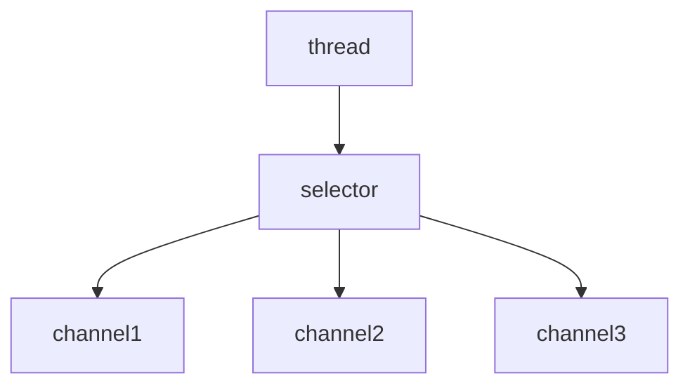

### 导航

```markmap
- [arthas](/#/java/tool/arthas)
- [工具插件](/#/java/tool/tool)
- [Jenkins](/#/java/tool/jenkins.md)
- [canal](/#/java/tool/canal)
- [idea](/#/java/tool/idea)


``` 


## mermaid示例

```mermaid
graph TD;

thread --> selector
selector --> channel1
selector --> channel2
selector --> channel3
```
