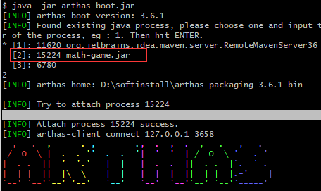
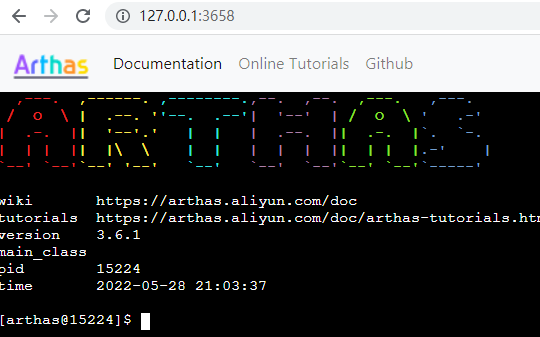
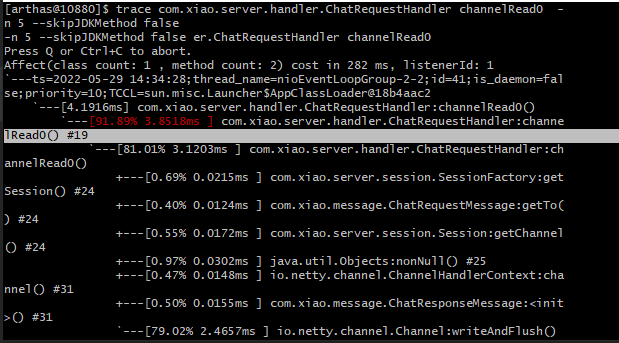
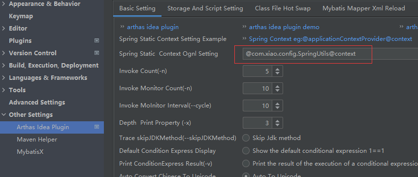
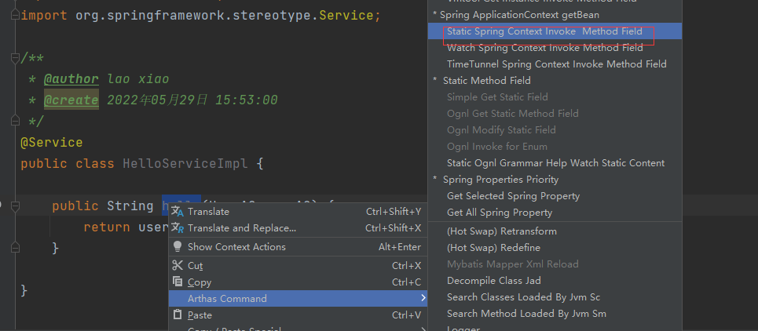
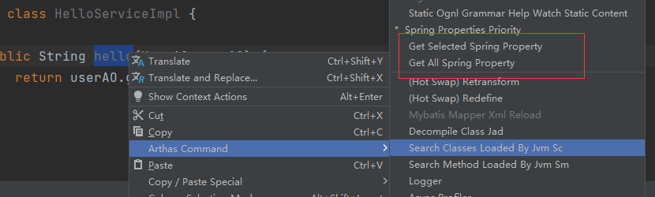

# 概述

## 文档

https://arthas.gitee.io/install-detail.html

## Arthas能做什么

1. 这个类从哪个jar包加载的?为什么会报各种类相关的 Exception?
2. 我改的代码为什么没有执行到?难道是我没commit?分支搞错了?
3. 遇到问题无法在线上debug，难道只能通过加日志再重新发布吗?
4. 线上遇到某个用户的数据处理有问题。但线上同样无法 debug,线下无法重现!
5. 是否有一个全局视角来查看系统的运行状况?
6. 有什么办法可以监控到JVM的实时运行状态?
7. 怎么快速定位应用的热点，生成火焰图?

# 粘附

> 要使用arthas监控其他的项目
>
> 先要让<b id="blue">arthas</b>先粘附这个项目

1. 运行官方给的demo

```shell
curl -O https://arthas.aliyun.com/math-game.jar
java -jar math-game.jar

```

2. 选择粘附的包



3. 如果端口号被占用，可以选择指定端口运行

```shell
java -jar arthas-boot.jar --telnet-port 9998 --http-port -1
```

4. 如果遇到`hostname can't be null`这样的错误，可以直接指定ip

```shell
./java -jar arthas-boot.jar --target-ip 127.0.0.1 --telnet-port 9997 --http-port -1
```


4. 可以通过windowns 浏览器访问




**好吧，官网记载的很详细，这里就开始记录一些骚操作吧**

---

# 常用的命令

## 全局参数

```shell
-x 是展示结果属性遍历深度，默认为 1
-n 是执行的次数 ，q 退出
```

## trace

- 查看方法的执行耗时

如图，查看当前方法的调用`耗时`占比



## watch

- 监控方法的入参与返回

## 异步任务

`只有特定的场景才会有bug ，如何排查bug？`

使用条件表达式过滤 +异步任务

```shell
使用 > 将结果重写向到日志文件，使用 & 指定命令是后台运行，session断开不影响任务执行（生命周期默认为1天）

jobs——列出所有job

kill——强制终止任务

fg——将暂停的任务拉到前台执行

bg——将暂停的任务放到后台执行
```
## 监控结果输出到文件
*定义一个异步任务*：

```shell
[arthas@10880]$ watch com.xiao.server.handler.ChatRequestHandler channelRead0 '{params,returnObj,throwExp}'  -n 5  -x 3 > test.txt &
## 查看当前test.txt的文件目录
[arthas@10880]$ pwd
pwd
E:\git\learning\netty
## 杀掉job
[arthas@10880]$ kill 6
kill 6
```

## 条件匹配

*带上表达式，有异常时打印*

```shell
watch com.xiao.server.handler.ChatRequestHandler channelRead0 '{params,returnObj,throwExp}' -n 5 -x 3 'throwExp != null'

```

*第一个参数==name*

```shell
watch com.xiao.server.handler.ChatRequestHandler channelRead0 '{params,returnObj,throwExp}' -n 5 -x 3 'params[0]=="name"'
```

# ognl

## 调用spring 方法

1. new 一个UserAO对象 赋值给user
2. 设置调用<b id="blue">user.setName</b>方法
3. 调用spring的属性，执行对应的方法

```shell
ognl -x 3 '#user=new com.xiao.ao.UserAO(),#user.setName("laoxiao"),#springContext=@com.xiao.config.SpringUtils@context,#springContext.getBean("helloServiceImpl").hello(#user)'
```

# idea的插件

## Spring配置

1. 定义一个Spring的常用类

```java
@Component
public class SpringUtils implements ApplicationContextAware {
    private static ApplicationContext context;

    @Override
    public void setApplicationContext(ApplicationContext applicationContext) throws BeansException {
        context = applicationContext;
    }
}
```

2. 配置到对应的插件专供



3. 生成对应的命令



## 获取Spring 环境变量



## 修改logger日志等级


