# 快捷方式使用

## 输入框的移动

*向右移动*：tab键

*向下移动*: enter键

或者上下左右的键盘

## 让栏宽适应文字宽度

对准此处，连续两下左键

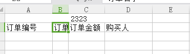

## 将所有栏宽（列高）设置一直

选中所有栏，然后对任意一个栏宽进行拖动，就能改变所有栏宽

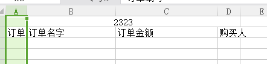

# 函数使用

## 自动加总

1. 输入sum函数
2. ctr+选中行，回车后计算数字，然后插入一行，输入数字，`会自动的加入到sum函数中`

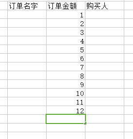

## 选中框进行计算

1. 输入sum函数
2. ctr+选中框，`就会将选中的框中的数字加入到函数中`

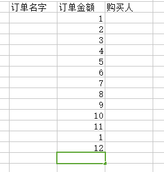

# 冻结窗格

想要1，2行不动，则可以

1. 选中第三格
2. 选择冻结窗格，则可以自用滑动第三行一下的行

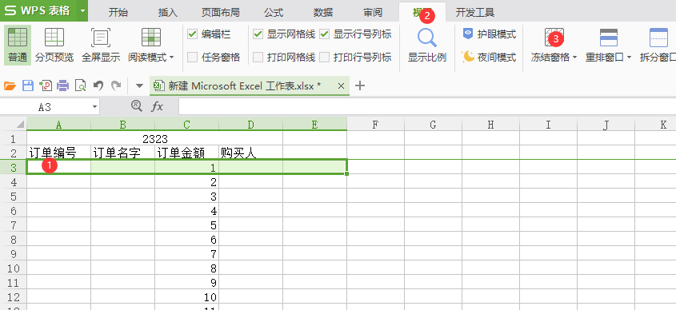

# 分割视窗

当我们想对比上下两个视窗的数据时，可以这样操作

这样，我们上下都能自由滑动数据，来进行对比

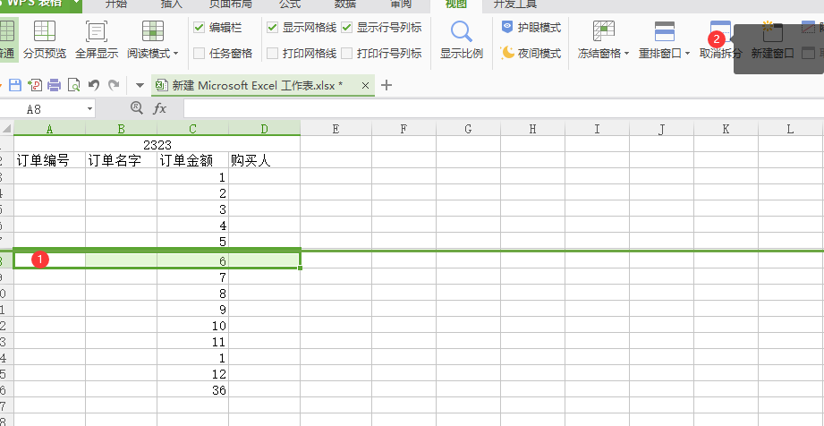

# 排序

## 单列排序

1. 排序的时候不要选中整列，这样可能会造成数据混乱

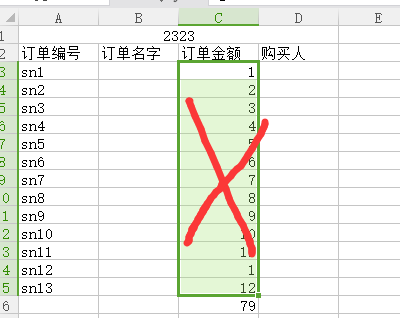

2. 应该只选中一个框，这样就能排序了

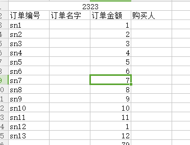

## 多列排序

1. 自定义排序

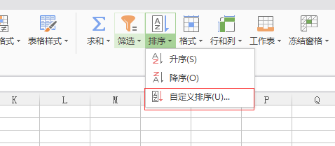

2. 选则对应的列

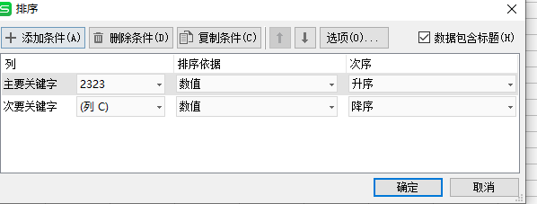

## 自定义序列

1. 选择自定义序列

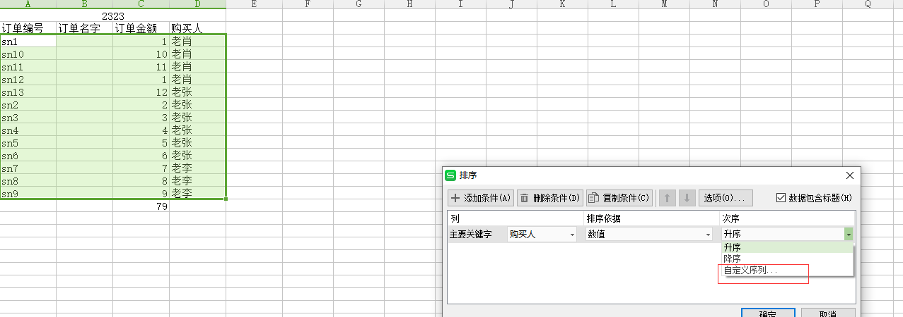

2. 输入对应序列，则排序按照自己的排序进行

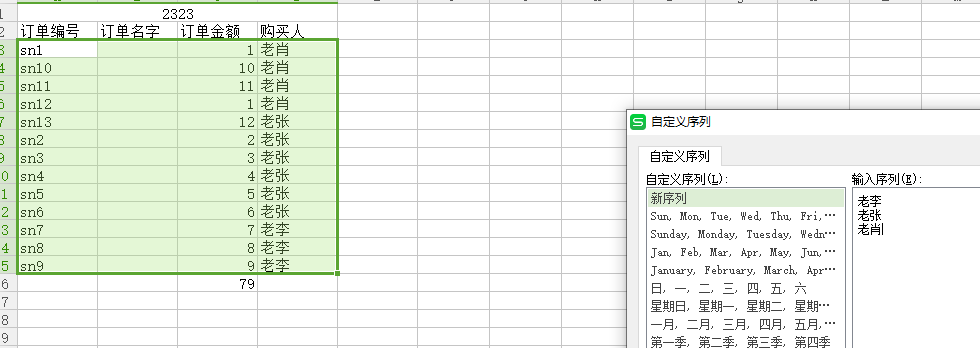