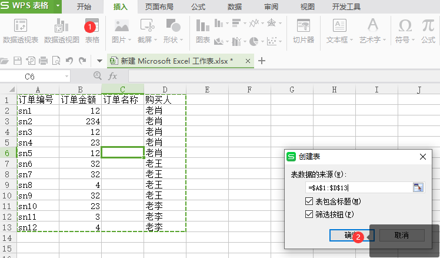
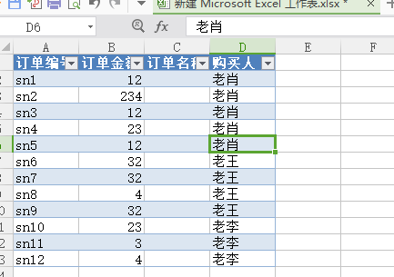
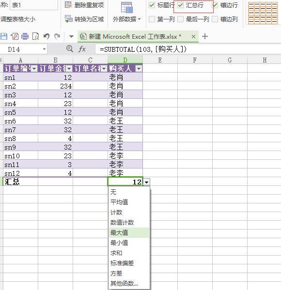
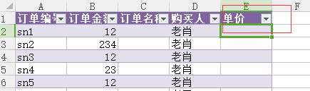
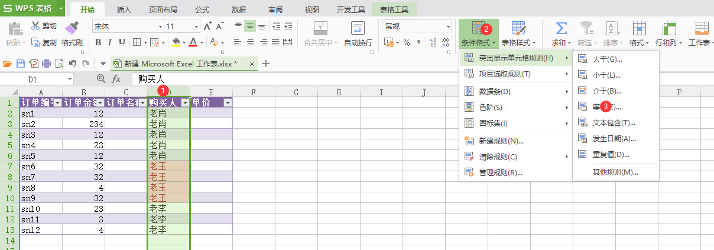
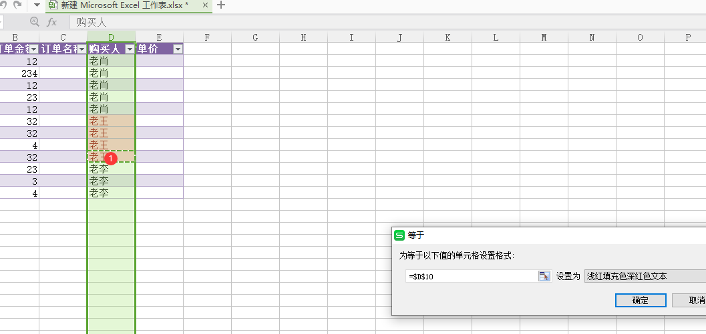
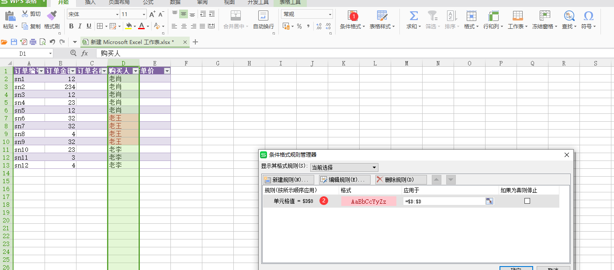
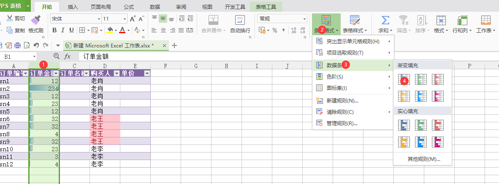

# 插入表格

1. 当我们选择插入表格是，excel会自动识别excel里面的表格内容

2. 点击确认后，表格变为新的样式

3. 可以在表格工具处选择表格的样式

# 汇总表格

1. 可以选择汇总行，然后选中表格对应的公式

# 增加列

可以在最后列输入对应标题，按下enter键，这样这一列就会套用表格的样式

# 将某一列相同文字加深颜色

## 加深颜色

1. 选择某一列
2. 选择条件格式
3. 然后选中对应的文字

## 更改规则

在条件格式中的筛选规则专供，可以选择对应列的规则字段，也可以更改规则字段

# 跟进数字大小显示资料横条

