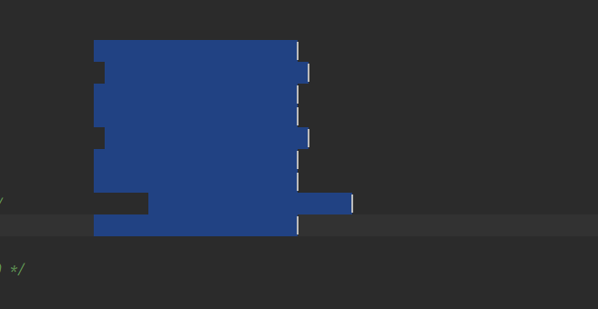
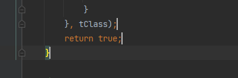
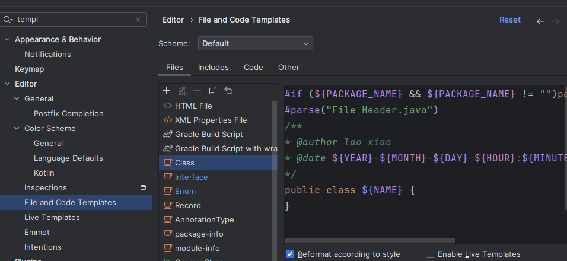
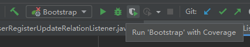
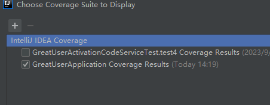
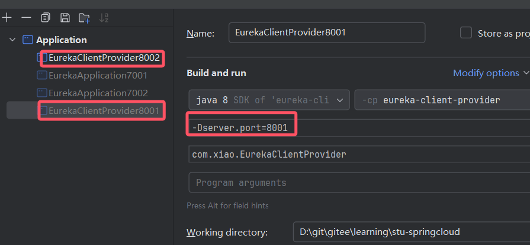

# 常用操作

**help 中的 fild action 能根据关键字查找快捷键**

- ctrl+alt+[
  - 切换项目
  - 在window中能在next project看到快捷键
- Recent file
  - 搜索最近打开的文件
- 查看上一步编辑的页面地方
  - navigate->last edit
- 回到最近浏览地方
  - navicat -> back
  - alt+箭头
- 利用书签进行跳转
  - bookmark
  - 如果选择Menemonic则是带数字的书签
- 收藏文件
  - add to fa
- 快速跳转到某个字符
  - 安装插件emacsIDEAs
  - ctrl+j 调整相关搜索
  - 进入manage keymap  搜索
- 快速搜索class
  - navigate -> class  查看
- 快速搜索文件
  - navigate -> file  查看
- 全局搜索或者全局替换
  - edit->find->find in path  来查看快捷键
- 快速跳转行头或者行尾
  - action 搜索->move caret lin
  - 一般是 home 或者 end建
- 快速跳转有问题的行
  - F2
- alt+enter 的功能
  - 自动创建方法，当写了一个方法后，没定义这个方法，enter可以自动创建
  - 实现接口
    - 当创建接口后，需要快捷的实现接口
    - alt+enter 选择implement  interface
  - 当定义变量不符合规范后，可以快速修复
- 代码窗口全屏
  - ctrl+shift+F12
- 查看文件方法结构
  - navigate 下查看
  - ctrl+F12
- 在方法上查看谁调用了这个方法，这个方法调用了谁
  - ctrl+alt+h

# 批量修改

## 多行修改

1. 多光标模式: shift+alt+insert



2. Alt+Shift：用鼠标点多个光标



## 批量修改

- 选中的单词如果在下面出现，操作会修改所有相同单词
- edit -> find ->select all occurent 来搜索快捷键

一般是：ctrl+alt+shilft+j

# 模板

## 代码模板

live template 进行设置模板

进入action 搜索，live template   

在这里也能看到常用的代码模板

## 注释模板

```java
/**
* @author lao xiao
* @date ${YEAR}-${MONTH}-${DAY} ${HOUR}:${MINUTE}
*/
```





# postfix

搜索 postfix completion

相当于不可编辑的模板

# 重构

- refactor->rename搜索
  - shift+F6
    - 修改变量名称
    - 修改class名称
- 重构方法
  - 在使用方方法出，加入变量，alt+enter

# 抽取

- 抽取变量
  - refactor -> extract+ variable 搜索快捷键
  - ctrl+alt+v

- 抽取成静态常量：ctrl+alt+c

- 抽取方法参数 ctrl+alt+p
- 抽取方法：ctrl+alt+m

# git 集成

- 快速搜索修改地方

- 在 keymap 中 搜索 previous change
  - ctrl + alt + shift + 上箭头或下箭头
- 快速撤销
  - ctrl + alt +z
- 查找本地历史记录
  - action中搜索 history


# 断点

- 快速打断点
  - run -> Toggle Breakpoint  ->Line Breakpoint 搜索快捷键
  - ctrl+ f8
- 禁止一切断点，断点失效
- 条件断点
  - 在断点处 shilft+ctrl+f8
  - 在condition输入条件
  - condition么满足条件才进入断点
  - condition示范：body.equals("qqq")
- 查看调试变量的内容，在表达式中输入变量可查询变量内容
  - run -> Debugging Actions -> Evaluate Expression... 搜索快捷键
  - alt+F8
- 运行到光标所在行
  - alt+F9
- 调试过程中修改变量值
  - 在调试的变量显示处setvalue
- 运行当前光标的最小上下文
  - 搜索 debug context 寻找快捷键

# 文件操作

- 在当前文件夹下新建文件
  - 在keymap中 搜索 new..., 搜索在 other下看到快捷键
  - ctrl + alt + insert

- 移动文件
  - 在 keymap 中搜索 mave... 查看快捷键
  - F6
- 查看maven  Show Dependencies...查找对应的包
  - action -> diagram element搜索快捷键
  - ctrl+F

# 遇到项目包后面出现% *classes*,% *lines* *covered*

## 产生原因

运行了这个



## 关闭

ctrl+alt+F6




# 热部署插件

## ArthasHotSwap


# 社群版的一些插件

## Spring Boot Assistant

SpringBoot开发插件。（可以识别springboot主配置文件，以及代码提示）

##  Maven Helper

快速解决Maven依赖关系和版本冲突等问题。

## MyBatisX

MybatisX 是一款基于 IDEA 的快速开发插件，为效率而生，支持Java 与 XML 调回跳转和Mapper 方法自动生成 XML。

## Statistic/WalkTime

Statistic：统计代码行数。

## String Manipulation

字符串处理插件(如 转大驼峰、小驼峰、常量名、生成MD5密串等等)，快捷键：alt+m

## SpotBugs

Java质量分析工具，可以帮我们查找代码中隐藏的bug。


spotbugs主要包括10大类bug
1.Bad practice（90余种）不良的实践，违反常识性的或者必要的代码惯例，比如重写了equals却没有重写hashcode。
2.Correctness （150余种） 此处的代码有可能在运行时导致错误，与预期不符，比如空指针错误。
3.Experimental（9种）spotbugs在此处不适用，大概是匹配模式不太适用于此处。
4.Internationalization（2种）原文是：code flaws having to do with internationalization and locale，没有遇到过类似的错误。
5.Malicious code vulnerability（17种）代码具有被恶意代码攻击的风险。比如返回一个可变类型引用并保存在对象字段中。
6.Multithreaded correctness（46种）线程安全，比如可能造成死锁的代码。
7.Bogus random noise（4种）并不是软件中的实际错误。
8.Performance（37种）性能不好的代码，比如在迭代中使用“+”连接字符串。
9.Security（11种）使用了不安全的外部输入，可能导致远程控制的漏洞。
10.Dodgy（87种）导致自身混乱的代码


# Idea同一个项目多次部署

在自测一些场景的时候，如微服务开发，一个包需要多次部署

1. 复制多个config



2. 传入动态的端口号（application.yml不写死）
3. 启动项目
