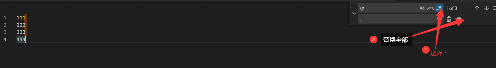
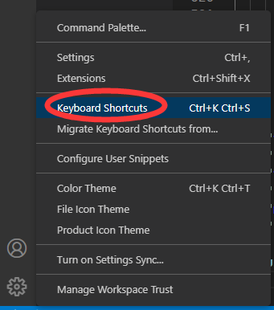
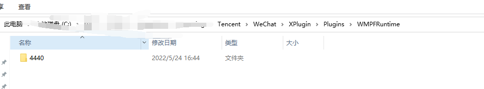
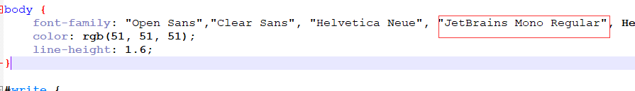
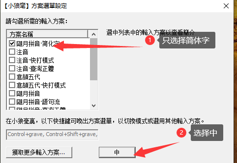
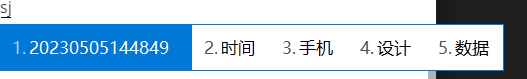
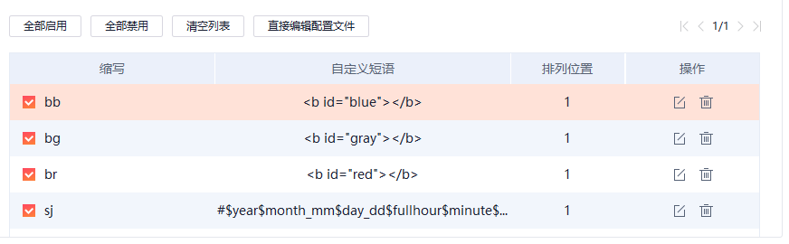

# vscode

## 插件集合

<b id="gray">code-eol 2019 (Line Endings)</b>：显示字符换行符等

<b id="gray">JVM Bytecode Viewer</b>

<b id="gray">JetBrains IDEA Icons</b> ：文件显示和idea差不多


## 替换换行符



## 快捷键设置




# 录屏工具

## ShareX

可以录屏，截图，截GIF等

https://github.com/ShareX/ShareX

##  Peek 

适用于linux平台的录屏

##  Captura  

大小不到3M

## OBSStudio

[obsproject.com](https://obsproject.com/)

# Filddler抓包

## Pc小程序无法抓到问题

1. 杀掉微信进程
2. 进入C:\Users\｛user｝\AppData\Roaming\Tencent\WeChat\XPlugin\Plugins\WMPFRuntime目录，删除全部文件夹



# xml解析包

## [*apache* commons *digester*](https://www.baidu.com/link?url=HjP_iZYofJc8VTmLuFWMZKX3Buu4kqGg0IYjdbXIscuQ3VR-T1W8U-ocxEIAct24&wd=&eqid=a79726a8000c8b5e000000065f9549cb)

# Idea 快捷使用


# Typora修改字体

1. 找到当前使用的主题**主题名.css**文件，body{}，然后在font-family中添加自己喜欢的中文字体。示例：



2. 修改代码中的字体，在主题文件夹中，新建一个名为base.user.css的文件，在里面添加如下代码(如果是中文需要加双引号)

```css
#write .CodeMirror-wrap .CodeMirror-code pre {
    font-family: JetBrains Mono Regular
}

```

# cron表达式

```shell
*/5 * * * * ? 每隔5秒执行一次
0 */1 * * * ? 每隔1分钟执行一次
0 0 5-15 * * ? 每天5-15点整点触发
0 0/3 * * * ? 每三分钟触发一次
0 0-5 14 * * ? 在每天下午2点到下午2:05期间的每1分钟触发 
0 0/5 14 * * ? 在每天下午2点到下午2:55期间的每5分钟触发
0 0/5 14,18 * * ? 在每天下午2点到2:55期间和下午6点到6:55期间的每5分钟触发
0 0/30 9-17 * * ? 朝九晚五工作时间内每半小时
0 0 10,14,16 * * ? 每天上午10点，下午2点，4点 

0 0 12 ? * WED 表示每个星期三中午12点
0 0 17 ? * TUES,THUR,SAT 每周二、四、六下午五点
0 10,44 14 ? 3 WED 每年三月的星期三的下午2:10和2:44触发 
0 15 10 ? * MON-FRI 周一至周五的上午10:15触发
0 0 23 L * ? 每月最后一天23点执行一次
0 15 10 L * ? 每月最后一日的上午10:15触发 
0 15 10 ? * 6L 每月的最后一个星期五上午10:15触发 
0 15 10 * * ? 2005 2005年的每天上午10:15触发 
0 15 10 ? * 6L 2002-2005 2002年至2005年的每月的最后一个星期五上午10:15触发 
0 15 10 ? * 6#3 每月的第三个星期五上午10:15触发

"30 * * * * ?" 每半分钟触发任务
"30 10 * * * ?" 每小时的10分30秒触发任务
"30 10 1 * * ?" 每天1点10分30秒触发任务
"30 10 1 20 * ?" 每月20号1点10分30秒触发任务
"30 10 1 20 10 ? *" 每年10月20号1点10分30秒触发任务
"30 10 1 20 10 ? 2011" 2011年10月20号1点10分30秒触发任务
"30 10 1 ? 10 * 2011" 2011年10月每天1点10分30秒触发任务
"30 10 1 ? 10 SUN 2011" 2011年10月每周日1点10分30秒触发任务
"15,30,45 * * * * ?" 每15秒，30秒，45秒时触发任务
"15-45 * * * * ?" 15到45秒内，每秒都触发任务
"15/5 * * * * ?" 每分钟的每15秒开始触发，每隔5秒触发一次
"15-30/5 * * * * ?" 每分钟的15秒到30秒之间开始触发，每隔5秒触发一次
"0 0/3 * * * ?" 每小时的第0分0秒开始，每三分钟触发一次
"0 15 10 ? * MON-FRI" 星期一到星期五的10点15分0秒触发任务
"0 15 10 L * ?" 每个月最后一天的10点15分0秒触发任务
"0 15 10 LW * ?" 每个月最后一个工作日的10点15分0秒触发任务
"0 15 10 ? * 5L" 每个月最后一个星期四的10点15分0秒触发任务
"0 15 10 ? * 5#3" 每个月第三周的星期四的10点15分0秒触发任务
```

# Idea maven无法下载jar包处理

IDEA中的maven项目出现jar包找不到的问题，首先有可能是项目依赖中有些jar没有下载完整，而

```shell
mvn idea:idea
```

这个命令可以检查并继续下载未下载完整的依赖jar。


# 进程管理工具supervisor


# 小狼豪输入法

## 简体中文设置



## 文件夹说明

如果配置没有生效，可以考虑是不是tab制表符的问题

### 用户文件夹

```tex
default.yaml，全局设定
weasel.yaml，发行版设定
installation.yaml，安装信息(可配置同步目录)
user.yaml，用户状态信息
*.schema.yaml，输入方案
*.dict.yaml，输入方案配套的词典源文件
*.custom.yaml，用户对Rime全局配置、各输入方案配置、自制输入方案等定制文件
```

### 用户配置同步目录及词典文件

```tex
*.userdb，Rime记录用户输入习惯的目录文件
UUID/，用户配置同步目录
UUID/*.userdb.txt，Rime生成的用以同步的用户词典
```


## 微软拼音皮肤设置

进入用户文件夹

打开weasel.custom.yaml配置文件,覆盖配置，然后重新部署

```yaml
customization:
  distribution_code_name: Weasel
  distribution_version: 0.14.3
  generator: "Weasel::UIStyleSettings"
  modified_time: "Thu Jun 27 17:32:21 2019"
  rime_version: 1.5.3

patch:
  "style/display_tray_icon": true
  "style/horizontal": true #横排显示
  "style/font_face": "Microsoft YaHei" #字体
  "style/font_point": 13 #字体大小
  "style/inline_preedit": true # 嵌入式候选窗单行显示


  "style/layout/border_width": 0
  "style/layout/border": 0
  "style/layout/margin_x": 12 #候选字左右边距
  "style/layout/margin_y": 12 #候选字上下边距
  "style/layout/hilite_padding": 12 #候选字背景色色块高度 若想候选字背景色块无边界填充候选框，仅需其高度和候选字上下边距一致即可
  "style/layout/hilite_spacing": 3 # 序号和候选字之间的间隔
  "style/layout/spacing": 10 #作用不明
  "style/layout/candidate_spacing": 24 # 候选字间隔
  "style/layout/round_corner": 0 #候选字背景色块圆角幅度


  "style/color_scheme": Micosoft
  "preset_color_schemes/Micosoft":
    name: "Micosoft"
    author: "XNOM"
    back_color: 0xffffff #候选框 背景色
    border_color: 0xD77800 #候选框 边框颜色
    text_color: 0x000000 #已选择字 文字颜色
    hilited_text_color: 0x000000 #已选择字右侧拼音 文字颜色
    hilited_back_color: 0xffffff #已选择字右侧拼音 背景色
    hilited_candidate_text_color: 0xffffff #候选字颜色
    hilited_candidate_back_color: 0xD77800 #候选字背景色
    candidate_text_color: 0x000000 #未候选字颜色
```

## 自定义短语配置

用户文件中，新建custom_phrase.txt文件家

配置

```yaml
# Rime table
# coding: utf-8
#@/db_name custom_phrase.txt
#@/db_type tabledb
#
# 用於【朙月拼音】系列輸入方案
# 【小狼毫】0.9.21 以上
#
# 請將該文件以UTF-8編碼保存爲
# Rime用戶文件夾/custom_phrase.txt
#
# 順序爲：文字、編碼、權重（決定重碼的次序、可選）
#
# 雖然文本碼表編輯較爲方便，但不適合導入大量條目
#
# no comment
# 各字段以制表符（Tab）分隔
<b id="blue"></b>	bb	1
<b id="gray"></b>	bg	1
<b id="red"></b>	br	1
```

## 时间输入

通过lua脚本配合输出当前时间

1. 在用户文件夹新建rime.lua文件

```lua
sj_translator = require("sj")
```

2. 在用户文件夹新建文件夹Lua， 注意大小写
3. 在Lua文件夹下面新建文件sj.lua

```lua
--lua语言中的注释用“--”
local function translator(input, seg)
    if (input == "sj") then         --关键字更改，你也可以用or语句定义多个关键字
        yield(Candidate("time", seg.start, seg._end, os.date("%Y%m%d%H%M%S"), " "))
    end
end
return translator
```

4. 在xx.schema.yaml文件里配置

```yaml
  translators:
    - lua_translator@sj_translator # 时间数字Lua
```

5. 重新部署
6. 效果图sj



## Shift上屏并切换英文

```yaml
# default.custom.yaml  对default.yaml的自定义设置
patch:
  "ascii_composer/switch_key":
    Caps_Lock: commit_code
    Shift_L: commit_code  # Shift上屏
    Shift_R: commit_code
```

| 选项         | 注释                                                         |
| ------------ | ------------------------------------------------------------ |
| commit_text  | 提交候选区的文字，然后切换到英文模式。                       |
| commit_code  | 提交已输入的编码（拼音字母），然后切换到英文模式。           |
| inline_ascii | 仅样式配置内存在 inline_preedit=true 时有效。在输入法的编辑区临时切换到英文，提交后恢复中文。 |
| noop         | 不执行任何操作。                                             |
| clear        | 清除已输入的编码，然后切换到英文模式。                       |

## 英文输入的支持

[rime-easy-en](https://link.zhihu.com/?target=https%3A//github.com/BlindingDark/rime-easy-en)把`easy-en`作为明月输入发的扩展，扩展到明月拼音等输入法内

只需要将`easy_en.schema.yaml`、`easy_en.dict.yaml`、`easy_en.yaml`和`lua/easy_en.lua`复制到 rime 配置目录。


最后，在输入法的配置项内激活即可，比如：`明月拼音-简化版`(luna_pinyin_simp.custom.yaml)：

```yaml
patch:
  __include: easy_en:/patch
```

某些特殊方案需要指定方案名称，如微软双拼：(double_pinyin_mspy是当前的输入法名称)

```yaml
patch:
  __include: easy_en:/patch_double_pinyin_mspy
```

# window查看端口占用

```shell
netstat -aon|findstr "8081"
## 查看pid对应的程序
tasklist|findstr "9088"
#杀掉进程
taskkill /T /F /PID 9088 
```

# SumatraPDF

```

# For documentation, see https://www.sumatrapdfreader.org/settings/settings3-3-1.html

MainWindowBackground = #80fff200
EscToExit = false
ReuseInstance = false
UseSysColors = false
RestoreSession = true
TabWidth = 300

FixedPageUI [
	TextColor = #000000
	BackgroundColor = #ffffff
	SelectionColor = #f5fc0c
	WindowMargin = 2 4 2 4
	PageSpacing = 4 4
	HideScrollbars = false
]
EbookUI [
	FontName = 冬青黑体简体中文
	FontSize = 12.5
	TextColor = #000000
	BackgroundColor = #d6e7cb
	UseFixedPageUI = false
]
ComicBookUI [
	WindowMargin = 0 0 0 0
	PageSpacing = 4 4
	CbxMangaMode = false
]
ChmUI [
	UseFixedPageUI = false
]
ExternalViewers [
]
ShowMenubar = true
ReloadModifiedDocuments = true
FullPathInTitle = false
ZoomLevels = 8.33 12.5 18 25 33.33 50 66.67 75 100 125 150 200 300 400 600 800 1000 1200 1600 2000 2400 3200 4800 6400
ZoomIncrement = 0

PrinterDefaults [
	PrintScale = shrink
]
ForwardSearch [
	HighlightOffset = 0
	HighlightWidth = 15
	HighlightColor = #6581ff
	HighlightPermanent = false
]
Annotations [
	HighlightColor = #ffff00
]
CustomScreenDPI = 0

RememberStatePerDocument = true
UiLanguage = cn
ShowToolbar = true
ShowFavorites = false
AssociateSilently = false
CheckForUpdates = false
RememberOpenedFiles = true
EnableTeXEnhancements = false
DefaultDisplayMode = automatic
DefaultZoom = fit page
WindowState = 1
WindowPos = 605 0 776 1040
ShowToc = true
SidebarDx = 186
TocDy = 0
TreeFontSize = 0
ShowStartPage = true
UseTabs = true

SessionData [
]
TimeOfLastUpdateCheck = 0 0
OpenCountWeek = 657

# Settings after this line have not been recognized by the current version


```

# 搜狗输入法

## 自定义短语




## 短语时间配置

```properties
bb,1=<b id="blue"></b>
bg,1=<b id="gray"></b>
br,1=<b id="red"></b>
sj,1=#$year$month_mm$day_dd$fullhour$minute$second 
sj,2=#$year$month_mm$day_dd
```

## 网盘下载

1. 下载<b id="blue">Motrix</b>软件
2. 下载浏览器插件 <b id="gray">篡改猴</b>
   1. 打开浏览器开发者模式
   2. 在篡改猴中搜索 <b id="blue">（改）网盘直链下载助手</b>