#

# 修改快捷方式

打开默认键盘快捷方式设置：
File -> Preferences -> Keyboard Shortcuts

# 几个常见的快捷键修改

## 格式化

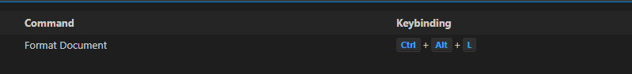

## 搜索文件


## 方法提示


## 触发提示

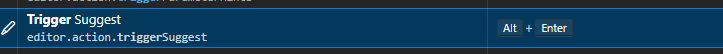

# 字体调整

File -> Preferences -> setting


# 插件

## GIT

### Git Graph

1. 点击Graph图标，进入界面

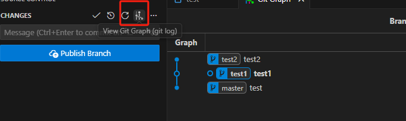

2. 显示git分支相关信息

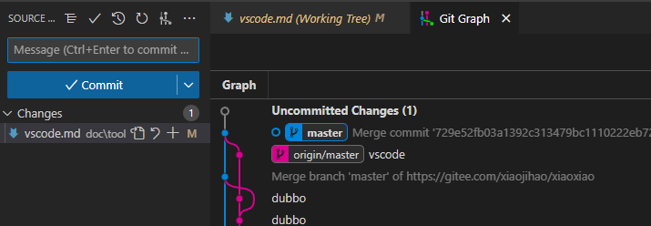

### Git History

显示历史

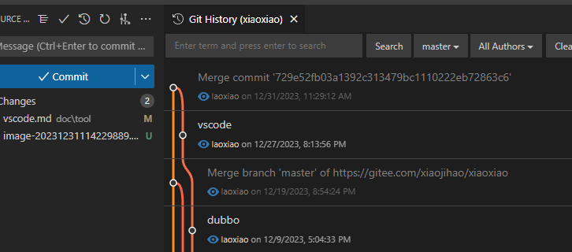

### Git Brains

> 可以对Git 冲突合并类似jetbrains一样的操作

1. 借助git graph对冲突分支合并

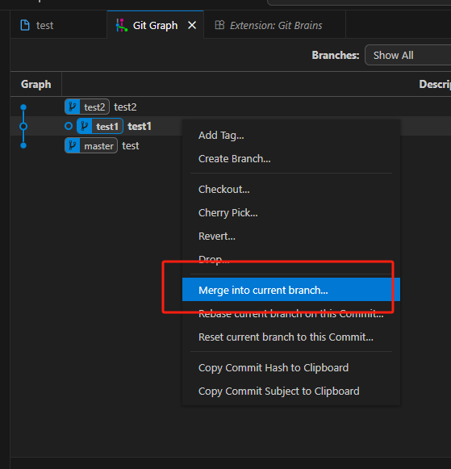

2. 进入冲突解决界面

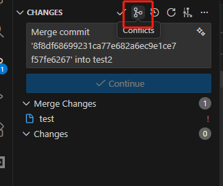

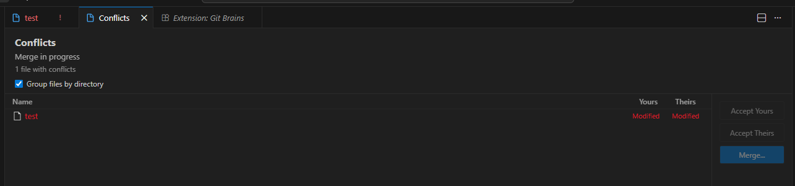

3. 冲突解决的界面和jetbrains一样

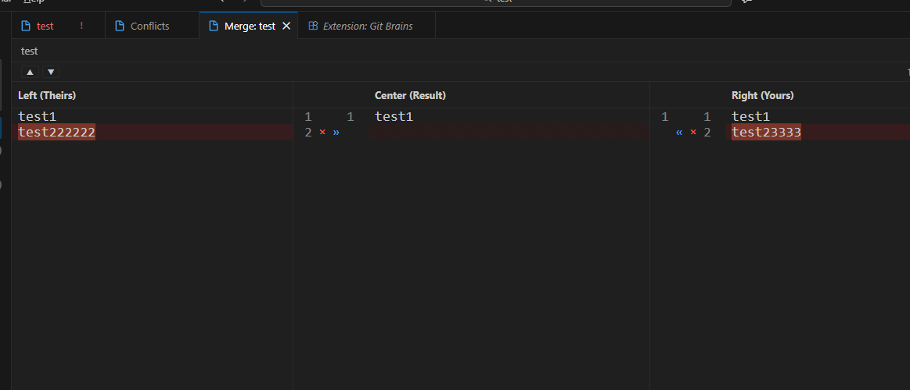

# 折叠代码块

右键进入命令行

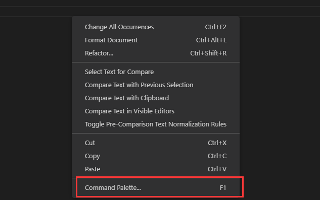

搜索fold


## Idea 快捷键

搜索 `IntelliJ IDEA Keybindings`。进行安装

## idea 主题

<b id="gray">IntelliJ IDEA Darcula Theme</b> 插件


# json处理

> json 树结构处理

<b id="gray">JSON Tree Editor</b>

安装完后，点击右上角

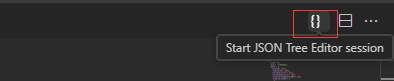

<b id="gray">JSON Tools</b>

json格式化/压缩

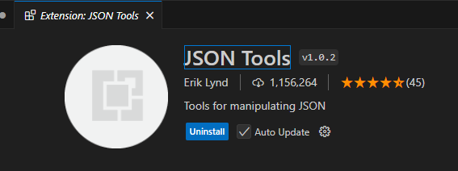

## 文件对比

<b id="gray">Compare View</b>


# 配置终端为Git

> 如何在vscode上将终端配置成git命令行

1. 在设置中搜索：profiles.windows

2. 在json中配置
```json
   "terminal.integrated.profiles.windows": {
       "PowerShell -NoProfile": {
         "source": "PowerShell",
         "args": [
           "-NoProfile"
         ]
       },
       "Git-Bash": {
         "path": "D:\\softinstall\\Git\\bin\\bash.exe",
         "args": []
       }
     },
   "terminal.integrated.defaultProfile.windows": "Git-Bash",
```

# 多行操作

1. 此时，光标在第一行

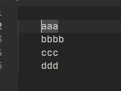

2. 按住alt+shift,点击最后一行，这样就可以选中多个光标了

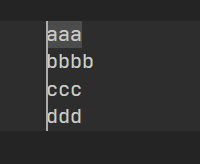

3. 如果想要批量跳到最后一行，则可以按住Ctrl+->键盘

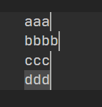

4. 同时批量的操作

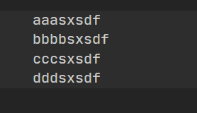