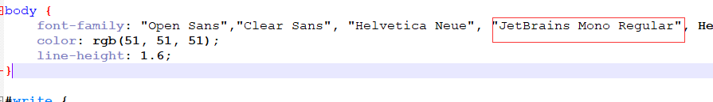

# xml解析包

## [*apache* commons *digester*](https://www.baidu.com/link?url=HjP_iZYofJc8VTmLuFWMZKX3Buu4kqGg0IYjdbXIscuQ3VR-T1W8U-ocxEIAct24&wd=&eqid=a79726a8000c8b5e000000065f9549cb)

# Idea 快捷使用

## 常用操作

**help 中的 fild action 能根据关键字查找快捷键**

- ctrl+alt+[
  - 切换项目
  - 在window中能在next project看到快捷键
- Recent file
  - 搜索最近打开的文件
- 查看上一步编辑的页面地方
  - navigate->last edit
- 回到最近浏览地方
  - navicat -> back
  - alt+箭头
- 利用书签进行跳转
  - bookmark
  - 如果选择Menemonic则是带数字的书签
- 收藏文件
  - add to fa
- 快速跳转到某个字符
  - 安装插件emacsIDEAs
  - ctrl+j 调整相关搜索
  - 进入manage keymap  搜索
- 快速搜索class
  - navigate -> class  查看
- 快速搜索文件
  - navigate -> file  查看
- 全局搜索或者全局替换
  - edit->find->find in path  来查看快捷键
- 快速跳转行头或者行尾
  - action 搜索->move caret lin
  - 一般是 home 或者 end建
- 批量操作
  - 选中的单词如果在下面出现，操作会修改所有相同单词
  - edit -> find ->select all occurent 来搜索快捷键
- 快速跳转有问题的行
  - F2
- alt+enter 的功能
  - 自动创建方法，当写了一个方法后，没定义这个方法，enter可以自动创建
  - 实现接口
    - 当创建接口后，需要快捷的实现接口
    - alt+enter 选择implement  interface
  - 当定义变量不符合规范后，可以快速修复
- 代码窗口全屏
  - ctrl+shift+F12
- 查看文件方法结构
  - navigate 下查看
  - ctrl+F12
- 在方法上查看谁调用了这个方法，这个方法调用了谁
  - ctrl+alt+h

## 代码模板

live template 进行设置模板

进入action 搜索，live template   

在这里也能看到常用的代码模板

## postfix

搜索 postfix completion

相当于不可编辑的模板

## 重构

- refactor->rename搜索
  - shift+F6
    - 修改变量名称
    - 修改class名称
- 重构方法
  - 在使用方方法出，加入变量，alt+enter

## 抽取

- 抽取变量
  - refactor -> extract+ variable 搜索快捷键
  - ctrl+alt+v

- 抽取成静态常量：ctrl+alt+c

- 抽取方法参数 ctrl+alt+p
- 抽取方法：ctrl+alt+m

## git 集成

- 快速搜索修改地方

- 在 keymap 中 搜索 previous change
  - ctrl + alt + shift + 上箭头或下箭头
- 快速撤销
  - ctrl + alt +z
- 查找本地历史记录
  - action中搜索 history

## 断点

- 快速打断点
  - run -> Toggle Breakpoint  ->Line Breakpoint 搜索快捷键
  - ctrl+ f8
- 禁止一切断点，断点失效
- 条件断点
  - 在断点处 shilft+ctrl+f8
  - 在condition输入条件
  - condition么满足条件才进入断点
  - condition示范：body.equals("qqq")
- 查看调试变量的内容，在表达式中输入变量可查询变量内容
  - run -> Debugging Actions -> Evaluate Expression... 搜索快捷键
  - alt+F8
- 运行到光标所在行
  - alt+F9
- 调试过程中修改变量值
  - 在调试的变量显示处setvalue
- 运行当前光标的最小上下文
  - 搜索 debug context 寻找快捷键

## 文件操作

- 在当前文件夹下新建文件
  - 在keymap中 搜索 new..., 搜索在 other下看到快捷键
  - ctrl + alt + insert

- 移动文件
  - 在 keymap 中搜索 mave... 查看快捷键
  - F6
- 查看maven  Show Dependencies...查找对应的包
  - action -> diagram element搜索快捷键
  - ctrl+F

# Typora修改字体

1. 找到当前使用的主题**主题名.css**文件，body{}，然后在font-family中添加自己喜欢的中文字体。示例：



2. 修改代码中的字体，在主题文件夹中，新建一个名为base.user.css的文件，在里面添加如下代码(如果是中文需要加双引号)

```css
#write .CodeMirror-wrap .CodeMirror-code pre {
    font-family: JetBrains Mono Regular
}

```

