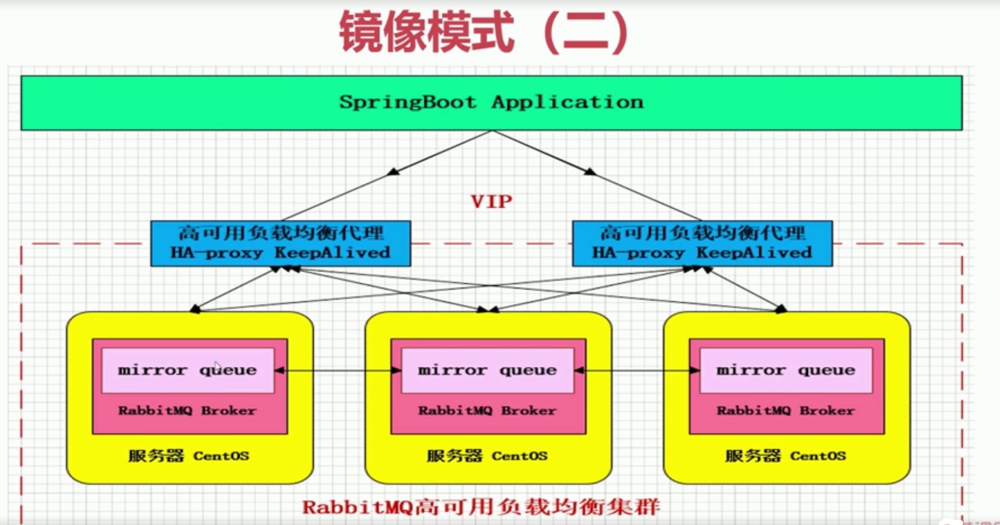

# 简介

- rabbitmq 是一个跨平台的消息中间键

- 使用Erlang语言编写
- RabbitMq是基于AMQP协议的


## 什么是AMQP高级消息队列协议

一个二进制协议，面向消息中间件

## AMQP核心概念

Server: 又称Brocker，接受客户端连接，实现AMQP实体服务

Connection：连接,应用程序与Broker的网络连接

Channel:网络信道，信息读写都是在Channel操作的，客户端可以建立多个Channel，类似于与数据库的会话

Message：消息，由Properties和Body组成

Virtual host ： 虚拟地址，用于进行逻辑隔离，最上层的消息路由，一个vh里面有若干个Exchange和queue

Exchange:交换机接收消息，根据路由键转发消息到对应的queue

Binding:Exchange 和queue之间的虚拟连接，binding中可以包含routingkey

routing key:一个路由规则，虚拟机可以用它来确定如何路由一个特定消息

queue:消息队列，保存消息并将他们转发给消费者


整体架构图

消息投递到对应exchange，消费者从queue消费，exchange和队列有个绑定关系，可以路由到指定的队列中


消息流转示意图


# 安装

1 先下载三个安装包

安装erlang安装包，再安装秘钥，socat，再安装rabbitmq

```shell
[root@localhost home]# ll
总用量 23664
-rw-r--r--. 1 root root 18345424 7月  25 22:18 erlang-18.3-1.el7.centos.x86_64.rpm
-rw-r--r--. 1 root root 5520417 7月  25 22:18 rabbitmq-server-3.6.5-1.noarch.rpm
-rw-r--r--. 1 root root 361448 7月  25 22:18 socat-1.7.3.2-1.1.el7.x86_64.rpm

```

2 配置文件

```shell
[root@localhost home]# vim /usr/lib/rabbitmq/lib/rabbitmq_server-3.6.5/ebin/rabbit.app 
```


```json
{mod, {rabbit, []}},
	#默认端口号
  {env, [{tcp_listeners, [5672]},
   # 
         {num_tcp_acceptors, 10},
#基于内存的高水平线的配置，如果剩下0.4*x的内存时，会报警
{vm_memory_high_watermark, 0.4},
```

需要修改这个,表示能够访问的用户

```json
{loopback_users, [<<"guest">>]},
```

修改成

```shell
{loopback_users, [guest]},
```


# 命令行与管控台操作

```shell
#修改主机名
[root@rabbitmq131 ~]# vim /etc/hostname 
#配置hosts映射得和hostname一致（否则超时等着你）
-------
127.0.0.1   localhost localhost.localdomain localhost4 localhost4.localdomain4
::1         localhost localhost.localdomain localhost6 localhost6.localdomain6
192.168.94.131 rabbitmq131
------

##启动服务（记得先修改主机名）
[root@localhost home]# rabbitmq-server start &
#或者这种方式启动或关闭
root@rabbitmq131 ~]# service rabbitmq-server start
root@rabbitmq131 ~]# service rabbitmq-server stop
#查看它是否已启动
[root@localhost home]# lsof -i:5672
COMMAND   PID     USER   FD   TYPE DEVICE SIZE/OFF NODE NAME
beam    22453 rabbitmq   48u  IPv6  50878      0t0  TCP *:amqp (LISTEN)
#退出
[root@localhost home]# rabbitmqctl stop
#查看rabbitmq有哪些插件
[root@localhost home]# rabbitmq-plugins list
# 查看有哪些队列
[root@rabbitmq131 ~]# rabbitmqctl list_queues
Listing queues ...
# 查看默认的虚拟主机，可以看到，默认创建的虚拟主机时/
[root@rabbitmq131 ~]# rabbitmqctl list_vhosts
Listing vhosts ...
/
```

## 网页登陆

<http://192.168.94.131:15672/#/>   guest/guest

# 快速开始

consumer端：

```java
public static void main(String[] args) throws Exception {
        //设置一个工厂类，进行配置
        ConnectionFactory connectionFactory = new ConnectionFactory();
        connectionFactory.setHost("192.168.94.131");
        connectionFactory.setPort(5672);
        //设置虚拟主机
        connectionFactory.setVirtualHost("/");
        connectionFactory.setConnectionTimeout(60000);
        //创建一个连接
        Connection connection = connectionFactory.newConnection();
        Channel channel = connection.createChannel();
        String queueName = "test001";
        //队列名称，是否持久化, , 如果与exchange失去关联则删除
        channel.queueDeclare(queueName, true,false,false, null);
        QueueingConsumer queueingConsumer = new QueueingConsumer(channel);
        //设置channel， 队列，是否ack会produce， 
        channel.basicConsume(queueName, true,queueingConsumer);
        System.out.println("开始消费数据");
        while (true) {
            QueueingConsumer.Delivery delivery = queueingConsumer.nextDelivery();
            String string = new String(delivery.getBody());
            System.out.println(string);
        }
    }
```

provide端：

```java
public static void main(String[] args) throws Exception{
    //设置一个工厂类，进行配置
    ConnectionFactory connectionFactory = new ConnectionFactory();
    connectionFactory.setHost("192.168.94.131");
    connectionFactory.setPort(5672);
    //设置虚拟主机
    connectionFactory.setVirtualHost("/");
    connectionFactory.setConnectionTimeout(60000);
    //创建一个连接
    Connection connection = connectionFactory.newConnection();
    Channel channel = connection.createChannel();
    System.out.println("开始生产数据");
    for(int i=0; i<5; i++){
        String msg = "Hello RabbitMq";
        //1 exchange   2 routingKey
        //如果exchange为空，则使用默认的exchange，
        //它的路由规则时routingkey得和消费队列相同
        channel.basicPublish("", "test001", null, msg.getBytes());
    }
    channel.close();
    connection.close();
}
```

## Exchange 交换机

接收消息，根据路由键转发消息所绑定的队列

- 交换机属性

name : 交换机名称

type：交换机类型 direct、topic、fanout、headers

durability: 是否需要持久化

auto delete :当最后一个绑定到Exchange上的队列删除后，自动删除该Exchagne 

internal： 当前Exchange是否用于RabbitMq内部使用，默认为false

- direct

直连的方式，routingkey必须完全匹配，相当于一个普通的队列

demo:

provide

```java
public static void main(String[] args) throws Exception{
    ConnectionFactory connectionFactory = new ConnectionFactory();
    connectionFactory.setHost("192.168.94.131");
    connectionFactory.setPort(5672);
    connectionFactory.setVirtualHost("/");
    connectionFactory.setConnectionTimeout(60000);
    //设置是否自动重连
    connectionFactory.setAutomaticRecoveryEnabled(true);
    connectionFactory.setNetworkRecoveryInterval(3000);
    Connection connection = connectionFactory.newConnection();
    Channel channel = connection.createChannel();
    String exchangeName="test_direct_exchange";
    String routingKey="test.direct";

    for(int i=0; i<5; i++){
        String msg = "Hello RabbitMq";
        //1 exchange   2 routingKey
        //如果exchange为空，则使用默认的exchange，
        //它的路由规则时routingkey得和消费队列相同
        channel.basicPublish(exchangeName, routingKey, null, msg.getBytes());
    }
    channel.close();
    connection.close();
}
```

comsumer

```java
public static void main(String[] args) throws Exception  {
    ConnectionFactory connectionFactory = new ConnectionFactory();
    connectionFactory.setHost("192.168.94.131");
    connectionFactory.setPort(5672);
    connectionFactory.setVirtualHost("/");
    connectionFactory.setConnectionTimeout(60000);
    //设置是否自动重连
    connectionFactory.setAutomaticRecoveryEnabled(true);
    connectionFactory.setNetworkRecoveryInterval(3000);
    Connection connection = connectionFactory.newConnection();
    Channel channel = connection.createChannel();
    String exchangeName="test_direct_exchange";
    String exchangeType="direct";
    String queueName="test_direct_queue";
    String routingKey="test.direct";
    //声明一个交换机 交换机名称，类型，是否持久化，
    channel.exchangeDeclare(exchangeName,exchangeType,true,false,false,null);
    //声明一个队列
    channel.queueDeclare(queueName,false,false,false,null);
    channel.queueBind(queueName, exchangeName, routingKey);
    QueueingConsumer queueingConsumer = new QueueingConsumer(channel);
    channel.basicConsume(queueName, true, queueingConsumer);
    while (true){
        QueueingConsumer.Delivery delivery = queueingConsumer.nextDelivery();
        String s = new String(delivery.getBody());
        System.out.println(s);
    }
}
```

- topic Exchange

发送到topic  Exchange消息会被转发到所有

routing key 可以模糊匹配：如 log.*  log.#

“#” 匹配一个或者多个词

“* ” 匹配一个词


- Fanout Exchange

不处理路由键，只需要简单的将队列绑定到交换机上

只要队列(可以是多个)绑定了该交换机，就能收到消息

转发消息是最快的


## Binding-绑定

exchange和exchange、queue之间的关系

# Rabbitmq高级特性

- 消息如何保障100%的投递成功
- 在海量订单产生的业务高峰期，如何避免消息的重复消费问题

## 消息的100%投递成功

什么时生产端的可靠性投递

- 保障消息的成功发送
- 保障mq节点的成功接收
- 发送端收到mq的确认应答
- 完善的消息补偿机制（消息投递失败我该怎么处理）

常用方案：

- 消息落库，对消息状态进行打标
  - 消息投递时，将消息持久化到库中，消息到达消费端，进行持久库的状态修改，对没有响应的消息，轮询发送，做最大努力的次数，如5次
  - 1、持久化消息记录 status=0 2 发送消息，3消费端回送响应给生产端，4生产端修改持久库状态 status=1,5如果超过时间status=0,则定时任务再抽取消息再次投递,如果次数超过一定次数，status=2,
- 消息的延迟投递，做二次确认

## 幂等性

在海量订单产生的业务高峰，如果避免重复消费

消费端实现幂等性，就意味着，我们的消息永远不会被消费多次

实现方式

- 唯一id+指纹码机制，利用数据库主键去重
  - 唯一id_指纹码（唯一规则）
  - select count(1) from order where id=唯一id+指纹码
  - 如果=0则进行insert，否则不进行处理
- 利用redis原子性实现
  - 如果数据入库，那么数据库与redis如何做到原子性

## Confirm 确认消息

消息的确认，时值消息投递后(到达队列)，broker收到消息，则会 给生产者一个应答。生产者进行应答，确认这条消息是否正常发送broker

如何实现：

- 在channel上开启确认模式:channel.confirmselect()
- 在channel上添加监听：addconfirmlistener

代码：消费端

```java
//设置confirm
channel.confirmSelect();
for(int i=0; i<5; i++){
    String msg = "Hello RabbitMq";
    //1 exchange   2 routingKey
    //如果exchange为空，则使用默认的exchange，
    //它的路由规则时routingkey得和消费队列相同
    channel.basicPublish(exchangeName, routingKey, null, msg.getBytes());
}
channel.addConfirmListener(new ConfirmListener() {
    //异常ack
    public void handleAck(long deliveryTag, boolean multiple) throws IOException {
        //deliveryTag:消息的唯一的标签
        //multiple:是否批量
    }
    //正常ack
    public void handleNack(long deliveryTag, boolean multiple) throws IOException {

    }
});
```

## Return 消息机制

用于处理一些不可路由的消息

要求:

先添加监听

```java
channel.addReturnListener(new ReturnListener() {
    //replyCode:响应码
    public void handleReturn(int replyCode, String replyText, String exchange, String routingKey, AMQP.BasicProperties properties, byte[] body) throws IOException {

    }
});
```

```java
//mandatory设置为true，设置为true，就不会把消息记录删除
void basicPublish(String exchange, String routingKey, boolean mandatory, BasicProperties props, byte[] body)
        throws IOException;
```

## 消费端自定义监听

我们之前获取下一条，我们用whiletrue 方式获取 queueingConsumer.nextDelivery();

另一种写法

consumer端

```java
//声明一个交换机 交换机名称，类型，是否持久化，
channel.exchangeDeclare(exchangeName,exchangeType,true,false,false,null);
//声明一个队列
channel.queueDeclare(queueName,false,false,false,null);
channel.queueBind(queueName, exchangeName, routingKey);

channel.basicConsume(queueName, true, new MyComsumer(channel));
```

```java
public class MyComsumer extends DefaultConsumer {
    public MyComsumer(Channel channel) {
        super(channel);
    }

//在这个方法中写业务逻辑
    @Override
    public void handleDelivery(String consumerTag, Envelope envelope, AMQP.BasicProperties properties, byte[] body) throws IOException {

    }
}
```

## 消费端数据限流

单个的客户端无法同时处理大量的消息

RabbitMQ提供了qos（服务质量保证）功能，在非自动确认消息（no_ack

设置为false）的前提下，如果一定数目的消息未被确认前，不进行消费新的消息

```java
//声明一个交换机 交换机名称，类型，是否持久化，
channel.exchangeDeclare(exchangeName,exchangeType,true,false,false,null);
//声明一个队列
channel.queueDeclare(queueName,false,false,false,null);
channel.queueBind(queueName, exchangeName, routingKey);
//消息大小的限制；
// 多少条之后ack，设置1表示1条结束后告诉生产者，可以再发送消息了；
// false表示在consumer端处理
channel.basicQos(0, 1, false);
//ack设置为false
channel.basicConsume(queueName, false, new MyComsumer(channel));
```

```java
public class MyComsumer extends DefaultConsumer {
    //需要channel来进行ack
    private Channel channel;
    public MyComsumer(Channel channel) {
        super(channel);
        this.channel=channel;
    }

    @Override
    public void handleDelivery(String consumerTag, Envelope envelope, AMQP.BasicProperties properties, byte[] body) throws IOException {
        //主动的给生产者一个应答，表示我处理了一个消息，你可以继续发送了
        //是否批量签收，prefetchCount设置为1，则不批量签收
        channel.basicAck(envelope.getDeliveryTag(), false);
    }
}
```

## 消费端的ACK机制与重回队列

- ack : 成功处理消息
- nack:处理消息失败，让生产者重新发

```java
//requeue：是否重回队列
channel.basicNack(envelope.getDeliveryTag(), false, true);
```

## TTL队列/消息

队列/消息 的生存时间，超时则进行清除

## 死信队列（DLX）

当消息在队列中没有消费者消费时，它能够重现publish到另一个Exchange中

死信队列情况

- 消息被拒绝（basic.reject/basic.nack）并且requeue=false
- 消息TTL过期
- 队列达到最大长度 

```java
// 这就是一个普通的交换机 和 队列 以及路由
		String exchangeName = "test_dlx_exchange";
		String routingKey = "dlx.#";
		String queueName = "test_dlx_queue";
		
		channel.exchangeDeclare(exchangeName, "topic", true, false, null);
		
		Map<String, Object> agruments = new HashMap<String, Object>();
		agruments.put("x-dead-letter-exchange", "dlx.exchange");
		//这个agruments属性，要设置到声明队列上
		channel.queueDeclare(queueName, true, false, false, agruments);
		channel.queueBind(queueName, exchangeName, routingKey);
		
		//要进行死信队列的声明:
		channel.exchangeDeclare("dlx.exchange", "topic", true, false, null);
		channel.queueDeclare("dlx.queue", true, false, false, null);
		channel.queueBind("dlx.queue", "dlx.exchange", "#");
		
		channel.basicConsume(queueName, true, new MyConsumer(channel));
```

# 整合spring

创建配置项

```java
@Configuration
@ComponentScan(value = "com.xiao")
public class BaseConfig {
    @Bean
    public ConnectionFactory connectionFactory(){
        /*com.rabbitmq.client.ConnectionFactory connectionFactory = new com.rabbitmq.client.ConnectionFactory();
        connectionFactory.setHost("192.168.94.131");
        connectionFactory.setPort(5672);
        connectionFactory.setVirtualHost("/");
        connectionFactory.setConnectionTimeout(60000);
        //设置是否自动重连
        connectionFactory.setAutomaticRecoveryEnabled(true);
        connectionFactory.setNetworkRecoveryInterval(3000);

        return new CachingConnectionFactory(connectionFactory);*/
        CachingConnectionFactory connectionFactory = new CachingConnectionFactory();
        connectionFactory.setAddresses("192.168.94.131:5672");
        connectionFactory.setUsername("guest");
        connectionFactory.setPassword("guest");
        connectionFactory.setVirtualHost("/");
        return connectionFactory;
    }

    @Bean
    public RabbitAdmin rabbitAdmin(ConnectionFactory connectionFactory) {
        RabbitAdmin rabbitAdmin = new RabbitAdmin(connectionFactory);
        //如果设置为false，则spring不会加载
        rabbitAdmin.setAutoStartup(true);
        return rabbitAdmin;
    }
}
```

测试交换机创建与队列创建

```java
@Test
public void test1(){
    //创建Exchange
    rabbitAdmin.declareExchange(new DirectExchange("test.Direct",false,false));
    rabbitAdmin.declareExchange(new TopicExchange("test.Topic", false, false));
    rabbitAdmin.declareExchange(new FanoutExchange("test.Fanout", false, false));
    //创建队列
    rabbitAdmin.declareQueue(new Queue("test.direct.queue",false));
    //绑定Exchange和队列(先创建队列和Exchange)
    rabbitAdmin.declareBinding(new Binding("test.direct.queue",//绑定的队列
            Binding.DestinationType.QUEUE,
            "test.Direct", //绑定的Exchange
            "direct", //routingkey
            new HashMap<>()));
    //topic方式
    rabbitAdmin.declareBinding(BindingBuilder
            .bind(new Queue("test.direct.queue",false))//队列
            .to(new TopicExchange("test.Topic",false,false))//交换机
            .with("bind.#"));//routingkey
    //直连方式
    rabbitAdmin.declareBinding(
            BindingBuilder
                    .bind(new Queue("test.fanout.queue", false))
                    .to(new FanoutExchange("test.fanout", false, false)));
    //清空队列数据
    rabbitAdmin.purgeQueue("test.direct.queue", false);
}
```

## RabbitAdmin源码

它实现了InitializingBean接口，InitializingBean的afterPropertiesSet是在bean加载之后执行，在这个方法中的initialize()方法声明了三个空的集合,然后从spring容器主公获取对应的bean，放入集合中

```java
Collection<Exchange> contextExchanges = new LinkedList<Exchange>(
      this.applicationContext.getBeansOfType(Exchange.class).values());
Collection<Queue> contextQueues = new LinkedList<Queue>(
      this.applicationContext.getBeansOfType(Queue.class).values());
Collection<Binding> contextBindings = new LinkedList<Binding>(
      this.applicationContext.getBeansOfType(Binding.class).values());
```

最终由rabbitTemplate.execute来执行

## SpringAMQP声明

```java
/**
 * 初始化启动时，创建交换机和队列，并进行绑定
 * @return
 */
@Bean
public TopicExchange exchange001() {
    return new TopicExchange("topic001", true, false);
}

@Bean
public Queue queue001() {
    return new Queue("queue001", true); //队列持久
}

@Bean
public Binding binding001() {
    return BindingBuilder.bind(queue001()).to(exchange001()).with("spring.*");
}

@Bean
public TopicExchange exchange002() {
    return new TopicExchange("topic002", true, false);
}

@Bean
public Queue queue002() {
    return new Queue("queue002", true); //队列持久
}

@Bean
public Binding binding002() {
    return BindingBuilder.bind(queue002()).to(exchange002()).with("rabbit.*");
}

@Bean
public Queue queue003() {
    return new Queue("queue003", true); //队列持久
}

@Bean
public Binding binding003() {
    return BindingBuilder.bind(queue003()).to(exchange001()).with("mq.*");
}
```

## 消息消费者监听

```java
MessageListenerAdapter@Bean
public SimpleMessageListenerContainer messageListenerContainer(ConnectionFactory connectionFactory){
    SimpleMessageListenerContainer container = new SimpleMessageListenerContainer(connectionFactory);
    //绑定监听队列
    container.addQueueNames("queue001", "queue002", "queue003");
    //设置当前消费者数量
    container.setConcurrentConsumers(1);
    //最大的消费者数量
    container.setMaxConcurrentConsumers(3);
    //是否重回队列
    container.setDefaultRequeueRejected(false);
    //自动签收
    container.setAcknowledgeMode(AcknowledgeMode.AUTO); //签收模式
    //消费端的标签策略
    container.setConsumerTagStrategy((queue)-> queue + "_" + UUID.randomUUID().toString());
    //消息监听
    ChannelAwareMessageListener messageListener=(message, channel)->{
        String msg = new String(message.getBody());
        System.out.println("----------消费者: " + msg);
    };
    container.setMessageListener(messageListener);
    return  container;
}
```

## MessageListenerAdapter消息监听

1、第一种方式,MessageDelegate类默认的调用handleMessage方法

```java
@Bean
public SimpleMessageListenerContainer messageListenerContainer1(ConnectionFactory connectionFactory){
    SimpleMessageListenerContainer container = new SimpleMessageListenerContainer(connectionFactory);
    //绑定监听队列
    container.addQueueNames("queue001", "queue002", "queue003");
    //设置当前消费者数量
    container.setConcurrentConsumers(1);
    //最大的消费者数量
    container.setMaxConcurrentConsumers(3);
    //是否重回队列
    container.setDefaultRequeueRejected(false);
    //自动签收
    container.setAcknowledgeMode(AcknowledgeMode.AUTO); //签收模式
    //消费端的标签策略
    container.setConsumerTagStrategy((queue)-> queue + "_" + UUID.randomUUID().toString());
    //消息监听
    MessageListenerAdapter adapter = new MessageListenerAdapter(new MessageDelegate());
    container.setMessageListener(adapter);
    return  container;
}
```

```java
public class MessageDelegate {

   public void handleMessage(byte[] messageBody) {
      System.err.println("默认方法, 消息内容:" + new String(messageBody));
   }
   
```

2、自定义调用方法

```java
MessageListenerAdapter adapter = new MessageListenerAdapter(new MessageDelegate());
adapter.setDefaultListenerMethod("consumeMessage");
container.setMessageListener(adapter);
```

```java
public void consumeMessage(byte[] messageBody) {
   System.err.println("字节数组方法, 消息内容:" + new String(messageBody));
}
```

3、自定义调用方法和传入参数

```java
MessageListenerAdapter adapter = new MessageListenerAdapter(new MessageDelegate());
adapter.setDefaultListenerMethod("consumeMessage");
//转换器: 从字节数组转换为String
adapter.setMessageConverter(new TextMessageConverter());
container.setMessageListener(adapter);
```

```java
public void consumeMessage(String messageBody) {
   System.err.println("字符串方法, 消息内容:" + messageBody);
}
```

```java
public class TextMessageConverter implements MessageConverter {

	@Override
	public Message toMessage(Object object, MessageProperties messageProperties) throws MessageConversionException {
		return new Message(object.toString().getBytes(), messageProperties);
	}

	@Override
	public Object fromMessage(Message message) throws MessageConversionException {
		String contentType = message.getMessageProperties().getContentType();
		if(null != contentType && contentType.contains("text")) {
			return new String(message.getBody());
		}
		return message.getBody();
	}

}
```

4、将队列与方法一一对应

```java
MessageListenerAdapter adapter = new MessageListenerAdapter(new MessageDelegate());
Map<String, String> queueOrTagToMethodName = new HashMap<>();
queueOrTagToMethodName.put("queue001", "method1");
queueOrTagToMethodName.put("queue002", "method2");
adapter.setQueueOrTagToMethodName(queueOrTagToMethodName);
adapter.setMessageConverter(new TextMessageConverter());
container.setMessageListener(adapter);
```

```java
public void method1(String messageBody) {
   System.err.println("method1 收到消息内容:" + new String(messageBody));
}

public void method2(String messageBody) {
   System.err.println("method2 收到消息内容:" + new String(messageBody));
}
```

## MessageConverter 消息转换器

一般来说，用于交互的消息是以byte[]方式传输的，如果我们想以 其他方式发送或者接收，那么就要用到消息装换器

# 整合spring boot

## 生产端整合

1 配置文件配置

```yaml
spring:
  rabbitmq:
    addresses: 192.168.94.131:5672
    username: guest
    password: guest
    virtual-host: /
    connection-timeout: 15000
    ##是否消息确认
    publisher-confirms: true
    publisher-returns: true
    template:
      mandatory: true
```

2 生产端整合

```java
//自动注入RabbitTemplate模板类
@Autowired
private RabbitTemplate rabbitTemplate;

//回调函数: confirm确认
final RabbitTemplate.ConfirmCallback confirmCallback = new RabbitTemplate.ConfirmCallback() {
   @Override
   public void confirm(CorrelationData correlationData, boolean ack, String cause) {
      System.err.println("correlationData: " + correlationData);
      System.err.println("ack: " + ack);
      if(!ack){
         System.err.println("异常处理....");
      }
   }
};
//回调函数: return返回
final RabbitTemplate.ReturnCallback returnCallback = new RabbitTemplate.ReturnCallback() {
   @Override
   public void returnedMessage(org.springframework.amqp.core.Message message, int replyCode, String replyText,
                        String exchange, String routingKey) {
      System.err.println("return exchange: " + exchange + ", routingKey: "
            + routingKey + ", replyCode: " + replyCode + ", replyText: " + replyText);
   }
};


//发送消息方法调用: 构建Message消息
public void send(Object message, Map<String, Object> properties) throws Exception {
   MessageHeaders mhs = new MessageHeaders(properties);
   Message msg = MessageBuilder.createMessage(message, mhs);
   rabbitTemplate.setConfirmCallback(confirmCallback);
   rabbitTemplate.setReturnCallback(returnCallback);
   //id + 时间戳 全局唯一（在做confirm的时候，可以根据correlationData来找到唯一的消息）
   CorrelationData correlationData = new CorrelationData("1234567890");
   rabbitTemplate.convertAndSend("exchange-1", "springboot.abc", msg, correlationData);
}
```

## 消费端整合

配置文件

```yaml
spring:
  rabbitmq:
    addresses: 192.168.94.131:5672
    username: guest
    password: guest
    virtual-host: /
    connection-timeout: 15000

    listener:
      simple:
        ## 消费者消息确认 （Ack）:手动确认
        acknowledge-mode: manual
        #并发消费者的个数
        concurrency: 5
        #最大并发消费者的个数
        max-concurrency: 10
```

消费端配置

```java
@Component
public class RabbitReceiver {
    @RabbitListener(bindings = @QueueBinding(
            value = @Queue(value = "queue-1", //绑定队列
                    durable="true"),
            exchange = @Exchange(value = "exchange-1",
                    durable="true",
                    type= "topic",
                    ignoreDeclarationExceptions = "true"),
            key = "springboot.*" //rowkey
    )
    )
    @RabbitHandler
    public void onMessage(Message message, Channel channel) throws Exception {
        System.err.println("--------------------------------------");
        System.err.println("消费端Payload: " + message.getPayload());
        Long deliveryTag = (Long)message.getHeaders().get(AmqpHeaders.DELIVERY_TAG);
        //手工ACK
        channel.basicAck(deliveryTag, false);
    }
}
```

对象序列化的方式接收消息

```java
@RabbitListener(bindings = @QueueBinding(
        value = @Queue(value = "${spring.rabbitmq.listener.order.queue.name}",
                durable="${spring.rabbitmq.listener.order.queue.durable}"),
        exchange = @Exchange(value = "${spring.rabbitmq.listener.order.exchange.name}",
                durable="${spring.rabbitmq.listener.order.exchange.durable}",
                type= "${spring.rabbitmq.listener.order.exchange.type}",
                ignoreDeclarationExceptions = "${spring.rabbitmq.listener.order.exchange.ignoreDeclarationExceptions}"),
        key = "${spring.rabbitmq.listener.order.key}"
)
)
@RabbitHandler
public void onOrderMessage(@Payload com.xiao.entity.Order order, //对象序列化接收消息
                           Channel channel,
                           @Headers Map<String, Object> headers //获取头信息
                            ) throws Exception {
    System.err.println("--------------------------------------");
    Long deliveryTag = (Long)headers.get(AmqpHeaders.DELIVERY_TAG);
    //手工ACK
    channel.basicAck(deliveryTag, false);
}
```

# RabbitMq 集群模式

## 镜像模式

把需要的队列做成镜像队列，存在于多个节点，属于RabbitMQ的HA方案,如图，三台服务器的节点数据都会实现实时的同步，保证数据100%不丢失




## 多活模式

如图,federation是建立在node上的，也就是说各个node可以实现数据的同步


