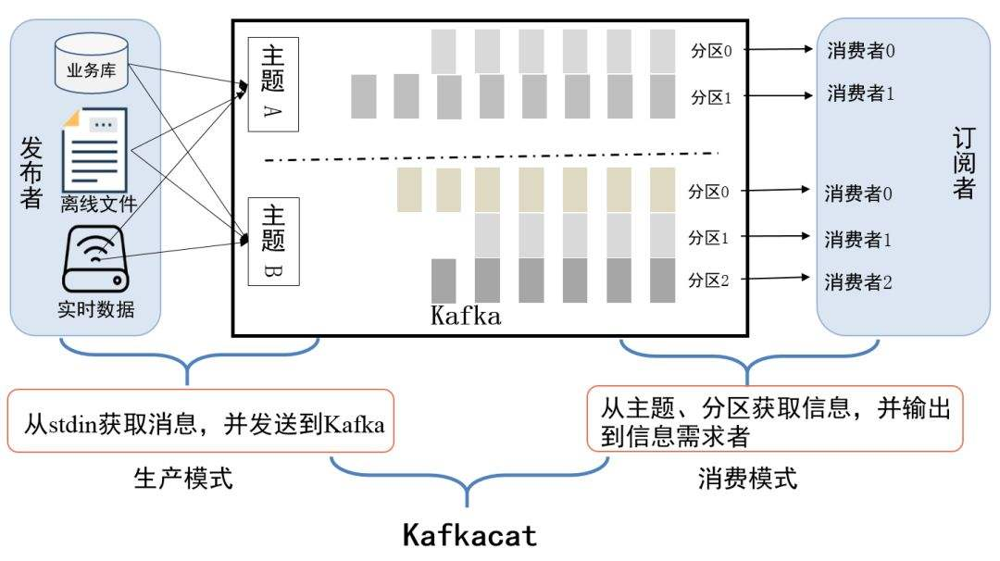

# 基本概念

## 体系结构

- producer：消息生存者,负责创建消息，投递kafka

- consumer：消息消费者，连接kafka接收消息，进而进行相应的业务逻辑处理、

- broker：kafka 集群的 server，(其实就是一台机器)负责处理消息读、写请求，存储消息

## 分区和主题

topic：主题（抽象概念），kafka消息以主题为单位进行归类，生产值将消息发送特定主题，消费者负责订阅主题进行消费

partition ：分区（物理概念），一个主题下可以有多个主题，**offset是分区的唯一表示，保证了消息的顺序性**

分区可以分布在不同的服务器上（**一个主题可以跨越多个broker**）