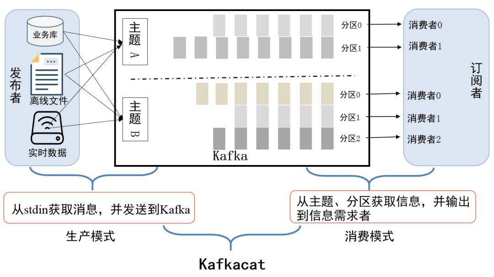

# 基本概念

## 体系结构


- producer：消息生存者,负责创建消息，投递kafka

- consumer：消息消费者，连接kafka接收消息，进而进行相应的业务逻辑处理、

- broker：kafka 集群的 server，(其实就是一台机器)负责处理消息读、写请求，存储消息

## 分区和主题

topic：主题（抽象概念），kafka消息以主题为单位进行归类，

​		     生产值将消息发送特定主题，消费者负责订阅主题进行消费

​			 代表一个类别，如果把Kafka看做为一个数据库，topic可以理解为数据库中的一张表，topic的名字即为表名  

partition ：分区（物理概念），一个主题下可以有多个主题，**offset是分区的唯一表示，保证了消息的顺序性**



分区可以分布在不同的服务器上（**一个主题可以跨越多个broker**）

# 安装

> 解压

```shell
-rw-r--r--. 1 root root 86486610 Oct  5 04:41 kafka_2.12-3.0.0.tgz
[root@node2 home]# tar -xzvf kafka_2.12-3.0.0.tgz 
```

> 加上可执行权限

```shell
[root@node2 bin]# cd ..
[root@node2 kafka_2.12-3.0.0]# chmod +x ./bin/*
```

> 修改配置文件

```shell
[root@node2 kafka_2.12-3.0.0]# vim config/server.properties
```

```properties
# 配置好brokerid，集群中，每台id都不一样
broker.id=0
## 这里说是日志，其实就是kafka的数据
log.dirs=/home/kafka/log

# 数据保存日期，默认是7天
log.retention.hours=168

## zookeeper地址
zookeeper.connect=node1:2181,node2:2181,node3:2181
```

> 启动

```shell
[root@node2 kafka_2.12-3.0.0]# nohup ./bin/kafka-server-start.sh  ./config/server.properties  > kafka.log 2>&1 &
[1] 7260
```

# 基本命令

> 创建一个topic

```shell
[root@node2 kafka]# ./bin/kafka-topics.sh --create --bootstrap-server localhost:9092 --replication-factor 1 --partitions 1 --topic mytest
Created topic mytest.
```

> 查看topic

```shell
[root@node2 kafka]# ./bin/kafka-topics.sh --list --bootstrap-server=127.0.0.1:9092
mytest

# 查看具体描述
[root@node2 kafka]# ./bin/kafka-topics.sh --describe --bootstrap-server=127.0.0.1:9092
Topic: mytest	TopicId: lHL_52IoSSWPJDRecdDctA	PartitionCount: 1	ReplicationFactor: 1	Configs: segment.bytes=1073741824
	Topic: mytest	Partition: 0	Leader: 0	Replicas: 0	Isr: 0

```

> 消费数据

```sh
 ./bin/kafka-console-consumer.sh --bootstrap-server localhost:9092 --from-beginning --topic my-replicated-topic
```