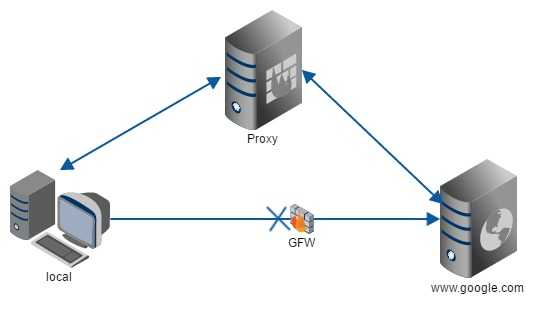

# 基本概念

正向代理隐藏真实客户端，反向代理隐藏真实服务端

- 正向代理

局域网中的客户端想访问外网，可以在客户端配置代理服务器通过代理服务器来访问



- 反向代理

客户端通过反向代理服务器，反向代理服务器转发到服务器，客户端并不知道代理服务器

# 安装

- 准备环境

```shell
#安装相关依赖
[root@node1 ~]# yum install gcc openssl-devel pcre-devel zlib-devel -y
#查看版本
[root@node1 ~]# pcre-config --version
8.32
# 为了linux的安全，创建nginx用户和用户组
[root@node1 ~]# groupadd -r nginx
# -M表示不创建用户的家目录
[root@node1 ~]# useradd -r -g nginx -M nginx
```

- 安装

```shell
##解压
[root@node1 home]# tar -zxvf nginx-1.16.1.tar.gz 
[root@node1 home]# mv nginx-1.16.1 nginx
[root@node1 home]# cd nginx
#检测你的安装平台的目标特征
[root@node1 nginx]# ./configure --user=nginx --group=nginx
# 编译安装
[root@node1 nginx]# make && make install
```

- 启动

```shell
#前往安装目录
[root@node1 nginx]# cd /usr/local/nginx/
#启动
[root@node1 nginx]# ./sbin/nginx 
[root@node1 nginx]# ps -ef | nginx
```

# 常用命令

```shell
## 查看版本号
[root@node1 sbin]# ./nginx -v
nginx version: nginx/1.16.1

## 启动n[root@node1 sbin]# ./nginx -s stop
[root@node1 sbin]# ./nginx
## 停止nginx
[root@node1 sbin]# ps -ef | grep nginxginx
[root@node1 sbin]# ./nginx -s stop
[root@node1 sbin]# ps -ef | grep nginx
# 重加载
[root@node1 sbin]# ./nginx -s reload
```

# 配置文件

nginx配置文件nginx.conf分三个模块

## 全局块

从配置文件开始，到配置文件events

```conf
#处理并发的数量
worker_processes  1;

```

## events

```conf
events {
	## 支持的最大连接数
    worker_connections  1024;
}

```

## http

### server块

# 反向代理

- 通过servername反向代理

让其访问192.168.1.134：80，能直接方向代理到192.168.1.134：8080服务

server name 为虚拟服务器的识别路径。因此不同的域名会通过请求头中的HOST字段，匹配到特定的server块，转发到对应的应用服务器中去。

```conf
 server {
     listen       80;
     server_name  192.168.1.134;

##添加proxy_pass配置
location / {
    root   html;
    proxy_pass http://192.168.1.134:8080;
    index  index.html index.htm;
}
```

在本地host配置www.zkh.com

在nginx上配置,访问www.zkh.com，发现进入的是nginx提示界面

```conf
server {
    listen  80;
    server_name www.zkh.com;
    location / {
             root   html;
            index  index.html index.htm;

     }
}
```

- 通过正则反向代理

访问：92.168.1.134:9001/test/index.html， 进入8080 的/test/index.html页面

~ 地址区分大小写

~* 地址不区分大小写

=  要求字符串严格匹配

```conf
server {
    listen  9001;
    server_name 192.168.1.134;
    location ~ /test/ {
       proxy_pass http://192.168.1.134:8080;
     }

    location ~ /edu/ {
       proxy_pass http://192.168.1.134:8001;
     }

}
```

# 负载均衡

- 在server外配置负载均衡的地址

```conf
upstream myserver {
        server 192.168.1.134:8080;
        server 192.168.1.134:8001;
}

    server {

```

- 在server内指向对应配置

```conf
server {
        listen       80;
        server_name  192.168.1.134;
   location / {
            root   html;
            proxy_pass http://myserver;
            index  index.html index.htm;
        }

```

- 访问<http://192.168.1.134/edu/index.html>，能够负载均衡的轮训访问服务

### 指定权重

```conf
upstream myserver {
        server 192.168.1.134:8080 weight=4;
        server 192.168.1.134:8001 weight=1;
}
```

### ip_hash

每个请求按照ip来分配，可以解决session问题

```conf
upstream myserver {
        ip_hash;
        server 192.168.1.134:8080;
        server 192.168.1.134:8001;
}
```

# 动静分离

当访问<http://192.168.1.134/image/>时，会列出下面的目录，**这是autoindex on;功能**

```conf
 location /www/ {
            root /data/;
        }

        location /image/ {
            root /data/;
            autoindex on;
        }

```

# 高可用

## 安装keepalived

两台机器都要安装

```shell
[root@localhost nginx]# yum install keepalived -y
##前往配置文件
[root@localhost nginx]# cd /etc/keepalived/
[root@localhost keepalived]# ls
keepalived.conf
```

### 配置文件

- global_defs：全局配置

- vrrp_instance

```conf
vrrp_instance VI_1 {
    state MASTER #主从，从：BACKUP
    interface eth0 # 网卡
    virtual_router_id 51 ##主备id必须相同
    priority 100 ## 优先级，主较大
    advert_int 1
    authentication {
        auth_type PASS
        auth_pass 1111
    }
    virtual_ipaddress {
        192.168.200.16 ## 虚拟ip
    }
}
```

### 配置步骤

- 整体配置文件

```conf
! Configuration File for keepalived

global_defs {
 #  notification_email {
 #    acassen@firewall.loc
 #    failover@firewall.loc
 #    sysadmin@firewall.loc
 #  }
 #  notification_email_from Alexandre.Cassen@firewall.loc
 #  smtp_server 192.168.200.1
 #  smtp_connect_timeout 30
   router_id LVS_DEVEL ## 注意host要配置主机名字
 #  vrrp_skip_check_adv_addr
 #  vrrp_strict
 #  vrrp_garp_interval 0
 #  vrrp_gna_interval 0
}
vrrp_script chk_nginx {
        script "/home/nginx_check.sh"
        interval 2
        weight -20
}
vrrp_instance VI_1 {
 state MASTER # 标识为主服务
    interface ens33 #绑定虚拟机的IP
    virtual_router_id 51 # 虚拟路由id，和从机保持一致
    #mcast_src_ip 192.168.126.2  #本机ip
    priority 100 #权重，需要高于从机
    advert_int 1
    authentication {
        auth_type PASS
        auth_pass 1111
    }
   track_script {
                chk_nginx ## 执行 Nginx 监控的服务
        }
    virtual_ipaddress {
        192.168.1.99
    }
}
```

- 心跳脚本

```shell
#!/bin/bash
counter=$(ps -C nginx --no-heading|wc -l)
if [ "${counter}" = "0" ]; then
    /usr/local/nginx/sbin/nginx
    sleep 2
    counter=$(ps -C nginx --no-heading|wc -l)
    if [ "${counter}" = "0" ]; then
        /etc/init.d/keepalived stop
    fi
fi

```


- 启动

```shell
[root@localhost keepalived]# systemctl start keepalived.service
```

