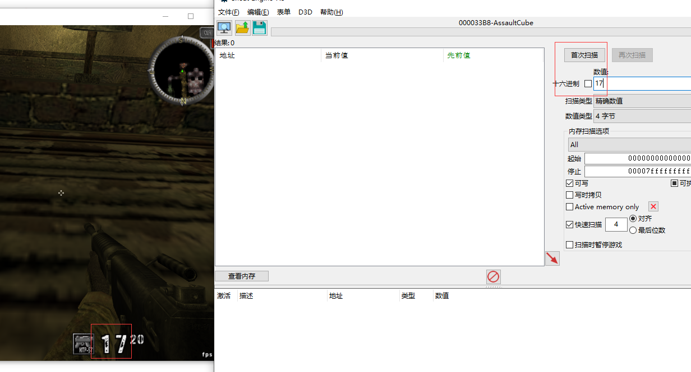
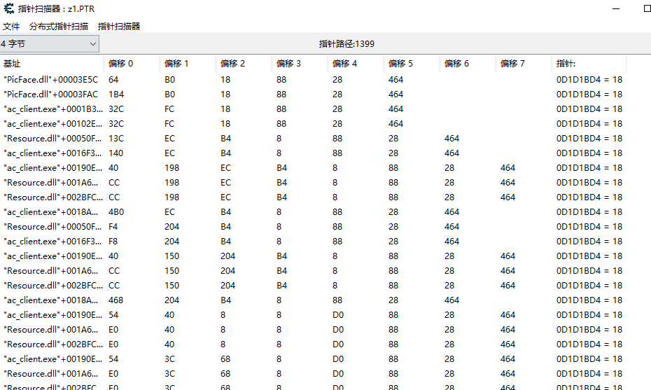

# CE

# 值地址寻找

## 精准数值寻找

如：我们看到血量17,输入17，精准数值选项，进行首次扫描

开一枪将子弹-1，在输入框输入16，进行<b id="blue">再次扫描</b>，如果有很多项，我们再开一枪，搜索15

## 模糊搜索

以一个坐标轴来距离，xy轴我们不知道正负增加减少，但是，z轴一般向上就是增加

1. 选择未知的值，进行首次扫描

2. 向上趴楼梯，再次扫描增加的值（我们不知道增加了多少）

3. 晃动鼠标，不要让z轴变动，扫描为改变的值，可以多扫描几次

4. 跳下去，搜减少的值

5. 重复上面的操作，让搜索到的数据减少
6. 直到这个值减少到个位数，我们将这些值拉下去，锁定某个值，操作坐标Z，看能不能动

# 基址寻找

## 推理寻找

避开pop push 等堆栈操作

1. 查找到某个值的地址，然后右键，点击<b id="blue">是什么访问了这个地址</b>，进入如下界面

2. 双击cmp操作，查看具体上下文的汇编操作，可以看到，当前的操作师比较操作，推测是子弹==0进行换弹，则可以知道[eax]表示子弹数，那么eax的地址指向了具体子弹，eax由esi+14解引用而来

3. esi的地址是00899798，点击<b id="blue">新的扫描</b>，用00899798地址16进制进行搜索，在搜索到的地址中，进行<b id="blue">是什么访问了这个地址</b>查询，找一个最简单的，有值的，比如如下，我们看到EBX=00899798，EBX=[ESI+364], esi=008A4108,

4. 继续执行新的扫描，查找008A4108

5. 点击确定后这个就是具体值，不过这个地址P表示指针，当我们重启游戏，发现使用基址寻找的数值还在，而内存寻找的已经指向未知了

## 指针扫描

用于我已经知道这个游戏大概这个数值偏移的值是多少，偏移的层数是多少

1. 找到我们子弹的地址，右键，扫描指针，然后选择填入偏移地址和偏移的层数（大概猜测），然后出现很多结果

2. 让自己子弹变化下，点击指针扫描器，重新扫描，因为我们的子弹当前是17，所以我们选择查找的值是17

3. 重新进入游戏，打开之前保存的文件，重新扫描子弹的值，我们得到这个基址

