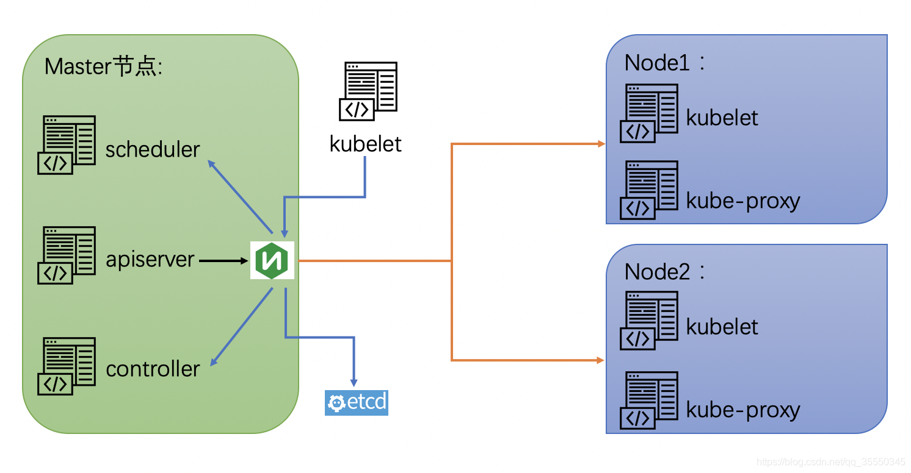

# 基础部分

## k8s功能

- 自动装箱
- 自动修复
- 水平拓展
- 负载均衡，服务发现
- 滚动更新
  - 加应用的时候，检测没有问题才进行服务

## k8s 的组件

- master（主控节点）
  - apiserver：对外统一入口，并负责接收、校验并响应所有的rest请求，结果状态被持久存储于etcd中
  - scheduler：节点调度，选择可用的节点，进行应用部署
  - controller manager：处理集群常规后台任务，一个资源对应一个controller，
  - etcd：保存了整个集群的状态
- node（工作节点）
  - kubelet：管理node节点的容器状态（生命周期）
  - kube-proxy：提供网络代理，提供负载均衡功能



## 核心概念

- Prod
  - 最小部署单元
  - 一组容器的集合
  - 他们共享网络
  - 生命周期是短暂的
- contoller
- service
  - 定义一组prod的访问规则

# 部署

## kubeadmin方式

- 准备三台服务器， master， node1, node2

- 系统初始化操作（除特点说明，其他都要在三台服务器执行）

```shell
	## 三台服务器关闭防火墙
[root@localhost ~]# systemctl stop firewalld
[root@localhost ~]# systemctl disable firewalld.service 
## 关闭selinux
sed -i 's/enforcing/disabled/' /etc/selinux/config
## 判断是否关闭
[root@k8sm ~]# getenforce
Disabled


## 关闭 swap
sed -ri 's/.*swap.*/#&/' /etc/fstab  
## 设置规划主机名
[root@localhost ~]# hostnamectl set-hostname k8smaster
# 查看
[root@localhost ~]# hostname
k8smaster
# 在master节点上添加host（需要与修改的hostname一致）
cat >> /etc/hosts <<EOF 
192.168.1.140 k8smaster
192.168.1.141 k8snode1
192.168.1.142 k8snode2
EOF
## 对网络进行设置
##将桥接的IPV4流量传递到iptables的链
cat >> /etc/sysctl.d/k8s.conf <<EOF
net.bridge.bridge-nf-call-ip6tables = 1
net.bridge.bridge-nf-call-iptables = 1
EOF
# 生效
[root@localhost ~]# sysctl --system

##时间同步
[root@localhost ~]# yum install ntpdate -y
[root@localhost ~]# ntpdate ntp1.aliyun.com
```

- 安装docker
  - 安装yum install -y docker-ce-18.06.3.ce-3.el7版本
- 设置k8s的阿里源

```shell
cat <<EOF > /etc/yum.repos.d/kubernetes.repo
[kubernetes]
name=Kubernetes
baseurl=http://mirrors.aliyun.com/kubernetes/yum/repos/kubernetes-el7-x86_64
enabled=1
gpgcheck=0
repo_gpgcheck=0
gpgkey=http://mirrors.aliyun.com/kubernetes/yum/doc/yum-key.gpg
       http://mirrors.aliyun.com/kubernetes/yum/doc/rpm-package-key.gpg
EOF
```

- 安装k8s

```shell
# 搜索各个版本的k8s
[root@k8snode2 ~]# yum search kubelet --showduplicates | sort -r
[root@k8snode2 ~]# yum install -y kubelet-1.18.0 kubeadm-1.18.0 kubect1-1.18.0
#开机启动
[root@k8smaster ~]# systemctl enable kubelet
```

- 部署k8s master(在master节点上执行)（192.168.1.140执行）
  - 当前节点ip
  - 使用阿里云镜像（从阿里云拉取很多组件镜像）
  - 指定版本
  - 连接访问的ip（不冲突就行）

```shell
kubeadm init \
--apiserver-advertise-address=192.168.1.140 \
--image-repository registry.aliyuncs.com/google_containers \
--kubernetes-version v1.18.0 \
--service-cidr=10.96.0.0/12 \
--pod-network-cidr=10.244.0.0/16
```

出现类似警告

detected "cgroupfs" as the Docker cgroup driver

需要修改docker

```shell
vim /etc/docker/daemon.json
##追加内容
{
 "exec-opts":["native.cgroupdriver=systemd"]
}
##生效
systemctl restart docker
systemctl status docker
```

可以在master节点上查看images

```shell
[root@k8smaster ~]# docker images
```

在master部署k8s成功后，我们看到如下图


- 使用kubectl工具
  - 执行途中的mkdir命令

```shell
mkdir -p $HOME/.kube
sudo cp -i /etc/kubernetes/admin.conf $HOME/.kube/config
sudo chown $(id -u):$(id -g) $HOME/.kube/config
```

```shell
##查看节点
[root@k8smaster ~]# kubectl get nodes
NAME        STATUS     ROLES    AGE     VERSION
k8smaster   NotReady   master   6m46s   v1.18.0
```

- 将node加入k8smaster中
  - 在另外两个node执行图中命令

```shell
kubeadm join 192.168.1.140:6443 --token e21hc2.oeigv6v2appxkh6c \
    --discovery-token-ca-cert-hash sha256:e46f08a3df79c9548ba8d1a75b2bb10ec3e6b7a40af361ccd9c878342919c994
```

```shell
##此时查看node加入了
[root@k8smaster ~]# kubectl get nodes
NAME        STATUS     ROLES    AGE     VERSION
k8smaster   NotReady   master   9m27s   v1.18.0
k8snode1    NotReady   <none>   45s     v1.18.0
k8snode2    NotReady   <none>   37s     v1.18.0

```

默认token有效期为24小时，当过期之后，该token就不可用了。这时就需要重新创建token，操作如下:

```shell
kubeadm token create --print-join-command
```

- 部署CNI网络插件(master节点)

```shell
[root@k8smaster ~]# kubectl apply -f https://raw.githubusercontent.com/coreos/flannel/master/Documentation/kube-flannel.yml
## 查看pods有没有运行
[root@k8smaster ~]# kubectl get pods -n kube-system
##如果查看到有那个pods运行异常，可以下载镜像
 docker pull quay.io/coreos/flannel:v0.12.0-amd64
 ##之后重写加载插件
 kubectl apply -f https://raw.githubusercontent.com/coreos/flannel/master/Documentation/kube-flannel.yml
```

- 重写查看节点，正常

```shell'
[root@k8smaster ~]# kubectl get nodes
NAME        STATUS   ROLES    AGE   VERSION
k8smaster   Ready    master   11h   v1.18.0
k8snode1    Ready    <none>   11h   v1.18.0
k8snode2    Ready    <none>   11h   v1.18.0

```

- 测试k8s集群

在k8szhogn 创建一个pod，验证是否正常运行

```shell
## 拉取nginx镜像
[root@k8smaster ~]# kubectl create deployment nginx --image=nginx
deployment.apps/nginx created
##等到nginx运行之后，对外暴露端口
[root@k8smaster ~]# kubectl get pod
NAME                    READY   STATUS    RESTARTS   AGE
nginx-f89759699-nrg87   1/1     Running   0          77s
##
[root@k8smaster ~]# kubectl expose deployment nginx --port=80 --type=NodePort
service/nginx exposed
```

```shell
##查看nginx对外端口 31303
[root@k8smaster ~]#  kubectl get pod,svc
NAME                        READY   STATUS    RESTARTS   AGE
pod/nginx-f89759699-nrg87   1/1     Running   0          4m7s

NAME                 TYPE        CLUSTER-IP      EXTERNAL-IP   PORT(S)        AGE
service/kubernetes   ClusterIP   10.96.0.1       <none>        443/TCP        13h
service/nginx        NodePort    10.110.148.58   <none>        80:31303/TCP   76s
```

访问：http://192.168.1.140:31303/

## 二进制搭建集群

### 准备三台服务器

1. 如上准备环境（初始化系统）

2. 安装下epel源

```shell
yum install epel-release
## 编辑repo，将注释的base放出来，metalink注释
[root@k8sn1 opt]# vim /etc/yum.repos.d/epel.repo
```

3. DNS初始化

   1. 安装bind9软件

   ```shell
   # 在master上安装
   [root@k8sm ~]# yum install bind -y
   # 查看版本
   [root@k8sm ~]# rpm -qa bind
   bind-9.11.4-26.P2.el7_9.2.x86_64
   ```

   2. 编辑配置文件

   ```shell
   [root@k8sm ~]# vim /etc/named.conf
   ## 更改监听地址为本机地址
   listen-on port 53 { 192.168.1.143; };
   ## 更改哪些客户端能查询这个DNS解析（任何都可以）
   allow-query     { any; };
   ## 新增上级DNS, 意思就是这个DNS没有查询到，到上级查询
   forwarders      { 202.96.128.86; };
   ##DNS采用递归的算法
    recursion yes;
   ```

   3. 检查配置，没有报错就是正常

   ```shell
   [root@k8sm ~]# named-checkconf
   ```

   4. 配置域

   ```shell
   [root@k8sm ~]# vim /etc/named.rfc1912.zones
   ## 添加域（允许本机update）
   zone "host.com" IN {
           type master;
           file "host.com.zone";
           allow-update { 192.168.1.143; };
   };
   
   # 创建区域文件
   [root@k8sm ~]# vim /var/named/host.com.zone
   
   $ORIGIN host.com.
   $TTL 86400
   @ IN SOA dns.host.com. dnsadmin.host.cncom (
   20201206901;Serial（修改需要修改这个，否则不同步，一般以时间+次数）
   3H;Refresh
   15M;Retry
   1W;Expire
   1D;Minimum
   )
    IN NS dns.host.com.
   dns IN A 192.168.1.143
   m IN A 192.168.1.143
   n1 IN A 192.168.1.144
   n2 IN A 192.168.1.145
   
   ## 检查配置文件
   [root@k8sm ~]# named-checkzone "host.com" /var/named/host.com.zone 
   zone host.com/IN: loaded serial 20201206
   OK
   
   ```

   5. 启动并检查

   ```shell
   [root@k8sm ~]# systemctl start named
   [root@k8sm ~]# netstat -npl | grep 53
   
   ## 安装DNS检测工具
   yum install bind-utils
   ## 检测dns
   ## A 记录  主机域  自建的dns
   [root@k8sm ~]# dig -t A n1.host.com @192.168.1.143 +short
   
   ```

   6. 使用dns

   ```shell
   [root@k8sm ~]# vim /etc/sysconfig/network-scripts/ifcfg-ens33
   DNS1=192.168.1.143
   #重启
   [root@k8sm ~]# systemctl restart network
   ## 查看
   [root@k8sm ~]# cat /etc/resolv.conf 
   # Generated by NetworkManager
   nameserver 192.168.1.143
   [root@k8sm ~]# ping m.host.com
   ```

   7. 其他两个都修改新的DNS

### 准备签发证书环境

1. master上

2. 安装CFSSL

```shell
[root@k8sm ~]# wget https://pkg.cfssl.org/R1.2/cfssl_linux-amd64 -O /usr/bin/cfssl
[root@k8sm bin]# wget https://pkg.cfssl.org/R1.2/cfssljson_linux-amd64 -O /usr/bin/cfssl-json
[root@k8sm bin]# wget https://pkg.cfssl.org/R1.2/cfssl-certinfo_linux-amd64 -O /usr/bin/cfssl-certinfo
```

```shell
[root@k8sm bin]# ll /usr/bin/cfssl*
-rw-r--r-- 1 root root 10376657 Mar 29  2016 /usr/bin/cfssl
-rw-r--r-- 1 root root  6595195 Mar 29  2016 /usr/bin/cfssl-certinfo
-rw-r--r-- 1 root root  2277873 Mar 29  2016 /usr/bin/cfssl-json
```

```shell
# 授予可执行权限
[root@k8sm bin]# chmod +x /usr/bin/cfssl*
# 检查
[root@k8sm bin]# which cfssl
/usr/bin/cfssl
[root@k8sm bin]# which cfssl-json 
/usr/bin/cfssl-json
[root@k8sm bin]# which cfssl-certinfo 
/usr/bin/cfssl-certinfo

```

### 签发CA证书

1. 开始签发证书

```shell
[root@k8sm opt]# mkdir certs
```

2. 创建ca请求文件
   1. CN: 浏览器使用该字段验证网站是否合法，一般是域名
   2. key: 加密算法和长度
   3. O:组织
   4. OU： 单位
   5. expiry: 过期时间

```shell
cat > ca-csr.json <<EOF
{
  "CN": "host.com",
  "hosts": [],
  "key": {
    "algo": "rsa",
    "size": 2048
  },
  "names": [
    {
      "C": "CN",
      "L": "BeiJing",
      "ST": "BeiJing",
      "O": "system:m",
      "OU": "System"
    }
  ],
  "ca":{
  	"expiry": "175200h"
  }
}
EOF
```

3. 签发证书

```shell
[root@k8sm certs]# cfssl gencert -initca ca-csr.json | cfssl-json -bare ca
2020/12/06 08:03:57 [INFO] generating a new CA key and certificate from CSR
2020/12/06 08:03:57 [INFO] generate received request
2020/12/06 08:03:57 [INFO] received CSR
2020/12/06 08:03:57 [INFO] generating key: rsa-2048
2020/12/06 08:03:57 [INFO] encoded CSR
2020/12/06 08:03:57 [INFO] signed certificate with serial number 463094640636714033430782087311472842531612561820
```

```shell
##  ca.pem 根证书
## ca-key.pem 根证书的私钥
[root@k8sm certs]# ll
total 16
-rw-r--r-- 1 root root 1005 Dec  6 08:03 ca.csr
-rw-r--r-- 1 root root  262 Dec  6 07:59 ca-csr.json
-rw------- 1 root root 1675 Dec  6 08:03 ca-key.pem
-rw-r--r-- 1 root root 1367 Dec  6 08:03 ca.pem
```

### 部署etcd集群

etcd是分布式键值存储系统，k8s使用他存储，所以首先搭建etcd数据库，使用3台集群，则可以容忍1台故障

1. 签发证书
   1. 建立生成证书的配置文件
   2. ca-config.json：可以定义多个 profiles，分别指定不同的参数；后续在签名证书时使用某个profile；
      signing：表示该证书可用于签名其它证书；生成的 ca.pem 证书中 CA=TRUE；
      server auth：表示client可以用该 CA 对server提供的证书进行验证；
      client auth：表示server可以用该CA对client提供的证书进行验证；
      profiles 中的 **peer**是后面cfssl gencert 命令值profiles 指定的值，要相互对应。

```shell
cat >/opt/certs/ca-config.json <<EOF
{
    "signing": {
        "default": {
            "expiry": "175200h"
        },
        "profiles": {
            "server": {
                "expiry": "175200h",
                "usages": [
                    "signing",
                    "key encipherment",
                    "server auth"
                ]
            },
            "client": {
                "expiry": "175200h",
                "usages": [
                    "signing",
                    "key encipherment",
                    "client auth"
                ]
            },
            "peer": {
                "expiry": "175200h",
                "usages": [
                    "signing",
                    "key encipherment",
                    "server auth",
                    "client auth"
                ]
            }
        }
    }
} 
EOF
```

2. 创建etcd的证书的请求文件
   1. host表示将来需要部署etcd的服务器ip
   2. 如果服务器变了，则需要重新签发证书

```shell
cat >/opt/certs/etcd-peer-csr.json <<EOF
{
    "CN": "k8s-etcd",
    "hosts": [
        "192.168.1.143",
        "192.168.1.144",
        "192.168.1.145"
    ],
    "key": {
        "algo": "rsa",
        "size": 2048
    },
    "names": [
        {
            "C": "CN",
            "ST": "beijing",
            "L": "beijing",
            "O": "laoxiao",
            "OU": "ops"
        }
    ]
}
EOF
```

3. 生成证书

```shell
## 先生成证书看一下
[root@k8sm certs]# cfssl gencert -ca=ca.pem -ca-key=ca-key.pem -config=ca-config.json -profile=peer etcd-peer-csr.json
## 通过管道符进行生成
[root@k8sm certs]# cfssl gencert -ca=ca.pem -ca-key=ca-key.pem -config=ca-config.json -profile=peer etcd-peer-csr.json | cfssl-json -bare etcd-peer

[root@k8sm certs]# ll
total 36
-rw-r--r-- 1 root root  837 Dec  9 10:22 ca-config.json
-rw-r--r-- 1 root root 1005 Dec  6 08:03 ca.csr
-rw-r--r-- 1 root root  262 Dec  6 07:59 ca-csr.json
-rw------- 1 root root 1675 Dec  6 08:03 ca-key.pem
-rw-r--r-- 1 root root 1367 Dec  6 08:03 ca.pem
-rw-r--r-- 1 root root 1062 Dec  9 10:29 etcd-peer.csr
-rw-r--r-- 1 root root  359 Dec  9 10:23 etcd-peer-csr.json
-rw------- 1 root root 1679 Dec  9 10:29 etcd-peer-key.pem
-rw-r--r-- 1 root root 1436 Dec  9 10:29 etcd-peer.pem

```

4. 创建一个没有家目录不需要登录的etcd用户

```shell
[root@k8sm certs]# useradd -s /sbin/nologin -M etcd
## 查看下etcd用户的信息
[root@k8sm certs]# id etcd
uid=1000(etcd) gid=1000(etcd) groups=1000(etcd)

```

5. 下载etcd的软件

https://repo.huaweicloud.com/etcd/v3.1.20/

```shell
[root@k8sm src]# wget https://repo.huaweicloud.com/etcd/v3.1.20/etcd-v3.1.20-linux-amd64.tar.gz

## 解压
[root@k8sm src]# tar xvf etcd-v3.1.20-linux-amd64.tar.gz -C /opt/
## 做一个软连接
[root@k8sm opt]# ln -s /opt/etcd-v3.1.20-linux-amd64 /opt/etcd

[root@k8sm opt]# cd etcd
[root@k8sm etcd]# ll
total 30108
drwxr-xr-x 11 478493 89939     4096 Oct 10  2018 Documentation
-rwxr-xr-x  1 478493 89939 16406432 Oct 10  2018 etcd
-rwxr-xr-x  1 478493 89939 14327712 Oct 10  2018 etcdctl
-rw-r--r--  1 478493 89939    32632 Oct 10  2018 README-etcdctl.md
-rw-r--r--  1 478493 89939     5878 Oct 10  2018 README.md
-rw-r--r--  1 478493 89939     7892 Oct 10  2018 READMEv2-etcdctl.md

```

6. 创建目录和迁移证书（三台服务器）

```shell
#创建etdc的目录
[root@k8sm etcd]# mkdir -p /opt/etcd/certs /data/etcd /data/logs/etcd-server
## 将三个证书拷贝到对应目录下
[root@k8sm etcd]# cp /opt/certs/ca.pem /opt/etcd/certs/
[root@k8sm etcd]# cp /opt/certs/etcd-peer-key.pem /opt/etcd/certs/
[root@k8sm etcd]# cp /opt/certs/etcd-peer.pem /opt/etcd/certs/
[root@k8sm etcd]# ls /opt/etcd/certs/
ca.pem  etcd-peer-key.pem  etcd-peer.pem
```

7. 创建etcd启动脚本

主要name 要每台服务器都不相同

```shell
cat >/opt/etcd/etcd-server-startup.sh <<'EOF'
#!/bin/sh
./etcd \
    --name etcd-server-143 \
    --data-dir /data/etcd/etcd-server \
    --listen-peer-urls https://192.168.1.143:2380 \
    --listen-client-urls https://192.168.1.143:2379,http://127.0.0.1:2379 \
    --quota-backend-bytes 8000000000 \
    --initial-advertise-peer-urls https://192.168.1.143:2380 \
    --advertise-client-urls https://192.168.1.143:2379,http://127.0.0.1:2379 \
    --initial-cluster  etcd-server-143=https://192.168.1.143:2380,etcd-server-144=https://192.168.1.144:2380,etcd-server-145=https://192.168.1.145:2380 \
    --ca-file ./certs/ca.pem \
    --cert-file ./certs/etcd-peer.pem \
    --key-file ./certs/etcd-peer-key.pem \
    --client-cert-auth  \
    --trusted-ca-file ./certs/ca.pem \
    --peer-ca-file ./certs/ca.pem \
    --peer-cert-file ./certs/etcd-peer.pem \
    --peer-key-file ./certs/etcd-peer-key.pem \
    --peer-client-cert-auth \
    --peer-trusted-ca-file ./certs/ca.pem \
    --log-output stdout
EOF
[root@hdss7-12 ~]# chmod +x /opt/etcd/etcd-server-startup.sh
## 更改属主
[root@k8sm certs]# chown -R etcd:etcd /opt/etcd-v3.1.20-linux-amd64/
[root@k8sm opt]# chown -R etcd:etcd /data/etcd/
[root@k8sm opt]# chown -R etcd:etcd /data/logs/etcd-server/

```

参数说明

| 参数               | 使用说明           |
| :----------------- | :----------------- |
| --name etcd0       | 本member的名字     |
| data-dir           | etcd的数据目录     |
| listen-peer-urls   | etcd的内部通信地址 |
| listen-client-urls | etcd的外部访问     |
| initial-cluster    | etcd名字+地址      |

8. 安装supervisord

因为etcd是后台启动的，如果掉了可以重启

```shell
## 安装supervisor
[root@k8sm ~]# yum install supervisor -y
[root@k8sm ~]# systemctl start supervisord
[root@k8sm ~]# systemctl enable supervisord
```

创建etcd的启动文件

```shell
cat >/etc/supervisord.d/etcd-server.ini <<EOF
[program:etcd-server]  ; 显示的程序名,类型my.cnf,可以有多个
command=sh /opt/etcd/etcd-server-startup.sh
numprocs=1             ; 启动进程数 (def 1)
directory=/opt/etcd    ; 启动命令前切换的目录 (def no cwd)
autostart=true         ; 是否自启 (default: true)
autorestart=true       ; 是否自动重启 (default: true)
startsecs=30           ; 服务运行多久判断为成功(def. 1)
startretries=3         ; 启动重试次数 (default 3)
exitcodes=0,2          ; 退出状态码 (default 0,2)
stopsignal=QUIT        ; 退出信号 (default TERM)
stopwaitsecs=10        ; 退出延迟时间 (default 10)
user=etcd              ; 运行用户
redirect_stderr=true   ; 是否重定向错误输出到标准输出(def false)
stdout_logfile=/data/logs/etcd-server/etcd.stdout.log
stdout_logfile_maxbytes=64MB  ; 日志文件大小 (default 50MB)
stdout_logfile_backups=4      ; 日志文件滚动个数 (default 10)
stdout_capture_maxbytes=1MB   ; 设定capture管道的大小(default 0)
;子进程还有子进程,需要添加这个参数,避免产生孤儿进程
killasgroup=true
stopasgroup=true
EOF
```

启动服务并且查看

```shell
[root@k8sm ~]# supervisorctl update
etcd-server: added process group
[root@k8sm ~]# supervisorctl status
etcd-server                      STARTING
```

8. 其他节点部署，
9. 查看集群状态

```shell
[root@k8sm etcd]# ./etcdctl cluster-health
member 4b1aa1dd24c2ff5e is healthy: got healthy result from http://127.0.0.1:2379
member 8fafbca53d201e6a is healthy: got healthy result from http://127.0.0.1:2379
member ee2517de2ebc109c is healthy: got healthy result from http://127.0.0.1:2379
cluster is healthy
## 查看节点的主从状态
[root@k8sm etcd]# ./etcdctl member list
```


### 为apiserver自签证书

- 采用可信用ip列表

server-csr.json 这个文件是master使用的

```shell
[root@k8sm ssl]# pwd
/home/ssl
[root@k8sm ssl]# cat server-csr.json 
```

这些地址就是可信用的ip列表

```shell
[root@k8sm ssl]# cat  server-csr.json 
{
    "CN": "kubernetes",
    "hosts": [
      "10.0.0.1",
  "127.0.0.1",
  "kubernetes",
  "kubernetes.default",
  "kubernetes.default.svc",
  "kubernetes.default.svc.cluster",
  "kubernetes.default.svc.cluster.local",
      "192.168.1.143",
      "192.168.1.144",
      "192.168.1.145"
    ],
    "key": {
        "algo": "rsa",
        "size": 2048
    },

```

执行命令生成server相关证书(ps:上面已经生成了)

```shell
cfssl gencert -ca=ca.pem -ca-key=ca-key.pem -config=ca-config.json -profile=kubernetes server-csr.json | cfssljson -bare server
```


### 部署master组件

1. 从这个地址下载

https://gitee.com/mirrors/Kubernetes/blob/master/CHANGELOG/CHANGELOG-1.19.md

对应版本（1.19），下载[Server binaries](https://gitee.com/mirrors/Kubernetes/blob/master/CHANGELOG/CHANGELOG-1.19.md#server-binaries)中的[kubernetes-server-linux-amd64.tar.gz](https://dl.k8s.io/v1.19.4/kubernetes-server-linux-amd64.tar.gz)

ps：可以去华为镜像源中下载

2. 进入此目录获取相关文件

```shell
[root@k8sm k8s]# pwd
/opt/k8s
[root@k8sm k8s]# cp /home/kubernetes/server/bin/{kube-scheduler,kube-apiserver,kube-controller-manager,kubectl} bin/
## 检查
[root@k8sm k8s]# ls bin/
etcd  etcdctl  kube-apiserver  kube-controller-manager  kubectl  kube-scheduler

```

3. 复制证书到ssl中

将之前etcd生成的pem证书cp到对应目录

```shell
[root@k8sm ssl]# cp *.pem /opt/k8s/ssl/
```


3. 配置文件
   - KUBE_APISERVER_OPTS：日志
   - etcd-servers：etcd集群地址
   - bind-address：当前监听地址
   - secure-port：https端口
   - enable-bootstrap-token-auth：为同组中自动授权

```shell
cat > /opt/k8s/conf/kube-apiserver.conf << EOF
KUBE_APISERVER_OPTS="--logtostderr=false \
--v=2 \
--log-dir=/opt/k8s/logs \
--etcd-servers=https://192.168.1.143:2379,https://192.168.1.144:2379,https://192.168.1.145:2379 \
--bind-address=192.168.1.143 \
--secure-port=6443 \
--advertise-address=192.168.1.143 \
--allow-privileged=true \
--service-cluster-ip-range=10.0.0.0/24 \
--enable-admission-plugins=NamespaceLifecycle,LimitRanger,ServiceAccount,ResourceQuota,NodeRestriction \
--authorization-mode=RBAC,Node \
--enable-bootstrap-token-auth=true \
--token-auth-file=/opt/k8s/conf/token.csv \
--service-node-port-range=30000-32767 \
--kubelet-client-certificate=/opt/k8s/ssl/server.pem \
--kubelet-client-key=/opt/k8s/ssl/server-key.pem \
--tls-cert-file=/opt/k8s/ssl/server.pem \
--tls-private-key-file=/opt/k8s/ssl/server-key.pem \
--client-ca-file=/opt/k8s/ssl/ca.pem \
--service-account-key-file=/opt/k8s/ssl/ca-key.pem \
--etcd-cafile=/opt/k8s/ssl/ca.pem \
--etcd-certfile=/opt/k8s/ssl/server.pem  \
--etcd-keyfile=/opt/k8s/ssl/server-key.pem \
--audit-log-maxage=30 \
--audit-log-maxbackup=3 \
--audit-log-maxsize=100 \
--audit-log-path=/opt/k8s/logs/k8s-audit.log"
EOF
```

```shell
cat > /opt/k8s/conf/kube-controller-manager.conf << EOF
KUBE_CONTROLLER_MANAGER_OPTS="--logtostderr=false \
--v=2 \
--log-dir=/opt/k8s/logs \
--leader-elect=true \
--master=127.0.0.1:8080 \
--address=127.0.0.1 \
--allocate-node-cidrs=true \
--cluster-cidr=10.244.0.0/16 \
--service-cluster-ip-range=10.0.0.0/24 \
--cluster-signing-cert-file=/opt/k8s/ssl/ca.pem \
--cluster-signing-key-file=/opt/k8s/ssl/ca-key.pem \
--root-ca-file=/opt/k8s/ssl/ca.pem \
--service-account-private-key-file=/opt/k8s/ssl/ca-key.pem \
--experimental-cluster-signing-duration=87600h0m0s"
EOF
```

```shell
cat > /opt/k8s/conf/kube-scheduler.conf << EOF
KUBE_SCHEDULER_OPTS="--logtostderr=false \
--v=2 \
--log-dir=/opt/k8s/logs \
--leader-elect \
--master=127.0.0.1:8080 \
--address=127.0.0.1"
EOF
```


5. 自启脚本

```shell
cat > /usr/lib/systemd/system/kube-apiserver.service << EOF
[Unit]
Description=Kubernetes API Server
Documentation=https://github.com/kubernetes/kubernetes

[Service]
EnvironmentFile=/opt/k8s/conf/kube-apiserver.conf
ExecStart=/opt/k8s/bin/kube-apiserver $KUBE_APISERVER_OPTS
Restart=on-failure

[Install]
WantedBy=multi-user.target
EOF
```

```shell
cat > /usr/lib/systemd/system/kube-controller-manager.service << EOF
[Unit]
Description=Kubernetes Controller Manager
Documentation=https://github.com/kubernetes/kubernetes

[Service]
EnvironmentFile=/opt/k8s/conf/kube-controller-manager.conf
ExecStart=/opt/k8s/bin/kube-controller-manager $KUBE_CONTROLLER_MANAGER_OPTS
Restart=on-failure

[Install]
WantedBy=multi-user.target
EOF
```

```shell
cat > /usr/lib/systemd/system/kube-scheduler.service << EOF
[Unit]
Description=Kubernetes Scheduler
Documentation=https://github.com/kubernetes/kubernetes

[Service]
EnvironmentFile=/opt/k8s/conf/kube-scheduler.conf
ExecStart=/opt/k8s/bin/kube-scheduler $KUBE_SCHEDULER_OPTS
Restart=on-failure

[Install]
WantedBy=multi-user.target
EOF
```

6. 在conf目录下生成token

```shell
echo "`head -c 16 /dev/urandom | od -An -t x | tr -d ' '`,kubelet-bootstrap,10001,\"system:kubelet-bootstrap\"" > token.csv
```


6. 启动

```shell
[root@k8sm conf]# systemctl start kube-apiserver
#查看进程
[root@k8sm logs]# ps -ef | grep k8s
#设置开机自启
[root@k8sm logs]# for i in $(ls /opt/k8s/bin);do systemctl enable $i;done
```

ps:如果报错发现日志，可以查看系统日志

```shell
cat /var/log/messages|grep kube-apiserver|grep -i error
```

