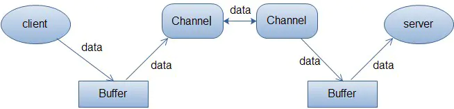
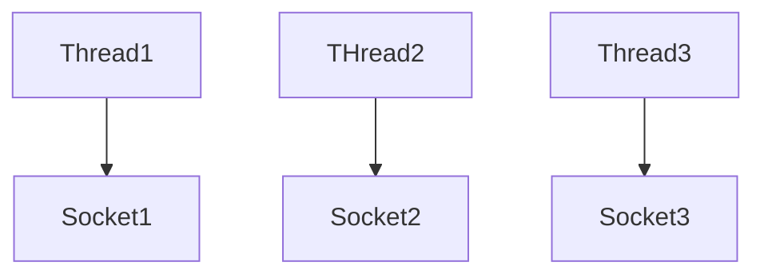
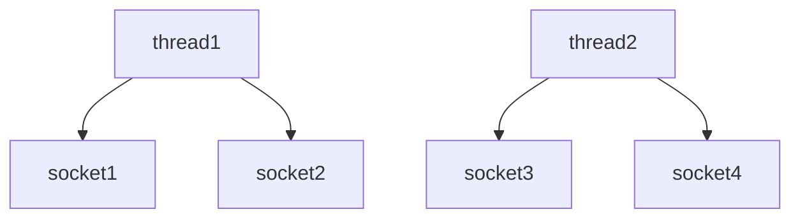
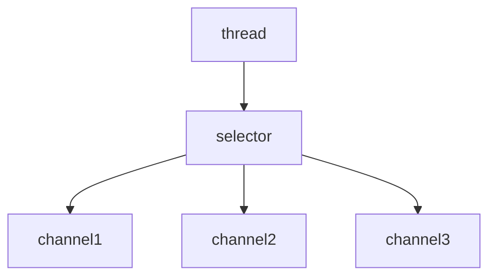
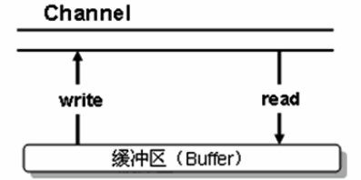
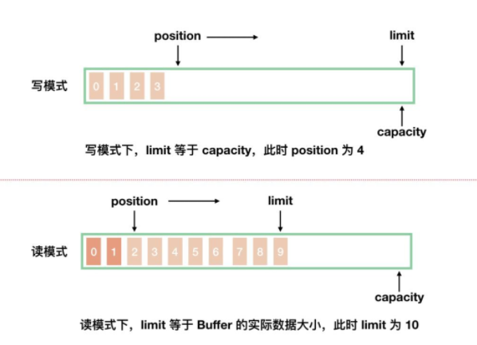

读写模式



# 网络编程变迁

## 多线程版

1. 一个线程对应一个socket
2. 当来了多个连接时建立多个线程进行连接



> 弊端

1. 内存占用高
2. 线程上下文切换成本高
3. 只适合连接数少的场景

## 线程池版

一个线程处理多个socket



> 弊端

1. 阻塞模式，一个线程只能在socket开始到结束阻塞执行，只能对接一个socket
2. 仅适合短连接场景

## Selector版

1. selector的作用就是配合一个线程来管理多个channel，获取这些channel上发生的事件
2. 当channel有事件（如：连接等一些）处理时，selector才让线程对接
3. 如果channel1 没有事件，可以让thread处理channel2的事件




# 三大组件

## Channel

> 简介

1. 读写的**双向通道**

2. 既可以从通道中读取数据，又可以写数据到通道。但流的读写通常是单向的

3. 通道中的数据总是要先读到一个Buffer，或者总是要往一个Buffer中写入




> 常见的channel

1. *FileChannel*用来对本地文件进行IO操作
2. *DatagramChannel* 常用于UDP的channel
3. *SocketChannel*/*ServerSocketChannel*TCP时的网络通道

> 读取

```java
int readBytes = channe1.read(buffer) ;
```

> 写入

写入的正确姿势:因为我们内存是有限的，所以，我们需要循环的从网络中读取数据，直到读完

```java
ByteBuffer buffer = ...;
buffer.put(...);//存入数据
buffer.flip();//切换读模式
while(buffer.hasRemaining()){
    channe1.write(buffer) ;
}
```

> channel的关闭

当关闭channel后，内部会去调用流的关闭

## Buffer

当向buffer写入数据时，buffer会记录下写了多少数据。

一旦要读取数据，需要通过flip()方法将Buffer从写模式切换到读模式。

在读模式下，可以读取之前写入到buffer的所有数据

> 以Intbuffer为例

*allocate*： 分配空间

*flip*: 转换操作

```java
//创建一个buffer，可以存放5个int
IntBuffer intBuffer = IntBuffer.allocate(5);
//将i设置进入buffer，将buffer塞满
for(int i=0; i<intBuffer.capacity(); i++){
    intBuffer.put(i);
}
//转化读操作
intBuffer.flip();
//判读是否还有数据
while (intBuffer.hasRemaining()) {
    log.info("取出数据：{}", intBuffer.get());
}
```

> 几个参数

```java
//标记
private int mark = -1;
//当前下标
private int position = 0;
//操作过程中，下标不能超过limit
//作用：读数据不能超过这个数，flip时，会将position赋值给limit
private int limit;
//容量
private int capacity;
```

参数解释

capacity: 相当于当前的容量，是不能超过的

limit：读模式下，当前具体存了多少数据， 写模式下，等于容量



> 创建的方式与**分配的内存**

*HeapByteBuffer*：受GC的影响

*DirectByteBuffer*：使用完以后，要合理的回收

```java
//class java.nio.HeapByteBuffer
//使用堆内存，读写效率低，受GC影响
ByteBuffer.allocate(5).getClass();
//class java.nio.DirectByteBuffer
//直接内存，读写效率高（少一次拷贝）
ByteBuffer.allocateDirect(5).getClass();    
```

> 读和存

*buffer#get(i)*：读取指定位置，读取后position不会变化

*buffer#rewind*：将position重置为0

*buffer#mark*: 记录当前position的位置，调用*buffer#reset*方法，将position重置到mark标记的位置

```java
ByteBuffer buffer = ByteBuffer.allocate(10);
//存入数据，也可以用 channel.read(buffer)
buffer.put(new byte[] {'a', 'b', 'c', 'd', 'e'});
buffer.flip();
buffer.get(new byte[4]);
//[pos=4 lim=5 cap=10]
//位置已经读取到了4位置
System.out.println(buffer);
//获取坐标1的数据，但是pos不会动
System.out.println((char)buffer.get(1));
//读取坐标重置
buffer.rewind();
System.out.println((char)buffer.get());
//标记当前位置
buffer.mark();
//中间做N个读取操作后，指针回到mark标记处
buffer.reset();
```

> 字符串和buffer转换

```java
//这些方式都是直接切换到读模式的

//将字符串直接读取成buffer
ByteBuffer buffer1 = StandardCharsets.UTF_8.encode("hello");
//将字符串先转为bytes，然后放入byteBuffer中
ByteBuffer buffer2 = ByteBuffer.wrap("hello".getBytes());

//将buffer读取成String
String str = StandardCharsets.UTF_8.decode(buffer1).toString;
```

> 正确使用姿势

1. 向buffer 写入数据，例如调用channel.read(buffer)
2. 调用flip()切换至读模式
3. 从buffer读取数据，例如调用buffer.get()
4. 读完之后，想要再写入，调用clear()或compact()切换至写模式（clear：position回到0索引位置， compact：把当前未读取的压缩）

## Selector

1. 一般称 为选择器 ,也可以翻译为 多路复用器 。

2. 它是用于检查一个或多个NIO Channel（通道）的状态是否处于可读、可写。如此可以实现单线程管理多个channels,也就是可以管理多个网络链接

3. 当有事件发生时，返回select Key 数组，通过selectKey可以获取对应channel

> 对应方法

```java
int select()：阻塞到至少有一个通道在你注册的事件上就绪了。
int select(long timeout)：和select()一样，但最长阻塞时间为timeout毫秒。
int selectNow()：非阻塞，只要有通道就绪就立刻返回。
```

```java
//获取有事件发生的key
Set selectedKeys = selector.selectedKeys();
//获取所有注册的key
Set<SelectionKey> keys = selector.keys();
```

> Selector Key

*SelectionKey.OP_ACCEPT*:有新的网络连接

*SelectionKey.OP_CONNECT*:连接已建立

*SelectionKey.OP_READ*: 读操作

*SelectionKey.OP_WRITE*:写操作

> 分散聚合

*分散*：我们读取一个文件，分多个bytebuffer去读取**一个文件**

*聚合*：将多个buffer聚合起来，写入一个文件中

> 读取文件编程步骤

1. ServerSocketChannel绑定服务器端口
2.  ServerSocketChannel注册selector，将selector与channel关联、
3.  SelectionKey 注册一个连接事件
4. 一个while循环，去获取事件
   1. 通过 selector.selectedKeys().iterator()获取所有事件的集合
   2. 发现一个事件，则进行处理

## 几个组件读取示例

> 文件读取

```java
File file = new File("d:\\1.txt");
FileInputStream fileInputStream = new FileInputStream(file);
FileChannel channel = fileInputStream.getChannel();
ByteBuffer buffer = ByteBuffer.allocate(10);
while (true) {
    //从管道中读取内容
    int read = channel.read(buffer);
    if(read == -1) {
        break;
    }
    //切换读模式
    buffer.flip();
    //查询是否还有数据没读
    while (buffer.hasRemaining()) {
        System.out.println(buffer.get());
    }
    //清空缓存区
    buffer.clear();
}
```

> 文件拷贝

1. 方式1

```java
public static void main(String[] args) throws Exception {
    FileInputStream input = new FileInputStream("E:\\1.avi");
    FileChannel channelSource = input.getChannel();
    FileOutputStream outputStream = new FileOutputStream("d:\\1.mp4");
    FileChannel channelTarget = outputStream.getChannel();
    ByteBuffer byteBuffer = ByteBuffer.allocate(5);
    while (true) {
        byteBuffer.clear();
        //从channel读取
        int read = channelSource.read(byteBuffer);
        if(read == -1){
            //读取完成
            break;
        }
        byteBuffer.flip();
        //写入channel中
        channelTarget.write(byteBuffer);
    }
    input.close();
    outputStream.close();
}
```

2. 方式二
   1. 一次，最多传输2g内容
   2. 想要优化，可以采用多次传输

*transferTo*：从一个channel读取到另一个channel

```java
try(FileChannel from = new FileInputStream("d:\\1.txt").getChannel();
    FileChannel to = new FileOutputStream("d:\\2.txt").getChannel();
) {
    //操作效率高，底层会调用0拷贝进行优化
    from.transferTo(0,from.size(), to);
} catch (Exception e) {
    e.printStackTrace();
}
```


# 黏包半包

## 问题的产生

网络发送三条数据

```tex
hello \n
world \n
zhangsang \n
```

结果接收的时候变成了下面的两条(黏包，半包)

```tex
hello\nworld\nzhan
gsang\n
```

# NIO编程

## 无Selector示例

- 可以看到，accept是阻塞的，read也是阻塞的
- 如果没有selector的配置，那么线程会一直阻塞，知道有连接产生，有数据发送

```java
ByteBuffer buffer = ByteBuffer.allocate(16);
try (ServerSocketChannel socketChannel = ServerSocketChannel.open();) {
    socketChannel.bind(new InetSocketAddress(80));
    while (true) {
        log.debug("连接中....");
        //连接的过程中是阻塞的，只有有连接了才会进行下一步操作
        SocketChannel channel = socketChannel.accept();
        log.debug("连接完成");
        //read的过程也是阻塞的
        channel.read(buffer);
        buffer.flip();
        log.debug("获取到客户端数据: {}", new String(buffer.array()));
        buffer.clear();
    }
} catch (Exception e) {
}
```

## 非阻塞模式

*socketChannel.configureBlocking(false)*将模式设置为非阻塞

- 当没有连接时，socketChannel.accept()返回为null
- read方法也变成非阻塞的，只有i>0时，表示有数据读取

```java
ByteBuffer buffer = ByteBuffer.allocate(16);
try (ServerSocketChannel socketChannel = ServerSocketChannel.open();) {
    socketChannel.bind(new InetSocketAddress(80));
    socketChannel.configureBlocking(false);
    while (true) {
        //连接的过程中不是是阻塞的
        SocketChannel channel = socketChannel.accept();
        if(ObjectUtil.isNotNull(channel)) {
            log.debug("连接完成");
            int i = channel.read(buffer);
            if(i>0) {
                buffer.flip();
                log.debug("获取到客户端数据: {}", new String(buffer.array()));
                buffer.clear();
            }
        }
    }
} catch (Exception e) {
}
```

## Selector版本

### 服务器端

*socketChannel.register*：将selector注册事件（如果想要这个channel当前selector接下来关注什么事件，就得先注册）

*sscKey.interestOps(SelectionKey.OP_ACCEPT)*： 指明当前这个key只关注连接事件

*selector.select*： 没有事件发生，就会阻塞（如果是带参的则在指定事件内等待）

*selector.selectedKeys()*: 获取所有的事件集合

*keys.remove()*: 为什么要remove? 因为如果当前处理的事件不删除，下次这个集合还会存在这个key，重复操作，所以，处理可事件后，还要往Iterator集合中删除当前key

*key.cancel()*： 如果selector不去处理事件，则下一次**selector.select**就不会阻塞，认为上一次事件没有执行

```java
ServerSocketChannel socketChannel = ServerSocketChannel.open();
Selector selector = Selector.open();
//绑定一个服务器监听端口
socketChannel.bind(new InetSocketAddress(7070));
//设置为非阻塞
socketChannel.configureBlocking(false);
//将selector与channel关联
//SelectionKey: 之后发生的事件都集中这里
SelectionKey sscKey = socketChannel.register(selector, 0, null);
//注册一个连接事件
sscKey.interestOps(SelectionKey.OP_ACCEPT);
//循环获取连接事件
while (true) {
    //1s没有获取到事件就重新获取
    if(selector.select(1000) == 0) {
        //System.out.println("没有人连接....");
        continue;
    }
    //获取发生的事件集合
    Iterator<SelectionKey> keys = selector.selectedKeys().iterator();
    while (keys.hasNext()) {
        SelectionKey key = keys.next();
        //将当前事件从集合中删除
        keys.remove();
        //如果是连接事件，注册读事件,并关联一个buffer
        if(key.isAcceptable()){
            //有新的客户端连接，注册一个生成一个channel，
            SocketChannel socketChannelRead = socketChannel.accept();
            socketChannelRead.configureBlocking(false);
            //当前这个注册一个读事件(如果接下来需要写，可以注册写事件)
            socketChannelRead.register(selector, SelectionKey.OP_READ, ByteBuffer.allocate(1024));
        } else if(key.isReadable()) {
            try {
                SocketChannel channel = (SocketChannel) key.channel();
                ByteBuffer buffer = (ByteBuffer) key.attachment();
               int i = channel.read(buffer);
                if(i ==-1) {
                    //客户端正常断开
                    key.cancel();
                } else {
                    System.out.println("客户端传来： "+ new String(buffer.array()));
                }
            } catch (IOException e) {
                //将当前事件消除，否则select()方法会认为这个事件还没有处理
                key.cancel();
            } 
        }
    }
} 
```

> 几个事件的解释

*accept*：会在有连接请求时触发

*connect*:客户端建立连接后触发

*read*： 可读事件

*write*:  可写事件

> 读事件操作

1. 客户端异常断开，则需要catch掉
2. 如果客户端正常断开int i = channel.read(buffer); **i == -1**

# WebSocket

1. 基于TCP的通信协议
2. WebSocket是双向通信协议，模拟Socket协议，可以双向发送或接受信息 