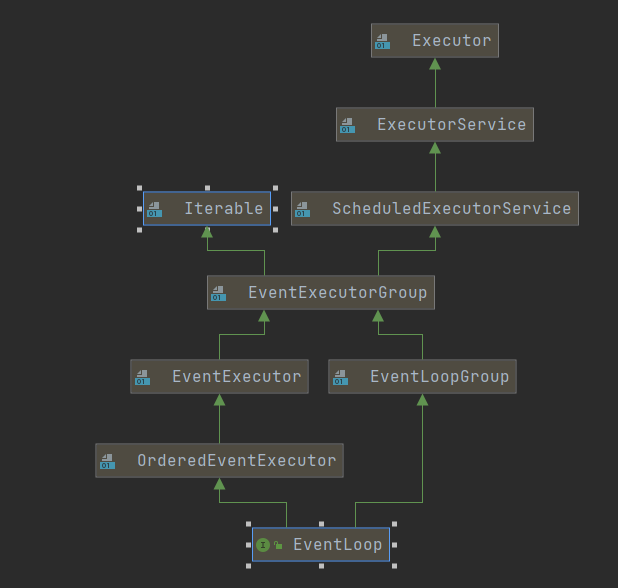
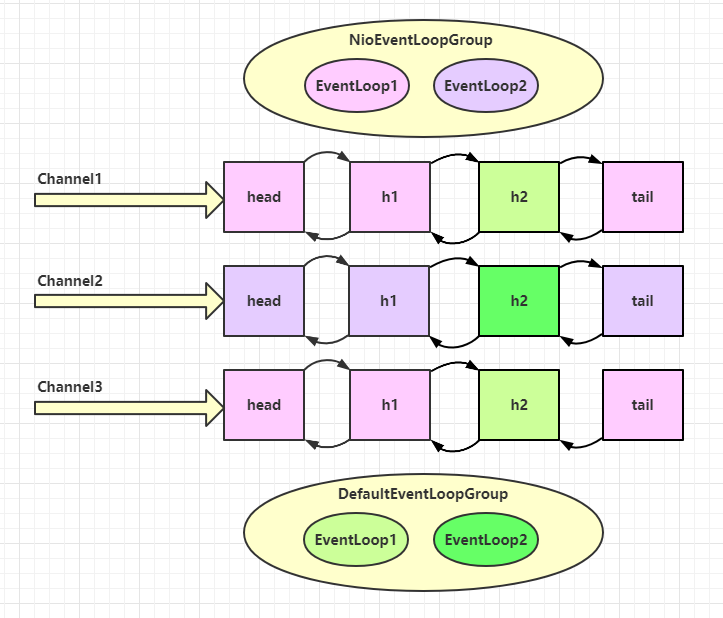

# 入门

## 服务器端

*new ServerBootstrap()*: 启动器，负责组装netty组件，启动服务器

*NioEventLoopGroup*：BossEventLoop ,WorkerEventLoop  循环处理事件组

*channel(NioServerSocketChannel.class)*: 选择SocketChannel实现

*childHandler*：告诉WorkerEventLoop ，将来发生事件处理哪些逻辑

*ChannelInitializer*： 根客户端读写的通道，并且添加别的handler

```java
public static void main(String[] args) {
    new ServerBootstrap()
            .group(new NioEventLoopGroup())
            .channel(NioServerSocketChannel.class)
            .childHandler(new ChannelInitializer<NioSocketChannel>() {
                @Override
                protected void initChannel(NioSocketChannel ch) throws Exception {
                    ch.pipeline().addLast(new StringDecoder());
                    ch.pipeline().addLast(new ChannelInboundHandlerAdapter(){
                        @Override
                        public void channelRead(ChannelHandlerContext ctx, Object msg) throws Exception {
                            log.info("收到数据：{}",msg);
                        }
                    });
                }
            })
            .bind(80);
}
```

## 客户端

*sync()*：等待连接建立

*channel()*： 获取连接对象

*writeAndFlush*：发送数据，之后进入*initChannel*方法中

```java
public static void main(String[] args) throws InterruptedException {
    new Bootstrap()
            .group(new NioEventLoopGroup())
            .channel(NioSocketChannel.class)
            .handler(new ChannelInitializer<NioSocketChannel>() {
                @Override
                protected void initChannel(NioSocketChannel ch) throws Exception {
                    ch.pipeline().addLast(new StringEncoder());
                }
            }).connect("127.0.0.1", 80)
            .sync()
            .channel()
            .writeAndFlush("hello word");
}
```

# Netty核心组件

## EventLoop

1. <b id="blue">EventLoop</b>本质是一个单线程执行器（同时维护了一个Selector)，里面有run方法处理Channel上源源不断的io事件。

2. 其实相当于我们我们[NIO笔记里的worker](https://laoxiaoo.github.io/xiaoxiao/#/socket/1-nio?id=%e5%a4%9a%e7%ba%bf%e7%a8%8b%e7%89%88%e6%9c%ac)定义

3. 服务器<b id="blue">EventLoop</b>处理了某个客户端的<b id="gray">channel</b>连接后，就会绑定，以后处理这个客户端的这个<b id="gray">channel</b>都是这个线程来处理




## EventLoopGroup 

1. 一组*EventLoop*
2. NioEventLoopGroup可以处理io事件，普通任务，定时任务

```java
NioEventLoopGroup executors = new NioEventLoopGroup();
//普通任务
executors.next().submit(() -> {
    System.out.println(Thread.currentThread().getId());
});
//定时任务
//任务，初始延迟时间， 时间间隔， 时间单位
executors.next().scheduleAtFixedRate(() -> {
    log.debug("定时任务");
}, 0, 1, TimeUnit.SECONDS);
```

3. NioEventLoopGroup默认的子线程`线程数是：cpu核心数*2`，new NioEventLoopGroup构造方法默认使用了NettyRuntime.availableProcessors() * 2

   如果构造参数有值，则使用构造参数的线程数。**不过我们一般bossGroup设置为1个**

<b id="blue">获取下一个eventLoop</b> 

```java
EventLoopGroup workGroup = new NioEventLoopGroup();
EventLoop eventLoop = workGroup.next();
```

> Boss和worker的线程数设置

在构建<b id="blue">group</b>的时候，我们可以设置两个<b id="blue">group</b>

1. 第一个表示boss线程池，用于处理<b id="blue">ServerSocketChannel</b>的<b id="gray">accept事件</b>通常设置一个
2. 第二个表示worker线程池，用于处理<b id="blue">SocketChannel</b>的<b id="gray">read和writer事件</b>

```java
new ServerBootstrap()
        .group(new NioEventLoopGroup(1), new NioEventLoopGroup())
```

> 额外的线程组处理业务

- 有时候，一个`handler`执行的业务时间特别长，这时，肯定会影响同一个EventLoop的其他channel的工作，此时，我们需要将此业务放入一个非IO的EventLoop中，防止它影响其他channel的使用
- 如下，我们造DefaultEventLoopGroup一个线程组，让handler2在其上执行，注意，需要在`channelRead`中调用`ctx.fireChannelRead(msg);`将消息传递这个里面`defaultEventLoop`中

```java
//非IO的线程组
EventLoopGroup defaultEventLoop = new DefaultEventLoopGroup();
new ServerBootstrap()
        .group(new NioEventLoopGroup(1), new NioEventLoopGroup())
        .channel(NioServerSocketChannel.class)
        .childHandler(new ChannelInitializer<NioSocketChannel>() {
            @Override
            protected void initChannel(NioSocketChannel ch) throws Exception {
                ch.pipeline().addLast("handler1",new ChannelInboundHandlerAdapter() {
                    @Override
                    public void channelRead(ChannelHandlerContext ctx, Object msg) throws Exception {
                        log.debug("handler1 进入 : {}", Thread.currentThread().getName());
                        //将消息传递给下一个handler
                        ctx.fireChannelRead(msg);
                    }
                });
                ch.pipeline().addLast(defaultEventLoop, "handler2", new ChannelInboundHandlerAdapter() {
                    @Override
                    public void channelRead(ChannelHandlerContext ctx, Object msg) throws Exception {
                        log.debug("handler2 是个很长的业务 {}", Thread.currentThread().getName());
                    }
                });
            }
        }).bind(80);
```

<b id="blue">绑定关系图</b>

如图：h2使用的线程组是我们自己外部定义的EventLoop



<b id="blue">Handler切换线程的源码</b>

io.netty.channel.AbstractChannelHandlerContext#invokeChannelRead(io.netty.channel.AbstractChannelHandlerContext, java.lang.Object)

如果两个handler绑定的是同—个线程,那么就直接调用否则，把要调用的代码封装为—个任务对象，由下—个handler的线程来调用

```java
//获取msg信息
final Object m = next.pipeline.touch(ObjectUtil.checkNotNull(msg, "msg"), next);
//获取下一个handler
EventExecutor executor = next.executor();
//判断是否是同一个执行eventloop
if (executor.inEventLoop()) {
    next.invokeChannelRead(m);
} else {
    //不是，调用的代码封装为一个任务对象，由下一个 handler 的线程来调用
    executor.execute(new Runnable() {
        @Override
        public void run() {
            next.invokeChannelRead(m);
        }
    });
}
```

## Channel

**主要作用**

<b id="blue">close()</b>：可以用来关闭channel

<b id="blue">closeFuture()</b>： 用于处理channel的关闭

<b id="blue">pipeline()</b>： 用于添加处理器

<b id="blue">write(Object msg, ChannelPromise promise)</b>： 将数据写入

<b id="blue">writeAndFlush(Object msg)</b>：将数据写入并刷出