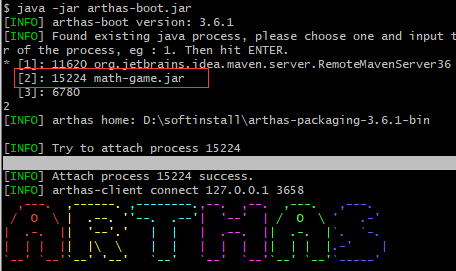
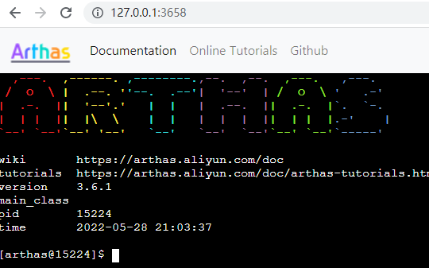

# 概述

## 文档

https://arthas.gitee.io/install-detail.html

## Arthas能做什么

1. 这个类从哪个jar包加载的?为什么会报各种类相关的 Exception?
2. 我改的代码为什么没有执行到?难道是我没commit?分支搞错了?
3. 遇到问题无法在线上debug，难道只能通过加日志再重新发布吗?
4. 线上遇到某个用户的数据处理有问题。但线上同样无法 debug,线下无法重现!
5. 是否有一个全局视角来查看系统的运行状况?
6. 有什么办法可以监控到JVM的实时运行状态?
7. 怎么快速定位应用的热点，生成火焰图?

# 粘附

> 要使用arthas监控其他的项目
>
> 先要让<b id="blue">arthas</b>先粘附这个项目

1. 运行官方给的demo

```shell
curl -O https://arthas.aliyun.com/math-game.jar
java -jar math-game.jar

```

2. 选择粘附的包



3. 如果端口号被占用，可以选择指定端口运行

```shell
java -jar arthas-boot.jar --telnet-port 9998 --http-port -1
```

4. 可以通过windowns 浏览器访问



# 好吧，官网记载的很详细，这里就开始记录一些骚操作吧

