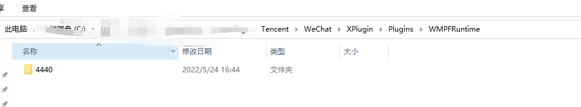

# vscode

## 插件集合

> code-eol 2019 (Line Endings)

显示字符换行符等

> JVM Bytecode Viewer

# 录屏工具

## ShareX

可以录屏，截图，截GIF等

https://github.com/ShareX/ShareX

##  Peek 

适用于linux平台的录屏

##  Captura  

大小不到3M

# Filddler抓包

## Pc小程序无法抓到问题

1. 杀掉微信进程
2. 进入C:\Users\｛user｝\AppData\Roaming\Tencent\WeChat\XPlugin\Plugins\WMPFRuntime目录，删除全部文件夹

