#

# 界面解释

## 三个主要面板

1. 视图区
   1. 顶视图（top）: 没有任何透视角度；按快捷键<b id="gray">T</b>
   2. 前视图（font）:没有透视；按快捷键<b id="gray">f</b>
   3. 左视图（left）：没有透视; 按快捷键<b id="gray">L</b>
   4. 透视图（快捷键<b id="gray">P</b>）
2. 视图控制区域
   1. 控制视图区的操作，比如移动旋转等
3. 命令面板

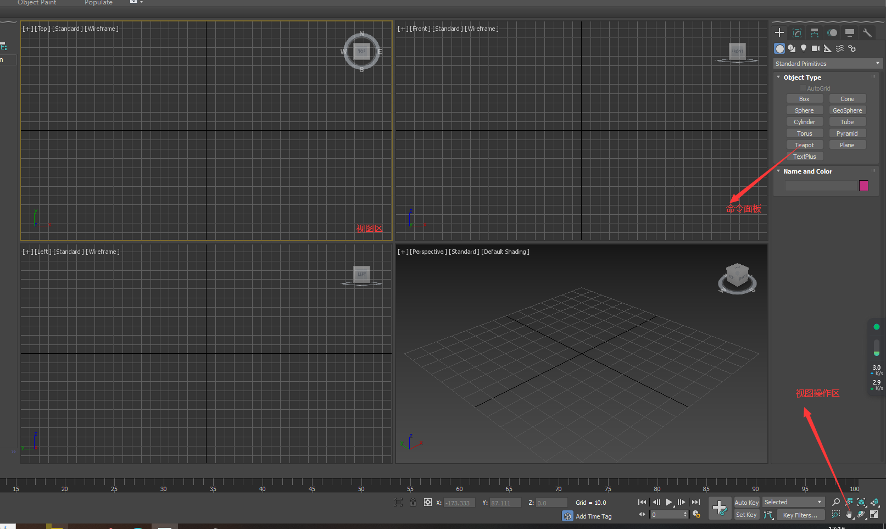

## 最大化透视图

点击 视图操作区域 的右下角

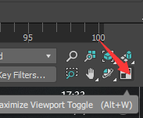

## 视图操作方式

移动：鼠标中键按下， 按下后会有一个手掌形状

移动：alt+鼠标中键

缩放：鼠标中键按下一次，滚动，再按下取消滚动

<b id="gray">F3</b> 线框模式：按下后，只显示线框

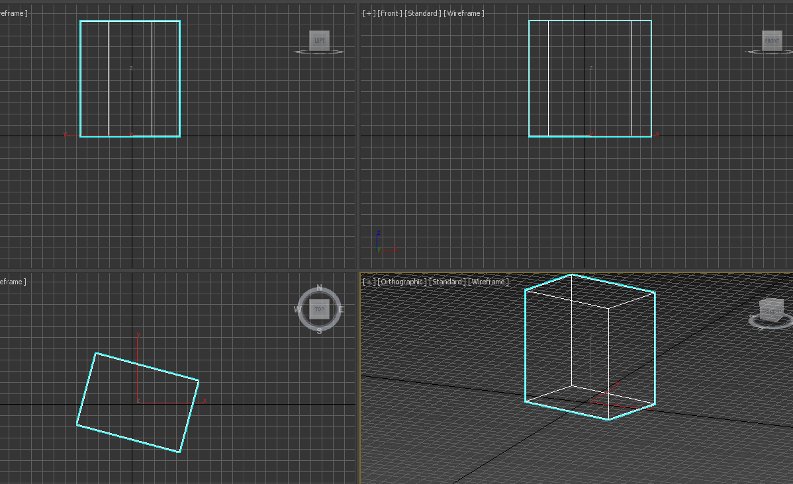

<b id="gray">F4</b> 线框+实体模式

## 模型的操作方式

模型的三个操作模式

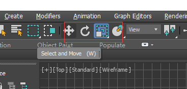

1. 移动模式：可以让模型沿着x或者y z 轴移动
2. 旋转模式
3. 缩放模式：默认是正常的比例缩放

## 居中显示

如果我们不小心不知道吧模型弄到哪里去了的时候，我们可以按快捷键 <b id="gray">Z</b> 进行居中显示

# 选中状态

按照ctrl + 鼠标右键，可以选中点线面等

# 注意事项

1. 所有模型必须在<b id="blue">Z轴</b> 0 以上，比如：有些怪，暴走变大，如果不在零点，则可能卡模型等

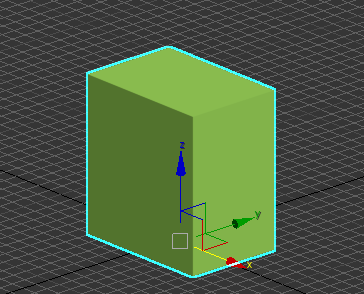

# 命令面板

## 模型创建

比如创建一个box

1. 选择box
2. 在透视区左键键点击一下，xy轴拖动，在左键点击一下，在Z轴拖动，然后右键点击一下，取消创建模式

## 单位检查

模型创建的第一步

游戏里的模型单位是cm

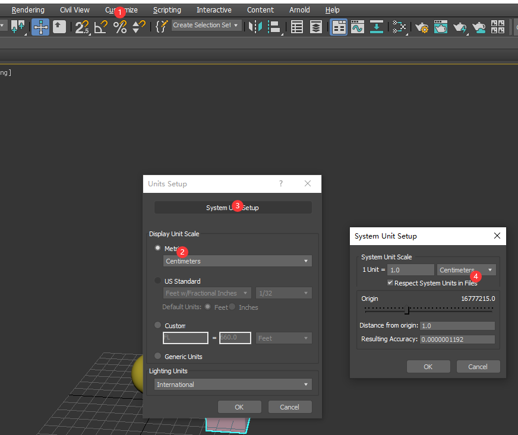

## 中心点设置

我们在创建球形的时候，中心点会在球心，这个时候，球的底部就在Z轴0度以下了，不符合要求

我们需要借助一个工具，将这个模型最低点设置成中心点

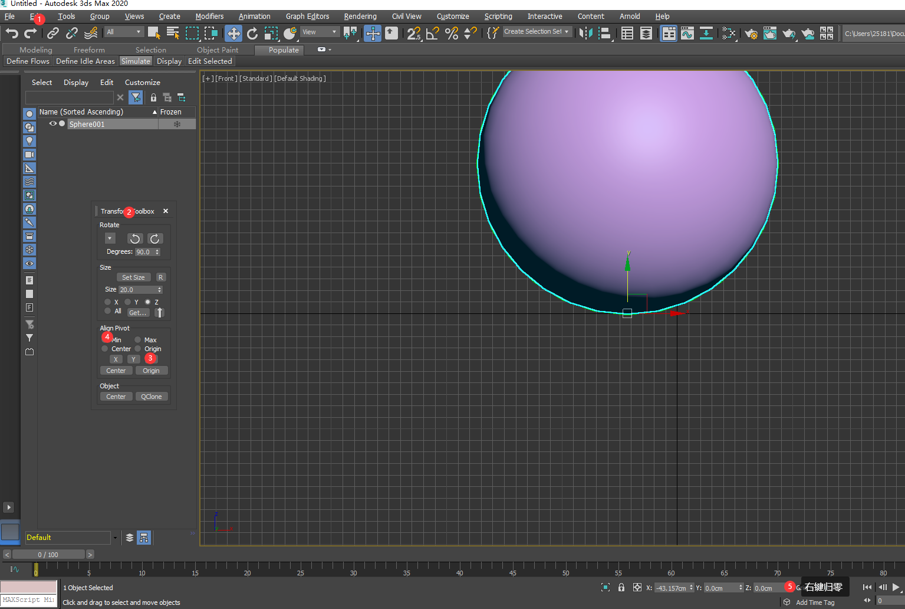

## 创建面板

可以调整模型的长度，宽度，高度等

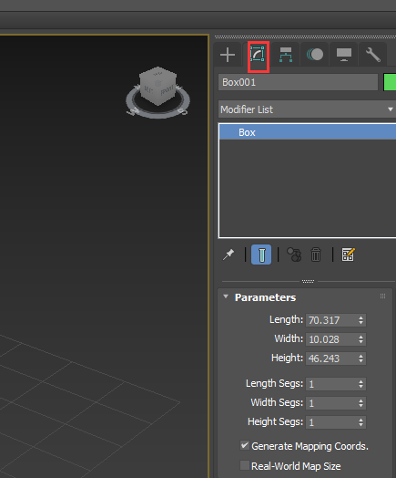

### 增加段数

将长度增加为4段

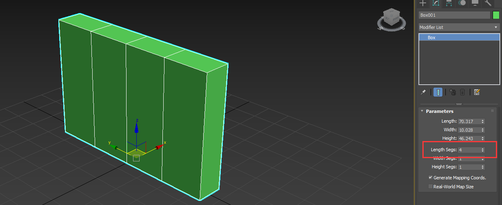

增加段数的好处：

可以用来做曲线（微积分可知，曲面由N个直线组成）

# 转为编辑状态

选中状态下，转为poly(可编辑多边形)， **一旦转为可编辑多边形，就不可逆了**

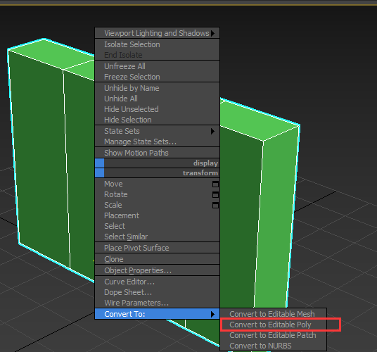

转变完成后，右边的命令面板就变了

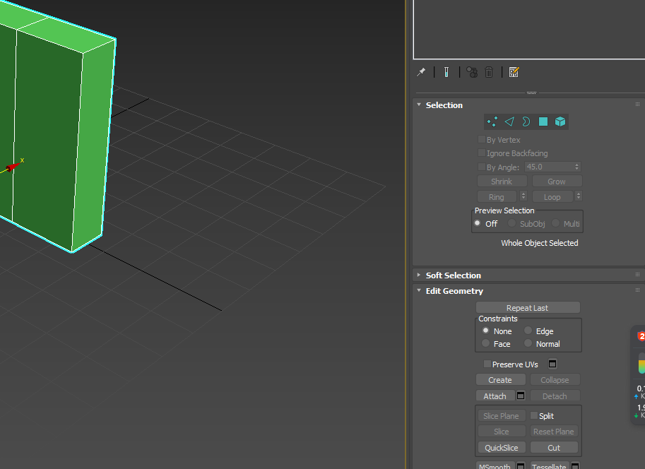

## 点级别

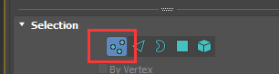

可以选择某个点，进行拖动，放大缩小的操作

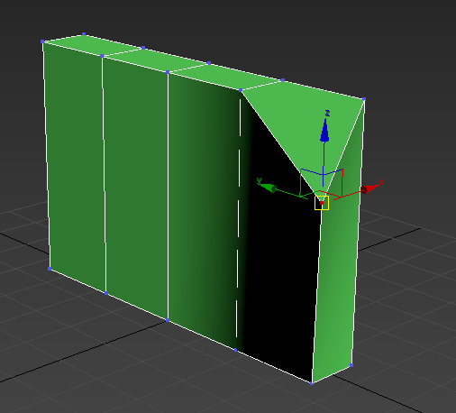

## 边级别

可以选择边，进行拖动等模型的操作

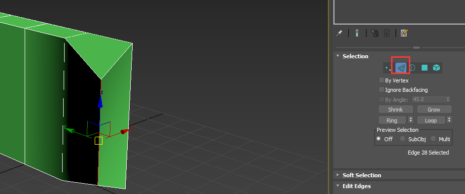

## 面级别

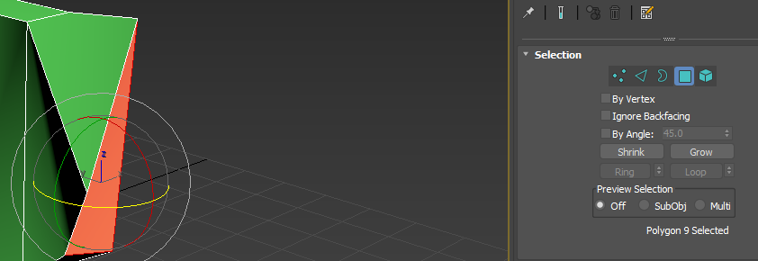

## 边界

如果某个面删了，则边界可以选中
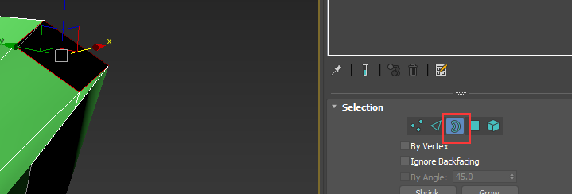

# 多边形命令

## 焊点命令

只可以在点级别使用

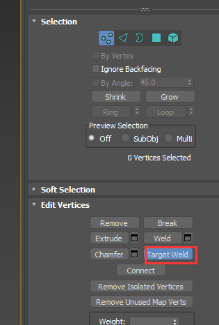

焊点的规则：必须在同一个边上的，并且线的两个点之间不能有其他点

比如我将一个点焊点到另一个点，则他的线就消失了

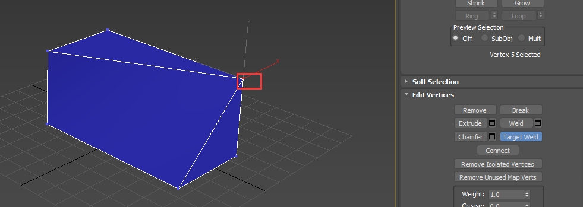

## 塌陷

按住ctrl,选中两个点，点击塌陷

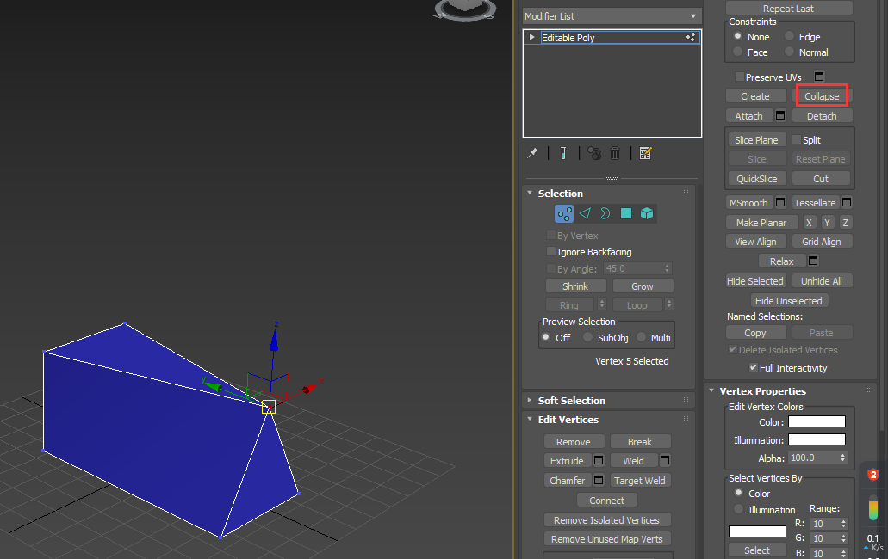

在线级别下，和面级别下，都可以使用塌陷命令，都是以面/线的中心点为基准，塌陷操作

## 切角

点/线级别下，选中，拖动的时候，可以将某个角删除掉

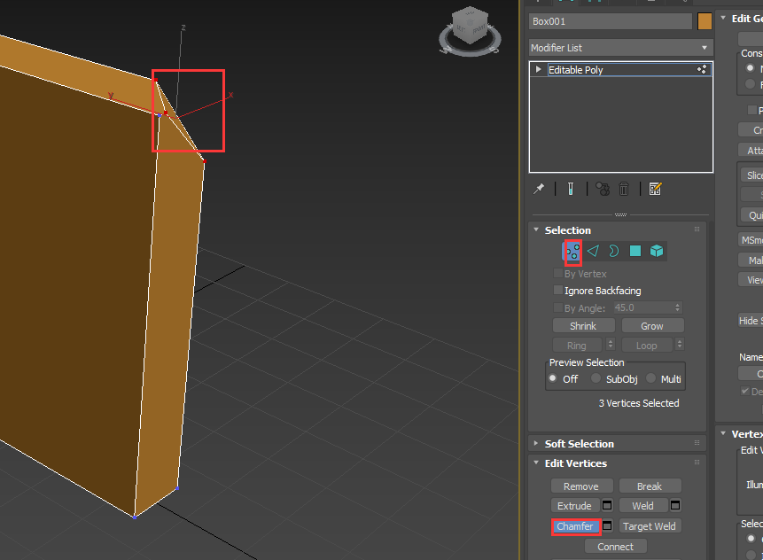

某些时候，我们想要精确的切角，则可以精确数值

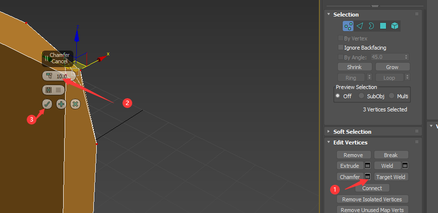

我们可以利用切角（线的模式下），然后增加段数，来添加圆滑的角，这里不会做的很多圆滑，因为面越多，渲染越高

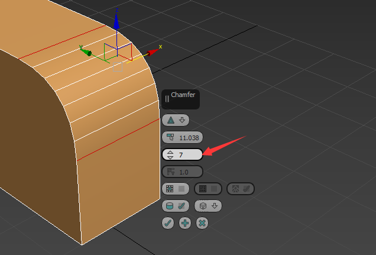

## 切线

可以多出线结构出来

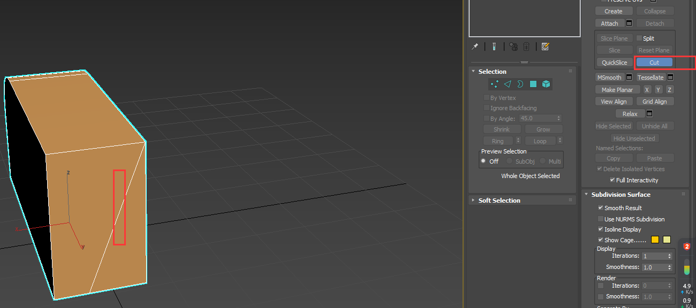

## 连接

ctrl+右键选择两个点，在同一面下，点connect,就会多出一条线连接

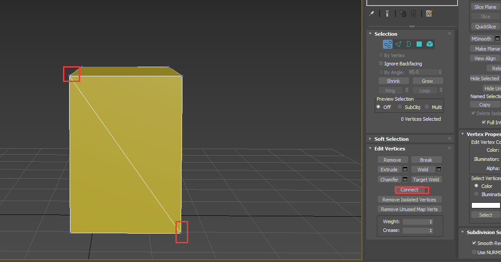

## 挤压（面）

可以把现有的吗模型往外再来一块

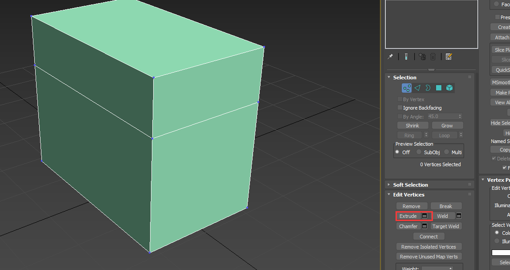

## 插入（面）

可以让一个面变成多个面

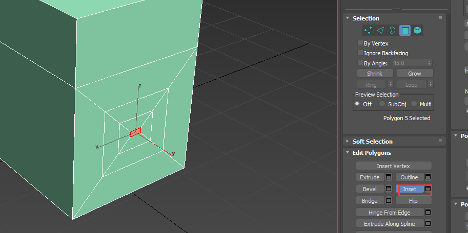

## 斜切

可以对一个面进行二次操作

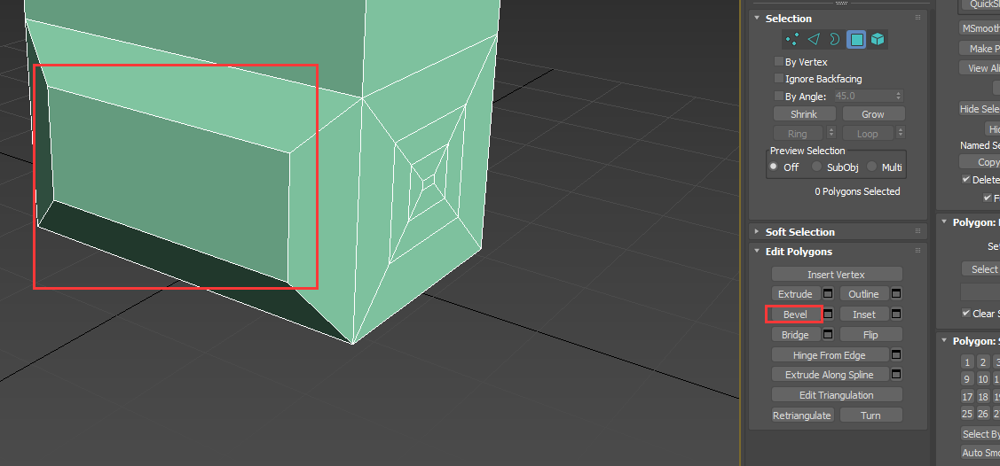

##  桥接

<b id="gray">bridge</b>如果删除了某个面，可以点一个线到另一个线，生成一个新的面

## 封面

<b id="gray">cap</b>:与桥接类似

