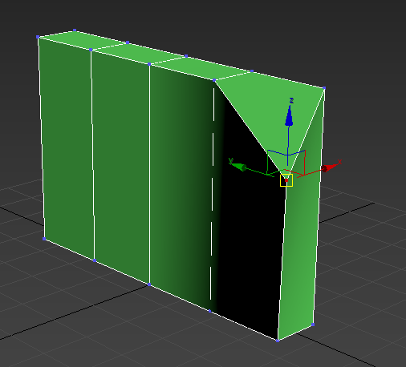
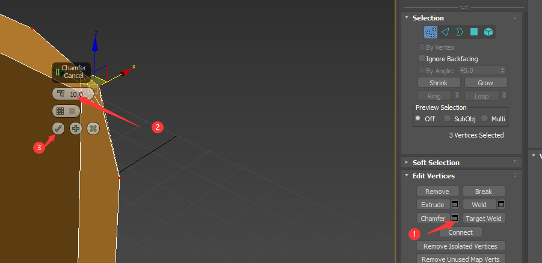
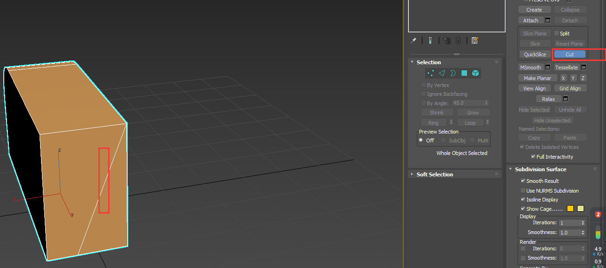

#

# 界面解释

## 三个主要面板

1. 视图区
   1. 顶视图（top）: 没有任何透视角度；按快捷键<b id="gray">T</b>
   2. 前视图（font）:没有透视；按快捷键<b id="gray">f</b>
   3. 左视图（left）：没有透视; 按快捷键<b id="gray">L</b>
   4. 透视图（快捷键<b id="gray">P</b>）
2. 视图控制区域
   1. 控制视图区的操作，比如移动旋转等
3. 命令面板

## 最大化透视图

点击 视图操作区域 的右下角

## 视图操作方式

### 移动

：鼠标中键按下， 按下后会有一个手掌形状

### 移动

alt+鼠标中键

### 缩放

鼠标中键按下一次，按住右键后拖动

<b id="gray">F3</b> 线框模式：按下后，只显示线框

<b id="gray">F4</b> 线框+实体模式

## 模型的操作方式

模型的三个操作模式

1. 移动模式：可以让模型沿着x或者y z 轴移动
2. 旋转模式
3. 缩放模式：默认是正常的比例缩放

## 居中显示

如果我们不小心不知道吧模型弄到哪里去了的时候，我们可以按快捷键 <b id="gray">Z</b> 进行居中显示

# 选中状态

按照ctrl + 鼠标右键，可以选中点线面等

如果我们想选中拖动，则需要选中<b id="blue">select and move</b>

# 注意事项

1. 所有模型必须在<b id="blue">Z轴</b> 0 以上，比如：有些怪，暴走变大，如果不在零点，则可能卡模型等

# 命令面板

## 模型创建

比如创建一个box

1. 选择box
2. 在透视区左键键点击一下，xy轴拖动，在左键点击一下，在Z轴拖动，然后右键点击一下，取消创建模式

## 单位检查

模型创建的第一步

游戏里的模型单位是cm

## 中心点设置

我们在创建球形的时候，中心点会在球心，这个时候，球的底部就在Z轴0度以下了，不符合要求

我们需要借助一个工具，将这个模型最低点设置成中心点

## 创建面板

可以调整模型的长度，宽度，高度等

### 增加段数

将长度增加为4段

增加段数的好处：

可以用来做曲线（微积分可知，曲面由N个直线组成）

# 转为编辑状态

选中状态下，转为poly(可编辑多边形)， **一旦转为可编辑多边形，就不可逆了**

转变完成后，右边的命令面板就变了

## 点级别

可以选择某个点，进行拖动，放大缩小的操作

## 边级别

可以选择边，进行拖动等模型的操作

## 面级别

## 边界

如果某个面删了，则边界可以选中

# 多边形命令

## 焊点命令

只可以在点级别使用

焊点的规则：必须在同一个边上的，并且线的两个点之间不能有其他点

比如我将一个点焊点到另一个点，则他的线就消失了

## 塌陷

按住ctrl,选中两个点，点击塌陷

在线级别下，和面级别下，都可以使用塌陷命令，都是以面/线的中心点为基准，塌陷操作

## 切角

点/线级别下，选中，拖动的时候，可以将某个角删除掉

某些时候，我们想要精确的切角，则可以精确数值

我们可以利用切角（线的模式下），然后增加段数（比如这里加了7段），来添加圆滑的角，这里不会做的很多圆滑，因为面越多，渲染越高

## 切线

可以多出线结构出来

## 连接

ctrl+右键 选择两个点，在同一面下，点connect,就会多出一条线连接

## 挤压（面）

可以把现有的吗模型往外再来一块

## 插入（面）

可以让一个面变成多个面

## 斜切

可以对一个面进行二次操作

##  桥接

<b id="gray">bridge</b>如果删除了某个面，可以点一个线到另一个线，生成一个新的面

## 封面

<b id="gray">cap</b>:与桥接类似

# 常用操作

## 栅格点选中

常用语，我们需要拖动一个模型，然后，我们可能需要只往z，或者x轴一个方向拖动

# 模型制作

## 做一个桌子

### 做一个桌面

1. 检查单位 cm

2. 正面朝向

> 旋转90度设置

模型图有一个，就是必须将模型的正面朝向Y轴，此时如果手动拖不好拖动

使用 <b id="gray">角度捕捉</b>就可以设置旋转每次操作旋转90度

3. 调整模型的宽度和长度
4. 调整xyz轴，因为这里我们的椅子的腿高48，所以我们的y轴48

4. 设置好桌面的比例之后，我们将模型转为poly

5. 循环选择

   1. 对于<b id="blue">四边形</b>的线，我们的宽是一样的，如果需要手动选中，需要我们一个个选，这时可以使用<b id="blue">循环选中</b>

   

6. 让边变得光滑，选择切角，此时，防止点了V后，就无法复原了，所以，我们需要另存为下，存一个版本

>  避免一个面有多个边

7. 游戏模型中，我们的面，必须保证不高于一个边,此时，我们需要将切角的几个边连接下

8. 连完之后，可以在面的操作下检查下

### 做一个柱子

1. 建立一个圆柱，一般边数是2的

2. 选中柱子的顶部的所有点，进行等比缩放

2. 柱子的底部有一个支撑点

   1. 先挤压底部的面
   2. 选择底部的点，进行缩小

   

3. 或者使用桥接

4. 此时底部出现边界，我需要补面，但是此时，边界超过4条边，会造成性能问题 

5. 如下图，选择border模式后后，按住shift,拖动缩放，再点击cap补面，，选中面模式后然后再点击塌陷

### 复制4个柱子

1. 将做好的柱子拖动到四边角的一边
2. 选择柱子时候，将中心点改为0,0,0

3. 选择镜像命令，如果点击后柱子消失，可以选择flip反转（因为把）

4. 在选择创建一个镜像，选择Y轴

## 材质合并

做好的桌子和椅子是两个材质，如果不进行合并，导入到UE后，就是两个材质

点击attach，可以进行合并材质

## 做好之后

1. 重命名模型

2. 按下 <b id="gray">M</b> 快捷键，进入 材质面板，选Modes的第一个选项

3. 给材质初始化颜色，然后重命名

4. 重置镜像

5. 选择模型再转换poly
6. 将背景去掉（当把面删除后，面板还是黑色的，但是正常的勾选后，就看不到这个面，为了看这个模型有没有问题）

## 光滑模型

## 模型导出

1. 命名
2. <b id="gray">M</b>一下，对模型命名
3. reset xform一下
   1. 查看下各个面是不是正确（记得属性是 backface full勾选）
4. 保证xy z 的轴对应
5. 想要导出一个模型，必须保证，场景中没有其他的东西，可以在列表中查看下有没有多余的
6. File-> export selected,
7. 虚幻和UNITY支持的格式 FBX, 虚化还支持 OBJ格式
8. 导出时，注意去掉涡轮平滑

## 模型导入UE4

1. 导入的时候，有很多选项
   1. 需要注意，碰撞这个选项
   2. 将网格体的选项箭头（<b id="blue">显示高级项</b>）打开后，看到很多如图的选项
   3. 关照UV需要注意，理论上不勾选

4. 对于材质，我们一般是*不搜索不创建不导入*

# 做一个有弧度的方形

## FFD命令

FFD点级别，可以实现模型的推拉、挤压、扭曲等变形效果

